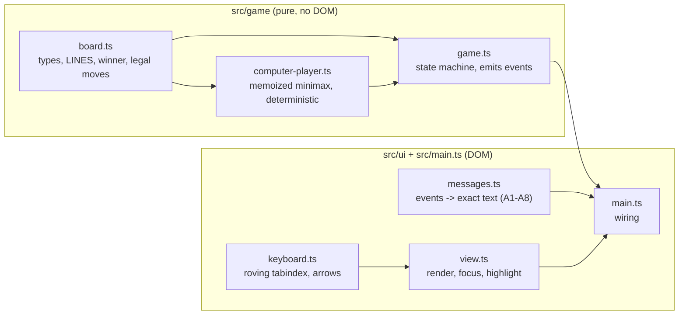
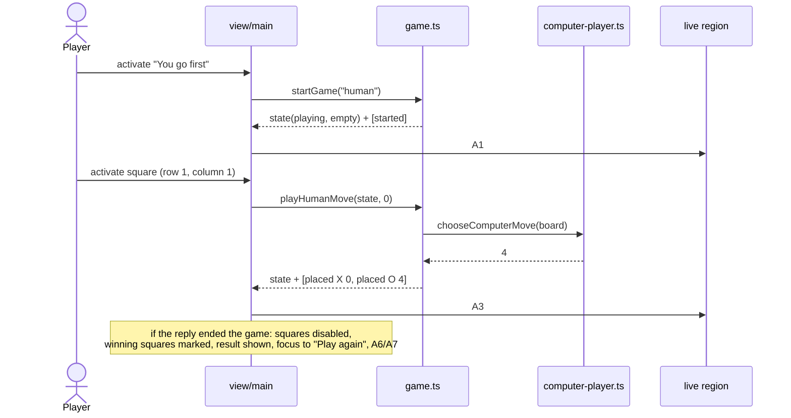
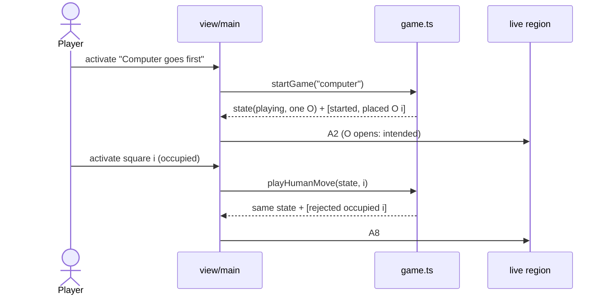
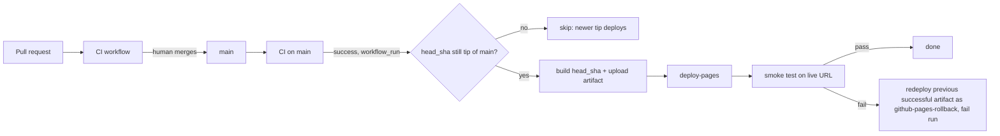

# Architecture: factory-tictactoe

_Traces to: `.factory/prd.md`, `.factory/acceptance.md`, `.factory/tech-stack.md`. Stack is committed (ADR-001 to ADR-008); this document does not revisit it._

## 1. Shape

A single static page: `index.html` + one CSS file + one ES module bundle built by Vite from strict TypeScript, published to GitHub Pages. No backend, no network calls at run time, no storage.

The code has two layers with a one-way dependency:

- **Game core** (`src/game/`): pure, DOM-free TypeScript. It holds all the rules, the perfect computer player, and the state transitions, and it emits *events* describing what happened. Vitest tests it exhaustively.
- **UI shell** (`src/ui/`, `src/main.ts`): renders state to the DOM, turns clicks, taps and keys into core calls, and turns core events into announcement text. Playwright and axe-core test it.



## 2. Components and responsibilities

| Component | File | Responsibility | Requirements |
|---|---|---|---|
| Board model | `src/game/board.ts` | `Mark = "X" \| "O"`, `Board` (9 cells, index 0–8 row-major), the 8 `LINES`, `findWinner(board)` returning winner and line, `isFull`, `emptySquares`, immutable `placeMark` | R-001, R-004 |
| Computer player | `src/game/computer-player.ts` | `chooseComputerMove(board): SquareIndex` (O is always to move when it is called) — full-depth minimax. A position's value is node-relative: `10 − plies to the end` for an O win, `plies to the end − 10` for an X win, `0` for a draw, so O wins sooner and never loses. Ties go to the lowest square index. Values are memoized in a module-level map keyed by **board + side to move**; because the values are node-relative they are valid across searches, games and starters (at most 2 × 3⁹ keys) | R-003 |
| Game state machine | `src/game/game.ts` | `startGame(firstMover)` and `playHumanMove(state, index)` return `{ state, events }`; the computer's reply is applied synchronously inside `playHumanMove`; illegal moves return the input state unchanged plus a `rejected` event. The opponent is a parameter that defaults to `chooseComputerMove`, so unit tests can inject a weak opponent to reach the otherwise unreachable human win (A4); the UI always uses the default | R-001, R-002, R-003, R-004, R-006 |
| Messages | `src/ui/messages.ts` | Pure `describeEvents(events): string` producing exact texts A1–A8; `squareLabel(index, mark)`; `describeLine(line)` | R-005, R-008 |
| View | `src/ui/view.ts` | Renders choice buttons, 9 square buttons, visible status/result, "Play again"; sets accessible names, `disabled` / `aria-disabled`, winning markers; moves focus per the rules below | R-001, R-002, R-004–R-007, R-009, R-010 |
| Keyboard | `src/ui/keyboard.ts` | Roving tabindex over the 3×3 grid; arrow keys move one square and stop at edges; Enter/Space are native button activation | R-007 |
| Wiring | `src/main.ts` | Holds the single current `GameState`, calls core, renders, writes the live region | all UI |
| Styles | `src/styles.css` | System font stack, high-contrast tokens (from design phase), 44 px minimum targets, fluid grid from 320 px, 2 px+ focus ring, non-colour winning marker | R-005, R-010, R-013 |
| Page | `index.html` | `lang="en"`, title, `h1`, live region; `<noscript>` message plus a load-error message ("The game didn't load. Try reloading the page.") that ships with the `hidden` attribute. It is revealed in two ways. (1) A small inline classic `<script>` in `index.html`, placed before the module script, registers a capture-phase `window` `error` listener that unhides the message when a `<script>` element fails to load. This is independent of the bundle, and survives the Vite build, which rewrites the module tag and would drop an `onerror` attribute (Codex rework review C1). (2) `main.ts` wraps start-up in `try/catch`, unhides the message on any exception, then rethrows so the error still reaches the console. It never flashes during a normal load and never shows next to the `<noscript>` message (design review, 2026-09-27); `<meta name="build-id">` set to the commit SHA at build time | R-001, R-008, R-009, R-014 |
| CI scripts | `scripts/check-bundle-size.mjs`, `scripts/check-dist-origins.mjs` | Gzip-sum JS in `dist/` under 51,200 bytes; scan `dist/` for other-origin script/link/iframe URLs | R-011, R-012 |

Filenames are kebab-case and identifiers follow the factory naming rules (standards §6), enforced by ESLint.

## 3. Data model

In memory only, discarded on reload (R-012).

```ts
type Mark = "X" | "O";                 // human is always X, computer always O (R-002)
type Cell = Mark | null;
type Board = readonly Cell[];          // length 9, row-major: index = (row-1)*3 + (column-1)
type Line = readonly [number, number, number];
type FirstMover = "human" | "computer";
type Result = { kind: "win"; winner: Mark; line: Line } | { kind: "draw" };
type GameState =
  | { phase: "choosing" }                                        // before each game
  | { phase: "playing"; board: Board; firstMover: FirstMover }    // always the human's turn when idle
  | { phase: "over"; board: Board; firstMover: FirstMover; result: Result };
type GameEvent =
  | { type: "started"; firstMover: FirstMover }
  | { type: "placed"; mark: Mark; index: number }
  | { type: "ended"; result: Result }
  | { type: "rejected"; reason: "occupied" | "not-playing"; index: number };
```

Because the computer replies synchronously, a `playing` state at rest is always the human's turn; "out of turn" (R-001) therefore reduces to "not in the `playing` phase". The unit tests exercise that case directly on the state machine.

## 4. Key flows

### Flow A: human goes first and makes a move



### Flow B: computer goes first, then the human activates an occupied square



## 5. Accessibility design

- The board is a `div role="group" aria-label="Board"` containing 9 native `<button>`s laid out by CSS grid. Buttons give Enter/Space activation and touch/click for free.
- Accessible name of each square: `Row R, column C, empty|X|O` (R-008).
- **Before a choice and after the game ends**, squares have the `disabled` attribute and are out of the Tab order. **During play**, exactly one square has `tabindex="0"` (roving); occupied squares are `aria-disabled="true"` but stay focusable, so arrow navigation passes through them and activating one announces A8.
- **Live region**: one visually hidden `div role="status"` (polite). It is written once per player action. To make a repeated identical message (such as A8 twice) announce again, the text is cleared and then set on the next animation frame.
- **Focus**: after a choice, focus goes to the first empty square in reading order (row 1, column 1 when the human starts; row 1, column 2 after the computer's opening O at row 1, column 1). This keeps the first Enter off a taken square (design review, 2026-09-27). After a move it stays on the square played. When the game ends, it moves to "Play again". After "Play again" it goes to "You go first".
- **Winning line**: `data-winning="true"` on the three squares. The style adds a thick border plus an overlaid strike line (not colour alone), and the text names the line (R-005).

## 6. Integration points and failure modes

| Integration | Used for | Failure mode | Handling |
|---|---|---|---|
| GitHub Actions: CI workflow (`ci.yml`, on push and pull request) | format check, lint, typecheck, unit + exhaustive tests, build, bundle-size and dist-origin checks, Playwright e2e + axe in 5 projects | Any job fails | PR cannot merge (humans merge; branch protection set in ship phase). Owner gets the failure email |
| GitHub Actions: deploy workflow (`deploy.yml`) | Triggered by `workflow_run` when CI completes successfully on `main`: checks out **`workflow_run.head_sha`** (not `GITHUB_SHA`), so it builds exactly the commit whose CI passed. It deploys only if that SHA is still the tip of `main`; otherwise it skips, because the newer tip's own pipeline will deploy it and it already contains this change. `workflow_dispatch` (with a `force_smoke_failure` input) deploys the tip of `main` only if CI succeeded for that SHA. Steps: build with `build-id` = SHA → `actions/upload-pages-artifact` (retention 90 days) → `actions/deploy-pages` → smoke → rollback if smoke fails | Build or deploy fails | Nothing changes on the live site; run fails; email |
| GitHub Pages | hosting at `https://onelifemedia.github.io/factory-tictactoe/` | Outage | Accepted: GitHub's uptime, no SLA (intent.operations) |
| Smoke test | Playwright against the live URL. It first polls, for up to 3 minutes, until the page's `build-id` meta equals the deployed SHA, so the old deployment cannot pass for the new one. Then it chooses "You go first", places X and sees O | Fails, or the build-id never appears | Rollback job (ADR-011). It finds the latest `deploy.yml` run on `main` that concluded successfully (`gh run list --status success`) and downloads its `github-pages` artifact (`actions/download-artifact` with `run-id` and `github-token`). It re-uploads the downloaded `artifact.tar` **unchanged under the distinct name `github-pages-rollback`**, so it never clashes with this run's `github-pages` artifact and the tar is not nested. It deploys with `actions/deploy-pages` (`artifact_name: github-pages-rollback`), then exits non-zero. If there is no such run, or its artifact has expired (more than 90 days since the last successful deploy), it logs that and exits non-zero. Nothing more. |

A run that rolled back concludes as failed, so it is never chosen as "previous successful" later. Deploy, smoke and rollback run in one workflow under `concurrency: { group: pages, cancel-in-progress: false }`. GitHub keeps at most one pending run per group, so a newer pending run replaces an older one. That is safe here because every run deploys only the current tip of `main`, which contains all earlier merges.

## 7. Deployment shape



Vite `base: "./"` makes asset URLs relative, so the site works under the `/factory-tictactoe/` path. The build target is `es2022`. Node 22 is pinned in `.nvmrc` and `engines`, and CI uses `actions/setup-node` with `node-version-file: .nvmrc`.

## 8. Test architecture

| Layer | Tool | What | Where |
|---|---|---|---|
| Unit | Vitest | board rules (16 win cases, draw), state machine incl. rejections, messages A1–A8, token contrast | `tests/unit/*.test.ts` |
| Exhaustive | Vitest | every human move sequence against the computer, both starting sides, run in one process one after the other (so the shared memo is exercised across starters); asserts 0 human wins and reports game counts; under 60 s | `tests/unit/never-loses.test.ts` |
| End-to-end + a11y | Playwright + @axe-core/playwright | A1–A3 and A5–A8 exact text (A4 is unreachable with the real opponent, so it is covered by unit tests with an injected opponent), keyboard-only games, blocked-bundle fallback, touch/click, exact live-region text, focus rules, layout/target sizes at 3 viewports, requests/cookies/storage, axe in 4 states | `tests/e2e/*.spec.ts`, 5 projects (ADR-008) |
| Build checks | Node scripts | bundle < 51,200 B gzipped; no other-origin URLs in `dist/` | `scripts/*.mjs` |
| Post-deploy | Playwright | wait for expected build-id, then smoke on live URL | `tests/smoke/*.spec.ts` (deploy workflow only) |

Every test file names the F-ID it covers (governance).

## 9. What we are deliberately not building

- No server, API, database, storage, cookies, service worker or PWA manifest.
- No framework runtime, router, state library or CSS framework.
- No analytics, error reporting SDK or third-party script of any kind.
- No difficulty levels, symbol choice, hot-seat mode, tally, undo, history, sound, themes, translations, rules page or custom domain.
- No artificial "thinking" delay or animation beyond basics (PRD open question 2 default).
- No rollback logic beyond "redeploy the previous successful artifact and fail the run".
- No real-device or manual screen-reader testing by the factory (QA report lists it as human follow-up).
