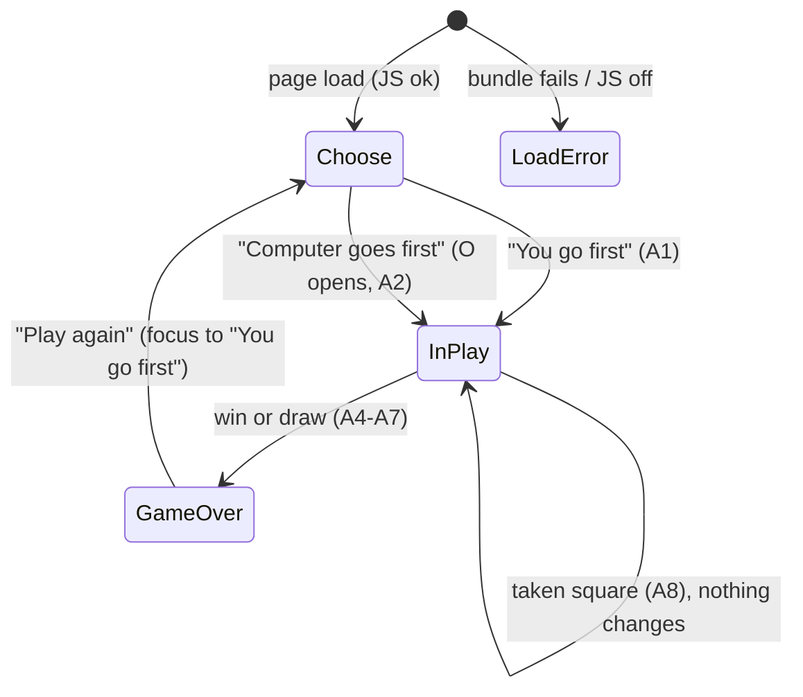

# Screens: factory-tictactoe

_Traces to: `.factory/prd.md` §6 (Flows A and B, unhappy paths), `.factory/acceptance.md`, `design-system.md`, `tokens.json`. One page with three states. Mockups are static HTML (`screens/*.html`), each showing every variant at 320 px and 760 px wide. Status: draft_

## Index

| Screen | File | Flow | Requirements | Components used | Notes |
|---|---|---|---|---|---|
| 1. Choose who goes first | `screens/game-01-choose-first.html` | A and B step 1; after Play again | R-001, R-002, R-006, R-007, R-010, R-012, R-013 | Title, status line, board (disabled squares), action area with choice button ×2, announcer, fallback message | Variants: 1a default (focus on "You go first" after Play again); 1b load error (hidden by default, revealed only on a script error); 1c JavaScript off (`noscript`). The empty disabled board is the empty state. No symbol picker. |
| 2. In play | `screens/game-02-in-play.html` | A steps 2–5; B steps 2–3 | R-001, R-002, R-003, R-007, R-008, R-009, R-010 | Title, status line, board (active and occupied squares, roving focus), action area with keyboard hint, announcer | Variants: 2a you first, empty board (A1); 2b computer first, O opens at row 1, column 1, focus on row 1, column 2 (A2); 2c mid-game after a move (A3); 2d taken square (A8). The visible status names the computer's last move. Always the human's turn when idle; no loading state (instant reply). Sample positions follow ADR-010 perfect play. |
| 3. Game over | `screens/game-03-game-over.html` | A steps 6–7 | R-004, R-005, R-006, R-007, R-008, R-009, R-010 | Title, status line, board (disabled, winning squares), action area with Play again button, announcer | Variants: 3a computer wins by diagonal (A6) with border, strike line and fill; 3b draw (A5/A7), no highlight; 3c computer wins by row (strike direction check). A4 "You win" is unreachable and not mocked; it uses the 3a layout with different words. |

## Navigation

## Focus map

| From | Action | Focus goes to |
|---|---|---|
| Fresh load | — | nothing (document start); Tab reaches "You go first" |
| Choose | either choice | first empty square in reading order (row 1, column 1 if you went first; row 1, column 2 after the computer's opening O) |
| In play | place X (game continues) | the square just played |
| In play | taken square | stays on that square (status keeps the taken message until the next valid move) |
| In play | move ends the game | "Play again" |
| Game over | "Play again" | "You go first" |

## Copy (exact; tests assert it)

- Title `h1`: "Tic-tac-toe". No tagline (the `<title>` carries "play against a computer that never loses").
- Status line: "Who goes first?" · "Your turn. You are X." · "Computer placed O in row R, column C. Your turn. You are X." (computer went first) · "Computer placed O in row R, column C. Your turn." · "Row R, column C is taken. Choose an empty square." · "Computer wins with {LINE}." · "It's a draw." · "You win with {LINE}."
- Keyboard hint (during play): "Arrow keys move between squares. Enter or Space places X."
- Buttons: "You go first" · "Computer goes first" · "Play again".
- Fallbacks: load error "The game didn't load. Try reloading the page." · `noscript` "This game needs JavaScript, which is turned off in this browser. Turn it on and reload the page."
- Announcer: A1–A8 exactly as in `acceptance.md`.

## Later (not designed; PRD non-goals)

Tally, symbol choice, difficulty, hot-seat, undo, history, rules page, themes/dark mode, sound, animation, translations.

## Refinements from the design review (now in the specification)

The approver chose option (a) on 2026-09-27. Both refinements are now in `architecture.md` §2 and §5 and in `acceptance.md` (R-001, R-007, R-010).
1. **Focus after a choice** goes to the first empty square in reading order, not always row 1, column 1 (architecture §5), because the computer's opening O sits there.
2. **Load-error fallback** is hidden by default and revealed only on a script error, with new wording (architecture §2 said a visible static message removed on start, which would flash on every load).

## Verification (now acceptance criteria R-010 and R-001)

- **The board never moves.** At 320 × 568 and 1280 × 800 at default text size, the board's bounding box is identical in choose, in play (including a taken-square message and the longest computer-move status), and game-over states. At 200% text zoom, reflow takes priority and the board may shift; that is accepted.
- **Load error.** Aborting the bundle request shows "The game didn't load. Try reloading the page."; a normal load never shows it, not even briefly.

## Sample games (checked against ADR-010 perfect play)

- 2c/2d: X r1c1 → O r2c2 → X r3c3 → O r1c2.
- 3a: X r1c1 → O r2c2 → X r1c2 → O r1c3 → X r2c1 → O r3c1 (diagonal from top right).
- 3b: X r1c1 → O r2c2 → X r1c2 → O r1c3 → X r3c1 → O r2c1 → X r2c3 → O r3c2 → X r3c3 (draw).
- 3c: X r1c1 → O r2c2 → X r3c1 → O r2c1 → X r1c2 → O r2c3 (row 2).
- Computer opening: r1c1.
