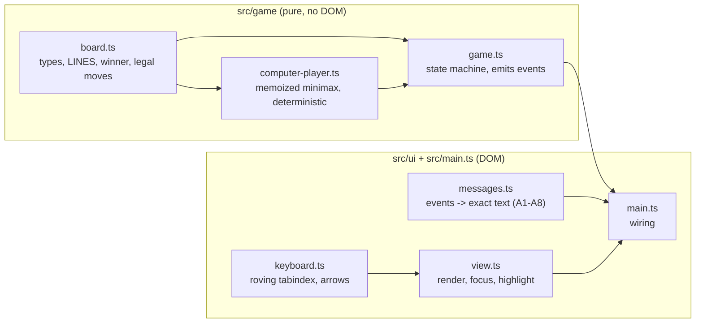
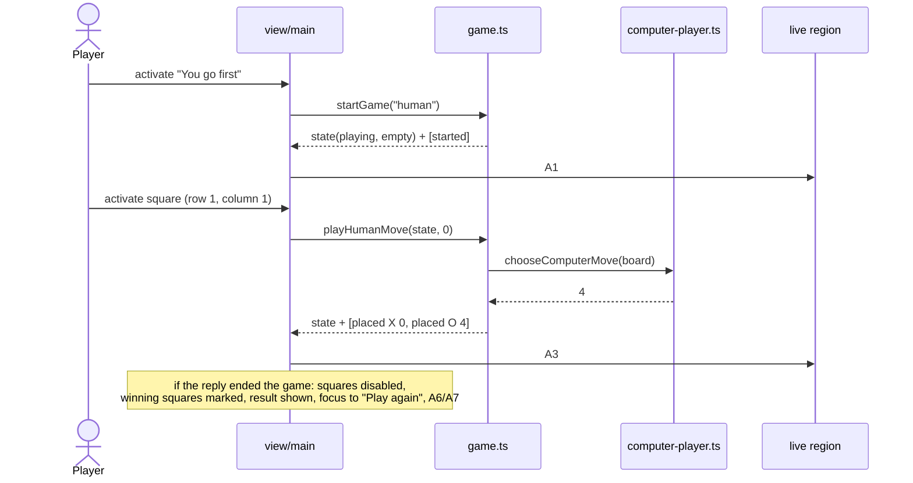
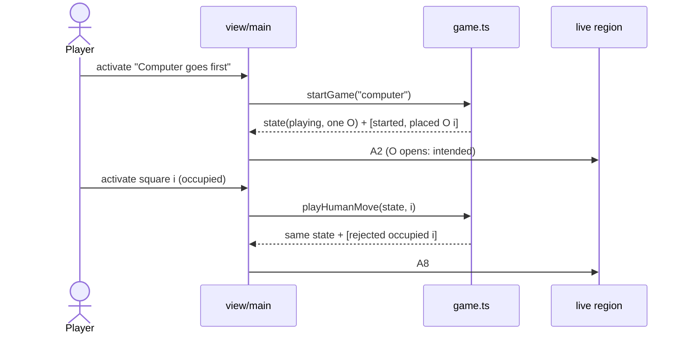
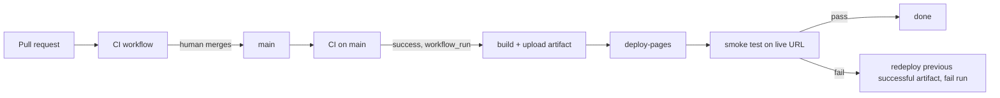

You are an independent second-opinion reviewer in a software factory pipeline.
A different AI (Claude) produced the DRAFT below. Your job is to find what it got
wrong, what it missed, and where a materially better approach exists. Do not
rubber-stamp, and do not inflate: report only findings you would defend with
evidence (a line, an input that breaks it, a requirement it violates). Do not
rewrite the whole thing. Be specific and terse.

Review kind: architecture
Reviewer: {{REVIEWER}}
Project: factory-tictactoe


Respond in EXACTLY this format (markdown):

## Verdict
Exactly one of:
- AGREE — no CRITICAL or HIGH findings.
- AGREE-WITH-CONCERNS — CRITICAL or HIGH findings that can be fixed within this approach.
- DISAGREE — the approach itself is wrong: you would redo it rather than patch it, and you describe what instead under Alternative.
Findings alone, however many or severe, never make a DISAGREE; they make AGREE-WITH-CONCERNS.
One sentence of justification.

## Findings
Number every finding C1, C2, … so the author can answer each one. One bullet each:
- [C1] [CRITICAL|HIGH|MEDIUM|LOW] <where> — <what is wrong> — <evidence> — <what to do instead>
(CRITICAL = will cause data loss, security hole, wrong behavior, or blocks the goal. Use it sparingly and only when sure.)

## Missing
Bullets: things the draft should address but doesn't. Empty if none.

## Alternative
If you would take a materially different approach, describe it in <=8 lines and say why it's better. Otherwise write "None".

## Questions for the human
Bullets: decisions only the product owner can make. Empty if none.

=== CONTEXT (read-only, for reference) ===

--- .factory/prd.md ---
# PRD: factory-tictactoe

_Traces to: `.factory/intent.json` (v2, captured 2026-09-27T20:20:18Z). Status: draft_

## 1. Problem

Casual players who want a quick game of tic-tac-toe in a browser have to put up with ad-heavy, slow game sites that are awkward to use with a keyboard or screen reader, because those sites are built to maximise ad impressions rather than to play well. We will ship a plain, fast, ad-free game with a computer opponent that never loses, playable by touch, mouse, keyboard and screen reader, with no install, sign-up or tracking. Severity is low for players; the build is also the end-to-end live test of the Software Factory, so every phase is exercised properly.

## 2. Users

| Persona | Context | Goal | Pain today |
|---|---|---|---|
| Casual novice player (primary) | About two minutes to spare, on a phone (touch) or laptop (mouse/trackpad); opens a link, plays one or two games, closes the tab | A quick game with zero friction | Ads, slow loads and sign-up prompts before the first move |
| Keyboard-only or screen-reader player (hard constraint, not a trade-off) | Same situations, using keyboard navigation and/or a screen reader | Play a complete game and always know the board state and result | Most game sites cannot be played without a pointer or give no spoken feedback |

A player who wants to beat the machine is served automatically by perfect play. By design a player can never win; the best outcome for the player is a draw.

## 3. Goals & Success Metrics

| Goal | Metric | Target | How measured |
|---|---|---|---|
| The computer is unbeatable | Computer losses across every reachable game position, both starting sides | 0 | Exhaustive automated test in CI (R-003) |
| Live and correct within 30 days | Done checklist: live URL loads; exhaustive test passes in CI; zero axe-core violations; JS bundle under 50 KB gzipped; full keyboard-only game completes | All 5 items true | Post-deploy smoke test (R-014), CI jobs (R-003, R-009, R-011), Playwright keyboard test (R-007) |

## 4. Non-goals (explicitly out of scope)

- Easier modes or difficulty levels
- Hot-seat two-player mode
- Win/draw tally
- Choosing X or O (picking a symbol)
- Sound
- Animations beyond basics
- Themes / dark mode
- PWA / offline install
- Translations
- Accounts
- Persistence
- Bigger boards
- Analytics
- Ads
- Real-device iOS/Android testing (this build)
- Screen readers other than VoiceOver; any manual screen-reader pass by the factory
- Undo / take-back
- Move history
- Rules / help page
- Custom domain

Complexity ceiling: anything that needs a server or storage.

## 5. Requirements

| ID | Requirement | Priority | Rationale |
|---|---|---|---|
| R-001 | The game shows a 3×3 board. Only legal moves are accepted: a move on an occupied square, out of turn, or after the game has ended changes nothing. | MUST | intent.scope.mvp[0] — legal moves only |
| R-002 | Before each game the player chooses who moves first: "You" or "Computer". The human is always X and the computer always O; when the computer starts, O opens (intended, not a bug). | MUST | intent.scope.mvp[0]; context.remember (first-mover rule) |
| R-003 | The computer plays perfectly and never loses: from every position reachable in a game against any sequence of legal human moves, with either side starting, the computer's play never produces a human win. Verified by an exhaustive automated test. | MUST | intent.success.primary_metric (target 0) |
| R-004 | The game detects a win (three in a row for X or O) and a draw (full board, no winner), ends the game at that moment, and shows a result message. | MUST | intent.scope.mvp[0] |
| R-005 | When a game is won, the three squares of the winning line are highlighted by a means that does not rely on colour alone, and the winning line is described in text. | MUST | intent.scope.mvp[0]; WCAG 2.2 AA 1.4.1 |
| R-006 | After a game ends, a "Play again" control returns the player to the first-mover choice with an empty board. | MUST | intent.scope.mvp[0] |
| R-007 | A full game, including the first-mover choice and "Play again", can be played with the keyboard only: Tab reaches the board, arrow keys move between squares, Enter or Space places X, and focus is always visible. | MUST | intent.scope.mvp[1]; success done-checklist item 5 |
| R-008 | A polite live region announces, with exact fixed wording, the start of each game, each human move, each computer move, invalid-move attempts, and the result including the winning line. The exact texts are the announcement contract A1–A8 in `acceptance.md`: a human move and the computer reply form one message that ends with either "Your turn." or the result. Each square exposes its position and contents as its accessible name. | MUST | intent.scope.mvp[1]; constraints (announcement text asserted in tests) |
| R-009 | The page meets WCAG 2.2 AA and has zero axe-core violations in every game state (choice, in play, won, drawn) in Chromium, Firefox and WebKit. | MUST | intent.constraints.quality_standards |
| R-010 | The layout works from 320 CSS px wide phones to laptop screens without horizontal scrolling or zoom, is playable by touch and mouse, and every square and button is at least 44×44 CSS px (above the WCAG 2.2 AA 2.5.8 minimum of 24 px, chosen for the touch-first primary persona; confirmed by the approver 2026-09-27). | MUST | intent.scope.mvp[2]; WCAG 2.2 1.4.10, 2.5.8 |
| R-011 | The production JavaScript bundle is under 50 KB gzipped; CI fails the build if it is not. | MUST | intent.constraints (performance) |
| R-012 | The game makes no network requests beyond its own static files, sets no cookies, uses no web storage, and contains no analytics, ads, sign-up or install prompt. | MUST | intent.constraints; technology.excluded; complexity ceiling |
| R-013 | The visual style is plain and high-contrast and uses the system font stack (no web fonts, no brand). | MUST | intent.constraints; intent.design |
| R-014 | Every merge to main whose CI passes builds and deploys the site to GitHub Pages via GitHub Actions. A post-deploy smoke test loads the live URL and plays one move. If it fails, the workflow redeploys the Pages artifact of the most recent deploy run that concluded successfully (its smoke test passed), and the run fails, so the repo owner gets the Actions failure email. On the first deployment, when no such run exists, the workflow only logs that and fails. Nothing more. | MUST | intent.operations; success done-checklist item 1 |
| R-015 | Supported browsers are the current and previous versions of Chrome, Firefox, Safari and Edge, plus iOS Safari and Android Chrome; the build targets `es2022`, which all of them support. Automated verification is narrower and engine-level only: every end-to-end test runs in Chromium, Firefox and WebKit plus touch-enabled Android and iPhone emulations. Testing specific browser versions or real devices is not performed; the QA report lists it as human follow-up. | MUST | intent.constraints (browser support, verification) |

## 6. User Flows

**Flow A — player moves first (primary)**
1. Player opens the URL. The page shows the title and the first-mover choice ("You go first" / "Computer goes first"); the board is empty.
2. Player chooses "You go first". The board becomes active; status reads "Your turn. You are X."
3. Player places X on an empty square (tap, click, or Enter/Space on the focused square).
4. The computer immediately places O. Both moves are announced in one message.
5. Steps 3–4 repeat until a win or draw.
6. The result is shown and announced; on a win the three squares are highlighted and the line described. "Play again" appears and receives focus.
7. "Play again" returns to step 1's choice with an empty board.

**Flow B — computer moves first**
1–2. As Flow A, but the player chooses "Computer goes first". The computer places O immediately; the announcement states that O opens.
3. Play continues as Flow A from step 3.

**Unhappy paths**
- Player activates an occupied square: nothing changes on the board; the live region says the square is taken.
- Player activates a square after the game has ended: nothing changes (squares are disabled).
- Player tries to play before choosing who goes first: squares are disabled until a choice is made.
- JavaScript disabled or failing to load: a static message says the game needs JavaScript.

## 7. Data

No stored data. Game state lives in memory for the life of the tab and is discarded on reload. No personal data, cookies, web storage or telemetry (R-012).

## 8. Integrations & External Dependencies

| System | Purpose | Auth | Failure mode |
|---|---|---|---|
| GitHub Actions | CI (format, lint, typecheck, unit, exhaustive, bundle size, e2e/axe) and deploy | Repository GITHUB_TOKEN | Build fails; nothing deploys; owner gets failure email |
| GitHub Pages | Static hosting | Pages deploy permission in workflow | Site unavailable (GitHub's uptime; no separate SLA); bad deploy triggers R-014 rollback |

At run time the game has no integrations.

## 9. Quality Requirements

- **Correctness:** 0 computer losses in the exhaustive test (R-003).
- **Accessibility:** WCAG 2.2 AA; zero axe-core violations in all game states; exact live-region text asserted in Playwright; keyboard-only full game in CI (R-007–R-009). A real VoiceOver pass and a real-device iOS/Android check are **not performed** by the factory; the QA report lists them as human follow-up.
- **Performance:** JS under 50 KB gzipped (R-011); no web fonts (R-013); no third-party requests (R-012).
- **Privacy/security:** no data collected, no cookies, no storage, no third-party scripts (R-012). Compliance: none applicable.
- **Browser support:** the supported browser list is a requirement; automated verification is engine-level only (R-015). Version-specific and real-device checks are human follow-up.

## 10. Open Questions

| # | Question | Owner | Blocking? |
|---|---|---|---|
| 1 | Should a "New game" control also be available mid-game (not only after the game ends)? **Resolved 2026-09-27: no.** "Play again" appears only after a game ends. | Approver | No (resolved) |
| 2 | Should the computer's reply be instant or shown after a short pause? **Resolved 2026-09-27: instant.** No animations beyond basics; both moves are announced in one message. | Approver | No (resolved) |

## 11. Second-opinion summary

Reviewed 2026-09-27 by Codex (AGREE, 2 MEDIUM) and Ollama qwen2.5:14b (summary only, no findings in the required format).
- Accepted: R-015 now separates the supported-browser requirement from the narrower engine-level verification (Codex C1). R-014 now defines the rollback target as the latest deploy run that concluded successfully, and states the first-deploy behaviour (Codex C2). R-008 points to the exact announcement contract A1–A8 (Codex, Missing).
- Rejected: Ollama's suggestions of a help page and testing more screen readers are explicit non-goals.
Details: `.factory/reviews/specification-reconciliation.md`.

--- .factory/acceptance.md ---
# Acceptance criteria: factory-tictactoe

_Traces to: `.factory/prd.md`. Every criterion is written to be checked by an automated test (Vitest unit tests, Playwright end-to-end tests, or a CI script), except where it says "verified in deploy phase"._

## Conventions used below

- Squares are numbered by **row 1–3 (top to bottom)** and **column 1–3 (left to right)**.
- `{R}`, `{C}` are the row and column of the human's move; `{R2}`, `{C2}` are those of the computer's move.
- `{LINE}` is one of: `row 1`, `row 2`, `row 3`, `column 1`, `column 2`, `column 3`, `the diagonal from top left to bottom right`, `the diagonal from top right to bottom left`.

### Announcement text (exact, used by R-002, R-004, R-005, R-008)

| ID | When | Exact live-region text |
|---|---|---|
| A1 | Game starts, human first | `New game. You go first. You are X. Your turn.` |
| A2 | Game starts, computer first | `New game. Computer goes first as O. Computer placed O in row {R2}, column {C2}. Your turn.` |
| A3 | Human moves, game continues | `You placed X in row {R}, column {C}. Computer placed O in row {R2}, column {C2}. Your turn.` |
| A4 | Human move wins (unreachable with a perfect computer, still defined) | `You placed X in row {R}, column {C}. You win with {LINE}.` |
| A5 | Human move fills the board with no winner | `You placed X in row {R}, column {C}. It's a draw.` |
| A6 | Computer move wins | `You placed X in row {R}, column {C}. Computer placed O in row {R2}, column {C2}. Computer wins with {LINE}.` |
| A7 | Computer move fills the board with no winner | `You placed X in row {R}, column {C}. Computer placed O in row {R2}, column {C2}. It's a draw.` |
| A8 | Human activates an occupied square | `Row {R}, column {C} is taken. Choose an empty square.` |

Square accessible names: `Row {R}, column {C}, empty` / `Row {R}, column {C}, X` / `Row {R}, column {C}, O`.

## R-001 Board and legal moves

- **Given** a game in progress with the human to move, **when** the human activates an empty square, **then** exactly that square shows X and no other square changes before the computer's reply.
- **Given** a game in progress, **when** the human activates a square showing X or O, **then** the board is unchanged and it is still the human's turn.
- **Given** the game state module, **when** a human move is submitted while it is the computer's turn or after the game has ended, **then** the move is rejected and the returned state equals the input state (unit test).

### Unhappy paths

- **Given** the first-mover choice has not been made, **when** the player clicks, taps or presses Enter on any square, **then** nothing is placed (squares are disabled).
- **Given** JavaScript is disabled, **when** the page loads, **then** a visible message says the game needs JavaScript (Playwright with `javaScriptEnabled: false`).

## R-002 First-mover choice

- **Given** a fresh page load, **when** it renders, **then** two controls "You go first" and "Computer goes first" are visible, the board is empty, and no control to choose a symbol exists.
- **Given** the choice is shown, **when** the player chooses "You go first", **then** the board is empty, it is the human's turn as X, and the live region reads A1.
- **Given** the choice is shown, **when** the player chooses "Computer goes first", **then** exactly one square shows O, no square shows X, and the live region reads A2 naming that square.
- **Given** any game, **when** squares are filled, **then** every human-placed mark is X and every computer-placed mark is O, regardless of who started.

## R-003 Perfect, never-losing computer

- **Given** both starting sides, **when** a test enumerates every legal human move at every position where it is the human's turn and applies the computer's chosen reply at every position where it is the computer's turn, **then** no reachable finished game is a human (X) win, and the test reports the number of finished games examined (greater than 0) for each starting side.
- **Given** a position where the computer can complete three in a row, **when** it chooses a move, **then** it completes the line (unit test over all such reachable positions).
- **Given** the same position twice, **when** the computer chooses a move, **then** it returns the same square both times (deterministic).
- **Given** CI, **when** the unit-test job runs, **then** the exhaustive test runs on every push and pull request and finishes in under 60 seconds.

## R-004 Win and draw detection with result message

- **Given** each of the 8 lines filled with X, and separately with O, **when** the board is evaluated, **then** the winner is that symbol and the line is identified (unit test, 16 cases).
- **Given** a full board with no three in a row, **when** it is evaluated, **then** the result is a draw.
- **Given** a move that wins or fills the board, **when** it is applied, **then** the game ends, all squares become disabled, and the visible result text contains "Computer wins", "You win" or "It's a draw" accordingly, and the live region reads A4, A5, A6 or A7 accordingly.

## R-005 Winning line highlight

- **Given** a game the computer has won, **when** the result is shown, **then** exactly the three squares of the winning line are marked as winning and each of them differs from non-winning squares in at least one non-colour computed style (border width or style, outline, or text decoration) or carries an overlaid line element.
- **Given** a game the computer has won, **when** the result is shown, **then** the visible result text and the live region both name the line using `{LINE}` wording.
- **Given** a drawn game, **when** the result is shown, **then** no square is marked as winning.

## R-006 Play again

- **Given** a finished game, **when** the result is shown, **then** a "Play again" button is visible and has keyboard focus.
- **Given** a game in progress, **when** the page is inspected, **then** no "Play again" button is visible.
- **Given** a finished game, **when** the player activates "Play again", **then** the board is empty, the first-mover choice is shown, and focus is on "You go first".

## R-007 Keyboard-only play

- **Given** a fresh page, **when** a Playwright test plays a complete game using only Tab, Shift+Tab, arrow keys, Enter and Space (no pointer events), choosing "You go first", **then** the game reaches a result and "Play again" can be activated from the keyboard to start a second game choosing "Computer goes first", which also reaches a result.
- **Given** the board has focus, **when** an arrow key is pressed, **then** focus moves one square in that direction, stays put at the board edge, and exactly one square is in the Tab order at any time.
- **Given** a square has focus, **when** Enter or Space is pressed on an empty square, **then** X is placed there.
- **Given** any focused control, **when** its computed style is read, **then** it has a visible focus indicator with an outline or border at least 2 CSS px wide.

## R-008 Screen-reader announcements

- **Given** each situation A1–A8, **when** it occurs in a Playwright test, **then** the live region (`aria-live="polite"`) text equals the exact string in the announcement table, with placeholders filled.
- **Given** any board state, **when** the squares are inspected, **then** each square's accessible name matches `Row {R}, column {C}, empty|X|O` for its current content.
- **Given** a human move, **when** the computer replies, **then** a single announcement covers both moves (the live region is updated once per human action).

## R-009 WCAG 2.2 AA and zero axe violations

- **Given** each game state (choice shown, game in progress, computer won, draw), **when** axe-core runs with tags `wcag2a`, `wcag2aa`, `wcag21a`, `wcag21aa` and `wcag22aa` in Chromium, Firefox and WebKit, **then** it reports 0 violations.
- **Given** the page, **when** it loads, **then** it has a `lang` attribute, a descriptive `<title>`, one `h1`, and the board is exposed as a labelled group.

## R-010 Responsive layout for touch and mouse

- **Given** viewports of 320×568, 390×844 and 1280×800 CSS px, **when** the page is shown in each game state, **then** `document.documentElement.scrollWidth` does not exceed the viewport width and all nine squares and both choice buttons are fully visible without scrolling horizontally.
- **Given** those viewports, **when** the bounding boxes of the squares and buttons are measured, **then** each is at least 44×44 CSS px.
- **Given** a touch-enabled phone emulation, **when** the player taps "You go first" and then an empty square, **then** X is placed there.
- **Given** a desktop viewport, **when** the player clicks "You go first" and then an empty square, **then** X is placed there.

## R-011 Bundle size

- **Given** a production build, **when** the CI size check sums the gzipped size of every JavaScript file in `dist/`, **then** the total is under 51,200 bytes, and the check fails the build otherwise.

## R-012 No tracking, storage or third-party requests

- **Given** a Playwright test that records every network request while loading the page and playing a full game, **when** the game ends, **then** every request went to the page's own origin.
- **Given** the same full game, **when** it ends, **then** `document.cookie` is empty and `localStorage.length` and `sessionStorage.length` are 0.
- **Given** the built `dist/` output, **when** it is scanned, **then** it contains no script, link or iframe pointing to another origin.

## R-013 Plain, high-contrast, system fonts

- **Given** the page, **when** the computed `font-family` of the body is read, **then** it begins with `system-ui`, and no font files are requested during a full game.
- **Given** the design tokens, **when** a unit test computes the contrast of every text colour against its background, **then** each ratio is at least 7:1, and every non-text indicator (square borders, focus ring, winning-line marker) is at least 3:1 against its background.

## R-014 Deploy to GitHub Pages with smoke test and minimal rollback

- **Given** a merge to main whose CI passes, **when** the deploy workflow runs, **then** the site is published to GitHub Pages and the smoke-test job loads the live URL, chooses "You go first", places one X, sees the computer's O, and passes (retrying for up to 3 minutes while Pages propagates). _Verified in deploy phase._
- **Given** a deploy whose smoke test fails (forced by the workflow's manual `force_smoke_failure` input), **when** the rollback job runs, **then** it redeploys the Pages artifact of the previous successful deploy run, does nothing else, and the workflow run concludes as failed so GitHub emails the repo owner. _Verified in deploy phase._
- **Given** no previous successful deploy run exists, **when** the smoke test fails, **then** the rollback job logs that no previous artifact exists and the run fails. _Verified in deploy phase._

## R-015 Browser coverage

- **Given** the Playwright configuration, **when** CI runs the end-to-end suite, **then** every spec runs in five projects — Chromium, Firefox, WebKit, a touch-enabled Android phone emulation (Chromium) and a touch-enabled iPhone emulation (WebKit) — and all pass.
- **Given** the production build, **when** Vite builds it, **then** its build target covers the current and previous versions of Chrome, Firefox, Safari and Edge and iOS Safari (build target `es2022`, supported by all of them).

--- .factory/adrs/ADR-001-vanilla-typescript-vite.md ---
# ADR-001: Vanilla TypeScript and Vite, no UI framework

- **Status:** proposed (accepted when the specification bundle is approved)
- **Date:** 2026-09-27
- **Deciders:** Claude (test operator, authorized by Jim Gibbs)
- **Traces to:** R-001–R-011, intent.technology.decisions[0]

## Context
The UI is nine squares, two choice buttons and a result area. The bundle must stay under 50 KB gzipped (R-011). The game logic must be pure so it can be verified exhaustively (R-003).

## Decision
We will write the game in strict TypeScript without a UI framework, bundled by Vite, keeping the rules in a DOM-free core and a thin hand-written DOM layer.

## Alternatives considered
| Option | Pros | Cons | Why not |
|---|---|---|---|
| Preact + Vite | Component model, small | About 4 KB runtime, extra abstraction | Not needed for 9 cells |
| Svelte + Vite | Small compiled output | Compiler step, extra lint and typecheck plumbing | Adds tooling for no user benefit |

## Consequences
Positive: tiny bundle and no framework upgrades. Negative: DOM updates and focus handling are written by hand, which the e2e tests have to cover. Licenses: typescript Apache-2.0, vite MIT. Both are dev-only; none ships in the bundle.

## Second opinion
See `.factory/reviews/specification-reconciliation.md` (architecture review, with ADRs as context).

--- .factory/adrs/ADR-002-github-pages-actions.md ---
# ADR-002: Host on GitHub Pages, deployed by GitHub Actions

- **Status:** proposed (accepted when the specification bundle is approved)
- **Date:** 2026-09-27
- **Deciders:** Claude (test operator, authorized by Jim Gibbs)
- **Traces to:** R-014, intent.technology.decisions[1]

## Context
The site is static with no server (complexity ceiling). The human committed to GitHub Pages. The repo is already on GitHub.

## Decision
We will deploy `dist/` to GitHub Pages using `actions/upload-pages-artifact` and `actions/deploy-pages` from a workflow triggered by a successful CI run on main.

## Alternatives considered
| Option | Pros | Cons | Why not |
|---|---|---|---|
| Netlify | Preview deploys | Extra account and secret | Human committed to Pages |
| Vercel | Preview deploys | Extra account; built for server features | Same |

## Consequences
Positive: free, no extra accounts. Negative: no preview deploys per PR; the path prefix `/factory-tictactoe/` requires a relative Vite `base`. Uptime is GitHub's, with no SLA. No new dependencies.

## Second opinion
See `.factory/reviews/specification-reconciliation.md` (architecture review, with ADRs as context).

--- .factory/adrs/ADR-003-npm-node-22.md ---
# ADR-003: npm with Node 22 pinned

- **Status:** proposed (accepted when the specification bundle is approved)
- **Date:** 2026-09-27
- **Deciders:** Claude (test operator, authorized by Jim Gibbs)
- **Traces to:** intent.technology.decisions[2]

## Context
Local and CI builds must be reproducible, and the human chose npm and Node 22.

## Decision
We will use npm with a committed `package-lock.json`, pin Node 22 in `.nvmrc` and `package.json` `engines`, and have CI read `.nvmrc` through `actions/setup-node`.

## Alternatives considered
| Option | Pros | Cons | Why not |
|---|---|---|---|
| pnpm | Faster, stricter | Another tool to install | Human chose npm |
| Node 24 | Newer | Human chose 22 | Human's choice |

## Consequences
Positive: one toolchain, identical local and CI builds. Negative: Node 22 reaches end of life in April 2027, so upgrade then. No new dependencies.

## Second opinion
See `.factory/reviews/specification-reconciliation.md` (architecture review, with ADRs as context).

--- .factory/adrs/ADR-004-prettier.md ---
# ADR-004: Prettier for formatting

- **Status:** proposed (accepted when the specification bundle is approved)
- **Date:** 2026-09-27
- **Deciders:** Claude (test operator, authorized by Jim Gibbs)
- **Traces to:** intent.technology.decisions[3], standards §3

## Context
Formatting must be checked in the pre-commit hook and in CI.

## Decision
We will format all TypeScript, CSS, HTML, JSON, YAML and Markdown with Prettier defaults, checked by `prettier --check .`.

## Alternatives considered
| Option | Pros | Cons | Why not |
|---|---|---|---|
| Biome | Fast, one tool | Doesn't carry the factory naming recipe | Kept separate from linting |
| dprint | Fast | Less common | No benefit here |

## Consequences
Positive: no formatting debates. Licenses: prettier MIT, dev-only.

## Second opinion
See `.factory/reviews/specification-reconciliation.md` (architecture review, with ADRs as context).

--- .factory/adrs/ADR-005-eslint-naming.md ---
# ADR-005: ESLint with typescript-eslint and unicorn, using the factory naming rules

- **Status:** proposed (accepted when the specification bundle is approved)
- **Date:** 2026-09-27
- **Deciders:** Claude (test operator, authorized by Jim Gibbs)
- **Traces to:** intent.technology.decisions[4], standards §6

## Context
The factory requires enforced naming rules. Standards §6 gives the recipe for TypeScript.

## Decision
We will use ESLint flat config with `@eslint/js`, `typescript-eslint` (recommendedTypeChecked) and `eslint-plugin-unicorn` 76 or later, applying the standards §6 naming rules verbatim, with kebab-case filenames.

## Alternatives considered
| Option | Pros | Cons | Why not |
|---|---|---|---|
| Biome lint | Fast | No equivalent of the naming recipe | Would need a waiver ADR |
| oxlint | Very fast | Incomplete type-aware rules | Same |

## Consequences
Positive: naming is checked mechanically. Negative: type-aware linting is slower, which is acceptable at this size. Licenses: eslint, @eslint/js, typescript-eslint and eslint-plugin-unicorn are all MIT and dev-only.

## Second opinion
See `.factory/reviews/specification-reconciliation.md` (architecture review, with ADRs as context).

--- .factory/adrs/ADR-006-tsc-strict.md ---
# ADR-006: Type-check with tsc in strict mode

- **Status:** proposed (accepted when the specification bundle is approved)
- **Date:** 2026-09-27
- **Deciders:** Claude (test operator, authorized by Jim Gibbs)
- **Traces to:** intent.technology.decisions[5]

## Context
Vite strips types without checking them.

## Decision
We will run `tsc --noEmit` with `strict`, `noUncheckedIndexedAccess` and `exactOptionalPropertyTypes` as a separate CI step and pre-push hook.

## Alternatives considered
| Option | Pros | Cons | Why not |
|---|---|---|---|
| Rely on the editor only | No CI step | Errors can merge | Unsafe |

## Consequences
Positive: board indexing errors are caught at compile time. No new dependencies beyond typescript (ADR-001).

## Second opinion
See `.factory/reviews/specification-reconciliation.md` (architecture review, with ADRs as context).

--- .factory/adrs/ADR-007-vitest.md ---
# ADR-007: Vitest for unit and exhaustive tests

- **Status:** proposed (accepted when the specification bundle is approved)
- **Date:** 2026-09-27
- **Deciders:** Claude (test operator, authorized by Jim Gibbs)
- **Traces to:** R-003, R-004, R-008, intent.technology.decisions[6]

## Context
The core needs fast unit tests and an exhaustive never-lose test that runs on every push.

## Decision
We will use Vitest for all DOM-free tests, including `tests/unit/never-loses.test.ts`.

## Alternatives considered
| Option | Pros | Cons | Why not |
|---|---|---|---|
| Jest | Mature | Needs TypeScript/ESM configuration | Extra setup |
| node:test | No dependency | Weaker TypeScript support | Friction |

## Consequences
Positive: shares the Vite config; zero-config TypeScript. Licenses: vitest MIT, dev-only.

## Second opinion
See `.factory/reviews/specification-reconciliation.md` (architecture review, with ADRs as context).

--- .factory/adrs/ADR-008-playwright-axe.md ---
# ADR-008: Playwright and axe-core for end-to-end, keyboard and accessibility tests, in five projects

- **Status:** proposed (accepted when the specification bundle is approved)
- **Date:** 2026-09-27
- **Deciders:** Claude (test operator, authorized by Jim Gibbs)
- **Traces to:** R-007–R-010, R-012, R-015, intent.technology.decisions[7]

## Context
Keyboard play, exact live-region text, layout, network and storage checks, and axe audits need real browser engines. Version-specific and real-device testing is out of scope.

## Decision
We will use Playwright with projects `chromium`, `firefox`, `webkit`, `mobile-android` (Pixel device, Chromium, touch) and `mobile-iphone` (iPhone device, WebKit, touch), run against `vite preview` of the production build, with @axe-core/playwright for audits.

## Alternatives considered
| Option | Pros | Cons | Why not |
|---|---|---|---|
| Cypress + cypress-axe | Popular | WebKit experimental, weaker multi-engine support | Needs WebKit for Safari coverage |
| Vitest browser mode | One runner | Less mature for full-page flows | Risky for e2e |

## Consequences
Positive: engine-level coverage of all supported browsers. Negative: browser downloads slow CI down (cache them). Licenses: @playwright/test Apache-2.0; @axe-core/playwright and axe-core MPL-2.0 (file-level copyleft, used unmodified at test time only, never shipped).

## Second opinion
See `.factory/reviews/specification-reconciliation.md` (architecture review, with ADRs as context).

--- .factory/adrs/ADR-009-pure-core-event-state-machine.md ---
# ADR-009: Pure game core returning state and events, with a synchronous computer reply

- **Status:** proposed (accepted when the specification bundle is approved)
- **Date:** 2026-09-27
- **Deciders:** Claude (test operator, authorized by Jim Gibbs)
- **Traces to:** R-001–R-004, R-006, R-008

## Context
Correctness must be verified exhaustively without a DOM, and announcements must be exact and testable.

## Decision
We will implement the game as pure functions `startGame` and `playHumanMove` returning `{ state, events }`, applying the computer's reply synchronously in the same call, and derive all announcement text from events in a pure `messages.ts`.

## Alternatives considered
| Option | Pros | Cons | Why not |
|---|---|---|---|
| Mutable game class tied to the DOM | Less code | Hard to test exhaustively | Blocks R-003 verification |
| Asynchronous computer turn with a delay | Feels more human | Races with input, timers in tests | Open question 2 defaults to instant |

## Consequences
Positive: the exhaustive test and message tests need no browser; an at-rest `playing` state is always the human's turn, so out-of-turn input cannot happen. Negative: adding a delay later would need a pending state. No new dependencies.

## Second opinion
See `.factory/reviews/specification-reconciliation.md` (architecture review, with ADRs as context).

--- .factory/adrs/ADR-010-memoized-minimax.md ---
# ADR-010: Full-depth memoized minimax with deterministic tie-break, verified by exhaustive enumeration

- **Status:** proposed (accepted when the specification bundle is approved)
- **Date:** 2026-09-27
- **Deciders:** Claude (test operator, authorized by Jim Gibbs)
- **Traces to:** R-003

## Context
The computer must never lose from any reachable position. The state space is at most 3⁹ = 19,683 boards, so a full search is cheap.

## Decision
We will choose O's move by full-depth minimax scoring `10 − depth` for a win and `depth − 10` for a loss, memoized by board key, breaking ties by the lowest square index. We will verify it with a test that enumerates every legal human move at every human turn for both starting sides and asserts that no finished game is an X win.

## Alternatives considered
| Option | Pros | Cons | Why not |
|---|---|---|---|
| Hand-coded strategy rules | No search | Easy to get subtly wrong | Correctness is the product |
| Precomputed lookup table | Constant time | Generated artifact to maintain | Unnecessary given tiny search cost |

## Consequences
Positive: provably perfect play and a deterministic, repeatable test. Negative: the computer always plays the same opening (square 1 when it starts), which is acceptable because variety is not a requirement. No new dependencies.

## Second opinion
See `.factory/reviews/specification-reconciliation.md` (architecture review, with ADRs as context).

--- .factory/adrs/ADR-011-minimal-rollback.md ---
# ADR-011: Minimal automatic rollback: redeploy the last successful Pages artifact

- **Status:** proposed (accepted when the specification bundle is approved)
- **Date:** 2026-09-27
- **Deciders:** Claude (test operator, authorized by Jim Gibbs)
- **Traces to:** R-014, intent.operations

## Context
The human requires automatic rollback when the post-deploy smoke test fails, kept minimal. Pages has no built-in rollback. By default `upload-pages-artifact` keeps artifacts for 1 day.

## Decision
We will upload each Pages artifact with 90-day retention. When the smoke test fails, a rollback job finds the latest `deploy.yml` run on main that concluded successfully (`gh run list --status success`), downloads its `github-pages` artifact (`actions/download-artifact` with `run-id` and `github-token`), re-uploads it unchanged as `github-pages`, deploys it with `actions/deploy-pages`, and fails the run. If there is no such run, it logs that and fails.

## Alternatives considered
| Option | Pros | Cons | Why not |
|---|---|---|---|
| Rebuild the previous commit | No artifact retention needed | Not the same bytes; slower | Human asked for the previous artifact |
| Manual rollback only | No custom logic | Site stays broken until a human acts | Human chose automatic |

## Consequences
Positive: a bad deploy is replaced within minutes. Negative: custom workflow logic that is only verifiable in the deploy phase (a `force_smoke_failure` dispatch input exists for that). A rolled-back run concludes failed, so it is never chosen later. No new dependencies (first-party GitHub actions).

## Second opinion
See `.factory/reviews/specification-reconciliation.md` (architecture review, with ADRs as context).

--- .factory/adrs/ADR-012-accessible-board-pattern.md ---
# ADR-012: Native buttons, roving tabindex and a single polite status region

- **Status:** proposed (accepted when the specification bundle is approved)
- **Date:** 2026-09-27
- **Deciders:** Claude (test operator, authorized by Jim Gibbs)
- **Traces to:** R-005, R-007–R-010

## Context
The board must be fully keyboard- and screen-reader-operable with exact announcements and zero axe violations.

## Decision
We will render the board as `role="group"` containing nine native `<button>`s with names `Row R, column C, empty|X|O`, use a roving tabindex with arrow keys stopping at the edges, mark occupied squares `aria-disabled` (still focusable) during play and `disabled` otherwise, and announce through one visually hidden `role="status"` region written once per action (cleared, then set on the next frame so repeated messages are read again).

## Alternatives considered
| Option | Pros | Cons | Why not |
|---|---|---|---|
| ARIA `grid` role | Semantic 2D widget | More ARIA to get right; inconsistent screen-reader support | Buttons are simpler and robust |
| All nine squares in the Tab order | No custom key handling | Nine Tab stops per pass | Worse keyboard experience; intent asks for arrow navigation |

## Consequences
Positive: native activation for touch, mouse and keyboard; predictable semantics. Negative: the real screen-reader experience is not verified by the factory (human follow-up). No new dependencies.

## Second opinion
See `.factory/reviews/specification-reconciliation.md` (architecture review, with ADRs as context).


=== DRAFT UNDER REVIEW: .factory/architecture.md ===
# Architecture: factory-tictactoe

_Traces to: `.factory/prd.md`, `.factory/acceptance.md`, `.factory/tech-stack.md`. Stack is committed (ADR-001 to ADR-008); this document does not revisit it._

## 1. Shape

A single static page: `index.html` + one CSS file + one ES module bundle built by Vite from strict TypeScript, published to GitHub Pages. No backend, no network calls at run time, no storage.

The code has two layers with a one-way dependency:

- **Game core** (`src/game/`): pure, DOM-free TypeScript. It holds all the rules, the perfect computer player, and the state transitions, and it emits *events* describing what happened. Vitest tests it exhaustively.
- **UI shell** (`src/ui/`, `src/main.ts`): renders state to the DOM, turns clicks, taps and keys into core calls, and turns core events into announcement text. Playwright and axe-core test it.



## 2. Components and responsibilities

| Component | File | Responsibility | Requirements |
|---|---|---|---|
| Board model | `src/game/board.ts` | `Mark = "X" \| "O"`, `Board` (9 cells, index 0–8 row-major), the 8 `LINES`, `findWinner(board)` returning winner and line, `isFull`, `emptySquares`, immutable `placeMark` | R-001, R-004 |
| Computer player | `src/game/computer-player.ts` | `chooseComputerMove(board): SquareIndex` — full-depth minimax for O, scores `10 − depth` for a win and `depth − 10` for a loss so it wins sooner and loses never; ties broken by the lowest square index; results memoized by board key (at most 3⁹ = 19,683 keys) | R-003 |
| Game state machine | `src/game/game.ts` | `startGame(firstMover)` and `playHumanMove(state, index)` return `{ state, events }`; the computer's reply is applied synchronously inside `playHumanMove`; illegal moves return the input state unchanged plus a `rejected` event | R-001, R-002, R-003, R-004, R-006 |
| Messages | `src/ui/messages.ts` | Pure `describeEvents(events): string` producing exact texts A1–A8; `squareLabel(index, mark)`; `describeLine(line)` | R-005, R-008 |
| View | `src/ui/view.ts` | Renders choice buttons, 9 square buttons, visible status/result, "Play again"; sets accessible names, `disabled` / `aria-disabled`, winning markers; moves focus per the rules below | R-001, R-002, R-004–R-007, R-009, R-010 |
| Keyboard | `src/ui/keyboard.ts` | Roving tabindex over the 3×3 grid; arrow keys move one square and stop at edges; Enter/Space are native button activation | R-007 |
| Wiring | `src/main.ts` | Holds the single current `GameState`, calls core, renders, writes the live region | all UI |
| Styles | `src/styles.css` | System font stack, high-contrast tokens (from design phase), 44 px minimum targets, fluid grid from 320 px, 2 px+ focus ring, non-colour winning marker | R-005, R-010, R-013 |
| Page | `index.html` | `lang="en"`, title, `h1`, `<noscript>` message, live region | R-001, R-008, R-009 |
| CI scripts | `scripts/check-bundle-size.mjs`, `scripts/check-dist-origins.mjs` | Gzip-sum JS in `dist/` under 51,200 bytes; scan `dist/` for other-origin script/link/iframe URLs | R-011, R-012 |

Filenames are kebab-case and identifiers follow the factory naming rules (standards §6), enforced by ESLint.

## 3. Data model

In memory only, discarded on reload (R-012).

```ts
type Mark = "X" | "O";                 // human is always X, computer always O (R-002)
type Cell = Mark | null;
type Board = readonly Cell[];          // length 9, row-major: index = (row-1)*3 + (column-1)
type Line = readonly [number, number, number];
type FirstMover = "human" | "computer";
type Result = { kind: "win"; winner: Mark; line: Line } | { kind: "draw" };
type GameState =
  | { phase: "choosing" }                                        // before each game
  | { phase: "playing"; board: Board; firstMover: FirstMover }    // always the human's turn when idle
  | { phase: "over"; board: Board; firstMover: FirstMover; result: Result };
type GameEvent =
  | { type: "started"; firstMover: FirstMover }
  | { type: "placed"; mark: Mark; index: number }
  | { type: "ended"; result: Result }
  | { type: "rejected"; reason: "occupied" | "not-playing"; index: number };
```

Because the computer replies synchronously, a `playing` state at rest is always the human's turn; "out of turn" (R-001) therefore reduces to "not in the `playing` phase". The unit tests exercise that case directly on the state machine.

## 4. Key flows

### Flow A: human goes first and makes a move



### Flow B: computer goes first, then the human activates an occupied square



## 5. Accessibility design

- The board is a `div role="group" aria-label="Board"` containing 9 native `<button>`s laid out by CSS grid. Buttons give Enter/Space activation and touch/click for free.
- Accessible name of each square: `Row R, column C, empty|X|O` (R-008).
- **Before a choice and after the game ends**, squares have the `disabled` attribute and are out of the Tab order. **During play**, exactly one square has `tabindex="0"` (roving); occupied squares are `aria-disabled="true"` but stay focusable, so arrow navigation passes through them and activating one announces A8.
- **Live region**: one visually hidden `div role="status"` (polite). It is written once per player action. To make a repeated identical message (such as A8 twice) announce again, the text is cleared and then set on the next animation frame.
- **Focus**: after a choice, focus goes to row 1, column 1. After a move it stays on the square played. When the game ends, it moves to "Play again". After "Play again" it goes to "You go first".
- **Winning line**: `data-winning="true"` on the three squares. The style adds a thick border plus an overlaid strike line (not colour alone), and the text names the line (R-005).

## 6. Integration points and failure modes

| Integration | Used for | Failure mode | Handling |
|---|---|---|---|
| GitHub Actions: CI workflow (`ci.yml`, on push and pull request) | format check, lint, typecheck, unit + exhaustive tests, build, bundle-size and dist-origin checks, Playwright e2e + axe in 5 projects | Any job fails | PR cannot merge (humans merge; branch protection set in ship phase). Owner gets the failure email |
| GitHub Actions: deploy workflow (`deploy.yml`, on successful CI for `main` via `workflow_run`, plus `workflow_dispatch` with a `force_smoke_failure` input) | build → `actions/upload-pages-artifact` (retention 90 days) → `actions/deploy-pages` → smoke → rollback if smoke fails | Build or deploy fails | Nothing changes on the live site; run fails; email |
| GitHub Pages | hosting at `https://onelifemedia.github.io/factory-tictactoe/` | Outage | Accepted: GitHub's uptime, no SLA (intent.operations) |
| Smoke test | Playwright against the live URL: load, choose "You go first", place X, see O; retries up to 3 min for propagation | Fails | Rollback job (ADR-011): finds the most recent *successful* deploy run on `main` with `gh run list`, downloads its `github-pages` artifact with `actions/download-artifact` (`run-id`, `github-token`), re-uploads it unchanged as `github-pages`, runs `actions/deploy-pages`, then exits non-zero. If no previous successful run exists, it logs that and exits non-zero. Nothing more. |

A run that rolled back concludes as failed, so it is never chosen as "previous successful" later. Deploys are serialized with `concurrency: pages` (no cancel-in-progress).

## 7. Deployment shape



Vite `base: "./"` makes asset URLs relative, so the site works under the `/factory-tictactoe/` path. The build target is `es2022`. Node 22 is pinned in `.nvmrc` and `engines`, and CI uses `actions/setup-node` with `node-version-file: .nvmrc`.

## 8. Test architecture

| Layer | Tool | What | Where |
|---|---|---|---|
| Unit | Vitest | board rules (16 win cases, draw), state machine incl. rejections, messages A1–A8, token contrast | `tests/unit/*.test.ts` |
| Exhaustive | Vitest | every human move sequence against the computer, both starting sides; asserts 0 human wins and reports game counts; under 60 s | `tests/unit/never-loses.test.ts` |
| End-to-end + a11y | Playwright + @axe-core/playwright | keyboard-only games, touch/click, exact live-region text, focus rules, layout/target sizes at 3 viewports, requests/cookies/storage, axe in 4 states | `tests/e2e/*.spec.ts`, 5 projects (ADR-008) |
| Build checks | Node scripts | bundle < 51,200 B gzipped; no other-origin URLs in `dist/` | `scripts/*.mjs` |
| Post-deploy | Playwright | smoke on live URL | `tests/smoke/*.spec.ts` (deploy workflow only) |

Every test file names the F-ID it covers (governance).

## 9. What we are deliberately not building

- No server, API, database, storage, cookies, service worker or PWA manifest.
- No framework runtime, router, state library or CSS framework.
- No analytics, error reporting SDK or third-party script of any kind.
- No difficulty levels, symbol choice, hot-seat mode, tally, undo, history, sound, themes, translations, rules page or custom domain.
- No artificial "thinking" delay or animation beyond basics (PRD open question 2 default).
- No rollback logic beyond "redeploy the previous successful artifact and fail the run".
- No real-device or manual screen-reader testing by the factory (QA report lists it as human follow-up).
=== END DRAFT ===
