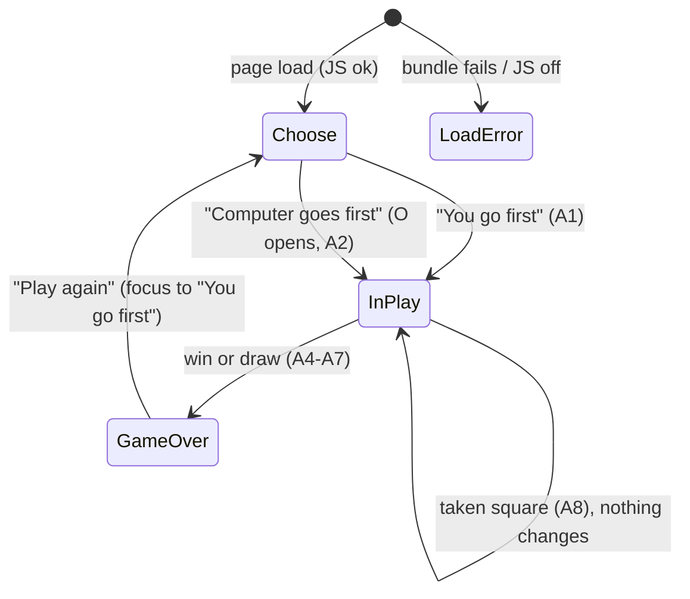

You are an independent second-opinion reviewer in a software factory pipeline.
A different AI (Claude) produced the DRAFT below. Your job is to find what it got
wrong, what it missed, and where a materially better approach exists. Do not
rubber-stamp, and do not inflate: report only findings you would defend with
evidence (a line, an input that breaks it, a requirement it violates). Do not
rewrite the whole thing. Be specific and terse.

Review kind: other
Reviewer: {{REVIEWER}}
Project: factory-tictactoe

Focus especially on: Design review: do the screens, states, copy, focus map and design system cover the PRD flows and acceptance criteria, meet WCAG 2.2 AA, and avoid scope creep?

Respond in EXACTLY this format (markdown):

## Verdict
Exactly one of:
- AGREE — no CRITICAL or HIGH findings.
- AGREE-WITH-CONCERNS — CRITICAL or HIGH findings that can be fixed within this approach.
- DISAGREE — the approach itself is wrong: you would redo it rather than patch it, and you describe what instead under Alternative.
Findings alone, however many or severe, never make a DISAGREE; they make AGREE-WITH-CONCERNS.
One sentence of justification.

## Findings
Number every finding C1, C2, … so the author can answer each one. One bullet each:
- [C1] [CRITICAL|HIGH|MEDIUM|LOW] <where> — <what is wrong> — <evidence> — <what to do instead>
(CRITICAL = will cause data loss, security hole, wrong behavior, or blocks the goal. Use it sparingly and only when sure.)

## Missing
Bullets: things the draft should address but doesn't. Empty if none.

## Alternative
If you would take a materially different approach, describe it in <=8 lines and say why it's better. Otherwise write "None".

## Questions for the human
Bullets: decisions only the product owner can make. Empty if none.

=== CONTEXT (read-only, for reference) ===

--- .factory/design/design-system.md ---
# Design System: factory-tictactoe

_Traces to: `.factory/prd.md` (users, flows), `intent.constraints.quality_standards`, `intent.design` (plain, high-contrast, system fonts, no brand). Tokens live in `tokens.json`; this file explains them. Status: draft_

## 1. Principles

- **Nothing between the player and the first move.** The primary persona has two minutes, so the page is one centred column: title, status line, choice, board. No chrome, no nav, no footer links. (R-002, persona)
- **Plain and high-contrast, not decorative.** Near-black on white, one dark blue for actions and focus, all text at 7:1 or more. No brand, no web fonts, no shadows, no animation. (R-013, intent.design)
- **Every state is visible, sayable and reachable.** Whatever a sighted player sees (whose turn, a taken square, the result, the winning line) also exists as text and is reachable by keyboard. (R-005, R-007, R-008)
- **Marks are letters, not colours.** X and O use the same colour and differ by shape, and the winning line is shown by border weight and a strike line, not by colour alone. (R-005, WCAG 1.4.1)

## 2. Color

Light only: themes and dark mode are out of scope (PRD non-goals), so there are no dark values. Ratios were computed with the WCAG relative-luminance formula; the R-013 unit test recomputes them from `tokens.json`.

| Role | Light | Dark | Used for | Contrast vs surface |
|---|---|---|---|---|
| surface | #ffffff | n/a (out of scope) | page background, active squares | — |
| surface-sunken | #f2f2f2 | n/a | disabled squares (before choice, after game over) | — |
| text | #111111 | n/a | title, status, marks X/O | 18.88:1 on surface; 16.87:1 on surface-sunken; 16.81:1 on win-surface |
| text-muted | #3d3d3d | n/a | tagline, fallback messages | 10.86:1 on surface |
| primary | #0b3d91 | n/a | button fill | on-primary text 10.04:1; fill vs surface 10.04:1 |
| on-primary | #ffffff | n/a | button labels | 10.04:1 on primary |
| border | #3d3d3d | n/a | active square outline (2px) | 10.86:1 on surface (≥ 3:1 non-text) |
| border-disabled | #595959 | n/a | disabled square outline (2px) | 6.26:1 on surface-sunken; 7.00:1 on surface |
| focus | #0b3d91 | n/a | focus ring (3px, 2px offset) | 10.04:1 on surface; 8.97:1 on surface-sunken |
| win-surface | #fff3b0 | n/a | winning squares background (supporting cue only) | text 16.81:1 on it |
| win-marker | #111111 | n/a | winning border (4px) and strike line (6px) | 16.81:1 on win-surface (≥ 3:1 non-text) |

There are no success/warning/danger colours. The game has no error styling: a taken square is reported in the status line in normal text. Rule: screens use roles only, never raw hex.

## 3. Typography

| Token | Size / line | Weight | Used for |
|---|---|---|---|
| display | 1.75rem / 1.2 | 700 | page title "Tic-tac-toe" (the one `h1`) |
| status | 1.125rem / 1.4 | 700 | status line: whose turn, taken square, result |
| body | 1rem / 1.5 | 400 | tagline, button labels (700), fallback text |
| small | 0.875rem / 1.4 | 400 | not used in the MVP; reserved |
| mark | clamp(2.5rem, 12vw, 4rem) / 1 | 700 | X and O inside squares |

Font stack: `system-ui, -apple-system, 'Segoe UI', Roboto, 'Helvetica Neue', Arial, sans-serif`. Nothing is loaded from the network (R-012, R-013). Sizes are in `rem`, so browser text zoom works; the layout reflows at 200% zoom and at 320 px wide (WCAG 1.4.4, 1.4.10).

## 4. Spacing, radius, elevation, motion

- **Spacing** (4-based): 4 / 8 / 12 / 16 / 24 / 32 px. Page padding is 16 px on phones and 24 px from 480 px up. Title, status, choice and board are 16–24 px apart. The gap between squares is 8 px.
- **Radius:** 4 px on squares and 8 px on buttons, only enough to avoid harshness.
- **Elevation:** none. Everything is flat; state is shown by fill and border, not shadow.
- **Motion:** none. State changes are instant (PRD open question 2: instant reply; animations beyond basics are a non-goal), so reduced-motion needs no special handling.
- **Sizes:** the page column is at most 28rem wide. The board is `min(100%, 360px)` square, so at 320 px wide each square is about 90 px and on desktop 114 px. The minimum target is 44 × 44 px (R-010).

## 5. Components

### Choice button ("You go first" / "Computer goes first")
- **Purpose:** start a game and pick who moves first (R-002).
- **Variants:** one style; both choices are equal, so neither is visually preferred. They sit side by side, or stack if they don't fit at 320 px.
- **States:** default (primary fill, on-primary label) · hover (underlined label) · focus-visible (3px focus ring, 2px offset) · active (same as hover). There are no disabled or loading states: the buttons only exist while choosing.
- **Anatomy:** native `<button type="button">` with a visible text label, at least 44 px tall, inside `div role="group" aria-label="Who goes first"`.
- **Do / Don't:** do keep the wording exact (tests assert it). Don't add icons or a symbol picker (a non-goal).

### Play again button
- **Purpose:** return to the choice after a game ends (R-006).
- **States:** as the choice button. It exists only in the game-over state and receives focus when it appears.
- **Do / Don't:** do place it directly under the board. Don't show it during play (PRD open question 1: no).

### Board square
- **Purpose:** show a cell and accept a move (R-001, R-007).
- **Variants:** empty · X · O.
- **States:**
  - *disabled* (before choice and after game over): `disabled` attribute, surface-sunken fill, border-disabled outline, out of the Tab order; marks stay in text colour.
  - *active empty* (during play): surface fill, border, pointer cursor.
  - *occupied during play*: `aria-disabled="true"`, same look as active but no pointer cursor; still focusable.
  - *hover* (active empty only): 4px inset border in text colour.
  - *focus-visible*: 3px focus ring, 2px offset. Exactly one square has `tabindex="0"`.
  - *winning*: `data-winning="true"`, win-surface fill, 4px win-marker border, plus a 6px strike line through the square's centre in the line's direction (`data-line="row|column|diagonal-down|diagonal-up"`), so the three squares form one continuous strike.
- **Anatomy:** native `<button>` with accessible name `Row R, column C, empty|X|O`. The visible mark is `aria-hidden` because the name already carries it.
- **Do / Don't:** do keep X and O the same colour. Don't show the winning line by colour only.

### Board
- **Purpose:** the 3 × 3 grid (R-001).
- **Anatomy:** `div role="group" aria-label="Board"`, a CSS grid of 3 × 3 with 8 px gaps and a square aspect ratio.
- **Keyboard:** roving tabindex; arrow keys move one square and stop at the edges; Enter/Space activate (ADR-012).

### Status line
- **Purpose:** visible text for the current state (R-004, R-005, R-008).
- **Content:**
  - choosing: "Who goes first?"
  - playing: "Your turn. You are X."
  - taken square: "Row R, column C is taken. Choose an empty square."
  - over: "Computer wins with {LINE}." / "It's a draw." / "You win with {LINE}." (the last is unreachable)
- **Anatomy:** a `
` in status type. It is **not** a live region; the separate announcer is (below), which prevents double announcements.

### Announcer (visually hidden)
- **Purpose:** the exact spoken texts A1–A8 (R-008).
- **Anatomy:** `div role="status"` with the `visually-hidden` utility (clip-path pattern, not `display:none`). It is written once per action.
- **Mockups:** shown as a dashed annotation box labelled "Screen reader hears", which is not part of the real UI.

### Fallback message
- **Purpose:** explain a failed load (R-001 unhappy paths).
- **Variants:** `<noscript>`: "This game needs JavaScript. Turn it on and reload the page." Static fallback, removed on start: "The game failed to load. It needs JavaScript; try reloading the page."
- **Anatomy:** a `
` in text-muted body type, in place of the choice and board.

## 6. Patterns

- **Forms & validation:** there are none. The only "invalid input" is a taken square, handled as a status message. There is no error colour and no dialog.
- **Empty state:** the empty disabled board under the choice shows what the game is before it starts.
- **Loading:** none in normal use; the bundle is tiny and the computer replies instantly. The fallback message covers the failure case.
- **Destructive actions:** none. "Play again" appears only after a game ends, so nothing is lost and no confirmation is needed.
- **Navigation:** none; a single page.
- **Responsive:** one fluid column from 320 px up, with no breakpoints beyond page padding (16 px below 480 px, 24 px above). The board is `min(100%, 360px)`. Choice buttons wrap to a column when they don't fit side by side.

## 7. Accessibility

- **Standard:** WCAG 2.2 AA (hard constraint). Text contrast is at least 7:1 and non-text at least 3:1, as a house rule above AA (R-013).
- **Keyboard model:** Tab order is title (not focusable) → choice buttons, or the board's one roving square during play, or "Play again" after the game. Arrow keys work within the board; Enter/Space place a mark.
- **Focus rules:**
  - after a choice → row 1, column 1
  - after a move → stays on the square played
  - on game over → "Play again"
  - after "Play again" → "You go first"
  - focus is never lost to `body`
- **Focus visibility:** 3px `focus` ring with a 2px offset on every interactive element. It is never removed (WCAG 2.4.7) and never obscured (2.4.11); nothing overlaps the board.
- **Target size:** at least 44 × 44 px for squares and buttons (R-010; above the 2.5.8 minimum).
- **Colour independence:** marks are letters; winning is a border weight plus a strike line plus text; disabled is also conveyed by the attribute and status text.
- **Reduced motion:** there is no motion, so nothing to reduce.
- **Language and structure:** `lang="en"`, `<title>Tic-tac-toe: play against a computer that never loses</title>`, one `h1`, and a `main` landmark.

## 8. Second-opinion summary

_Filled after the UX review and the Codex second opinion. See `.factory/reviews/` design reconciliation._

--- .factory/design/tokens.json ---
{
  "$comment": "Design tokens for factory-tictactoe. Consumed as CSS custom properties (--color-text etc.). Light only: themes and dark mode are out of scope (PRD non-goals). Contrast ratios are against the background named in design-system.md section 2 and are re-checked by a unit test (acceptance R-013).",
  "version": 1,
  "color": {
    "light": {
      "surface": "#ffffff",
      "surface-sunken": "#f2f2f2",
      "text": "#111111",
      "text-muted": "#3d3d3d",
      "primary": "#0b3d91",
      "on-primary": "#ffffff",
      "border": "#3d3d3d",
      "border-disabled": "#595959",
      "focus": "#0b3d91",
      "win-surface": "#fff3b0",
      "win-marker": "#111111"
    }
  },
  "font": {
    "family": "system-ui, -apple-system, 'Segoe UI', Roboto, 'Helvetica Neue', Arial, sans-serif",
    "size": { "small": "0.875rem", "body": "1rem", "status": "1.125rem", "display": "1.75rem", "mark": "clamp(2.5rem, 12vw, 4rem)" },
    "line": { "small": "1.4", "body": "1.5", "status": "1.4", "display": "1.2", "mark": "1" },
    "weight": { "regular": 400, "bold": 700 }
  },
  "space": { "1": "4px", "2": "8px", "3": "12px", "4": "16px", "5": "24px", "6": "32px" },
  "radius": { "sm": "4px", "md": "8px" },
  "shadow": {},
  "motion": { "fast": "0ms", "$comment": "No animation (PRD non-goal: animations beyond basics). State changes are instant." },
  "size": { "page-max": "28rem", "board-max": "360px", "square-gap": "8px", "border": "2px", "border-win": "4px", "win-line": "6px" },
  "breakpoint": { "phone": "0", "desktop": "none (single fluid column from 320px up)" },
  "a11y": { "min-target": "44px", "focus-ring": "3px solid var(--color-focus)", "focus-offset": "2px" }
}

--- .factory/prd.md ---
# PRD: factory-tictactoe

_Traces to: `.factory/intent.json` (v2, captured 2026-09-27T20:20:18Z). Status: draft_

## 1. Problem

Casual players who want a quick game of tic-tac-toe in a browser have to put up with ad-heavy, slow game sites that are awkward to use with a keyboard or screen reader, because those sites are built to maximise ad impressions rather than to play well. We will ship a plain, fast, ad-free game with a computer opponent that never loses, playable by touch, mouse, keyboard and screen reader, with no install, sign-up or tracking. Severity is low for players; the build is also the end-to-end live test of the Software Factory, so every phase is exercised properly.

## 2. Users

| Persona | Context | Goal | Pain today |
|---|---|---|---|
| Casual novice player (primary) | About two minutes to spare, on a phone (touch) or laptop (mouse/trackpad); opens a link, plays one or two games, closes the tab | A quick game with zero friction | Ads, slow loads and sign-up prompts before the first move |
| Keyboard-only or screen-reader player (hard constraint, not a trade-off) | Same situations, using keyboard navigation and/or a screen reader | Play a complete game and always know the board state and result | Most game sites cannot be played without a pointer or give no spoken feedback |

A player who wants to beat the machine is served automatically by perfect play. By design a player can never win; the best outcome for the player is a draw.

## 3. Goals & Success Metrics

| Goal | Metric | Target | How measured |
|---|---|---|---|
| The computer is unbeatable | Computer losses across every reachable game position, both starting sides | 0 | Exhaustive automated test in CI (R-003) |
| Live and correct within 30 days | Done checklist: live URL loads; exhaustive test passes in CI; zero axe-core violations; JS bundle under 50 KB gzipped; full keyboard-only game completes | All 5 items true | Post-deploy smoke test (R-014), CI jobs (R-003, R-009, R-011), Playwright keyboard test (R-007) |

## 4. Non-goals (explicitly out of scope)

- Easier modes or difficulty levels
- Hot-seat two-player mode
- Win/draw tally
- Choosing X or O (picking a symbol)
- Sound
- Animations beyond basics
- Themes / dark mode
- PWA / offline install
- Translations
- Accounts
- Persistence
- Bigger boards
- Analytics
- Ads
- Real-device iOS/Android testing (this build)
- Screen readers other than VoiceOver; any manual screen-reader pass by the factory
- Undo / take-back
- Move history
- Rules / help page
- Custom domain

Complexity ceiling: anything that needs a server or storage.

## 5. Requirements

| ID | Requirement | Priority | Rationale |
|---|---|---|---|
| R-001 | The game shows a 3×3 board. Only legal moves are accepted: a move on an occupied square, out of turn, or after the game has ended changes nothing. | MUST | intent.scope.mvp[0] — legal moves only |
| R-002 | Before each game the player chooses who moves first: "You" or "Computer". The human is always X and the computer always O; when the computer starts, O opens (intended, not a bug). | MUST | intent.scope.mvp[0]; context.remember (first-mover rule) |
| R-003 | The computer plays perfectly and never loses: from every position reachable in a game against any sequence of legal human moves, with either side starting, the computer's play never produces a human win. Verified by an exhaustive automated test. | MUST | intent.success.primary_metric (target 0) |
| R-004 | The game detects a win (three in a row for X or O) and a draw (full board, no winner), ends the game at that moment, and shows a result message. | MUST | intent.scope.mvp[0] |
| R-005 | When a game is won, the three squares of the winning line are highlighted by a means that does not rely on colour alone, and the winning line is described in text. | MUST | intent.scope.mvp[0]; WCAG 2.2 AA 1.4.1 |
| R-006 | After a game ends, a "Play again" control returns the player to the first-mover choice with an empty board. | MUST | intent.scope.mvp[0] |
| R-007 | A full game, including the first-mover choice and "Play again", can be played with the keyboard only: Tab reaches the board, arrow keys move between squares, Enter or Space places X, and focus is always visible. | MUST | intent.scope.mvp[1]; success done-checklist item 5 |
| R-008 | A polite live region announces, with exact fixed wording, the start of each game, each human move, each computer move, invalid-move attempts, and the result including the winning line. The exact texts are the announcement contract A1–A8 in `acceptance.md`: a human move and the computer reply form one message that ends with either "Your turn." or the result. Each square exposes its position and contents as its accessible name. | MUST | intent.scope.mvp[1]; constraints (announcement text asserted in tests) |
| R-009 | The page meets WCAG 2.2 AA and has zero axe-core violations in every game state (choice, in play, won, drawn) in Chromium, Firefox and WebKit. | MUST | intent.constraints.quality_standards |
| R-010 | The layout works from 320 CSS px wide phones to laptop screens without horizontal scrolling or zoom, is playable by touch and mouse, and every square and button is at least 44×44 CSS px (above the WCAG 2.2 AA 2.5.8 minimum of 24 px, chosen for the touch-first primary persona; confirmed by the approver 2026-09-27). | MUST | intent.scope.mvp[2]; WCAG 2.2 1.4.10, 2.5.8 |
| R-011 | The production JavaScript bundle is under 50 KB gzipped; CI fails the build if it is not. | MUST | intent.constraints (performance) |
| R-012 | The game makes no network requests beyond its own static files, sets no cookies, uses no web storage, and contains no analytics, ads, sign-up or install prompt. | MUST | intent.constraints; technology.excluded; complexity ceiling |
| R-013 | The visual style is plain and high-contrast and uses the system font stack (no web fonts, no brand). | MUST | intent.constraints; intent.design |
| R-014 | Whenever CI passes for the latest commit on main, GitHub Actions builds exactly that commit and deploys it to GitHub Pages. An older merge whose CI finishes after a newer merge is not deployed separately; it goes live as part of the newer commit. A post-deploy smoke test waits until the live page shows the deployed commit, then plays one move. If it fails, the workflow redeploys the Pages artifact of the most recent deploy run that concluded successfully (its smoke test passed), and the run fails, so the repo owner gets the Actions failure email. If no such run exists (first deployment) or its artifact has expired (artifacts are kept 90 days), the workflow only logs that and fails. Nothing more. | MUST | intent.operations; success done-checklist item 1; approver decisions 2026-09-27 |
| R-015 | Supported browsers are the current and previous versions of Chrome, Firefox, Safari and Edge, plus iOS Safari and Android Chrome; the build targets `es2022`, which all of them support. Automated verification is narrower and engine-level only: every end-to-end test runs in Chromium, Firefox and WebKit plus touch-enabled Android and iPhone emulations. Testing specific browser versions or real devices is not performed; the QA report lists it as human follow-up. | MUST | intent.constraints (browser support, verification) |

## 6. User Flows

**Flow A — player moves first (primary)**
1. Player opens the URL. The page shows the title and the first-mover choice ("You go first" / "Computer goes first"); the board is empty.
2. Player chooses "You go first". The board becomes active; status reads "Your turn. You are X."
3. Player places X on an empty square (tap, click, or Enter/Space on the focused square).
4. The computer immediately places O. Both moves are announced in one message.
5. Steps 3–4 repeat until a win or draw.
6. The result is shown and announced; on a win the three squares are highlighted and the line described. "Play again" appears and receives focus.
7. "Play again" returns to step 1's choice with an empty board.

**Flow B — computer moves first**
1–2. As Flow A, but the player chooses "Computer goes first". The computer places O immediately; the announcement states that O opens.
3. Play continues as Flow A from step 3.

**Unhappy paths**
- Player activates an occupied square: nothing changes on the board; the live region says the square is taken.
- Player activates a square after the game has ended: nothing changes (squares are disabled).
- Player tries to play before choosing who goes first: squares are disabled until a choice is made.
- JavaScript disabled or failing to load: a static message says the game needs JavaScript.

## 7. Data

No stored data. Game state lives in memory for the life of the tab and is discarded on reload. No personal data, cookies, web storage or telemetry (R-012).

## 8. Integrations & External Dependencies

| System | Purpose | Auth | Failure mode |
|---|---|---|---|
| GitHub Actions | CI (format, lint, typecheck, unit, exhaustive, bundle size, e2e/axe) and deploy | Repository GITHUB_TOKEN | Build fails; nothing deploys; owner gets failure email |
| GitHub Pages | Static hosting | Pages deploy permission in workflow | Site unavailable (GitHub's uptime; no separate SLA); bad deploy triggers R-014 rollback |

At run time the game has no integrations.

## 9. Quality Requirements

- **Correctness:** 0 computer losses in the exhaustive test (R-003).
- **Accessibility:** WCAG 2.2 AA; zero axe-core violations in all game states; exact live-region text asserted in Playwright; keyboard-only full game in CI (R-007–R-009). A real VoiceOver pass and a real-device iOS/Android check are **not performed** by the factory; the QA report lists them as human follow-up.
- **Performance:** JS under 50 KB gzipped (R-011); no web fonts (R-013); no third-party requests (R-012).
- **Privacy/security:** no data collected, no cookies, no storage, no third-party scripts (R-012). Compliance: none applicable.
- **Browser support:** the supported browser list is a requirement; automated verification is engine-level only (R-015). Version-specific and real-device checks are human follow-up.

## 10. Open Questions

| # | Question | Owner | Blocking? |
|---|---|---|---|
| 1 | Should a "New game" control also be available mid-game (not only after the game ends)? **Resolved 2026-09-27: no.** "Play again" appears only after a game ends. | Approver | No (resolved) |
| 2 | Should the computer's reply be instant or shown after a short pause? **Resolved 2026-09-27: instant.** No animations beyond basics; both moves are announced in one message. | Approver | No (resolved) |

## 11. Second-opinion summary

Reviewed 2026-09-27 by Codex (AGREE, 2 MEDIUM) and Ollama qwen2.5:14b (summary only, no findings in the required format).
- Accepted: R-015 now separates the supported-browser requirement from the narrower engine-level verification (Codex C1). R-014 now defines the rollback target as the latest deploy run that concluded successfully, and states the first-deploy behaviour (Codex C2). R-008 points to the exact announcement contract A1–A8 (Codex, Missing).
- Rejected: Ollama's suggestions of a help page and testing more screen readers are explicit non-goals.
- Architecture review (Codex AGREE-WITH-CONCERNS, 3 HIGH and 4 MEDIUM, all resolved; Ollama non-conforming): R-014 changed by approver decision to deploy only the latest commit on main and to accept the 90-day artifact expiry limit on rollback.
Details: `.factory/reviews/specification-reconciliation.md`.

--- .factory/acceptance.md ---
# Acceptance criteria: factory-tictactoe

_Traces to: `.factory/prd.md`. Every criterion is written to be checked by an automated test (Vitest unit tests, Playwright end-to-end tests, or a CI script), except where it says "verified in deploy phase"._

## Conventions used below

- Squares are numbered by **row 1–3 (top to bottom)** and **column 1–3 (left to right)**.
- `{R}`, `{C}` are the row and column of the human's move; `{R2}`, `{C2}` are those of the computer's move.
- `{LINE}` is one of: `row 1`, `row 2`, `row 3`, `column 1`, `column 2`, `column 3`, `the diagonal from top left to bottom right`, `the diagonal from top right to bottom left`.

### Announcement text (exact, used by R-002, R-004, R-005, R-008)

| ID | When | Exact live-region text |
|---|---|---|
| A1 | Game starts, human first | `New game. You go first. You are X. Your turn.` |
| A2 | Game starts, computer first | `New game. Computer goes first as O. Computer placed O in row {R2}, column {C2}. Your turn.` |
| A3 | Human moves, game continues | `You placed X in row {R}, column {C}. Computer placed O in row {R2}, column {C2}. Your turn.` |
| A4 | Human move wins (unreachable with a perfect computer, still defined) | `You placed X in row {R}, column {C}. You win with {LINE}.` |
| A5 | Human move fills the board with no winner | `You placed X in row {R}, column {C}. It's a draw.` |
| A6 | Computer move wins | `You placed X in row {R}, column {C}. Computer placed O in row {R2}, column {C2}. Computer wins with {LINE}.` |
| A7 | Computer move fills the board with no winner | `You placed X in row {R}, column {C}. Computer placed O in row {R2}, column {C2}. It's a draw.` |
| A8 | Human activates an occupied square | `Row {R}, column {C} is taken. Choose an empty square.` |

Square accessible names: `Row {R}, column {C}, empty` / `Row {R}, column {C}, X` / `Row {R}, column {C}, O`.

## R-001 Board and legal moves

- **Given** a game in progress with the human to move, **when** the human activates an empty square, **then** exactly that square shows X and no other square changes before the computer's reply.
- **Given** a game in progress, **when** the human activates a square showing X or O, **then** the board is unchanged and it is still the human's turn.
- **Given** the game state module, **when** a human move is submitted while it is the computer's turn or after the game has ended, **then** the move is rejected and the returned state equals the input state (unit test).

### Unhappy paths

- **Given** the first-mover choice has not been made, **when** the player clicks, taps or presses Enter on any square, **then** nothing is placed (squares are disabled).
- **Given** JavaScript is disabled, **when** the page loads, **then** a visible message says the game needs JavaScript (Playwright with `javaScriptEnabled: false`).
- **Given** JavaScript is enabled but the JavaScript bundle request fails (Playwright aborts it), **when** the page loads, **then** a visible message says the game failed to load; **and given** the bundle loads normally, **then** that message is not present.

## R-002 First-mover choice

- **Given** a fresh page load, **when** it renders, **then** two controls "You go first" and "Computer goes first" are visible, the board is empty, and no control to choose a symbol exists.
- **Given** the choice is shown, **when** the player chooses "You go first", **then** the board is empty, it is the human's turn as X, and the live region reads A1.
- **Given** the choice is shown, **when** the player chooses "Computer goes first", **then** exactly one square shows O, no square shows X, and the live region reads A2 naming that square.
- **Given** any game, **when** squares are filled, **then** every human-placed mark is X and every computer-placed mark is O, regardless of who started.

## R-003 Perfect, never-losing computer

- **Given** both starting sides, **when** a test enumerates every legal human move at every position where it is the human's turn and applies the computer's chosen reply at every position where it is the computer's turn, **then** no reachable finished game is a human (X) win, and the test reports the number of finished games examined (greater than 0) for each starting side.
- **Given** a position where the computer can complete three in a row, **when** it chooses a move, **then** it completes the line (unit test over all such reachable positions).
- **Given** the same position twice, **when** the computer chooses a move, **then** it returns the same square both times (deterministic).
- **Given** successive games in one process with alternating starters (human, computer, human, …), **when** the exhaustive enumeration runs for each, **then** results are identical to running each starter in a fresh process (the memo stays valid across starters).
- **Given** CI, **when** the unit-test job runs, **then** the exhaustive test runs on every push and pull request and finishes in under 60 seconds.

## R-004 Win and draw detection with result message

- **Given** each of the 8 lines filled with X, and separately with O, **when** the board is evaluated, **then** the winner is that symbol and the line is identified (unit test, 16 cases).
- **Given** a full board with no three in a row, **when** it is evaluated, **then** the result is a draw.
- **Given** a move that wins or fills the board, **when** it is applied, **then** the game ends, all squares become disabled, and the visible result text contains "Computer wins", "You win" or "It's a draw" accordingly, and the live region reads A4, A5, A6 or A7 accordingly.

## R-005 Winning line highlight

- **Given** a game the computer has won, **when** the result is shown, **then** exactly the three squares of the winning line are marked as winning and each of them differs from non-winning squares in at least one non-colour computed style (border width or style, outline, or text decoration) or carries an overlaid line element.
- **Given** a game the computer has won, **when** the result is shown, **then** the visible result text and the live region both name the line using `{LINE}` wording.
- **Given** a drawn game, **when** the result is shown, **then** no square is marked as winning.

## R-006 Play again

- **Given** a finished game, **when** the result is shown, **then** a "Play again" button is visible and has keyboard focus.
- **Given** a game in progress, **when** the page is inspected, **then** no "Play again" button is visible.
- **Given** a finished game, **when** the player activates "Play again", **then** the board is empty, the first-mover choice is shown, and focus is on "You go first".

## R-007 Keyboard-only play

- **Given** a fresh page, **when** a Playwright test plays a complete game using only Tab, Shift+Tab, arrow keys, Enter and Space (no pointer events), choosing "You go first", **then** the game reaches a result and "Play again" can be activated from the keyboard to start a second game choosing "Computer goes first", which also reaches a result.
- **Given** the board has focus, **when** an arrow key is pressed, **then** focus moves one square in that direction, stays put at the board edge, and exactly one square is in the Tab order at any time.
- **Given** a square has focus, **when** Enter or Space is pressed on an empty square, **then** X is placed there.
- **Given** any focused control, **when** its computed style is read, **then** it has a visible focus indicator with an outline or border at least 2 CSS px wide.

## R-008 Screen-reader announcements

- **Given** each situation A1–A3 and A5–A8, **when** it occurs in a Playwright test, **then** the live region (`role="status"`, polite) text equals the exact string in the announcement table, with placeholders filled.
- **Given** A4 (human win), which the real opponent makes unreachable, **when** a unit test drives the game state machine with an injected opponent that loses and passes the events to the message builder, **then** the text equals A4 exactly; the production bundle contains no way to inject an opponent.
- **Given** any board state, **when** the squares are inspected, **then** each square's accessible name matches `Row {R}, column {C}, empty|X|O` for its current content.
- **Given** a human move, **when** the computer replies, **then** a single announcement covers both moves (the live region is updated once per human action).

## R-009 WCAG 2.2 AA and zero axe violations

- **Given** each game state (choice shown, game in progress, computer won, draw), **when** axe-core runs with tags `wcag2a`, `wcag2aa`, `wcag21a`, `wcag21aa` and `wcag22aa` in Chromium, Firefox and WebKit, **then** it reports 0 violations.
- **Given** the page, **when** it loads, **then** it has a `lang` attribute, a descriptive `<title>`, one `h1`, and the board is exposed as a labelled group.

## R-010 Responsive layout for touch and mouse

- **Given** viewports of 320×568, 390×844 and 1280×800 CSS px, **when** the page is shown in each game state, **then** `document.documentElement.scrollWidth` does not exceed the viewport width and all nine squares and both choice buttons are fully visible without scrolling horizontally.
- **Given** those viewports, **when** the bounding boxes of the squares and buttons are measured, **then** each is at least 44×44 CSS px.
- **Given** a touch-enabled phone emulation, **when** the player taps "You go first" and then an empty square, **then** X is placed there.
- **Given** a desktop viewport, **when** the player clicks "You go first" and then an empty square, **then** X is placed there.

## R-011 Bundle size

- **Given** a production build, **when** the CI size check sums the gzipped size of every JavaScript file in `dist/`, **then** the total is under 51,200 bytes, and the check fails the build otherwise.

## R-012 No tracking, storage or third-party requests

- **Given** a Playwright test that records every network request while loading the page and playing a full game, **when** the game ends, **then** every request went to the page's own origin.
- **Given** the same full game, **when** it ends, **then** `document.cookie` is empty and `localStorage.length` and `sessionStorage.length` are 0.
- **Given** the built `dist/` output, **when** it is scanned, **then** it contains no script, link or iframe pointing to another origin.

## R-013 Plain, high-contrast, system fonts

- **Given** the page, **when** the computed `font-family` of the body is read, **then** it begins with `system-ui`, and no font files are requested during a full game.
- **Given** the design tokens, **when** a unit test computes the contrast of every text colour against its background, **then** each ratio is at least 7:1, and every non-text indicator (square borders, focus ring, winning-line marker) is at least 3:1 against its background.

## R-014 Deploy to GitHub Pages with smoke test and minimal rollback

- **Given** a merge to main whose CI passes and which is still the latest commit on main, **when** the deploy workflow runs, **then** it builds exactly that commit (`workflow_run.head_sha`) and publishes it to GitHub Pages. The smoke test waits up to 3 minutes until the live page's `build-id` meta equals that SHA, then chooses "You go first", places one X, sees the computer's O, and passes. _Verified in deploy phase._
- **Given** CI passes for a commit that is no longer the latest commit on main, **when** the deploy workflow starts, **then** it skips without deploying. _Verified in deploy phase._
- **Given** a deploy whose smoke test fails (forced by the workflow's manual `force_smoke_failure` input), **when** the rollback job runs, **then** it redeploys the Pages artifact of the latest successful deploy run unchanged, under the artifact name `github-pages-rollback`, does nothing else, and the workflow run concludes as failed so GitHub emails the repo owner. _Verified in deploy phase._
- **Given** no previous successful deploy run exists, or its artifact has expired, **when** the smoke test fails, **then** the rollback job logs that no previous artifact is available and the run fails. _Verified in deploy phase._

## R-015 Browser coverage

- **Given** the Playwright configuration, **when** CI runs the end-to-end suite, **then** every spec runs in five projects — Chromium, Firefox, WebKit, a touch-enabled Android phone emulation (Chromium) and a touch-enabled iPhone emulation (WebKit) — and all pass.
- **Given** the production build, **when** Vite builds it, **then** its build target covers the current and previous versions of Chrome, Firefox, Safari and Edge and iOS Safari (build target `es2022`, supported by all of them).

--- .factory/design/screens/game-01-choose-first.html ---
<!doctype html>
<!--
  MOCKUP, not implementation. Generated in the factory design phase for factory-tictactoe.
  Static HTML and CSS only; no JavaScript. Focus rings are drawn with .is-focused to show where
  focus sits. The grey frames, labels and dashed "Screen reader hears" boxes are presentation
  chrome and are not part of the product. Implementation copies the tokens (tokens.json) and the
  "product styles" block, and builds real components per architecture.md.
-->
<html lang="en">
<head><meta charset="utf-8"><meta name="viewport" content="width=device-width, initial-scale=1">
<title>Mockup: 1. Choose who goes first</title>
</head>
<body>
<header class="mock-header"><h1>Mockup: 1. Choose who goes first</h1>
The first state on load and after “Play again”. Traces to R-002, R-006, R-001, R-010 and R-013. The board is shown empty and disabled so a newcomer sees what the game is before starting.
</header>
<section class="mock-state" aria-labelledby="1a"><h2 id="1a">1a. Default (fresh load or after Play again)</h2>
Focus is on “You go first” after Play again; on a fresh load nothing is focused until the player tabs. Both choices look the same because neither is preferred. Buttons sit side by side and wrap to a column when they don't fit.

Phone, 320 px wide
<main class="page"><h1 class="title">Tic-tac-toe</h1>
Play against a computer that never loses. Can you hold it to a draw?

Who goes first?

<button type="button" class="button is-focused">You go first</button><button type="button" class="button">Computer goes first</button>

<button type="button" class="square" aria-label="Row 1, column 1, empty" disabled></button><button type="button" class="square" aria-label="Row 1, column 2, empty" disabled></button><button type="button" class="square" aria-label="Row 1, column 3, empty" disabled></button><button type="button" class="square" aria-label="Row 2, column 1, empty" disabled></button><button type="button" class="square" aria-label="Row 2, column 2, empty" disabled></button><button type="button" class="square" aria-label="Row 2, column 3, empty" disabled></button><button type="button" class="square" aria-label="Row 3, column 1, empty" disabled></button><button type="button" class="square" aria-label="Row 3, column 2, empty" disabled></button><button type="button" class="square" aria-label="Row 3, column 3, empty" disabled></button>
</main>
<strong>Screen reader hears (live region, not visible):</strong>Nothing on a fresh load. After “Play again”, focus moving to “You go first” reads its name. (No live-region message: A1/A2 are spoken when a game starts.)

Desktop, 760 px wide
<main class="page"><h1 class="title">Tic-tac-toe</h1>
Play against a computer that never loses. Can you hold it to a draw?

Who goes first?

<button type="button" class="button is-focused">You go first</button><button type="button" class="button">Computer goes first</button>

<button type="button" class="square" aria-label="Row 1, column 1, empty" disabled></button><button type="button" class="square" aria-label="Row 1, column 2, empty" disabled></button><button type="button" class="square" aria-label="Row 1, column 3, empty" disabled></button><button type="button" class="square" aria-label="Row 2, column 1, empty" disabled></button><button type="button" class="square" aria-label="Row 2, column 2, empty" disabled></button><button type="button" class="square" aria-label="Row 2, column 3, empty" disabled></button><button type="button" class="square" aria-label="Row 3, column 1, empty" disabled></button><button type="button" class="square" aria-label="Row 3, column 2, empty" disabled></button><button type="button" class="square" aria-label="Row 3, column 3, empty" disabled></button>
</main>
<strong>Screen reader hears (live region, not visible):</strong>Nothing on a fresh load. After “Play again”, focus moving to “You go first” reads its name. (No live-region message: A1/A2 are spoken when a game starts.)

</section><section class="mock-state" aria-labelledby="1b"><h2 id="1b">1b. Error: the game failed to load (JavaScript on, bundle failed)</h2>
Static fallback in <code>index.html</code>, removed by <code>main.ts</code> on a successful start. No board or buttons are shown, because they would not work.

Phone, 320 px wide
<main class="page"><h1 class="title">Tic-tac-toe</h1>
Play against a computer that never loses. Can you hold it to a draw?

The game failed to load. It needs JavaScript; try reloading the page.
</main>
<strong>Screen reader hears (live region, not visible):</strong>Reads the message as page content (not a live region).

Desktop, 760 px wide
<main class="page"><h1 class="title">Tic-tac-toe</h1>
Play against a computer that never loses. Can you hold it to a draw?

The game failed to load. It needs JavaScript; try reloading the page.
</main>
<strong>Screen reader hears (live region, not visible):</strong>Reads the message as page content (not a live region).

</section><section class="mock-state" aria-labelledby="1c"><h2 id="1c">1c. JavaScript turned off</h2>
The <code>&lt;noscript&gt;</code> message replaces the game.

Phone, 320 px wide
<main class="page"><h1 class="title">Tic-tac-toe</h1>
Play against a computer that never loses. Can you hold it to a draw?

This game needs JavaScript. Turn it on and reload the page.
</main>
<strong>Screen reader hears (live region, not visible):</strong>Reads the message as page content.

Desktop, 760 px wide
<main class="page"><h1 class="title">Tic-tac-toe</h1>
Play against a computer that never loses. Can you hold it to a draw?

This game needs JavaScript. Turn it on and reload the page.
</main>
<strong>Screen reader hears (live region, not visible):</strong>Reads the message as page content.

</section>
</body></html>

--- .factory/design/screens/game-02-in-play.html ---
<!doctype html>
<!--
  MOCKUP, not implementation. Generated in the factory design phase for factory-tictactoe.
  Static HTML and CSS only; no JavaScript. Focus rings are drawn with .is-focused to show where
  focus sits. The grey frames, labels and dashed "Screen reader hears" boxes are presentation
  chrome and are not part of the product. Implementation copies the tokens (tokens.json) and the
  "product styles" block, and builds real components per architecture.md.
-->
<html lang="en">
<head><meta charset="utf-8"><meta name="viewport" content="width=device-width, initial-scale=1">
<title>Mockup: 2. In play</title>
</head>
<body>
<header class="mock-header"><h1>Mockup: 2. In play</h1>
The board is active and it is always the human's turn when idle, because the computer replies instantly. Traces to R-001, R-003, R-007, R-008, R-009 and R-010. Exactly one square is in the Tab order; arrow keys move between squares.
</header>
<section class="mock-state" aria-labelledby="2a"><h2 id="2a">2a. You went first: empty board</h2>
After choosing “You go first”, focus moves to row 1, column 1.

Phone, 320 px wide
<main class="page"><h1 class="title">Tic-tac-toe</h1>
Play against a computer that never loses. Can you hold it to a draw?

Your turn. You are X.

<button type="button" class="square is-focused" aria-label="Row 1, column 1, empty" tabindex="0"></button><button type="button" class="square" aria-label="Row 1, column 2, empty" tabindex="-1"></button><button type="button" class="square" aria-label="Row 1, column 3, empty" tabindex="-1"></button><button type="button" class="square" aria-label="Row 2, column 1, empty" tabindex="-1"></button><button type="button" class="square" aria-label="Row 2, column 2, empty" tabindex="-1"></button><button type="button" class="square" aria-label="Row 2, column 3, empty" tabindex="-1"></button><button type="button" class="square" aria-label="Row 3, column 1, empty" tabindex="-1"></button><button type="button" class="square" aria-label="Row 3, column 2, empty" tabindex="-1"></button><button type="button" class="square" aria-label="Row 3, column 3, empty" tabindex="-1"></button>
</main>
<strong>Screen reader hears (live region, not visible):</strong>A1: “New game. You go first. You are X. Your turn.”

Desktop, 760 px wide
<main class="page"><h1 class="title">Tic-tac-toe</h1>
Play against a computer that never loses. Can you hold it to a draw?

Your turn. You are X.

<button type="button" class="square is-focused" aria-label="Row 1, column 1, empty" tabindex="0"></button><button type="button" class="square" aria-label="Row 1, column 2, empty" tabindex="-1"></button><button type="button" class="square" aria-label="Row 1, column 3, empty" tabindex="-1"></button><button type="button" class="square" aria-label="Row 2, column 1, empty" tabindex="-1"></button><button type="button" class="square" aria-label="Row 2, column 2, empty" tabindex="-1"></button><button type="button" class="square" aria-label="Row 2, column 3, empty" tabindex="-1"></button><button type="button" class="square" aria-label="Row 3, column 1, empty" tabindex="-1"></button><button type="button" class="square" aria-label="Row 3, column 2, empty" tabindex="-1"></button><button type="button" class="square" aria-label="Row 3, column 3, empty" tabindex="-1"></button>
</main>
<strong>Screen reader hears (live region, not visible):</strong>A1: “New game. You go first. You are X. Your turn.”

</section><section class="mock-state" aria-labelledby="2b"><h2 id="2b">2b. Computer went first: O opens</h2>
After “Computer goes first” the computer has already placed O (always row 1, column 1, per ADR-010). O opening is intended. Focus goes to row 1, column 1, which is occupied (aria-disabled, still focusable).

Phone, 320 px wide
<main class="page"><h1 class="title">Tic-tac-toe</h1>
Play against a computer that never loses. Can you hold it to a draw?

Your turn. You are X.

<button type="button" class="square is-focused" aria-label="Row 1, column 1, O" tabindex="0" aria-disabled="true">O</button><button type="button" class="square" aria-label="Row 1, column 2, empty" tabindex="-1"></button><button type="button" class="square" aria-label="Row 1, column 3, empty" tabindex="-1"></button><button type="button" class="square" aria-label="Row 2, column 1, empty" tabindex="-1"></button><button type="button" class="square" aria-label="Row 2, column 2, empty" tabindex="-1"></button><button type="button" class="square" aria-label="Row 2, column 3, empty" tabindex="-1"></button><button type="button" class="square" aria-label="Row 3, column 1, empty" tabindex="-1"></button><button type="button" class="square" aria-label="Row 3, column 2, empty" tabindex="-1"></button><button type="button" class="square" aria-label="Row 3, column 3, empty" tabindex="-1"></button>
</main>
<strong>Screen reader hears (live region, not visible):</strong>A2: “New game. Computer goes first as O. Computer placed O in row 1, column 1. Your turn.”

Desktop, 760 px wide
<main class="page"><h1 class="title">Tic-tac-toe</h1>
Play against a computer that never loses. Can you hold it to a draw?

Your turn. You are X.

<button type="button" class="square is-focused" aria-label="Row 1, column 1, O" tabindex="0" aria-disabled="true">O</button><button type="button" class="square" aria-label="Row 1, column 2, empty" tabindex="-1"></button><button type="button" class="square" aria-label="Row 1, column 3, empty" tabindex="-1"></button><button type="button" class="square" aria-label="Row 2, column 1, empty" tabindex="-1"></button><button type="button" class="square" aria-label="Row 2, column 2, empty" tabindex="-1"></button><button type="button" class="square" aria-label="Row 2, column 3, empty" tabindex="-1"></button><button type="button" class="square" aria-label="Row 3, column 1, empty" tabindex="-1"></button><button type="button" class="square" aria-label="Row 3, column 2, empty" tabindex="-1"></button><button type="button" class="square" aria-label="Row 3, column 3, empty" tabindex="-1"></button>
</main>
<strong>Screen reader hears (live region, not visible):</strong>A2: “New game. Computer goes first as O. Computer placed O in row 1, column 1. Your turn.”

</section><section class="mock-state" aria-labelledby="2c"><h2 id="2c">2c. Mid-game after a move</h2>
The player placed X in row 3, column 3 and the computer replied in row 1, column 3. Focus stays on the square just played.

Phone, 320 px wide
<main class="page"><h1 class="title">Tic-tac-toe</h1>
Play against a computer that never loses. Can you hold it to a draw?

Your turn. You are X.

<button type="button" class="square" aria-label="Row 1, column 1, X" tabindex="-1" aria-disabled="true">X</button><button type="button" class="square" aria-label="Row 1, column 2, empty" tabindex="-1"></button><button type="button" class="square" aria-label="Row 1, column 3, O" tabindex="-1" aria-disabled="true">O</button><button type="button" class="square" aria-label="Row 2, column 1, empty" tabindex="-1"></button><button type="button" class="square" aria-label="Row 2, column 2, O" tabindex="-1" aria-disabled="true">O</button><button type="button" class="square" aria-label="Row 2, column 3, empty" tabindex="-1"></button><button type="button" class="square" aria-label="Row 3, column 1, empty" tabindex="-1"></button><button type="button" class="square" aria-label="Row 3, column 2, empty" tabindex="-1"></button><button type="button" class="square is-focused" aria-label="Row 3, column 3, X" tabindex="0" aria-disabled="true">X</button>
</main>
<strong>Screen reader hears (live region, not visible):</strong>A3: “You placed X in row 3, column 3. Computer placed O in row 1, column 3. Your turn.”

Desktop, 760 px wide
<main class="page"><h1 class="title">Tic-tac-toe</h1>
Play against a computer that never loses. Can you hold it to a draw?

Your turn. You are X.

<button type="button" class="square" aria-label="Row 1, column 1, X" tabindex="-1" aria-disabled="true">X</button><button type="button" class="square" aria-label="Row 1, column 2, empty" tabindex="-1"></button><button type="button" class="square" aria-label="Row 1, column 3, O" tabindex="-1" aria-disabled="true">O</button><button type="button" class="square" aria-label="Row 2, column 1, empty" tabindex="-1"></button><button type="button" class="square" aria-label="Row 2, column 2, O" tabindex="-1" aria-disabled="true">O</button><button type="button" class="square" aria-label="Row 2, column 3, empty" tabindex="-1"></button><button type="button" class="square" aria-label="Row 3, column 1, empty" tabindex="-1"></button><button type="button" class="square" aria-label="Row 3, column 2, empty" tabindex="-1"></button><button type="button" class="square is-focused" aria-label="Row 3, column 3, X" tabindex="0" aria-disabled="true">X</button>
</main>
<strong>Screen reader hears (live region, not visible):</strong>A3: “You placed X in row 3, column 3. Computer placed O in row 1, column 3. Your turn.”

</section><section class="mock-state" aria-labelledby="2d"><h2 id="2d">2d. Taken square</h2>
The player activated row 2, column 2, which already holds O. Nothing changes on the board; the status line explains it.

Phone, 320 px wide
<main class="page"><h1 class="title">Tic-tac-toe</h1>
Play against a computer that never loses. Can you hold it to a draw?

Row 2, column 2 is taken. Choose an empty square.

<button type="button" class="square" aria-label="Row 1, column 1, X" tabindex="-1" aria-disabled="true">X</button><button type="button" class="square" aria-label="Row 1, column 2, empty" tabindex="-1"></button><button type="button" class="square" aria-label="Row 1, column 3, O" tabindex="-1" aria-disabled="true">O</button><button type="button" class="square" aria-label="Row 2, column 1, empty" tabindex="-1"></button><button type="button" class="square is-focused" aria-label="Row 2, column 2, O" tabindex="0" aria-disabled="true">O</button><button type="button" class="square" aria-label="Row 2, column 3, empty" tabindex="-1"></button><button type="button" class="square" aria-label="Row 3, column 1, empty" tabindex="-1"></button><button type="button" class="square" aria-label="Row 3, column 2, empty" tabindex="-1"></button><button type="button" class="square" aria-label="Row 3, column 3, X" tabindex="-1" aria-disabled="true">X</button>
</main>
<strong>Screen reader hears (live region, not visible):</strong>A8: “Row 2, column 2 is taken. Choose an empty square.”

Desktop, 760 px wide
<main class="page"><h1 class="title">Tic-tac-toe</h1>
Play against a computer that never loses. Can you hold it to a draw?

Row 2, column 2 is taken. Choose an empty square.

<button type="button" class="square" aria-label="Row 1, column 1, X" tabindex="-1" aria-disabled="true">X</button><button type="button" class="square" aria-label="Row 1, column 2, empty" tabindex="-1"></button><button type="button" class="square" aria-label="Row 1, column 3, O" tabindex="-1" aria-disabled="true">O</button><button type="button" class="square" aria-label="Row 2, column 1, empty" tabindex="-1"></button><button type="button" class="square is-focused" aria-label="Row 2, column 2, O" tabindex="0" aria-disabled="true">O</button><button type="button" class="square" aria-label="Row 2, column 3, empty" tabindex="-1"></button><button type="button" class="square" aria-label="Row 3, column 1, empty" tabindex="-1"></button><button type="button" class="square" aria-label="Row 3, column 2, empty" tabindex="-1"></button><button type="button" class="square" aria-label="Row 3, column 3, X" tabindex="-1" aria-disabled="true">X</button>
</main>
<strong>Screen reader hears (live region, not visible):</strong>A8: “Row 2, column 2 is taken. Choose an empty square.”

</section>
</body></html>

--- .factory/design/screens/game-03-game-over.html ---
<!doctype html>
<!--
  MOCKUP, not implementation. Generated in the factory design phase for factory-tictactoe.
  Static HTML and CSS only; no JavaScript. Focus rings are drawn with .is-focused to show where
  focus sits. The grey frames, labels and dashed "Screen reader hears" boxes are presentation
  chrome and are not part of the product. Implementation copies the tokens (tokens.json) and the
  "product styles" block, and builds real components per architecture.md.
-->
<html lang="en">
<head><meta charset="utf-8"><meta name="viewport" content="width=device-width, initial-scale=1">
<title>Mockup: 3. Game over</title>
</head>
<body>
<header class="mock-header"><h1>Mockup: 3. Game over</h1>
Squares are disabled and “Play again” appears under the board with focus. Traces to R-004, R-005, R-006 and R-008. A human win (“You win with …”, A4) cannot happen against the perfect computer, so it isn't mocked; it uses the same layout as 3a with the words changed.
</header>
<section class="mock-state" aria-labelledby="3a"><h2 id="3a">3a. Computer wins, winning line highlighted</h2>
The computer completed the diagonal from top right to bottom left (row 1, column 3; row 2, column 2; row 3, column 1). The three squares get a 4px border, a continuous strike line and a pale fill, and the line is named in text, so colour isn't the only cue.

Phone, 320 px wide
<main class="page"><h1 class="title">Tic-tac-toe</h1>
Play against a computer that never loses. Can you hold it to a draw?

Computer wins with the diagonal from top right to bottom left.

<button type="button" class="square" aria-label="Row 1, column 1, X" disabled>X</button><button type="button" class="square" aria-label="Row 1, column 2, X" disabled>X</button><button type="button" class="square" aria-label="Row 1, column 3, O" disabled data-winning="true" data-line="diagonal-up">O</button><button type="button" class="square" aria-label="Row 2, column 1, empty" disabled></button><button type="button" class="square" aria-label="Row 2, column 2, O" disabled data-winning="true" data-line="diagonal-up">O</button><button type="button" class="square" aria-label="Row 2, column 3, empty" disabled></button><button type="button" class="square" aria-label="Row 3, column 1, O" disabled data-winning="true" data-line="diagonal-up">O</button><button type="button" class="square" aria-label="Row 3, column 2, empty" disabled></button><button type="button" class="square" aria-label="Row 3, column 3, X" disabled>X</button>
<button type="button" class="button button--play-again is-focused">Play again</button></main>
<strong>Screen reader hears (live region, not visible):</strong>A6: “You placed X in row 1, column 2. Computer placed O in row 3, column 1. Computer wins with the diagonal from top right to bottom left.”

Desktop, 760 px wide
<main class="page"><h1 class="title">Tic-tac-toe</h1>
Play against a computer that never loses. Can you hold it to a draw?

Computer wins with the diagonal from top right to bottom left.

<button type="button" class="square" aria-label="Row 1, column 1, X" disabled>X</button><button type="button" class="square" aria-label="Row 1, column 2, X" disabled>X</button><button type="button" class="square" aria-label="Row 1, column 3, O" disabled data-winning="true" data-line="diagonal-up">O</button><button type="button" class="square" aria-label="Row 2, column 1, empty" disabled></button><button type="button" class="square" aria-label="Row 2, column 2, O" disabled data-winning="true" data-line="diagonal-up">O</button><button type="button" class="square" aria-label="Row 2, column 3, empty" disabled></button><button type="button" class="square" aria-label="Row 3, column 1, O" disabled data-winning="true" data-line="diagonal-up">O</button><button type="button" class="square" aria-label="Row 3, column 2, empty" disabled></button><button type="button" class="square" aria-label="Row 3, column 3, X" disabled>X</button>
<button type="button" class="button button--play-again is-focused">Play again</button></main>
<strong>Screen reader hears (live region, not visible):</strong>A6: “You placed X in row 1, column 2. Computer placed O in row 3, column 1. Computer wins with the diagonal from top right to bottom left.”

</section><section class="mock-state" aria-labelledby="3b"><h2 id="3b">3b. Draw</h2>
A full board with no winner. No square is marked as winning.

Phone, 320 px wide
<main class="page"><h1 class="title">Tic-tac-toe</h1>
Play against a computer that never loses. Can you hold it to a draw?

It's a draw.

<button type="button" class="square" aria-label="Row 1, column 1, X" disabled>X</button><button type="button" class="square" aria-label="Row 1, column 2, O" disabled>O</button><button type="button" class="square" aria-label="Row 1, column 3, X" disabled>X</button><button type="button" class="square" aria-label="Row 2, column 1, X" disabled>X</button><button type="button" class="square" aria-label="Row 2, column 2, O" disabled>O</button><button type="button" class="square" aria-label="Row 2, column 3, O" disabled>O</button><button type="button" class="square" aria-label="Row 3, column 1, O" disabled>O</button><button type="button" class="square" aria-label="Row 3, column 2, X" disabled>X</button><button type="button" class="square" aria-label="Row 3, column 3, X" disabled>X</button>
<button type="button" class="button button--play-again is-focused">Play again</button></main>
<strong>Screen reader hears (live region, not visible):</strong>A5 (you went first, your X filled the board): “You placed X in row 3, column 3. It's a draw.” When the computer went first, its O fills the board and A7 is spoken instead.

Desktop, 760 px wide
<main class="page"><h1 class="title">Tic-tac-toe</h1>
Play against a computer that never loses. Can you hold it to a draw?

It's a draw.

<button type="button" class="square" aria-label="Row 1, column 1, X" disabled>X</button><button type="button" class="square" aria-label="Row 1, column 2, O" disabled>O</button><button type="button" class="square" aria-label="Row 1, column 3, X" disabled>X</button><button type="button" class="square" aria-label="Row 2, column 1, X" disabled>X</button><button type="button" class="square" aria-label="Row 2, column 2, O" disabled>O</button><button type="button" class="square" aria-label="Row 2, column 3, O" disabled>O</button><button type="button" class="square" aria-label="Row 3, column 1, O" disabled>O</button><button type="button" class="square" aria-label="Row 3, column 2, X" disabled>X</button><button type="button" class="square" aria-label="Row 3, column 3, X" disabled>X</button>
<button type="button" class="button button--play-again is-focused">Play again</button></main>
<strong>Screen reader hears (live region, not visible):</strong>A5 (you went first, your X filled the board): “You placed X in row 3, column 3. It's a draw.” When the computer went first, its O fills the board and A7 is spoken instead.

</section><section class="mock-state" aria-labelledby="3c"><h2 id="3c">3c. Computer wins with a row (strike direction check)</h2>
Shows the horizontal strike line (row 2) to check that the line reads as continuous across the gaps.

Phone, 320 px wide
<main class="page"><h1 class="title">Tic-tac-toe</h1>
Play against a computer that never loses. Can you hold it to a draw?

Computer wins with row 2.

<button type="button" class="square" aria-label="Row 1, column 1, X" disabled>X</button><button type="button" class="square" aria-label="Row 1, column 2, X" disabled>X</button><button type="button" class="square" aria-label="Row 1, column 3, empty" disabled></button><button type="button" class="square" aria-label="Row 2, column 1, O" disabled data-winning="true" data-line="row">O</button><button type="button" class="square" aria-label="Row 2, column 2, O" disabled data-winning="true" data-line="row">O</button><button type="button" class="square" aria-label="Row 2, column 3, O" disabled data-winning="true" data-line="row">O</button><button type="button" class="square" aria-label="Row 3, column 1, X" disabled>X</button><button type="button" class="square" aria-label="Row 3, column 2, empty" disabled></button><button type="button" class="square" aria-label="Row 3, column 3, empty" disabled></button>
<button type="button" class="button button--play-again is-focused">Play again</button></main>
<strong>Screen reader hears (live region, not visible):</strong>A6: “You placed X in row 1, column 2. Computer placed O in row 2, column 3. Computer wins with row 2.”

Desktop, 760 px wide
<main class="page"><h1 class="title">Tic-tac-toe</h1>
Play against a computer that never loses. Can you hold it to a draw?

Computer wins with row 2.

<button type="button" class="square" aria-label="Row 1, column 1, X" disabled>X</button><button type="button" class="square" aria-label="Row 1, column 2, X" disabled>X</button><button type="button" class="square" aria-label="Row 1, column 3, empty" disabled></button><button type="button" class="square" aria-label="Row 2, column 1, O" disabled data-winning="true" data-line="row">O</button><button type="button" class="square" aria-label="Row 2, column 2, O" disabled data-winning="true" data-line="row">O</button><button type="button" class="square" aria-label="Row 2, column 3, O" disabled data-winning="true" data-line="row">O</button><button type="button" class="square" aria-label="Row 3, column 1, X" disabled>X</button><button type="button" class="square" aria-label="Row 3, column 2, empty" disabled></button><button type="button" class="square" aria-label="Row 3, column 3, empty" disabled></button>
<button type="button" class="button button--play-again is-focused">Play again</button></main>
<strong>Screen reader hears (live region, not visible):</strong>A6: “You placed X in row 1, column 2. Computer placed O in row 2, column 3. Computer wins with row 2.”

</section>
</body></html>

=== DRAFT UNDER REVIEW: .factory/design/screens.md ===
# Screens: factory-tictactoe

_Traces to: `.factory/prd.md` §6 (Flows A and B, unhappy paths), `.factory/acceptance.md`, `design-system.md`, `tokens.json`. One page with three states. Mockups are static HTML (`screens/*.html`), each showing every variant at 320 px and 760 px wide. Status: draft_

## Index

| Screen | File | Flow | Requirements | Components used | Notes |
|---|---|---|---|---|---|
| 1. Choose who goes first | `screens/game-01-choose-first.html` | A and B step 1; after Play again | R-001, R-002, R-006, R-010, R-012, R-013 | Title, tagline, status line, choice button ×2, board (disabled squares), fallback message | Variants: 1a default (focus on "You go first" after Play again); 1b error: bundle failed to load (static fallback); 1c JavaScript off (`noscript`). The empty disabled board is the empty state. No symbol picker. |
| 2. In play | `screens/game-02-in-play.html` | A steps 2–5; B steps 2–3 | R-001, R-002, R-003, R-007, R-008, R-009, R-010 | Title, tagline, status line, board (active and occupied squares, roving focus), announcer | Variants: 2a you first, empty board (A1); 2b computer first, O opens at row 1, column 1 (A2); 2c mid-game after a move (A3); 2d taken square (A8). Always the human's turn when idle; no loading state (instant reply). |
| 3. Game over | `screens/game-03-game-over.html` | A steps 6–7 | R-004, R-005, R-006, R-008, R-009, R-010 | Title, tagline, status line, board (disabled, winning squares), Play again button, announcer | Variants: 3a computer wins by diagonal (A6) with border, strike line and fill; 3b draw (A5/A7), no highlight; 3c computer wins by row (strike direction check). A4 "You win" is unreachable and not mocked; it uses the 3a layout with different words. |

## Navigation

## Focus map

| From | Action | Focus goes to |
|---|---|---|
| Fresh load | — | nothing (document start); Tab reaches "You go first" |
| Choose | either choice | row 1, column 1 |
| In play | place X (game continues) | the square just played |
| In play | taken square | stays on that square |
| In play | move ends the game | "Play again" |
| Game over | "Play again" | "You go first" |

## Copy (exact; tests assert it)

- Title `h1`: "Tic-tac-toe". Tagline: "Play against a computer that never loses. Can you hold it to a draw?"
- Status line: "Who goes first?" · "Your turn. You are X." · "Row R, column C is taken. Choose an empty square." · "Computer wins with {LINE}." · "It's a draw." · "You win with {LINE}."
- Buttons: "You go first" · "Computer goes first" · "Play again".
- Fallbacks: "The game failed to load. It needs JavaScript; try reloading the page." · "This game needs JavaScript. Turn it on and reload the page."
- Announcer: A1–A8 exactly as in `acceptance.md`.

## Later (not designed; PRD non-goals)

Tally, symbol choice, difficulty, hot-seat, undo, history, rules page, themes/dark mode, sound, animation, translations.
=== END DRAFT ===
