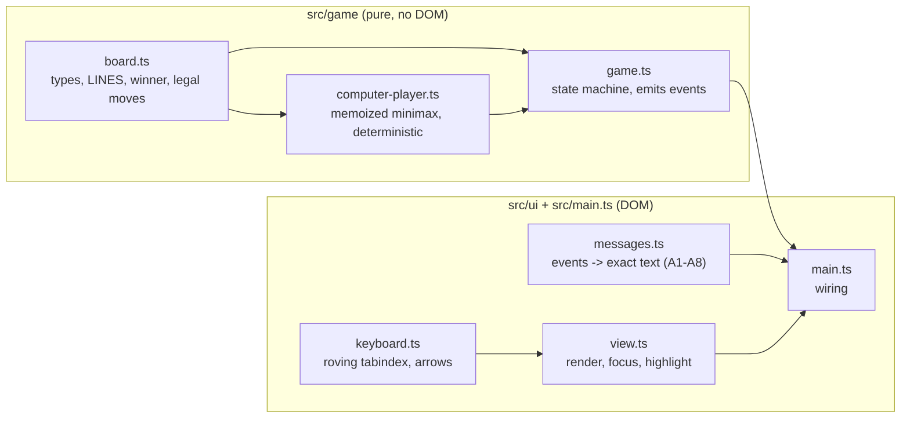
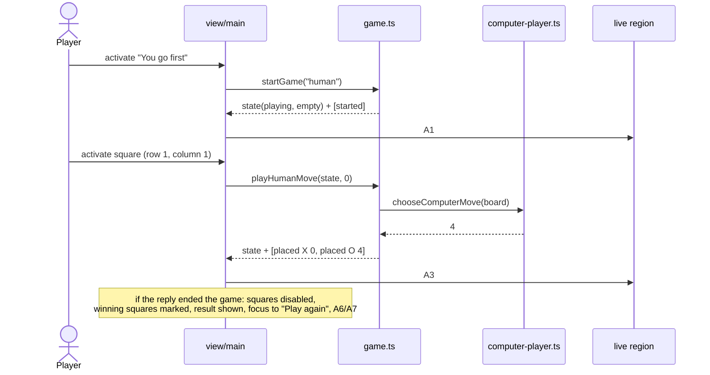
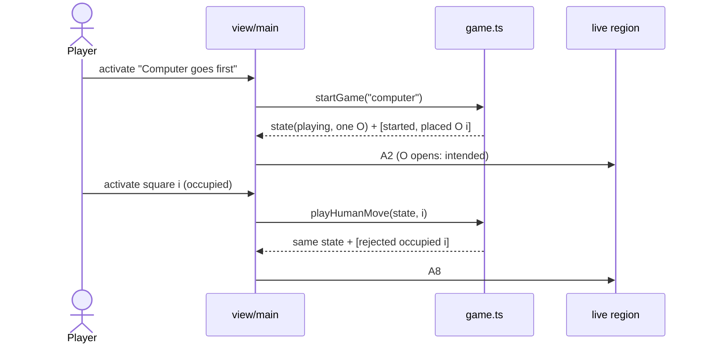
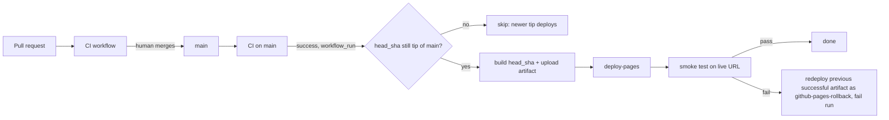
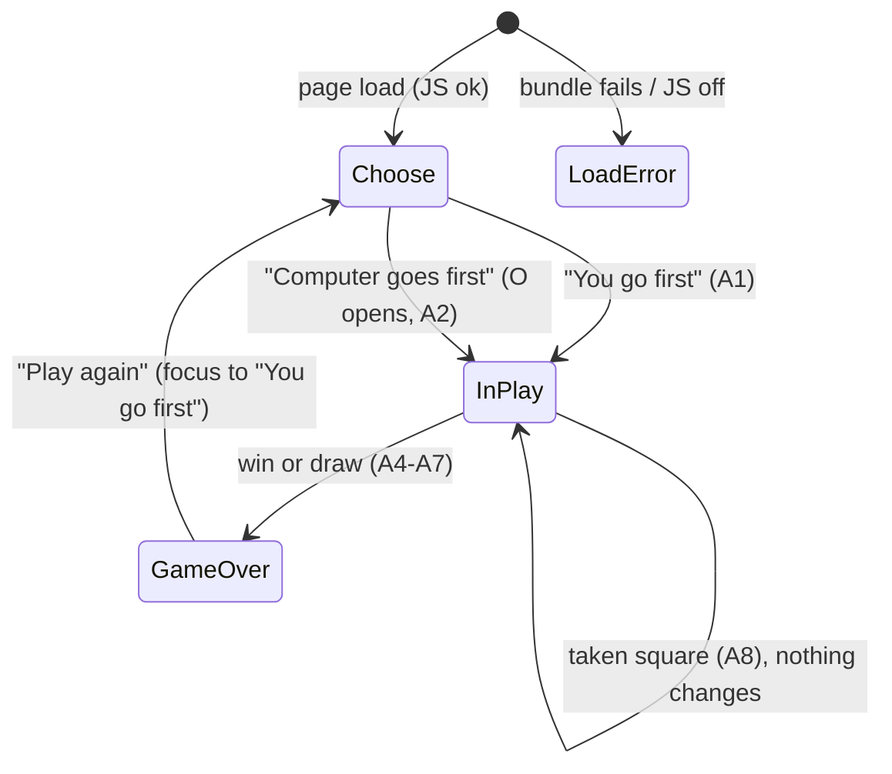

You are an independent second-opinion reviewer in a software factory pipeline.
A different AI (Claude) produced the DRAFT below. Your job is to find what it got
wrong, what it missed, and where a materially better approach exists. Do not
rubber-stamp, and do not inflate: report only findings you would defend with
evidence (a line, an input that breaks it, a requirement it violates). Do not
rewrite the whole thing. Be specific and terse.

Review kind: plan
Reviewer: {{REVIEWER}}
Project: factory-tictactoe


Respond in EXACTLY this format (markdown):

## Verdict
Exactly one of:
- AGREE — no CRITICAL or HIGH findings.
- AGREE-WITH-CONCERNS — CRITICAL or HIGH findings that can be fixed within this approach.
- DISAGREE — the approach itself is wrong: you would redo it rather than patch it, and you describe what instead under Alternative.
Findings alone, however many or severe, never make a DISAGREE; they make AGREE-WITH-CONCERNS.
One sentence of justification.

## Findings
Number every finding C1, C2, … so the author can answer each one. One bullet each:
- [C1] [CRITICAL|HIGH|MEDIUM|LOW] <where> — <what is wrong> — <evidence> — <what to do instead>
(CRITICAL = will cause data loss, security hole, wrong behavior, or blocks the goal. Use it sparingly and only when sure.)

## Missing
Bullets: things the draft should address but doesn't. Empty if none.

## Alternative
If you would take a materially different approach, describe it in <=8 lines and say why it's better. Otherwise write "None".

## Questions for the human
Bullets: decisions only the product owner can make. Empty if none.

=== CONTEXT (read-only, for reference) ===

--- .factory/prd.md ---
# PRD: factory-tictactoe

_Traces to: `.factory/intent.json` (v2, captured 2026-09-27T20:20:18Z). Status: draft_

## 1. Problem

Casual players who want a quick game of tic-tac-toe in a browser have to put up with ad-heavy, slow game sites that are awkward to use with a keyboard or screen reader, because those sites are built to maximise ad impressions rather than to play well. We will ship a plain, fast, ad-free game with a computer opponent that never loses, playable by touch, mouse, keyboard and screen reader, with no install, sign-up or tracking. Severity is low for players; the build is also the end-to-end live test of the Software Factory, so every phase is exercised properly.

## 2. Users

| Persona | Context | Goal | Pain today |
|---|---|---|---|
| Casual novice player (primary) | About two minutes to spare, on a phone (touch) or laptop (mouse/trackpad); opens a link, plays one or two games, closes the tab | A quick game with zero friction | Ads, slow loads and sign-up prompts before the first move |
| Keyboard-only or screen-reader player (hard constraint, not a trade-off) | Same situations, using keyboard navigation and/or a screen reader | Play a complete game and always know the board state and result | Most game sites cannot be played without a pointer or give no spoken feedback |

A player who wants to beat the machine is served automatically by perfect play. By design a player can never win; the best outcome for the player is a draw.

## 3. Goals & Success Metrics

| Goal | Metric | Target | How measured |
|---|---|---|---|
| The computer is unbeatable | Computer losses across every reachable game position, both starting sides | 0 | Exhaustive automated test in CI (R-003) |
| Live and correct within 30 days | Done checklist: live URL loads; exhaustive test passes in CI; zero axe-core violations; JS bundle under 50 KB gzipped; full keyboard-only game completes | All 5 items true | Post-deploy smoke test (R-014), CI jobs (R-003, R-009, R-011), Playwright keyboard test (R-007) |

## 4. Non-goals (explicitly out of scope)

- Easier modes or difficulty levels
- Hot-seat two-player mode
- Win/draw tally
- Choosing X or O (picking a symbol)
- Sound
- Animations beyond basics
- Themes / dark mode
- PWA / offline install
- Translations
- Accounts
- Persistence
- Bigger boards
- Analytics
- Ads
- Real-device iOS/Android testing (this build)
- Screen readers other than VoiceOver; any manual screen-reader pass by the factory
- Undo / take-back
- Move history
- Rules / help page
- Custom domain

Complexity ceiling: anything that needs a server or storage.

## 5. Requirements

| ID | Requirement | Priority | Rationale |
|---|---|---|---|
| R-001 | The game shows a 3×3 board. Only legal moves are accepted: a move on an occupied square, out of turn, or after the game has ended changes nothing. | MUST | intent.scope.mvp[0] — legal moves only |
| R-002 | Before each game the player chooses who moves first: "You" or "Computer". The human is always X and the computer always O; when the computer starts, O opens (intended, not a bug). | MUST | intent.scope.mvp[0]; context.remember (first-mover rule) |
| R-003 | The computer plays perfectly and never loses: from every position reachable in a game against any sequence of legal human moves, with either side starting, the computer's play never produces a human win. Verified by an exhaustive automated test. | MUST | intent.success.primary_metric (target 0) |
| R-004 | The game detects a win (three in a row for X or O) and a draw (full board, no winner), ends the game at that moment, and shows a result message. | MUST | intent.scope.mvp[0] |
| R-005 | When a game is won, the three squares of the winning line are highlighted by a means that does not rely on colour alone, and the winning line is described in text. | MUST | intent.scope.mvp[0]; WCAG 2.2 AA 1.4.1 |
| R-006 | After a game ends, a "Play again" control returns the player to the first-mover choice with an empty board. | MUST | intent.scope.mvp[0] |
| R-007 | A full game, including the first-mover choice and "Play again", can be played with the keyboard only: Tab reaches the board, arrow keys move between squares, Enter or Space places X, and focus is always visible. | MUST | intent.scope.mvp[1]; success done-checklist item 5 |
| R-008 | A polite live region announces, with exact fixed wording, the start of each game, each human move, each computer move, invalid-move attempts, and the result including the winning line. The exact texts are the announcement contract A1–A8 in `acceptance.md`: a human move and the computer reply form one message that ends with either "Your turn." or the result. Each square exposes its position and contents as its accessible name. | MUST | intent.scope.mvp[1]; constraints (announcement text asserted in tests) |
| R-009 | The page meets WCAG 2.2 AA and has zero axe-core violations in every game state (choice, in play, won, drawn) in Chromium, Firefox and WebKit. | MUST | intent.constraints.quality_standards |
| R-010 | The layout works from 320 CSS px wide phones to laptop screens without horizontal scrolling or zoom, is playable by touch and mouse, and every square and button is at least 44×44 CSS px (above the WCAG 2.2 AA 2.5.8 minimum of 24 px, chosen for the touch-first primary persona; confirmed by the approver 2026-09-27). | MUST | intent.scope.mvp[2]; WCAG 2.2 1.4.10, 2.5.8 |
| R-011 | The production JavaScript bundle is under 50 KB gzipped; CI fails the build if it is not. | MUST | intent.constraints (performance) |
| R-012 | The game makes no network requests beyond its own static files, sets no cookies, uses no web storage, and contains no analytics, ads, sign-up or install prompt. | MUST | intent.constraints; technology.excluded; complexity ceiling |
| R-013 | The visual style is plain and high-contrast and uses the system font stack (no web fonts, no brand). | MUST | intent.constraints; intent.design |
| R-014 | Whenever CI passes for the latest commit on main, GitHub Actions builds exactly that commit and deploys it to GitHub Pages. An older merge whose CI finishes after a newer merge is not deployed separately; it goes live as part of the newer commit. A post-deploy smoke test waits until the live page shows the deployed commit, then plays one move. If it fails, the workflow redeploys the Pages artifact of the most recent deploy run that concluded successfully (its smoke test passed), and the run fails, so the repo owner gets the Actions failure email. If no such run exists (first deployment) or its artifact has expired (artifacts are kept 90 days), the workflow only logs that and fails. Nothing more. | MUST | intent.operations; success done-checklist item 1; approver decisions 2026-09-27 |
| R-015 | Supported browsers are the current and previous versions of Chrome, Firefox, Safari and Edge, plus iOS Safari and Android Chrome; the build targets `es2022`, which all of them support. Automated verification is narrower and engine-level only: every end-to-end test runs in Chromium, Firefox and WebKit plus touch-enabled Android and iPhone emulations. Testing specific browser versions or real devices is not performed; the QA report lists it as human follow-up. | MUST | intent.constraints (browser support, verification) |

## 6. User Flows

**Flow A — player moves first (primary)**
1. Player opens the URL. The page shows the title and the first-mover choice ("You go first" / "Computer goes first"); the board is empty.
2. Player chooses "You go first". The board becomes active; status reads "Your turn. You are X."
3. Player places X on an empty square (tap, click, or Enter/Space on the focused square).
4. The computer immediately places O. Both moves are announced in one message.
5. Steps 3–4 repeat until a win or draw.
6. The result is shown and announced; on a win the three squares are highlighted and the line described. "Play again" appears and receives focus.
7. "Play again" returns to step 1's choice with an empty board.

**Flow B — computer moves first**
1–2. As Flow A, but the player chooses "Computer goes first". The computer places O immediately; the announcement states that O opens.
3. Play continues as Flow A from step 3.

**Unhappy paths**
- Player activates an occupied square: nothing changes on the board; the live region says the square is taken.
- Player activates a square after the game has ended: nothing changes (squares are disabled).
- Player tries to play before choosing who goes first: squares are disabled until a choice is made.
- JavaScript disabled or failing to load: a static message says the game needs JavaScript.

## 7. Data

No stored data. Game state lives in memory for the life of the tab and is discarded on reload. No personal data, cookies, web storage or telemetry (R-012).

## 8. Integrations & External Dependencies

| System | Purpose | Auth | Failure mode |
|---|---|---|---|
| GitHub Actions | CI (format, lint, typecheck, unit, exhaustive, bundle size, e2e/axe) and deploy | Repository GITHUB_TOKEN | Build fails; nothing deploys; owner gets failure email |
| GitHub Pages | Static hosting | Pages deploy permission in workflow | Site unavailable (GitHub's uptime; no separate SLA); bad deploy triggers R-014 rollback |

At run time the game has no integrations.

## 9. Quality Requirements

- **Correctness:** 0 computer losses in the exhaustive test (R-003).
- **Accessibility:** WCAG 2.2 AA; zero axe-core violations in all game states; exact live-region text asserted in Playwright; keyboard-only full game in CI (R-007–R-009). A real VoiceOver pass and a real-device iOS/Android check are **not performed** by the factory; the QA report lists them as human follow-up.
- **Performance:** JS under 50 KB gzipped (R-011); no web fonts (R-013); no third-party requests (R-012).
- **Privacy/security:** no data collected, no cookies, no storage, no third-party scripts (R-012). Compliance: none applicable.
- **Browser support:** the supported browser list is a requirement; automated verification is engine-level only (R-015). Version-specific and real-device checks are human follow-up.

## 10. Open Questions

| # | Question | Owner | Blocking? |
|---|---|---|---|
| 1 | Should a "New game" control also be available mid-game (not only after the game ends)? **Resolved 2026-09-27: no.** "Play again" appears only after a game ends. | Approver | No (resolved) |
| 2 | Should the computer's reply be instant or shown after a short pause? **Resolved 2026-09-27: instant.** No animations beyond basics; both moves are announced in one message. | Approver | No (resolved) |

## 11. Second-opinion summary

Reviewed 2026-09-27 by Codex (AGREE, 2 MEDIUM) and Ollama qwen2.5:14b (summary only, no findings in the required format).
- Accepted: R-015 now separates the supported-browser requirement from the narrower engine-level verification (Codex C1). R-014 now defines the rollback target as the latest deploy run that concluded successfully, and states the first-deploy behaviour (Codex C2). R-008 points to the exact announcement contract A1–A8 (Codex, Missing).
- Rejected: Ollama's suggestions of a help page and testing more screen readers are explicit non-goals.
- Architecture review (Codex AGREE-WITH-CONCERNS, 3 HIGH and 4 MEDIUM, all resolved; Ollama non-conforming): R-014 changed by approver decision to deploy only the latest commit on main and to accept the 90-day artifact expiry limit on rollback.
Details: `.factory/reviews/specification-reconciliation.md`.

--- .factory/acceptance.md ---
# Acceptance criteria: factory-tictactoe

_Traces to: `.factory/prd.md`. Every criterion is written to be checked by an automated test (Vitest unit tests, Playwright end-to-end tests, or a CI script), except where it says "verified in deploy phase"._

## Conventions used below

- Squares are numbered by **row 1–3 (top to bottom)** and **column 1–3 (left to right)**.
- `{R}`, `{C}` are the row and column of the human's move; `{R2}`, `{C2}` are those of the computer's move.
- `{LINE}` is one of: `row 1`, `row 2`, `row 3`, `column 1`, `column 2`, `column 3`, `the diagonal from top left to bottom right`, `the diagonal from top right to bottom left`.

### Announcement text (exact, used by R-002, R-004, R-005, R-008)

| ID | When | Exact live-region text |
|---|---|---|
| A1 | Game starts, human first | `New game. You go first. You are X. Your turn.` |
| A2 | Game starts, computer first | `New game. Computer goes first as O. Computer placed O in row {R2}, column {C2}. Your turn.` |
| A3 | Human moves, game continues | `You placed X in row {R}, column {C}. Computer placed O in row {R2}, column {C2}. Your turn.` |
| A4 | Human move wins (unreachable with a perfect computer, still defined) | `You placed X in row {R}, column {C}. You win with {LINE}.` |
| A5 | Human move fills the board with no winner | `You placed X in row {R}, column {C}. It's a draw.` |
| A6 | Computer move wins | `You placed X in row {R}, column {C}. Computer placed O in row {R2}, column {C2}. Computer wins with {LINE}.` |
| A7 | Computer move fills the board with no winner | `You placed X in row {R}, column {C}. Computer placed O in row {R2}, column {C2}. It's a draw.` |
| A8 | Human activates an occupied square | `Row {R}, column {C} is taken. Choose an empty square.` |

Square accessible names: `Row {R}, column {C}, empty` / `Row {R}, column {C}, X` / `Row {R}, column {C}, O`.

## R-001 Board and legal moves

- **Given** a game in progress with the human to move, **when** the human activates an empty square, **then** exactly that square shows X and no other square changes before the computer's reply.
- **Given** a game in progress, **when** the human activates a square showing X or O, **then** the board is unchanged and it is still the human's turn.
- **Given** the game state module, **when** a human move is submitted while it is the computer's turn or after the game has ended, **then** the move is rejected and the returned state equals the input state (unit test).

### Unhappy paths

- **Given** the first-mover choice has not been made, **when** the player clicks, taps or presses Enter on any square, **then** nothing is placed (squares are disabled).
- **Given** JavaScript is disabled, **when** the page loads, **then** a visible message says the game needs JavaScript (Playwright with `javaScriptEnabled: false`).
- **Given** JavaScript is enabled but the JavaScript bundle request fails (Playwright aborts it), **when** the page loads, **then** the visible message "The game didn't load. Try reloading the page." is shown (tested against the production build in `dist/`, not the dev server); **and given** the bundle loads normally, **then** that message is never visible at any point during the load (it ships `hidden`).
- **Given** the production build, **when** start-up throws (the Playwright test serves `index.html` with the board's root element removed, so `main.ts` fails to find it), **then** the same load-error message is shown.

## R-002 First-mover choice

- **Given** a fresh page load, **when** it renders, **then** two controls "You go first" and "Computer goes first" are visible, the board is empty, and no control to choose a symbol exists.
- **Given** the choice is shown, **when** the player chooses "You go first", **then** the board is empty, it is the human's turn as X, and the live region reads A1.
- **Given** the choice is shown, **when** the player chooses "Computer goes first", **then** exactly one square shows O, no square shows X, and the live region reads A2 naming that square.
- **Given** any game, **when** squares are filled, **then** every human-placed mark is X and every computer-placed mark is O, regardless of who started.

## R-003 Perfect, never-losing computer

- **Given** both starting sides, **when** a test enumerates every legal human move at every position where it is the human's turn and applies the computer's chosen reply at every position where it is the computer's turn, **then** no reachable finished game is a human (X) win, and the test reports the number of finished games examined (greater than 0) for each starting side.
- **Given** a position where the computer can complete three in a row, **when** it chooses a move, **then** it completes the line (unit test over all such reachable positions).
- **Given** the same position twice, **when** the computer chooses a move, **then** it returns the same square both times (deterministic).
- **Given** successive games in one process with alternating starters (human, computer, human, …), **when** the exhaustive enumeration runs for each, **then** results are identical to running each starter in a fresh process (the memo stays valid across starters).
- **Given** CI, **when** the unit-test job runs, **then** the exhaustive test runs on every push and pull request and finishes in under 60 seconds.

## R-004 Win and draw detection with result message

- **Given** each of the 8 lines filled with X, and separately with O, **when** the board is evaluated, **then** the winner is that symbol and the line is identified (unit test, 16 cases).
- **Given** a full board with no three in a row, **when** it is evaluated, **then** the result is a draw.
- **Given** a move that wins or fills the board, **when** it is applied, **then** the game ends, all squares become disabled, and the visible result text contains "Computer wins", "You win" or "It's a draw" accordingly, and the live region reads A4, A5, A6 or A7 accordingly.

## R-005 Winning line highlight

- **Given** a game the computer has won, **when** the result is shown, **then** exactly the three squares of the winning line are marked as winning and each of them differs from non-winning squares in at least one non-colour computed style (border width or style, outline, or text decoration) or carries an overlaid line element.
- **Given** a game the computer has won, **when** the result is shown, **then** the visible result text and the live region both name the line using `{LINE}` wording.
- **Given** a drawn game, **when** the result is shown, **then** no square is marked as winning.

## R-006 Play again

- **Given** a finished game, **when** the result is shown, **then** a "Play again" button is visible and has keyboard focus.
- **Given** a game in progress, **when** the page is inspected, **then** no "Play again" button is visible.
- **Given** a finished game, **when** the player activates "Play again", **then** the board is empty, the first-mover choice is shown, and focus is on "You go first".

## R-007 Keyboard-only play

- **Given** a fresh page, **when** a Playwright test plays a complete game using only Tab, Shift+Tab, arrow keys, Enter and Space (no pointer events), choosing "You go first", **then** the game reaches a result and "Play again" can be activated from the keyboard to start a second game choosing "Computer goes first", which also reaches a result.
- **Given** the board has focus, **when** an arrow key is pressed, **then** focus moves one square in that direction, stays put at the board edge, and exactly one square is in the Tab order at any time.
- **Given** a square has focus, **when** Enter or Space is pressed on an empty square, **then** X is placed there.
- **Given** the first-mover choice, **when** the player chooses "You go first", **then** focus is on row 1, column 1; **and when** the player chooses "Computer goes first", **then** focus is on the first empty square in reading order (row 1, column 2 after the opening O at row 1, column 1).
- **Given** any focused control, **when** its computed style is read, **then** it has a visible focus indicator with an outline or border at least 2 CSS px wide.

## R-008 Screen-reader announcements

- **Given** each situation A1–A3 and A5–A8, **when** it occurs in a Playwright test, **then** the live region (`role="status"`, polite) text equals the exact string in the announcement table, with placeholders filled.
- **Given** A4 (human win), which the real opponent makes unreachable, **when** a unit test drives the game state machine with an injected opponent that loses and passes the events to the message builder, **then** the text equals A4 exactly; the production bundle contains no way to inject an opponent.
- **Given** any board state, **when** the squares are inspected, **then** each square's accessible name matches `Row {R}, column {C}, empty|X|O` for its current content.
- **Given** a human move, **when** the computer replies, **then** a single announcement covers both moves (the live region is updated once per human action).

## R-009 WCAG 2.2 AA and zero axe violations

- **Given** each game state (choice shown, game in progress, computer won, draw), **when** axe-core runs with tags `wcag2a`, `wcag2aa`, `wcag21a`, `wcag21aa` and `wcag22aa` in Chromium, Firefox and WebKit, **then** it reports 0 violations.
- **Given** the page, **when** it loads, **then** it has a `lang` attribute, a descriptive `<title>`, one `h1`, and the board is exposed as a labelled group.

## R-010 Responsive layout for touch and mouse

- **Given** viewports of 320×568, 390×844 and 1280×800 CSS px, **when** the page is shown in each game state, **then** `document.documentElement.scrollWidth` does not exceed the viewport width and all nine squares and both choice buttons are fully visible without scrolling horizontally.
- **Given** those viewports, **when** the bounding boxes of the squares and buttons are measured, **then** each is at least 44×44 CSS px.
- **Given** a touch-enabled phone emulation, **when** the player taps "You go first" and then an empty square, **then** X is placed there.
- **Given** a desktop viewport, **when** the player clicks "You go first" and then an empty square, **then** X is placed there.
- **Given** viewports of 320×568 and 1280×800 at default text size, **when** the page moves through the choose state, play (including a taken-square message and the longest computer-move status), and the game-over state, **then** the board's bounding box (x, y, width, height) is identical in every state. At 200% text zoom reflow takes priority and this check does not apply.

## R-011 Bundle size

- **Given** a production build, **when** the CI size check sums the gzipped size of every JavaScript file in `dist/`, **then** the total is under 51,200 bytes, and the check fails the build otherwise.

## R-012 No tracking, storage or third-party requests

- **Given** a Playwright test that records every network request while loading the page and playing a full game, **when** the game ends, **then** every request went to the page's own origin.
- **Given** the same full game, **when** it ends, **then** `document.cookie` is empty and `localStorage.length` and `sessionStorage.length` are 0.
- **Given** the built `dist/` output, **when** it is scanned, **then** it contains no script, link or iframe pointing to another origin.

## R-013 Plain, high-contrast, system fonts

- **Given** the page, **when** the computed `font-family` of the body is read, **then** it begins with `system-ui`, and no font files are requested during a full game.
- **Given** the design tokens, **when** a unit test computes the contrast of every text colour against its background, **then** each ratio is at least 7:1, and every non-text indicator (square borders, focus ring, winning-line marker) is at least 3:1 against its background.

## R-014 Deploy to GitHub Pages with smoke test and minimal rollback

- **Given** a merge to main whose CI passes and which is still the latest commit on main, **when** the deploy workflow runs, **then** it builds exactly that commit (`workflow_run.head_sha`) and publishes it to GitHub Pages. The smoke test waits up to 3 minutes until the live page's `build-id` meta equals that SHA, then chooses "You go first", places one X, sees the computer's O, and passes. _Verified in deploy phase._
- **Given** CI passes for a commit that is no longer the latest commit on main, **when** the deploy workflow starts, **then** it skips without deploying. _Verified in deploy phase._
- **Given** a deploy whose smoke test fails (forced by the workflow's manual `force_smoke_failure` input), **when** the rollback job runs, **then** it redeploys the Pages artifact of the latest successful deploy run unchanged, under the artifact name `github-pages-rollback`, does nothing else, and the workflow run concludes as failed so GitHub emails the repo owner. _Verified in deploy phase._
- **Given** no previous successful deploy run exists, or its artifact has expired, **when** the smoke test fails, **then** the rollback job logs that no previous artifact is available and the run fails. _Verified in deploy phase._

## R-015 Browser coverage

- **Given** the Playwright configuration, **when** CI runs the end-to-end suite, **then** every spec runs in five projects — Chromium, Firefox, WebKit, a touch-enabled Android phone emulation (Chromium) and a touch-enabled iPhone emulation (WebKit) — and all pass.
- **Given** the production build, **when** Vite builds it, **then** its build target covers the current and previous versions of Chrome, Firefox, Safari and Edge and iOS Safari (build target `es2022`, supported by all of them).

--- .factory/architecture.md ---
# Architecture: factory-tictactoe

_Traces to: `.factory/prd.md`, `.factory/acceptance.md`, `.factory/tech-stack.md`. Stack is committed (ADR-001 to ADR-008); this document does not revisit it._

## 1. Shape

A single static page: `index.html` + one CSS file + one ES module bundle built by Vite from strict TypeScript, published to GitHub Pages. No backend, no network calls at run time, no storage.

The code has two layers with a one-way dependency:

- **Game core** (`src/game/`): pure, DOM-free TypeScript. It holds all the rules, the perfect computer player, and the state transitions, and it emits *events* describing what happened. Vitest tests it exhaustively.
- **UI shell** (`src/ui/`, `src/main.ts`): renders state to the DOM, turns clicks, taps and keys into core calls, and turns core events into announcement text. Playwright and axe-core test it.



## 2. Components and responsibilities

| Component | File | Responsibility | Requirements |
|---|---|---|---|
| Board model | `src/game/board.ts` | `Mark = "X" \| "O"`, `Board` (9 cells, index 0–8 row-major), the 8 `LINES`, `findWinner(board)` returning winner and line, `isFull`, `emptySquares`, immutable `placeMark` | R-001, R-004 |
| Computer player | `src/game/computer-player.ts` | `chooseComputerMove(board): SquareIndex` (O is always to move when it is called) — full-depth minimax. A position's value is node-relative: `10 − plies to the end` for an O win, `plies to the end − 10` for an X win, `0` for a draw, so O wins sooner and never loses. Ties go to the lowest square index. Values are memoized in a module-level map keyed by **board + side to move**; because the values are node-relative they are valid across searches, games and starters (at most 2 × 3⁹ keys) | R-003 |
| Game state machine | `src/game/game.ts` | `startGame(firstMover)` and `playHumanMove(state, index)` return `{ state, events }`; the computer's reply is applied synchronously inside `playHumanMove`; illegal moves return the input state unchanged plus a `rejected` event. The opponent is a parameter that defaults to `chooseComputerMove`, so unit tests can inject a weak opponent to reach the otherwise unreachable human win (A4); the UI always uses the default | R-001, R-002, R-003, R-004, R-006 |
| Messages | `src/ui/messages.ts` | Pure `describeEvents(events): string` producing exact texts A1–A8; `squareLabel(index, mark)`; `describeLine(line)` | R-005, R-008 |
| View | `src/ui/view.ts` | Renders choice buttons, 9 square buttons, visible status/result, "Play again"; sets accessible names, `disabled` / `aria-disabled`, winning markers; moves focus per the rules below | R-001, R-002, R-004–R-007, R-009, R-010 |
| Keyboard | `src/ui/keyboard.ts` | Roving tabindex over the 3×3 grid; arrow keys move one square and stop at edges; Enter/Space are native button activation | R-007 |
| Wiring | `src/main.ts` | Holds the single current `GameState`, calls core, renders, writes the live region | all UI |
| Styles | `src/styles.css` | System font stack, high-contrast tokens (from design phase), 44 px minimum targets, fluid grid from 320 px, 2 px+ focus ring, non-colour winning marker | R-005, R-010, R-013 |
| Page | `index.html` | `lang="en"`, title, `h1`, live region; `<noscript>` message plus a load-error message ("The game didn't load. Try reloading the page.") that ships with the `hidden` attribute. It is revealed in two ways. (1) A small inline classic `<script>` in `index.html`, placed before the module script, registers a capture-phase `window` `error` listener that unhides the message when a `<script>` element fails to load. This is independent of the bundle, and survives the Vite build, which rewrites the module tag and would drop an `onerror` attribute (Codex rework review C1). (2) `main.ts` wraps start-up in `try/catch`, unhides the message on any exception, then rethrows so the error still reaches the console. It never flashes during a normal load and never shows next to the `<noscript>` message (design review, 2026-09-27); `<meta name="build-id">` set to the commit SHA at build time | R-001, R-008, R-009, R-014 |
| CI scripts | `scripts/check-bundle-size.mjs`, `scripts/check-dist-origins.mjs` | Gzip-sum JS in `dist/` under 51,200 bytes; scan `dist/` for other-origin script/link/iframe URLs | R-011, R-012 |

Filenames are kebab-case and identifiers follow the factory naming rules (standards §6), enforced by ESLint.

## 3. Data model

In memory only, discarded on reload (R-012).

```ts
type Mark = "X" | "O";                 // human is always X, computer always O (R-002)
type Cell = Mark | null;
type Board = readonly Cell[];          // length 9, row-major: index = (row-1)*3 + (column-1)
type Line = readonly [number, number, number];
type FirstMover = "human" | "computer";
type Result = { kind: "win"; winner: Mark; line: Line } | { kind: "draw" };
type GameState =
  | { phase: "choosing" }                                        // before each game
  | { phase: "playing"; board: Board; firstMover: FirstMover }    // always the human's turn when idle
  | { phase: "over"; board: Board; firstMover: FirstMover; result: Result };
type GameEvent =
  | { type: "started"; firstMover: FirstMover }
  | { type: "placed"; mark: Mark; index: number }
  | { type: "ended"; result: Result }
  | { type: "rejected"; reason: "occupied" | "not-playing"; index: number };
```

Because the computer replies synchronously, a `playing` state at rest is always the human's turn; "out of turn" (R-001) therefore reduces to "not in the `playing` phase". The unit tests exercise that case directly on the state machine.

## 4. Key flows

### Flow A: human goes first and makes a move



### Flow B: computer goes first, then the human activates an occupied square



## 5. Accessibility design

- The board is a `div role="group" aria-label="Board"` containing 9 native `<button>`s laid out by CSS grid. Buttons give Enter/Space activation and touch/click for free.
- Accessible name of each square: `Row R, column C, empty|X|O` (R-008).
- **Before a choice and after the game ends**, squares have the `disabled` attribute and are out of the Tab order. **During play**, exactly one square has `tabindex="0"` (roving); occupied squares are `aria-disabled="true"` but stay focusable, so arrow navigation passes through them and activating one announces A8.
- **Live region**: one visually hidden `div role="status"` (polite). It is written once per player action. To make a repeated identical message (such as A8 twice) announce again, the text is cleared and then set on the next animation frame.
- **Focus**: after a choice, focus goes to the first empty square in reading order (row 1, column 1 when the human starts; row 1, column 2 after the computer's opening O at row 1, column 1). This keeps the first Enter off a taken square (design review, 2026-09-27). After a move it stays on the square played. When the game ends, it moves to "Play again". After "Play again" it goes to "You go first".
- **Winning line**: `data-winning="true"` on the three squares. The style adds a thick border plus an overlaid strike line (not colour alone), and the text names the line (R-005).

## 6. Integration points and failure modes

| Integration | Used for | Failure mode | Handling |
|---|---|---|---|
| GitHub Actions: CI workflow (`ci.yml`, on push and pull request) | format check, lint, typecheck, unit + exhaustive tests, build, bundle-size and dist-origin checks, Playwright e2e + axe in 5 projects | Any job fails | PR cannot merge (humans merge; branch protection set in ship phase). Owner gets the failure email |
| GitHub Actions: deploy workflow (`deploy.yml`) | Triggered by `workflow_run` when CI completes successfully on `main`: checks out **`workflow_run.head_sha`** (not `GITHUB_SHA`), so it builds exactly the commit whose CI passed. It deploys only if that SHA is still the tip of `main`; otherwise it skips, because the newer tip's own pipeline will deploy it and it already contains this change. `workflow_dispatch` (with a `force_smoke_failure` input) deploys the tip of `main` only if CI succeeded for that SHA. Steps: build with `build-id` = SHA → `actions/upload-pages-artifact` (retention 90 days) → `actions/deploy-pages` → smoke → rollback if smoke fails | Build or deploy fails | Nothing changes on the live site; run fails; email |
| GitHub Pages | hosting at `https://onelifemedia.github.io/factory-tictactoe/` | Outage | Accepted: GitHub's uptime, no SLA (intent.operations) |
| Smoke test | Playwright against the live URL. It first polls, for up to 3 minutes, until the page's `build-id` meta equals the deployed SHA, so the old deployment cannot pass for the new one. Then it chooses "You go first", places X and sees O | Fails, or the build-id never appears | Rollback job (ADR-011). It finds the latest `deploy.yml` run on `main` that concluded successfully (`gh run list --status success`) and downloads its `github-pages` artifact (`actions/download-artifact` with `run-id` and `github-token`). It re-uploads the downloaded `artifact.tar` **unchanged under the distinct name `github-pages-rollback`**, so it never clashes with this run's `github-pages` artifact and the tar is not nested. It deploys with `actions/deploy-pages` (`artifact_name: github-pages-rollback`), then exits non-zero. If there is no such run, or its artifact has expired (more than 90 days since the last successful deploy), it logs that and exits non-zero. Nothing more. |

A run that rolled back concludes as failed, so it is never chosen as "previous successful" later. Deploy, smoke and rollback run in one workflow under `concurrency: { group: pages, cancel-in-progress: false }`. GitHub keeps at most one pending run per group, so a newer pending run replaces an older one. That is safe here because every run deploys only the current tip of `main`, which contains all earlier merges.

## 7. Deployment shape



Vite `base: "./"` makes asset URLs relative, so the site works under the `/factory-tictactoe/` path. The build target is `es2022`. Node 22 is pinned in `.nvmrc` and `engines`, and CI uses `actions/setup-node` with `node-version-file: .nvmrc`.

## 8. Test architecture

| Layer | Tool | What | Where |
|---|---|---|---|
| Unit | Vitest | board rules (16 win cases, draw), state machine incl. rejections, messages A1–A8, token contrast | `tests/unit/*.test.ts` |
| Exhaustive | Vitest | every human move sequence against the computer, both starting sides, run in one process one after the other (so the shared memo is exercised across starters); asserts 0 human wins and reports game counts; under 60 s | `tests/unit/never-loses.test.ts` |
| End-to-end + a11y | Playwright + @axe-core/playwright | A1–A3 and A5–A8 exact text (A4 is unreachable with the real opponent, so it is covered by unit tests with an injected opponent), keyboard-only games, blocked-bundle fallback, touch/click, exact live-region text, focus rules, layout/target sizes at 3 viewports, requests/cookies/storage, axe in 4 states | `tests/e2e/*.spec.ts`, 5 projects (ADR-008) |
| Build checks | Node scripts | bundle < 51,200 B gzipped; no other-origin URLs in `dist/` | `scripts/*.mjs` |
| Post-deploy | Playwright | wait for expected build-id, then smoke on live URL | `tests/smoke/*.spec.ts` (deploy workflow only) |

Every test file names the F-ID it covers (governance).

## 9. What we are deliberately not building

- No server, API, database, storage, cookies, service worker or PWA manifest.
- No framework runtime, router, state library or CSS framework.
- No analytics, error reporting SDK or third-party script of any kind.
- No difficulty levels, symbol choice, hot-seat mode, tally, undo, history, sound, themes, translations, rules page or custom domain.
- No artificial "thinking" delay or animation beyond basics (PRD open question 2 default).
- No rollback logic beyond "redeploy the previous successful artifact and fail the run".
- No real-device or manual screen-reader testing by the factory (QA report lists it as human follow-up).

--- .factory/design/screens.md ---
# Screens: factory-tictactoe

_Traces to: `.factory/prd.md` §6 (Flows A and B, unhappy paths), `.factory/acceptance.md`, `design-system.md`, `tokens.json`. One page with three states. Mockups are static HTML (`screens/*.html`), each showing every variant at 320 px and 760 px wide. Status: draft_

## Index

| Screen | File | Flow | Requirements | Components used | Notes |
|---|---|---|---|---|---|
| 1. Choose who goes first | `screens/game-01-choose-first.html` | A and B step 1; after Play again | R-001, R-002, R-006, R-007, R-010, R-012, R-013 | Title, status line, board (disabled squares), action area with choice button ×2, announcer, fallback message | Variants: 1a default (focus on "You go first" after Play again); 1b load error (hidden by default, revealed only on a script error); 1c JavaScript off (`noscript`). The empty disabled board is the empty state. No symbol picker. |
| 2. In play | `screens/game-02-in-play.html` | A steps 2–5; B steps 2–3 | R-001, R-002, R-003, R-007, R-008, R-009, R-010 | Title, status line, board (active and occupied squares, roving focus), action area with keyboard hint, announcer | Variants: 2a you first, empty board (A1); 2b computer first, O opens at row 1, column 1, focus on row 1, column 2 (A2); 2c mid-game after a move (A3); 2d taken square (A8). The visible status names the computer's last move. Always the human's turn when idle; no loading state (instant reply). Sample positions follow ADR-010 perfect play. |
| 3. Game over | `screens/game-03-game-over.html` | A steps 6–7 | R-004, R-005, R-006, R-007, R-008, R-009, R-010 | Title, status line, board (disabled, winning squares), action area with Play again button, announcer | Variants: 3a computer wins by diagonal (A6) with border, strike line and fill; 3b draw (A5/A7), no highlight; 3c computer wins by row (strike direction check). A4 "You win" is unreachable and not mocked; it uses the 3a layout with different words. |

## Navigation



## Focus map

| From | Action | Focus goes to |
|---|---|---|
| Fresh load | — | nothing (document start); Tab reaches "You go first" |
| Choose | either choice | first empty square in reading order (row 1, column 1 if you went first; row 1, column 2 after the computer's opening O) |
| In play | place X (game continues) | the square just played |
| In play | taken square | stays on that square (status keeps the taken message until the next valid move) |
| In play | move ends the game | "Play again" |
| Game over | "Play again" | "You go first" |

## Copy (exact; tests assert it)

- Title `h1`: "Tic-tac-toe". No tagline (the `<title>` carries "play against a computer that never loses").
- Status line: "Who goes first?" · "Your turn. You are X." · "Computer placed O in row R, column C. Your turn. You are X." (computer went first) · "Computer placed O in row R, column C. Your turn." · "Row R, column C is taken. Choose an empty square." · "Computer wins with {LINE}." · "It's a draw." · "You win with {LINE}."
- Keyboard hint (during play): "Arrow keys move between squares. Enter or Space places X."
- Buttons: "You go first" · "Computer goes first" · "Play again".
- Fallbacks: load error "The game didn't load. Try reloading the page." · `noscript` "This game needs JavaScript, which is turned off in this browser. Turn it on and reload the page."
- Announcer: A1–A8 exactly as in `acceptance.md`.

## Later (not designed; PRD non-goals)

Tally, symbol choice, difficulty, hot-seat, undo, history, rules page, themes/dark mode, sound, animation, translations.

## Refinements from the design review (now in the specification)

The approver chose option (a) on 2026-09-27. Both refinements are now in `architecture.md` §2 and §5 and in `acceptance.md` (R-001, R-007, R-010).
1. **Focus after a choice** goes to the first empty square in reading order, not always row 1, column 1 (architecture §5), because the computer's opening O sits there.
2. **Load-error fallback** is hidden by default and revealed only on a script error, with new wording (architecture §2 said a visible static message removed on start, which would flash on every load).

## Verification (now acceptance criteria R-010 and R-001)

- **The board never moves.** At 320 × 568 and 1280 × 800 at default text size, the board's bounding box is identical in choose, in play (including a taken-square message and the longest computer-move status), and game-over states. At 200% text zoom, reflow takes priority and the board may shift; that is accepted.
- **Load error.** Aborting the bundle request shows "The game didn't load. Try reloading the page."; a normal load never shows it, not even briefly.

## Sample games (checked against ADR-010 perfect play)

- 2c/2d: X r1c1 → O r2c2 → X r3c3 → O r1c2.
- 3a: X r1c1 → O r2c2 → X r1c2 → O r1c3 → X r2c1 → O r3c1 (diagonal from top right).
- 3b: X r1c1 → O r2c2 → X r1c2 → O r1c3 → X r3c1 → O r2c1 → X r2c3 → O r3c2 → X r3c3 (draw).
- 3c: X r1c1 → O r2c2 → X r3c1 → O r2c1 → X r1c2 → O r2c3 (row 2).
- Computer opening: r1c1.


=== DRAFT UNDER REVIEW: .factory/plan.json ===
{
  "version": 1,
  "generated_at": "2026-09-27T20:53:26Z",
  "traces_to": [
    ".factory/prd.md",
    ".factory/architecture.md",
    ".factory/acceptance.md",
    ".factory/design/screens.md"
  ],
  "milestones": [
    {
      "id": "M1",
      "title": "Walking skeleton: toolchain, standards and CI green, page renders in five browser projects",
      "exit_criteria": [
        "standards.sh check passes",
        "CI (format, lint, typecheck, unit, build, e2e) green on the F-001 pull request",
        "dist/ builds with the design tokens wired in"
      ],
      "features": [
        "F-001"
      ]
    },
    {
      "id": "M2",
      "title": "Unbeatable core: rules, perfect player, state machine and exact texts",
      "exit_criteria": [
        "Exhaustive never-lose test reports 0 computer losses for both starters in CI (primary metric)",
        "A1\u2013A8 texts unit-tested exactly"
      ],
      "features": [
        "F-002",
        "F-003",
        "F-004",
        "F-005"
      ]
    },
    {
      "id": "M3",
      "title": "Playable, accessible game (MVP in the browser)",
      "exit_criteria": [
        "A full game completes by pointer, touch and keyboard only in all five projects",
        "0 axe violations in all states",
        "Bundle under 50 KB gzipped; no third-party requests, cookies or storage",
        "Board stable across states; load-error and no-JS messages work"
      ],
      "features": [
        "F-006",
        "F-007",
        "F-008",
        "F-009",
        "F-010",
        "F-011",
        "F-012"
      ]
    },
    {
      "id": "M4",
      "title": "Live on GitHub Pages with smoke test and minimal rollback",
      "exit_criteria": [
        "deploy.yml builds the CI-verified SHA and deploys only the latest main",
        "Smoke test waits for build-id then plays a move",
        "Rollback path implemented (live verification in the deploy phase)"
      ],
      "features": [
        "F-013"
      ]
    }
  ],
  "features": [
    {
      "id": "F-001",
      "title": "Scaffold the walking skeleton: toolchain, standards, CI and a page that renders",
      "milestone": "M1",
      "requirements": [
        "R-013",
        "R-015"
      ],
      "depends_on": [],
      "size": "M",
      "touches": [
        "package.json",
        "package-lock.json",
        ".nvmrc",
        "tsconfig.json",
        "vite.config.ts",
        "eslint.config.js",
        ".prettierrc.json",
        ".prettierignore",
        "vitest.config.ts",
        "playwright.config.ts",
        ".githooks/",
        "index.html",
        "src/main.ts",
        "src/styles.css",
        "tests/unit/",
        "tests/e2e/",
        ".github/workflows/ci.yml",
        ".factory/config.json (standards.commands)"
      ],
      "screens": [
        "game-01-choose-first.html"
      ],
      "components": [
        "page shell (lang, title, h1, main)",
        "design tokens as CSS custom properties"
      ],
      "acceptance_criteria": [
        "Given a fresh clone with Node 22, when `npm ci` and `npm run build` run, then `dist/` contains index.html and one JS bundle built with target es2022 and base './'.",
        "Given the repo, when `bash $PLUGIN/scripts/standards.sh check` runs, then it passes: Prettier format check, ESLint with the standards \u00a76 naming recipe (warnings as errors), `tsc --noEmit` strict, Vitest, git hooks in .githooks (pre-commit: format_check; pre-push: format_check, lint, typecheck, test), and CI running the same commands.",
        "Given the built page served by `vite preview`, when Playwright loads it in all five projects (chromium, firefox, webkit, mobile-android, mobile-iphone), then it has lang=\"en\", the title 'Tic-tac-toe: play against a computer that never loses', one h1 'Tic-tac-toe', a main landmark, and body font-family beginning with system-ui.",
        "Given src/styles.css, when it is read, then every colour, size and spacing value in tokens.json is defined as a CSS custom property with the same value.",
        "Given a push or pull request, when CI runs, then format check, lint, typecheck, unit tests, build and the Playwright suite all run and pass."
      ],
      "tests_first": [
        "tests/unit/tokens.test.ts: every tokens.json colour/size/space appears as the matching --custom-property in src/styles.css",
        "tests/e2e/shell.spec.ts: lang, title, single h1, main landmark, body font-family starts with system-ui (5 projects)",
        "tests/e2e/shell.spec.ts: no console errors on load"
      ],
      "needs_migration": false,
      "needs_feature_flag": false,
      "notes": "Standards commands recorded in .factory/config.json: format_check 'npm run format:check', lint 'npm run lint', typecheck 'npm run typecheck', test 'npm test' (Vitest). CI additionally runs 'npm run build' and 'npm run test:e2e'. Pages deploy comes in F-013; M1 is deployable in the sense that CI produces the static dist/."
    },
    {
      "id": "F-002",
      "title": "Model the board: marks, lines, winner and draw detection",
      "milestone": "M2",
      "requirements": [
        "R-001",
        "R-004"
      ],
      "depends_on": [
        "F-001"
      ],
      "size": "S",
      "touches": [
        "src/game/board.ts",
        "tests/unit/board.test.ts"
      ],
      "screens": [],
      "components": [],
      "acceptance_criteria": [
        "Given each of the 8 lines filled with X, and separately with O, when the board is evaluated, then the winner is that symbol and the line is identified (16 cases).",
        "Given a full board with no three in a row, when it is evaluated, then the result is a draw; given a non-full board with no line, then there is no result.",
        "Given a board and an occupied index, when placeMark is called, then it throws or returns the same board unchanged (documented) and never mutates the input; given an empty index, it returns a new board with only that square changed."
      ],
      "tests_first": [
        "16 win cases (8 lines \u00d7 X/O) with line identification",
        "draw on full board without line; no result on partial board",
        "placeMark immutability and occupied-square handling",
        "emptySquares returns indexes in reading order"
      ],
      "needs_migration": false,
      "needs_feature_flag": false,
      "notes": ""
    },
    {
      "id": "F-003",
      "title": "Build the perfect computer player and the exhaustive never-lose test",
      "milestone": "M2",
      "requirements": [
        "R-003"
      ],
      "depends_on": [
        "F-002"
      ],
      "size": "S",
      "touches": [
        "src/game/computer-player.ts",
        "tests/unit/computer-player.test.ts",
        "tests/unit/never-loses.test.ts"
      ],
      "screens": [],
      "components": [],
      "acceptance_criteria": [
        "Given both starting sides, when a test enumerates every legal human move at every human turn and applies chooseComputerMove at every computer turn, then no finished game is an X win, and the test reports the finished-game count (> 0) per starting side.",
        "Given any reachable position where O can complete three in a row, when the computer chooses, then it completes the line.",
        "Given the same position twice, when the computer chooses, then it returns the same square (deterministic; ties to the lowest index; opening move on an empty board is index 0).",
        "Given successive enumerations in one process with alternating starters, when they run, then the results equal those of fresh runs (memo keyed by board + side to move stays valid).",
        "Given CI, when the unit job runs, then the exhaustive test finishes in under 60 seconds."
      ],
      "tests_first": [
        "never-loses: exhaustive enumeration, human first and computer first, 0 X wins, counts reported",
        "takes an immediate win in every reachable position that has one",
        "deterministic choice and opening at index 0",
        "alternating-starter enumeration equals fresh-run results",
        "timing guard: exhaustive test completes under 60 s"
      ],
      "needs_migration": false,
      "needs_feature_flag": false,
      "notes": ""
    },
    {
      "id": "F-004",
      "title": "Run the game as a pure state machine with events",
      "milestone": "M2",
      "requirements": [
        "R-001",
        "R-002",
        "R-004",
        "R-006"
      ],
      "depends_on": [
        "F-002",
        "F-003"
      ],
      "size": "S",
      "touches": [
        "src/game/game.ts",
        "tests/unit/game.test.ts"
      ],
      "screens": [],
      "components": [],
      "acceptance_criteria": [
        "Given startGame('human'), when it returns, then the phase is playing, the board is empty, and events are [started]; given startGame('computer'), then exactly one O is on the board and events are [started, placed O].",
        "Given a playing state, when playHumanMove targets an empty square, then X is placed, the computer's reply is applied in the same call, and events list both placements (plus ended when the game ends).",
        "Given an occupied square, or a state that is not playing, when playHumanMove is called, then the returned state equals the input and the events are [rejected occupied|not-playing].",
        "Given a finished game, when resetToChoosing is called, then the phase is choosing (Play again).",
        "Given an injected opponent, when the game is driven, then that opponent is used (used only by tests to reach the unreachable human win)."
      ],
      "tests_first": [
        "startGame for both first movers",
        "playHumanMove applies X then the computer's O synchronously",
        "win and draw end the game with the correct result and line",
        "rejections return identical state (occupied, not-playing, game over)",
        "every human mark is X and every computer mark is O",
        "resetToChoosing",
        "injected opponent can produce a human win"
      ],
      "needs_migration": false,
      "needs_feature_flag": false,
      "notes": ""
    },
    {
      "id": "F-005",
      "title": "Write the exact announcement and status texts",
      "milestone": "M2",
      "requirements": [
        "R-005",
        "R-008"
      ],
      "depends_on": [
        "F-004"
      ],
      "size": "S",
      "touches": [
        "src/ui/messages.ts",
        "tests/unit/messages.test.ts"
      ],
      "screens": [],
      "components": [],
      "acceptance_criteria": [
        "Given the events for each situation A1\u2013A8, when describeEvents runs, then the text equals the acceptance.md announcement table exactly, with placeholders filled.",
        "Given A4, when a unit test drives game.ts with an injected losing opponent and passes the events to describeEvents, then the text equals A4 exactly.",
        "Given each of the 8 lines, when describeLine runs, then it returns the {LINE} wording ('row 1'\u2026'the diagonal from top right to bottom left').",
        "Given a square index and content, when squareLabel runs, then it returns 'Row R, column C, empty|X|O'.",
        "Given each state, when statusText runs, then it returns the visible status copy from design/screens.md exactly."
      ],
      "tests_first": [
        "A1\u2013A8 exact strings (A4 via injected opponent)",
        "describeLine for all 8 lines",
        "squareLabel for all 9 squares \u00d7 3 contents",
        "statusText copy for choosing, playing (both starters, after a move), taken, win, draw"
      ],
      "needs_migration": false,
      "needs_feature_flag": false,
      "notes": ""
    },
    {
      "id": "F-006",
      "title": "Render the choice and board and play a game by click or tap",
      "milestone": "M3",
      "requirements": [
        "R-001",
        "R-002",
        "R-010"
      ],
      "depends_on": [
        "F-005"
      ],
      "size": "M",
      "touches": [
        "index.html",
        "src/main.ts",
        "src/ui/view.ts",
        "src/styles.css",
        "tests/e2e/play-pointer.spec.ts"
      ],
      "screens": [
        "game-01-choose-first.html",
        "game-02-in-play.html"
      ],
      "components": [
        "choice buttons",
        "board group",
        "square buttons (disabled, active, occupied states)",
        "status line",
        "action area"
      ],
      "acceptance_criteria": [
        "Given a fresh load, when it renders, then 'Who goes first?', the two choice buttons and an empty disabled board are shown, and there is no symbol picker.",
        "Given the choice, when the player clicks or taps 'You go first', then the board is empty and active and the status reads 'Your turn. You are X.'; when 'Computer goes first', then exactly one O is shown and the status names its square.",
        "Given play, when the player clicks or taps an empty square, then exactly that square shows X and the computer's O appears; when the player activates an occupied square, then the board is unchanged and the status shows the taken message until the next valid move.",
        "Given the choice has not been made, when the player clicks, taps or presses Enter on a square, then nothing is placed.",
        "Given touch (mobile projects) and mouse (desktop projects), when tapping or clicking, then X is placed."
      ],
      "tests_first": [
        "pointer game: You go first, click empty square, X and O appear",
        "Computer goes first: one O, status names it",
        "occupied square leaves board unchanged and shows taken status",
        "disabled squares before the choice",
        "tap on mobile projects, click on desktop projects"
      ],
      "needs_migration": false,
      "needs_feature_flag": false,
      "notes": ""
    },
    {
      "id": "F-007",
      "title": "Show the result, highlight the winning line and play again",
      "milestone": "M3",
      "requirements": [
        "R-004",
        "R-005",
        "R-006"
      ],
      "depends_on": [
        "F-006"
      ],
      "size": "S",
      "touches": [
        "src/ui/view.ts",
        "src/styles.css",
        "tests/e2e/game-over.spec.ts"
      ],
      "screens": [
        "game-03-game-over.html"
      ],
      "components": [
        "status line (result)",
        "winning square style + strike line",
        "Play again button"
      ],
      "acceptance_criteria": [
        "Given a move that ends the game, when it is applied, then all squares are disabled and the visible result text contains 'Computer wins with {LINE}', 'It's a draw' or 'You win with {LINE}'.",
        "Given a computer win, when the result shows, then exactly the three winning squares are marked data-winning and each differs from non-winning squares in a non-colour computed style (border width) and carries the strike-line element; given a draw, then no square is marked.",
        "Given a finished game, when the result shows, then 'Play again' is visible; during play it is not.",
        "Given a finished game, when 'Play again' is activated, then the board is empty and the first-mover choice is shown."
      ],
      "tests_first": [
        "scripted losing line for the human reaches a computer win with the expected line highlighted",
        "draw game shows no highlight",
        "Play again hidden during play, visible after",
        "Play again returns to the choice"
      ],
      "needs_migration": false,
      "needs_feature_flag": false,
      "notes": ""
    },
    {
      "id": "F-008",
      "title": "Make the game fully keyboard-playable with managed focus",
      "milestone": "M3",
      "requirements": [
        "R-007",
        "R-006"
      ],
      "depends_on": [
        "F-007"
      ],
      "size": "M",
      "touches": [
        "src/ui/keyboard.ts",
        "src/ui/view.ts",
        "src/styles.css",
        "tests/e2e/keyboard.spec.ts"
      ],
      "screens": [
        "game-01-choose-first.html",
        "game-02-in-play.html",
        "game-03-game-over.html"
      ],
      "components": [
        "roving tabindex",
        "keyboard hint (aria-describedby)",
        "focus ring"
      ],
      "acceptance_criteria": [
        "Given a fresh page, when a test plays a full game with only Tab, Shift+Tab, arrows, Enter and Space choosing 'You go first', then it reaches a result, and 'Play again' starts a second game choosing 'Computer goes first', which also reaches a result.",
        "Given the board has focus, when an arrow key is pressed, then focus moves one square and stops at the edge, and exactly one square is in the Tab order.",
        "Given the choice, when 'You go first' is chosen, then focus is on row 1, column 1; when 'Computer goes first', then on the first empty square in reading order.",
        "Given a move, focus stays on the square played; given game over, focus is on 'Play again'; after 'Play again', focus is on 'You go first'.",
        "Given any focused control, when its computed style is read, then the outline is at least 2 CSS px wide; during play the hint text is shown and referenced by the board's aria-describedby."
      ],
      "tests_first": [
        "keyboard-only two-game run (you first, then computer first)",
        "arrow navigation and edge stops; single tab stop",
        "focus after choice for both starters",
        "focus after move, at game over, after Play again",
        "focus indicator width and hint association"
      ],
      "needs_migration": false,
      "needs_feature_flag": false,
      "notes": ""
    },
    {
      "id": "F-009",
      "title": "Announce every move and result through the live region",
      "milestone": "M3",
      "requirements": [
        "R-008"
      ],
      "depends_on": [
        "F-007"
      ],
      "size": "S",
      "touches": [
        "index.html",
        "src/main.ts",
        "src/ui/announcer.ts",
        "tests/e2e/announcements.spec.ts"
      ],
      "screens": [
        "game-02-in-play.html",
        "game-03-game-over.html"
      ],
      "components": [
        "announcer (visually hidden role=status)"
      ],
      "acceptance_criteria": [
        "Given each situation A1\u2013A3 and A5\u2013A8, when it occurs in Playwright, then the role=status region text equals the exact string.",
        "Given any board state, when squares are inspected, then each accessible name is 'Row R, column C, empty|X|O'.",
        "Given a human move, when the computer replies, then the region is updated once with a single message covering both moves; given the same taken square twice, then the message is written twice (cleared, then set)."
      ],
      "tests_first": [
        "A1, A2, A3, A5, A6, A7, A8 exact text in the browser",
        "accessible names update with board contents",
        "one update per action; repeated A8 re-announced"
      ],
      "needs_migration": false,
      "needs_feature_flag": false,
      "notes": ""
    },
    {
      "id": "F-010",
      "title": "Verify WCAG 2.2 AA, responsive layout and a stable board",
      "milestone": "M3",
      "requirements": [
        "R-009",
        "R-010",
        "R-013"
      ],
      "depends_on": [
        "F-008",
        "F-009"
      ],
      "size": "S",
      "touches": [
        "src/styles.css",
        "tests/e2e/accessibility.spec.ts",
        "tests/e2e/layout.spec.ts",
        "tests/unit/contrast.test.ts"
      ],
      "screens": [
        "game-01-choose-first.html",
        "game-02-in-play.html",
        "game-03-game-over.html"
      ],
      "components": [
        "page layout (reserved status and action heights)"
      ],
      "acceptance_criteria": [
        "Given each state (choice, in play, computer won, draw), when axe-core runs with wcag2a/2aa/21a/21aa/22aa tags in Chromium, Firefox and WebKit, then there are 0 violations.",
        "Given 320\u00d7568, 390\u00d7844 and 1280\u00d7800 viewports, when each state is shown, then scrollWidth does not exceed the viewport width and every square and button is at least 44\u00d744 CSS px.",
        "Given 320\u00d7568 and 1280\u00d7800 at default text size, when moving through choose, play (with taken and longest status) and game over, then the board's bounding box is identical.",
        "Given tokens.json, when a unit test computes contrast, then every text pair is at least 7:1 and every non-text indicator at least 3:1."
      ],
      "tests_first": [
        "axe 0 violations in 4 states \u00d7 3 engines",
        "no horizontal overflow at 3 viewports",
        "44 px targets",
        "board bounding box stable across states",
        "token contrast ratios"
      ],
      "needs_migration": false,
      "needs_feature_flag": false,
      "notes": ""
    },
    {
      "id": "F-011",
      "title": "Show a message when JavaScript is off or the game fails to load",
      "milestone": "M3",
      "requirements": [
        "R-001"
      ],
      "depends_on": [
        "F-006"
      ],
      "size": "S",
      "touches": [
        "index.html",
        "src/main.ts",
        "tests/e2e/load-error.spec.ts"
      ],
      "screens": [
        "game-01-choose-first.html"
      ],
      "components": [
        "fallback message",
        "noscript message"
      ],
      "acceptance_criteria": [
        "Given JavaScript is disabled, when the page loads, then the noscript message is visible and the load-error message is not.",
        "Given the production build with the bundle request aborted, when the page loads, then 'The game didn't load. Try reloading the page.' is visible (inline capture-phase error listener).",
        "Given a normal load, when the page loads, then the load-error message is never visible (ships hidden).",
        "Given index.html served without the board root, when main.ts starts, then it shows the load-error message and rethrows."
      ],
      "tests_first": [
        "javaScriptEnabled false shows noscript only",
        "aborted bundle shows load error (against dist/)",
        "normal load never shows load error",
        "forced start-up exception shows load error"
      ],
      "needs_migration": false,
      "needs_feature_flag": false,
      "notes": ""
    },
    {
      "id": "F-012",
      "title": "Guard bundle size, privacy and fonts in CI",
      "milestone": "M3",
      "requirements": [
        "R-011",
        "R-012",
        "R-013"
      ],
      "depends_on": [
        "F-007"
      ],
      "size": "S",
      "touches": [
        "scripts/check-bundle-size.mjs",
        "scripts/check-dist-origins.mjs",
        "tests/e2e/privacy.spec.ts",
        ".github/workflows/ci.yml",
        "package.json"
      ],
      "screens": [],
      "components": [],
      "acceptance_criteria": [
        "Given a production build, when the size check runs, then the gzipped sum of dist/**/*.js is under 51,200 bytes, and CI fails otherwise.",
        "Given a full game in Playwright, when it ends, then every request was same-origin, no font files were requested, document.cookie is empty and localStorage/sessionStorage are empty.",
        "Given dist/, when it is scanned, then no script, link or iframe points to another origin."
      ],
      "tests_first": [
        "size script fails above the limit (fixture) and passes the real build",
        "full-game network log is same-origin with no fonts",
        "cookie and storage empty after a game",
        "dist origin scan (fixture with an external URL fails)"
      ],
      "needs_migration": false,
      "needs_feature_flag": false,
      "notes": ""
    },
    {
      "id": "F-013",
      "title": "Deploy to GitHub Pages with smoke test and minimal rollback",
      "milestone": "M4",
      "requirements": [
        "R-014"
      ],
      "depends_on": [
        "F-012"
      ],
      "size": "M",
      "touches": [
        ".github/workflows/deploy.yml",
        "tests/smoke/smoke.spec.ts",
        "vite.config.ts (build-id meta)",
        "scripts/is-latest-main.sh"
      ],
      "screens": [],
      "components": [],
      "acceptance_criteria": [
        "Given CI success on main for the latest commit, when deploy.yml runs, then it builds workflow_run.head_sha with build-id = SHA, uploads the Pages artifact with 90-day retention, and deploys.",
        "Given CI success for a commit that is no longer the latest on main, when deploy.yml starts, then it skips.",
        "Given a deploy, when the smoke test runs, then it waits up to 3 minutes for the live build-id to equal the SHA, then chooses 'You go first', places X, sees O.",
        "Given a failed smoke test (workflow_dispatch force_smoke_failure), when rollback runs, then it downloads the latest successful run's github-pages artifact, re-uploads it unchanged as github-pages-rollback, deploys it and fails the run; with no such run or an expired artifact it logs that and fails.",
        "Given concurrency group 'pages', when runs overlap, then they are serialized without cancelling in progress."
      ],
      "tests_first": [
        "smoke.spec.ts against local `vite preview` with an expected BUILD_ID (passes) and a wrong one (times out)",
        "build-id meta equals the injected SHA in dist/index.html",
        "is-latest-main script: tip SHA \u2192 deploy, older SHA \u2192 skip (unit-tested with fixture refs)",
        "actionlint passes on deploy.yml"
      ],
      "needs_migration": false,
      "needs_feature_flag": false,
      "notes": "Live behaviour (actual Pages deploy, forced rollback) is verified in the deploy phase per acceptance R-014; requires Pages enabled with source 'GitHub Actions' (a human-confirmed repo setting)."
    }
  ],
  "deferred": []
}
=== END DRAFT ===
