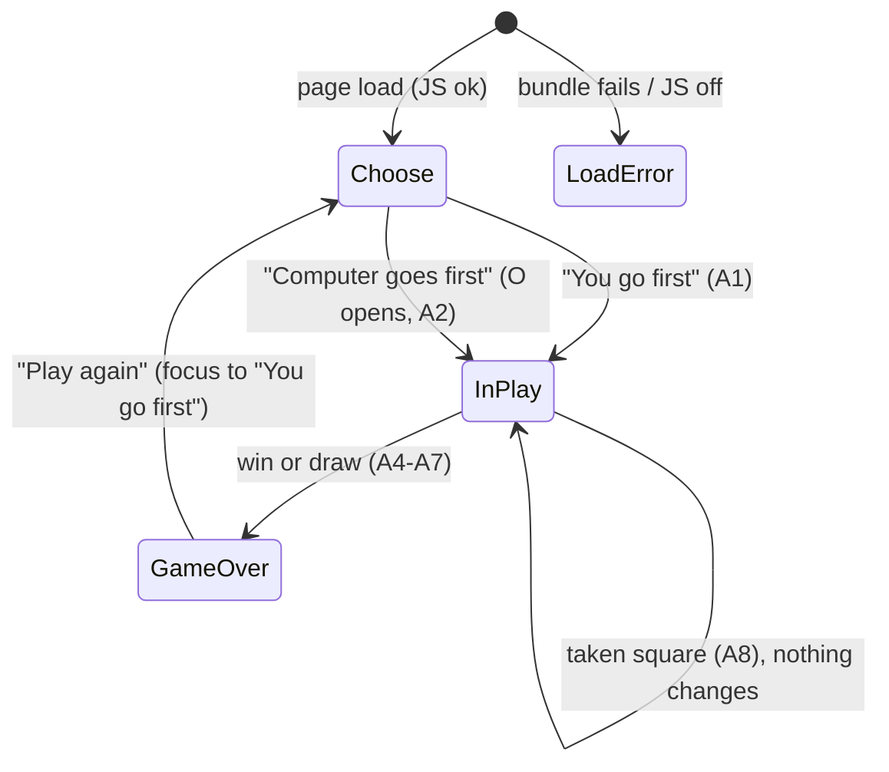

You are an independent second-opinion reviewer in a software factory pipeline.
A different AI (Claude) produced the DRAFT below. Your job is to find what it got
wrong, what it missed, and where a materially better approach exists. Do not
rubber-stamp, and do not inflate: report only findings you would defend with
evidence (a line, an input that breaks it, a requirement it violates). Do not
rewrite the whole thing. Be specific and terse.

Review kind: code
Reviewer: {{REVIEWER}}
Project: factory-tictactoe

Focus especially on: correctness against the exact copy (A1–A8, square labels, {LINE}, status copy), security, and anything that will bite when the UI uses these texts

Respond in EXACTLY this format (markdown):

## Verdict
Exactly one of:
- AGREE — no CRITICAL or HIGH findings.
- AGREE-WITH-CONCERNS — CRITICAL or HIGH findings that can be fixed within this approach.
- DISAGREE — the approach itself is wrong: you would redo it rather than patch it, and you describe what instead under Alternative.
Findings alone, however many or severe, never make a DISAGREE; they make AGREE-WITH-CONCERNS.
One sentence of justification.

## Findings
Number every finding C1, C2, … so the author can answer each one. One bullet each:
- [C1] [CRITICAL|HIGH|MEDIUM|LOW] <where> — <what is wrong> — <evidence> — <what to do instead>
(CRITICAL = will cause data loss, security hole, wrong behavior, or blocks the goal. Use it sparingly and only when sure.)

## Missing
Bullets: things the draft should address but doesn't. Empty if none.

## Alternative
If you would take a materially different approach, describe it in <=8 lines and say why it's better. Otherwise write "None".

## Questions for the human
Bullets: decisions only the product owner can make. Empty if none.

=== CONTEXT (read-only, for reference) ===

--- .factory/features/F-005.md ---
# F-005: Write the exact announcement and status texts

- **Milestone:** M2 · **Size:** S · **Requirements:** R-005, R-008 · **Depends on:** F-004
- **Screens:** none directly. The texts are the copy for all three screens (`design/screens.md` "Copy").
- **Branch:** `factory/F-005-messages`, stacked on `factory/F-004-game-state-machine` (PR #5)

## Acceptance criteria

1. Given the events for each situation A1–A8, when `describeEvents` runs, then the text equals the acceptance.md announcement table exactly, with placeholders filled.
2. Given A4, when a unit test drives `game.ts` with an injected losing opponent and passes the events to `describeEvents`, then the text equals A4 exactly.
3. Given each of the 8 lines, when `describeLine` runs, then it returns the {LINE} wording (`row 1` … `the diagonal from top right to bottom left`).
4. Given a square index and its content, when `squareLabel` runs, then it returns `Row R, column C, empty|X|O`.
5. Given each state, when `statusText` runs, then it returns the visible status copy from `design/screens.md` exactly.

## API (`src/ui/messages.ts`, pure, no DOM)

- `describeEvents(events: readonly GameEvent[]): string`: the live-region text for one player action (A1–A8). It returns `""` for no events (reset) and for a `not-playing` rejection, which the UI prevents by disabling squares, so nothing is announced.
- `describeLine(line: Line): string`: gives `row N`, `column N`, `the diagonal from top left to bottom right` for [0,4,8], or `the diagonal from top right to bottom left` for [2,4,6].
- `squareLabel(index: number, cell: Cell): string`.
- `describeSquare(index: number): string`: `row R, column C`, the shared fragment.
- `statusText(state: GameState, events: readonly GameEvent[]): string`: the visible status line (design copy):
  - choosing: `Who goes first?`
  - playing, just started human first: `Your turn. You are X.`
  - playing, just started computer first: `Computer placed O in row R, column C. Your turn. You are X.`
  - playing, after a move: `Computer placed O in row R, column C. Your turn.`
  - taken square (`rejected occupied`): `Row R, column C is taken. Choose an empty square.`
  - over: `Computer wins with {LINE}.` · `It's a draw.` · `You win with {LINE}.`
  - Keeping the taken message until the next valid move is the UI's job (F-006): it only calls `statusText` when events arrive.

## Tests to write first (`tests/unit/messages.test.ts`)

- **A1–A8:** exact strings, built from real `game.ts` steps:
  - A1: `startGame("human")`.
  - A2: `startGame("computer")` (O at row 1, column 1).
  - A3: X at 0 with O replying at 4.
  - A5: the 3b draw's last move, X at 8.
  - A6: the 3a win (X at 3, O at 6, diagonal from top right).
  - A7: the computer-first draw's last move (X at 7, O at 8).
  - A8: rejected occupied at 4.
  - A4: an injected lowest-empty opponent, with X playing 3, 4, 5, gives `You placed X in row 2, column 3. You win with row 2.`
- **Not announced:** `describeEvents([])` and a `not-playing` rejection both give `""`.
- **`describeLine`:** all 8 `LINES` map to their exact wording.
- **`squareLabel`:** all 9 squares × 3 contents.
- **`statusText`:** every case listed under API, using real states and events.

## Files expected

`src/ui/messages.ts`, `tests/unit/messages.test.ts`.

## Approach

`describeEvents` builds the text by walking the events:
- `started` emits the new-game opening, depending on who started.
- `placed X` emits `You placed X in {square}.`
- `placed O` emits `Computer placed O in {square}.`
- `ended` emits the result sentence.
- Otherwise it closes with `Your turn.`
- `rejected occupied` gives A8; `not-playing` gives `""`.

Row and column are `Math.floor(index / 3) + 1` and `index % 3 + 1`. `describeLine` classifies by the line's indexes, not its position in `LINES`, so it can't drift from the board order.

All copy lives in this one module, so tests pin it and the UI can't hand-build strings.

## Review outcome

_Filled after the second opinion on the diff._

--- .factory/acceptance.md ---
# Acceptance criteria: factory-tictactoe

_Traces to: `.factory/prd.md`. Every criterion is written to be checked by an automated test (Vitest unit tests, Playwright end-to-end tests, or a CI script), except where it says "verified in deploy phase"._

## Conventions used below

- Squares are numbered by **row 1–3 (top to bottom)** and **column 1–3 (left to right)**.
- `{R}`, `{C}` are the row and column of the human's move; `{R2}`, `{C2}` are those of the computer's move.
- `{LINE}` is one of: `row 1`, `row 2`, `row 3`, `column 1`, `column 2`, `column 3`, `the diagonal from top left to bottom right`, `the diagonal from top right to bottom left`.

### Announcement text (exact, used by R-002, R-004, R-005, R-008)

| ID | When | Exact live-region text |
|---|---|---|
| A1 | Game starts, human first | `New game. You go first. You are X. Your turn.` |
| A2 | Game starts, computer first | `New game. Computer goes first as O. Computer placed O in row {R2}, column {C2}. Your turn.` |
| A3 | Human moves, game continues | `You placed X in row {R}, column {C}. Computer placed O in row {R2}, column {C2}. Your turn.` |
| A4 | Human move wins (unreachable with a perfect computer, still defined) | `You placed X in row {R}, column {C}. You win with {LINE}.` |
| A5 | Human move fills the board with no winner | `You placed X in row {R}, column {C}. It's a draw.` |
| A6 | Computer move wins | `You placed X in row {R}, column {C}. Computer placed O in row {R2}, column {C2}. Computer wins with {LINE}.` |
| A7 | Computer move fills the board with no winner | `You placed X in row {R}, column {C}. Computer placed O in row {R2}, column {C2}. It's a draw.` |
| A8 | Human activates an occupied square | `Row {R}, column {C} is taken. Choose an empty square.` |

Square accessible names: `Row {R}, column {C}, empty` / `Row {R}, column {C}, X` / `Row {R}, column {C}, O`.

## R-001 Board and legal moves

- **Given** a game in progress with the human to move, **when** the human activates an empty square, **then** exactly that square shows X and no other square changes before the computer's reply.
- **Given** a game in progress, **when** the human activates a square showing X or O, **then** the board is unchanged and it is still the human's turn.
- **Given** the game state module, **when** a human move is submitted while it is the computer's turn or after the game has ended, **then** the move is rejected and the returned state equals the input state (unit test).

### Unhappy paths

- **Given** the first-mover choice has not been made, **when** the player clicks, taps or presses Enter on any square, **then** nothing is placed (squares are disabled).
- **Given** JavaScript is disabled, **when** the page loads, **then** a visible message says the game needs JavaScript (Playwright with `javaScriptEnabled: false`).
- **Given** JavaScript is enabled but the JavaScript bundle request fails (Playwright aborts it), **when** the page loads, **then** the visible message "The game didn't load. Try reloading the page." is shown (tested against the production build in `dist/`, not the dev server); **and given** the bundle loads normally, **then** that message is never visible at any point during the load (it ships `hidden`).
- **Given** the production build, **when** start-up throws (the Playwright test serves `index.html` with the board's root element removed, so `main.ts` fails to find it), **then** the same load-error message is shown.

## R-002 First-mover choice

- **Given** a fresh page load, **when** it renders, **then** two controls "You go first" and "Computer goes first" are visible, the board is empty, and no control to choose a symbol exists.
- **Given** the choice is shown, **when** the player chooses "You go first", **then** the board is empty, it is the human's turn as X, and the live region reads A1.
- **Given** the choice is shown, **when** the player chooses "Computer goes first", **then** exactly one square shows O, no square shows X, and the live region reads A2 naming that square.
- **Given** any game, **when** squares are filled, **then** every human-placed mark is X and every computer-placed mark is O, regardless of who started.

## R-003 Perfect, never-losing computer

- **Given** both starting sides, **when** a test enumerates every legal human move at every position where it is the human's turn and applies the computer's chosen reply at every position where it is the computer's turn, **then** no reachable finished game is a human (X) win, and the test reports the number of finished games examined (greater than 0) for each starting side.
- **Given** a position where the computer can complete three in a row, **when** it chooses a move, **then** it completes the line (unit test over all such reachable positions).
- **Given** the same position twice, **when** the computer chooses a move, **then** it returns the same square both times (deterministic).
- **Given** successive games in one process with alternating starters (human, computer, human, …), **when** the exhaustive enumeration runs for each, **then** results are identical to running each starter in a fresh process (the memo stays valid across starters).
- **Given** CI, **when** the unit-test job runs, **then** the exhaustive test runs on every push and pull request and finishes in under 60 seconds.

## R-004 Win and draw detection with result message

- **Given** each of the 8 lines filled with X, and separately with O, **when** the board is evaluated, **then** the winner is that symbol and the line is identified (unit test, 16 cases).
- **Given** a full board with no three in a row, **when** it is evaluated, **then** the result is a draw.
- **Given** a move that wins or fills the board, **when** it is applied, **then** the game ends, all squares become disabled, and the visible result text contains "Computer wins", "You win" or "It's a draw" accordingly, and the live region reads A4, A5, A6 or A7 accordingly.

## R-005 Winning line highlight

- **Given** a game the computer has won, **when** the result is shown, **then** exactly the three squares of the winning line are marked as winning and each of them differs from non-winning squares in at least one non-colour computed style (border width or style, outline, or text decoration) or carries an overlaid line element.
- **Given** a game the computer has won, **when** the result is shown, **then** the visible result text and the live region both name the line using `{LINE}` wording.
- **Given** a drawn game, **when** the result is shown, **then** no square is marked as winning.

## R-006 Play again

- **Given** a finished game, **when** the result is shown, **then** a "Play again" button is visible and has keyboard focus.
- **Given** a game in progress, **when** the page is inspected, **then** no "Play again" button is visible.
- **Given** a finished game, **when** the player activates "Play again", **then** the board is empty, the first-mover choice is shown, and focus is on "You go first".

## R-007 Keyboard-only play

- **Given** a fresh page, **when** a Playwright test plays a complete game using only Tab, Shift+Tab, arrow keys, Enter and Space (no pointer events), choosing "You go first", **then** the game reaches a result and "Play again" can be activated from the keyboard to start a second game choosing "Computer goes first", which also reaches a result.
- **Given** the board has focus, **when** an arrow key is pressed, **then** focus moves one square in that direction, stays put at the board edge, and exactly one square is in the Tab order at any time.
- **Given** a square has focus, **when** Enter or Space is pressed on an empty square, **then** X is placed there.
- **Given** the first-mover choice, **when** the player chooses "You go first", **then** focus is on row 1, column 1; **and when** the player chooses "Computer goes first", **then** focus is on the first empty square in reading order (row 1, column 2 after the opening O at row 1, column 1).
- **Given** any focused control, **when** its computed style is read, **then** it has a visible focus indicator with an outline or border at least 2 CSS px wide.

## R-008 Screen-reader announcements

- **Given** each situation A1–A3 and A5–A8, **when** it occurs in a Playwright test, **then** the live region (`role="status"`, polite) text equals the exact string in the announcement table, with placeholders filled.
- **Given** A4 (human win), which the real opponent makes unreachable, **when** a unit test drives the game state machine with an injected opponent that loses and passes the events to the message builder, **then** the text equals A4 exactly; the production bundle contains no way to inject an opponent.
- **Given** any board state, **when** the squares are inspected, **then** each square's accessible name matches `Row {R}, column {C}, empty|X|O` for its current content.
- **Given** a human move, **when** the computer replies, **then** a single announcement covers both moves (the live region is updated once per human action).

## R-009 WCAG 2.2 AA and zero axe violations

- **Given** each game state (choice shown, game in progress, computer won, draw), **when** axe-core runs with tags `wcag2a`, `wcag2aa`, `wcag21a`, `wcag21aa` and `wcag22aa` in Chromium, Firefox and WebKit, **then** it reports 0 violations.
- **Given** the page, **when** it loads, **then** it has a `lang` attribute, a descriptive `<title>`, one `h1`, and the board is exposed as a labelled group.

## R-010 Responsive layout for touch and mouse

- **Given** viewports of 320×568, 390×844 and 1280×800 CSS px, **when** the page is shown in each game state, **then** `document.documentElement.scrollWidth` does not exceed the viewport width and all nine squares and both choice buttons are fully visible without scrolling horizontally.
- **Given** those viewports, **when** the bounding boxes of the squares and buttons are measured, **then** each is at least 44×44 CSS px.
- **Given** a touch-enabled phone emulation, **when** the player taps "You go first" and then an empty square, **then** X is placed there.
- **Given** a desktop viewport, **when** the player clicks "You go first" and then an empty square, **then** X is placed there.
- **Given** viewports of 320×568 and 1280×800 at default text size, **when** the page moves through the choose state, play (including a taken-square message and the longest computer-move status), and the game-over state, **then** the board's bounding box (x, y, width, height) is identical in every state. At 200% text zoom reflow takes priority and this check does not apply.

## R-011 Bundle size

- **Given** a production build, **when** the CI size check sums the gzipped size of every JavaScript file in `dist/`, **then** the total is under 51,200 bytes, and the check fails the build otherwise.

## R-012 No tracking, storage or third-party requests

- **Given** a Playwright test that records every network request while loading the page and playing a full game, **when** the game ends, **then** every request went to the page's own origin.
- **Given** the same full game, **when** it ends, **then** `document.cookie` is empty and `localStorage.length` and `sessionStorage.length` are 0.
- **Given** the built `dist/` output, **when** it is scanned, **then** it contains no script, link or iframe pointing to another origin.

## R-013 Plain, high-contrast, system fonts

- **Given** the page, **when** the computed `font-family` of the body is read, **then** it begins with `system-ui`, and no font files are requested during a full game.
- **Given** the design tokens, **when** a unit test computes the contrast of every text colour against its background, **then** each ratio is at least 7:1, and every non-text indicator (square borders, focus ring, winning-line marker) is at least 3:1 against its background.

## R-014 Deploy to GitHub Pages with smoke test and minimal rollback

- **Given** a merge to main whose CI passes and which is still the latest commit on main, **when** the deploy workflow runs, **then** it builds exactly that commit (`workflow_run.head_sha`) and publishes it to GitHub Pages. The smoke test waits up to 3 minutes until the live page's `build-id` meta equals that SHA, then chooses "You go first", places one X, sees the computer's O, and passes. _Verified in deploy phase._
- **Given** CI passes for a commit that is no longer the latest commit on main, **when** its deploy run acquires the concurrency slot, **then** it skips without deploying. _Verified in deploy phase._
- **Given** deploy runs that overlap (one running, the latest commit's run queued, and an older commit's run queued after it), **when** they are processed, **then** none of them is discarded (`queue: max`, first in, first out), the older one skips as stale, and the latest commit ends up live. _Verified in deploy phase; the workflow's concurrency block is checked statically in CI._
- **Given** a manual `workflow_dispatch` run, **when** main's CI for its tip is pending or failed, **then** the run refuses to deploy and fails with a message. _Verified in deploy phase._
- **Given** a deploy whose smoke test fails (forced by the workflow's manual `force_smoke_failure` input), **when** the rollback job runs, **then** it redeploys, unchanged, the Pages artifact of the latest deploy run whose deploy and smoke jobs both succeeded (a stale no-op run in between is never chosen), under the artifact name `github-pages-rollback`, does nothing else, and the workflow run concludes as failed so GitHub emails the repo owner. _Verified in deploy phase._
- **Given** no previous successful deploy run exists, or its artifact has expired, **when** the smoke test fails, **then** the rollback job logs that no previous artifact is available and the run fails. _Verified in deploy phase._

## R-015 Browser coverage

- **Given** the Playwright configuration, **when** CI runs the end-to-end suite, **then** every spec runs in five projects — Chromium, Firefox, WebKit, a touch-enabled Android phone emulation (Chromium) and a touch-enabled iPhone emulation (WebKit) — and all pass.
- **Given** the production build, **when** Vite builds it, **then** its build target covers the current and previous versions of Chrome, Firefox, Safari and Edge and iOS Safari (build target `es2022`, supported by all of them).

--- .factory/design/screens.md ---
# Screens: factory-tictactoe

_Traces to: `.factory/prd.md` §6 (Flows A and B, unhappy paths), `.factory/acceptance.md`, `design-system.md`, `tokens.json`. One page with three states. Mockups are static HTML (`screens/*.html`), each showing every variant at 320 px and 760 px wide. Status: draft_

## Index

| Screen | File | Flow | Requirements | Components used | Notes |
|---|---|---|---|---|---|
| 1. Choose who goes first | `screens/game-01-choose-first.html` | A and B step 1; after Play again | R-001, R-002, R-006, R-007, R-010, R-012, R-013 | Title, status line, board (disabled squares), action area with choice button ×2, announcer, fallback message | Variants: 1a default (focus on "You go first" after Play again); 1b load error (hidden by default, revealed only on a script error); 1c JavaScript off (`noscript`). The empty disabled board is the empty state. No symbol picker. |
| 2. In play | `screens/game-02-in-play.html` | A steps 2–5; B steps 2–3 | R-001, R-002, R-003, R-007, R-008, R-009, R-010 | Title, status line, board (active and occupied squares, roving focus), action area with keyboard hint, announcer | Variants: 2a you first, empty board (A1); 2b computer first, O opens at row 1, column 1, focus on row 1, column 2 (A2); 2c mid-game after a move (A3); 2d taken square (A8). The visible status names the computer's last move. Always the human's turn when idle; no loading state (instant reply). Sample positions follow ADR-010 perfect play. |
| 3. Game over | `screens/game-03-game-over.html` | A steps 6–7 | R-004, R-005, R-006, R-007, R-008, R-009, R-010 | Title, status line, board (disabled, winning squares), action area with Play again button, announcer | Variants: 3a computer wins by diagonal (A6) with border, strike line and fill; 3b draw (A5/A7), no highlight; 3c computer wins by row (strike direction check). A4 "You win" is unreachable and not mocked; it uses the 3a layout with different words. |

## Navigation

## Focus map

| From | Action | Focus goes to |
|---|---|---|
| Fresh load | — | nothing (document start); Tab reaches "You go first" |
| Choose | either choice | first empty square in reading order (row 1, column 1 if you went first; row 1, column 2 after the computer's opening O) |
| In play | place X (game continues) | the square just played |
| In play | taken square | stays on that square (status keeps the taken message until the next valid move) |
| In play | move ends the game | "Play again" |
| Game over | "Play again" | "You go first" |

## Copy (exact; tests assert it)

- Title `h1`: "Tic-tac-toe". No tagline (the `<title>` carries "play against a computer that never loses").
- Status line: "Who goes first?" · "Your turn. You are X." · "Computer placed O in row R, column C. Your turn. You are X." (computer went first) · "Computer placed O in row R, column C. Your turn." · "Row R, column C is taken. Choose an empty square." · "Computer wins with {LINE}." · "It's a draw." · "You win with {LINE}."
- Keyboard hint (during play): "Arrow keys move between squares. Enter or Space places X."
- Buttons: "You go first" · "Computer goes first" · "Play again".
- Fallbacks: load error "The game didn't load. Try reloading the page." · `noscript` "This game needs JavaScript, which is turned off in this browser. Turn it on and reload the page."
- Announcer: A1–A8 exactly as in `acceptance.md`.

## Later (not designed; PRD non-goals)

Tally, symbol choice, difficulty, hot-seat, undo, history, rules page, themes/dark mode, sound, animation, translations.

## Refinements from the design review (now in the specification)

The approver chose option (a) on 2026-09-27. Both refinements are now in `architecture.md` §2 and §5 and in `acceptance.md` (R-001, R-007, R-010).
1. **Focus after a choice** goes to the first empty square in reading order, not always row 1, column 1 (architecture §5), because the computer's opening O sits there.
2. **Load-error fallback** is hidden by default and revealed only on a script error, with new wording (architecture §2 said a visible static message removed on start, which would flash on every load).

## Verification (now acceptance criteria R-010 and R-001)

- **The board never moves.** At 320 × 568 and 1280 × 800 at default text size, the board's bounding box is identical in choose, in play (including a taken-square message and the longest computer-move status), and game-over states. At 200% text zoom, reflow takes priority and the board may shift; that is accepted.
- **Load error.** Aborting the bundle request shows "The game didn't load. Try reloading the page."; a normal load never shows it, not even briefly.

## Sample games (checked against ADR-010 perfect play)

- 2c/2d: X r1c1 → O r2c2 → X r3c3 → O r1c2.
- 3a: X r1c1 → O r2c2 → X r1c2 → O r1c3 → X r2c1 → O r3c1 (diagonal from top right).
- 3b: X r1c1 → O r2c2 → X r1c2 → O r1c3 → X r3c1 → O r2c1 → X r2c3 → O r3c2 → X r3c3 (draw).
- 3c: X r1c1 → O r2c2 → X r3c1 → O r2c1 → X r1c2 → O r2c3 (row 2).
- Computer opening: r1c1.

--- src/game/game.ts ---
// F-004 (R-001, R-002, R-004, R-006): the game as a pure state machine.
// Each call returns the next state plus the events that describe what happened
// (ADR-009); the UI turns events into text and never inspects the rules.
import {
  createEmptyBoard,
  evaluateResult,
  placeMark,
  type Board,
  type BoardResult,
  type Mark,
} from "./board";
import { chooseComputerMove } from "./computer-player";

export type FirstMover = "human" | "computer";
export type Opponent = (board: Board) => number;
export type GameState =
  | { phase: "choosing" }
  | { phase: "playing"; board: Board; firstMover: FirstMover }
  | {
      phase: "over";
      board: Board;
      firstMover: FirstMover;
      result: BoardResult;
    };
export type GameEvent =
  | { type: "started"; firstMover: FirstMover }
  | { type: "placed"; mark: Mark; index: number }
  | { type: "ended"; result: BoardResult }
  | { type: "rejected"; reason: "occupied" | "not-playing"; index: number };
export interface GameStep {
  state: GameState;
  events: GameEvent[];
}

const HUMAN_MARK: Mark = "X";
const COMPUTER_MARK: Mark = "O";

export function resetToChoosing(): GameStep {
  return { state: { phase: "choosing" }, events: [] };
}

// Places one mark and settles the state: `over` with an `ended` event if that
// mark finished the game, otherwise still `playing`.
function applyMark(
  board: Board,
  firstMover: FirstMover,
  index: number,
  mark: Mark,
  events: GameEvent[],
): GameState {
  const nextBoard = placeMark(board, index, mark);
  events.push({ type: "placed", mark, index });
  const result = evaluateResult(nextBoard);
  if (result) {
    events.push({ type: "ended", result });
    return { phase: "over", board: nextBoard, firstMover, result };
  }
  return { phase: "playing", board: nextBoard, firstMover };
}

export function startGame(
  firstMover: FirstMover,
  opponent: Opponent = chooseComputerMove,
): GameStep {
  const events: GameEvent[] = [{ type: "started", firstMover }];
  const board = createEmptyBoard();
  if (firstMover === "human") {
    return { state: { phase: "playing", board, firstMover }, events };
  }
  const state = applyMark(
    board,
    firstMover,
    opponent(board),
    COMPUTER_MARK,
    events,
  );
  return { state, events };
}

/**
 * Plays X on `index` and, if the game continues, the opponent's O in the same
 * call. Illegal moves return the same state and a `rejected` event. An index
 * outside 0–8 is a programming error and throws (from placeMark).
 */
export function playHumanMove(
  state: GameState,
  index: number,
  opponent: Opponent = chooseComputerMove,
): GameStep {
  if (state.phase !== "playing") {
    return {
      state,
      events: [{ type: "rejected", reason: "not-playing", index }],
    };
  }
  if (state.board[index] != null) {
    return { state, events: [{ type: "rejected", reason: "occupied", index }] };
  }
  const events: GameEvent[] = [];
  const afterHuman = applyMark(
    state.board,
    state.firstMover,
    index,
    HUMAN_MARK,
    events,
  );
  if (afterHuman.phase !== "playing") {
    return { state: afterHuman, events };
  }
  const afterComputer = applyMark(
    afterHuman.board,
    afterHuman.firstMover,
    opponent(afterHuman.board),
    COMPUTER_MARK,
    events,
  );
  return { state: afterComputer, events };
}

=== DRAFT UNDER REVIEW: git-diff-8978512aa8d9c9effaed5166455140a51436f06d-to-5f7ea379f1736254cd56502dd6d658f85567d75d ===
diff --git a/.factory/features/F-005.md b/.factory/features/F-005.md
new file mode 100644
index 0000000..413a0cc
--- /dev/null
+++ b/.factory/features/F-005.md
@@ -0,0 +1,66 @@
+# F-005: Write the exact announcement and status texts
+
+- **Milestone:** M2 · **Size:** S · **Requirements:** R-005, R-008 · **Depends on:** F-004
+- **Screens:** none directly. The texts are the copy for all three screens (`design/screens.md` "Copy").
+- **Branch:** `factory/F-005-messages`, stacked on `factory/F-004-game-state-machine` (PR #5)
+
+## Acceptance criteria
+
+1. Given the events for each situation A1–A8, when `describeEvents` runs, then the text equals the acceptance.md announcement table exactly, with placeholders filled.
+2. Given A4, when a unit test drives `game.ts` with an injected losing opponent and passes the events to `describeEvents`, then the text equals A4 exactly.
+3. Given each of the 8 lines, when `describeLine` runs, then it returns the {LINE} wording (`row 1` … `the diagonal from top right to bottom left`).
+4. Given a square index and its content, when `squareLabel` runs, then it returns `Row R, column C, empty|X|O`.
+5. Given each state, when `statusText` runs, then it returns the visible status copy from `design/screens.md` exactly.
+
+## API (`src/ui/messages.ts`, pure, no DOM)
+
+- `describeEvents(events: readonly GameEvent[]): string`: the live-region text for one player action (A1–A8). It returns `""` for no events (reset) and for a `not-playing` rejection, which the UI prevents by disabling squares, so nothing is announced.
+- `describeLine(line: Line): string`: gives `row N`, `column N`, `the diagonal from top left to bottom right` for [0,4,8], or `the diagonal from top right to bottom left` for [2,4,6].
+- `squareLabel(index: number, cell: Cell): string`.
+- `describeSquare(index: number): string`: `row R, column C`, the shared fragment.
+- `statusText(state: GameState, events: readonly GameEvent[]): string`: the visible status line (design copy):
+  - choosing: `Who goes first?`
+  - playing, just started human first: `Your turn. You are X.`
+  - playing, just started computer first: `Computer placed O in row R, column C. Your turn. You are X.`
+  - playing, after a move: `Computer placed O in row R, column C. Your turn.`
+  - taken square (`rejected occupied`): `Row R, column C is taken. Choose an empty square.`
+  - over: `Computer wins with {LINE}.` · `It's a draw.` · `You win with {LINE}.`
+  - Keeping the taken message until the next valid move is the UI's job (F-006): it only calls `statusText` when events arrive.
+
+## Tests to write first (`tests/unit/messages.test.ts`)
+
+- **A1–A8:** exact strings, built from real `game.ts` steps:
+  - A1: `startGame("human")`.
+  - A2: `startGame("computer")` (O at row 1, column 1).
+  - A3: X at 0 with O replying at 4.
+  - A5: the 3b draw's last move, X at 8.
+  - A6: the 3a win (X at 3, O at 6, diagonal from top right).
+  - A7: the computer-first draw's last move (X at 7, O at 8).
+  - A8: rejected occupied at 4.
+  - A4: an injected lowest-empty opponent, with X playing 3, 4, 5, gives `You placed X in row 2, column 3. You win with row 2.`
+- **Not announced:** `describeEvents([])` and a `not-playing` rejection both give `""`.
+- **`describeLine`:** all 8 `LINES` map to their exact wording.
+- **`squareLabel`:** all 9 squares × 3 contents.
+- **`statusText`:** every case listed under API, using real states and events.
+
+## Files expected
+
+`src/ui/messages.ts`, `tests/unit/messages.test.ts`.
+
+## Approach
+
+`describeEvents` builds the text by walking the events:
+- `started` emits the new-game opening, depending on who started.
+- `placed X` emits `You placed X in {square}.`
+- `placed O` emits `Computer placed O in {square}.`
+- `ended` emits the result sentence.
+- Otherwise it closes with `Your turn.`
+- `rejected occupied` gives A8; `not-playing` gives `""`.
+
+Row and column are `Math.floor(index / 3) + 1` and `index % 3 + 1`. `describeLine` classifies by the line's indexes, not its position in `LINES`, so it can't drift from the board order.
+
+All copy lives in this one module, so tests pin it and the UI can't hand-build strings.
+
+## Review outcome
+
+_Filled after the second opinion on the diff._
diff --git a/src/ui/messages.ts b/src/ui/messages.ts
new file mode 100644
index 0000000..86048b5
--- /dev/null
+++ b/src/ui/messages.ts
@@ -0,0 +1,118 @@
+// F-005 (R-005, R-008): every word the game shows or announces. Pure, no DOM.
+// Exact texts: acceptance.md "Announcement text" (A1–A8) and design/screens.md "Copy".
+import type { BoardResult, Cell, Line } from "../game/board";
+import type { GameEvent, GameState } from "../game/game";
+
+const COLUMN_COUNT = 3;
+
+/** "row R, column C" for a square index 0–8. */
+export function describeSquare(index: number): string {
+  const row = Math.floor(index / COLUMN_COUNT) + 1;
+  const column = (index % COLUMN_COUNT) + 1;
+  return `row ${String(row)}, column ${String(column)}`;
+}
+
+function capitalize(text: string): string {
+  return text.charAt(0).toUpperCase() + text.slice(1);
+}
+
+/** Accessible name of a square: "Row R, column C, empty|X|O". */
+export function squareLabel(index: number, cell: Cell): string {
+  return `${capitalize(describeSquare(index))}, ${cell ?? "empty"}`;
+}
+
+/** The {LINE} wording, classified by the line's squares. */
+export function describeLine(line: Line): string {
+  const [first, second, third] = line;
+  if (first === 0 && second === 4 && third === 8) {
+    return "the diagonal from top left to bottom right";
+  }
+  if (first === 2 && second === 4 && third === 6) {
+    return "the diagonal from top right to bottom left";
+  }
+  if (second - first === 1) {
+    return `row ${String(Math.floor(first / COLUMN_COUNT) + 1)}`;
+  }
+  return `column ${String(first + 1)}`;
+}
+
+function describeResult(result: BoardResult): string {
+  if (result.kind === "draw") {
+    return "It's a draw.";
+  }
+  const winner = result.winner === "X" ? "You win" : "Computer wins";
+  return `${winner} with ${describeLine(result.line)}.`;
+}
+
+function describeTakenSquare(index: number): string {
+  return `${capitalize(describeSquare(index))} is taken. Choose an empty square.`;
+}
+
+/** The live-region text for one player action (A1–A8); "" when nothing is announced. */
+export function describeEvents(events: readonly GameEvent[]): string {
+  const sentences: string[] = [];
+  let hasEnded = false;
+  for (const event of events) {
+    switch (event.type) {
+      case "rejected":
+        return event.reason === "occupied"
+          ? describeTakenSquare(event.index)
+          : "";
+      case "started":
+        sentences.push(
+          event.firstMover === "human"
+            ? "New game. You go first. You are X."
+            : "New game. Computer goes first as O.",
+        );
+        break;
+      case "placed":
+        sentences.push(
+          event.mark === "X"
+            ? `You placed X in ${describeSquare(event.index)}.`
+            : `Computer placed O in ${describeSquare(event.index)}.`,
+        );
+        break;
+      case "ended":
+        sentences.push(describeResult(event.result));
+        hasEnded = true;
+        break;
+    }
+  }
+  if (sentences.length === 0) {
+    return "";
+  }
+  if (!hasEnded) {
+    sentences.push("Your turn.");
+  }
+  return sentences.join(" ");
+}
+
+/** The visible status line for the current state and the events that led to it. */
+export function statusText(
+  state: GameState,
+  events: readonly GameEvent[],
+): string {
+  if (state.phase === "choosing") {
+    return "Who goes first?";
+  }
+  if (state.phase === "over") {
+    return describeResult(state.result);
+  }
+  const rejection = events.find((event) => event.type === "rejected");
+  if (rejection) {
+    return describeTakenSquare(rejection.index);
+  }
+  const hasJustStarted = events.some((event) => event.type === "started");
+  const computerMoves = events.filter(
+    (event): event is Extract<GameEvent, { type: "placed" }> =>
+      event.type === "placed" && event.mark === "O",
+  );
+  const computerMove = computerMoves.at(-1);
+  if (!computerMove) {
+    return "Your turn. You are X.";
+  }
+  const placedText = `Computer placed O in ${describeSquare(computerMove.index)}.`;
+  return hasJustStarted
+    ? `${placedText} Your turn. You are X.`
+    : `${placedText} Your turn.`;
+}
diff --git a/tests/unit/messages.test.ts b/tests/unit/messages.test.ts
new file mode 100644
index 0000000..f634626
--- /dev/null
+++ b/tests/unit/messages.test.ts
@@ -0,0 +1,321 @@
+// F-005 R-005 R-008: every announcement (A1–A8), square name and status line
+// the player hears or sees comes from src/ui/messages.ts. Expected strings are
+// copied verbatim from acceptance.md ("Announcement text") and design/screens.md
+// ("Copy"); the events come from real game.ts calls, not hand-built arrays.
+import { describe, it, expect } from "vitest";
+import type { Board, Cell, Line } from "../../src/game/board";
+import { LINES, emptySquares } from "../../src/game/board";
+import type { FirstMover, GameStep, Opponent } from "../../src/game/game";
+import { playHumanMove, resetToChoosing, startGame } from "../../src/game/game";
+import {
+  describeEvents,
+  describeLine,
+  describeSquare,
+  squareLabel,
+  statusText,
+} from "../../src/ui/messages";
+
+// Human first, real opponent, O wins on the rising diagonal:
+// X0 O4, X1 O2, X3 O6 -> "XXOXO.O..".
+const COMPUTER_WIN_MOVES: readonly number[] = [0, 1, 3];
+
+// Human first, real opponent, ends in a draw on X's ninth mark (A5):
+// X0 O4, X1 O2, X6 O3, X5 O7, X8 -> "XXOOOXXOX".
+const HUMAN_FIRST_DRAW_MOVES: readonly number[] = [0, 1, 6, 5, 8];
+
+// Computer first, real opponent, O's fifth mark fills the board (A7):
+// O0, X4 O1, X2 O6, X3 O5, X7 O8 -> "OOXXXOOXO".
+const COMPUTER_FIRST_DRAW_MOVES: readonly number[] = [4, 2, 3, 7];
+
+// Human first against the lowest-empty-index opponent, X wins the middle row:
+// X3 O0, X4 O1, X5 -> "OO.XXX...".
+const HUMAN_WIN_MOVES: readonly number[] = [3, 4, 5];
+
+/** A deliberately weak opponent: always the lowest empty square. */
+function chooseLowestEmptySquare(board: Board): number {
+  const [lowestSquare] = emptySquares(board);
+  if (lowestSquare === undefined) {
+    throw new RangeError("The board is full; there is no square to choose");
+  }
+  return lowestSquare;
+}
+
+/** Starts a game and plays every human move; returns the last step only. */
+function playToLastStep(
+  firstMover: FirstMover,
+  humanMoves: readonly number[],
+  opponent?: Opponent,
+): GameStep {
+  let step = startGame(firstMover, opponent);
+  for (const humanMove of humanMoves) {
+    step = playHumanMove(step.state, humanMove, opponent);
+  }
+  return step;
+}
+
+describe("describeEvents announcements A1–A8 (F-005 R-008 R-005)", () => {
+  it("announces A1 when the human starts a new game", () => {
+    const step = startGame("human");
+
+    expect(describeEvents(step.events)).toBe(
+      "New game. You go first. You are X. Your turn.",
+    );
+  });
+
+  it("announces A2 with the computer's opening O at row 1, column 1", () => {
+    const step = startGame("computer");
+
+    expect(describeEvents(step.events)).toBe(
+      "New game. Computer goes first as O. Computer placed O in row 1, column 1. Your turn.",
+    );
+  });
+
+  it("announces A3 for X at row 1, column 1 and O's reply at row 2, column 2", () => {
+    const step = playToLastStep("human", [0]);
+
+    expect(describeEvents(step.events)).toBe(
+      "You placed X in row 1, column 1. Computer placed O in row 2, column 2. Your turn.",
+    );
+  });
+
+  it("announces A4 when X wins row 2 against an injected losing opponent", () => {
+    const step = playToLastStep(
+      "human",
+      HUMAN_WIN_MOVES,
+      chooseLowestEmptySquare,
+    );
+
+    expect(describeEvents(step.events)).toBe(
+      "You placed X in row 2, column 3. You win with row 2.",
+    );
+  });
+
+  it("announces A5 when X's move fills the board with no winner", () => {
+    const step = playToLastStep("human", HUMAN_FIRST_DRAW_MOVES);
+
+    expect(describeEvents(step.events)).toBe(
+      "You placed X in row 3, column 3. It's a draw.",
+    );
+  });
+
+  it("announces A6 when the computer wins on the diagonal from top right", () => {
+    const step = playToLastStep("human", COMPUTER_WIN_MOVES);
+
+    expect(describeEvents(step.events)).toBe(
+      "You placed X in row 2, column 1. Computer placed O in row 3, column 1. Computer wins with the diagonal from top right to bottom left.",
+    );
+  });
+
+  it("announces A7 when the computer's move fills the board with no winner", () => {
+    const step = playToLastStep("computer", COMPUTER_FIRST_DRAW_MOVES);
+
+    expect(describeEvents(step.events)).toBe(
+      "You placed X in row 3, column 2. Computer placed O in row 3, column 3. It's a draw.",
+    );
+  });
+
+  it("announces A8 when the human activates the occupied square at row 2, column 2", () => {
+    const { state } = playToLastStep("human", [0]);
+
+    const step = playHumanMove(state, 4);
+
+    expect(describeEvents(step.events)).toBe(
+      "Row 2, column 2 is taken. Choose an empty square.",
+    );
+  });
+});
+
+describe("describeEvents announces nothing (F-005 R-008)", () => {
+  it("returns an empty string for no events (Play again)", () => {
+    expect(describeEvents([])).toBe("");
+    expect(describeEvents(resetToChoosing().events)).toBe("");
+  });
+
+  it("returns an empty string for a not-playing rejection while choosing", () => {
+    const step = playHumanMove(resetToChoosing().state, 4);
+
+    expect(describeEvents(step.events)).toBe("");
+  });
+
+  it("returns an empty string for a not-playing rejection after the game is over", () => {
+    const { state } = playToLastStep("human", COMPUTER_WIN_MOVES);
+
+    const step = playHumanMove(state, 5);
+
+    expect(describeEvents(step.events)).toBe("");
+  });
+});
+
+describe("describeLine (F-005 R-005)", () => {
+  const expectedWordings: readonly { line: Line; wording: string }[] = [
+    { line: [0, 1, 2], wording: "row 1" },
+    { line: [3, 4, 5], wording: "row 2" },
+    { line: [6, 7, 8], wording: "row 3" },
+    { line: [0, 3, 6], wording: "column 1" },
+    { line: [1, 4, 7], wording: "column 2" },
+    { line: [2, 5, 8], wording: "column 3" },
+    {
+      line: [0, 4, 8],
+      wording: "the diagonal from top left to bottom right",
+    },
+    {
+      line: [2, 4, 6],
+      wording: "the diagonal from top right to bottom left",
+    },
+  ];
+
+  it("covers exactly the 8 winning lines from the board module", () => {
+    expect(LINES).toEqual(expectedWordings.map(({ line }) => line));
+  });
+
+  for (const { line, wording } of expectedWordings) {
+    it(`names the line [${line.join(", ")}] as "${wording}"`, () => {
+      const boardLine = LINES.find(
+        (candidate) => candidate.join() === line.join(),
+      );
+      expect(boardLine).toBeDefined();
+
+      expect(describeLine(boardLine ?? line)).toBe(wording);
+    });
+  }
+});
+
+describe("describeSquare (F-005 R-008)", () => {
+  const expectedFragments: readonly string[] = [
+    "row 1, column 1",
+    "row 1, column 2",
+    "row 1, column 3",
+    "row 2, column 1",
+    "row 2, column 2",
+    "row 2, column 3",
+    "row 3, column 1",
+    "row 3, column 2",
+    "row 3, column 3",
+  ];
+
+  expectedFragments.forEach((fragment, index) => {
+    it(`describes square ${String(index)} as "${fragment}"`, () => {
+      expect(describeSquare(index)).toBe(fragment);
+    });
+  });
+});
+
+describe("squareLabel (F-005 R-008)", () => {
+  const expectedLabels: readonly {
+    index: number;
+    cell: Cell;
+    label: string;
+  }[] = [
+    { index: 0, cell: null, label: "Row 1, column 1, empty" },
+    { index: 0, cell: "X", label: "Row 1, column 1, X" },
+    { index: 0, cell: "O", label: "Row 1, column 1, O" },
+    { index: 1, cell: null, label: "Row 1, column 2, empty" },
+    { index: 1, cell: "X", label: "Row 1, column 2, X" },
+    { index: 1, cell: "O", label: "Row 1, column 2, O" },
+    { index: 2, cell: null, label: "Row 1, column 3, empty" },
+    { index: 2, cell: "X", label: "Row 1, column 3, X" },
+    { index: 2, cell: "O", label: "Row 1, column 3, O" },
+    { index: 3, cell: null, label: "Row 2, column 1, empty" },
+    { index: 3, cell: "X", label: "Row 2, column 1, X" },
+    { index: 3, cell: "O", label: "Row 2, column 1, O" },
+    { index: 4, cell: null, label: "Row 2, column 2, empty" },
+    { index: 4, cell: "X", label: "Row 2, column 2, X" },
+    { index: 4, cell: "O", label: "Row 2, column 2, O" },
+    { index: 5, cell: null, label: "Row 2, column 3, empty" },
+    { index: 5, cell: "X", label: "Row 2, column 3, X" },
+    { index: 5, cell: "O", label: "Row 2, column 3, O" },
+    { index: 6, cell: null, label: "Row 3, column 1, empty" },
+    { index: 6, cell: "X", label: "Row 3, column 1, X" },
+    { index: 6, cell: "O", label: "Row 3, column 1, O" },
+    { index: 7, cell: null, label: "Row 3, column 2, empty" },
+    { index: 7, cell: "X", label: "Row 3, column 2, X" },
+    { index: 7, cell: "O", label: "Row 3, column 2, O" },
+    { index: 8, cell: null, label: "Row 3, column 3, empty" },
+    { index: 8, cell: "X", label: "Row 3, column 3, X" },
+    { index: 8, cell: "O", label: "Row 3, column 3, O" },
+  ];
+
+  for (const { index, cell, label } of expectedLabels) {
+    it(`labels square ${String(index)} holding ${cell ?? "nothing"} as "${label}"`, () => {
+      expect(squareLabel(index, cell)).toBe(label);
+    });
+  }
+});
+
+describe("statusText (F-005 R-005 R-008)", () => {
+  it("asks who goes first while choosing", () => {
+    const step = resetToChoosing();
+
+    expect(statusText(step.state, step.events)).toBe("Who goes first?");
+  });
+
+  it("tells the human it is their turn as X when they start", () => {
+    const step = startGame("human");
+
+    expect(statusText(step.state, step.events)).toBe("Your turn. You are X.");
+  });
+
+  it("names the computer's opening O and the human's symbol when the computer starts", () => {
+    const step = startGame("computer");
+
+    expect(statusText(step.state, step.events)).toBe(
+      "Computer placed O in row 1, column 1. Your turn. You are X.",
+    );
+  });
+
+  it("names the computer's reply after a human move", () => {
+    const step = playToLastStep("human", [0]);
+
+    expect(statusText(step.state, step.events)).toBe(
+      "Computer placed O in row 2, column 2. Your turn.",
+    );
+  });
+
+  it("names the computer's reply after a human move in a computer-first game", () => {
+    const step = playToLastStep("computer", [4]);
+
+    expect(statusText(step.state, step.events)).toBe(
+      "Computer placed O in row 1, column 2. Your turn.",
+    );
+  });
+
+  it("says the square is taken on an occupied rejection", () => {
+    const { state } = playToLastStep("human", [0]);
+
+    const step = playHumanMove(state, 4);
+
+    expect(statusText(step.state, step.events)).toBe(
+      "Row 2, column 2 is taken. Choose an empty square.",
+    );
+  });
+
+  it("names the winning line when the computer wins", () => {
+    const step = playToLastStep("human", COMPUTER_WIN_MOVES);
+
+    expect(statusText(step.state, step.events)).toBe(
+      "Computer wins with the diagonal from top right to bottom left.",
+    );
+  });
+
+  it("says it's a draw when the human's move fills the board", () => {
+    const step = playToLastStep("human", HUMAN_FIRST_DRAW_MOVES);
+
+    expect(statusText(step.state, step.events)).toBe("It's a draw.");
+  });
+
+  it("says it's a draw when the computer's move fills the board", () => {
+    const step = playToLastStep("computer", COMPUTER_FIRST_DRAW_MOVES);
+
+    expect(statusText(step.state, step.events)).toBe("It's a draw.");
+  });
+
+  it("names the winning line when the human wins against an injected losing opponent", () => {
+    const step = playToLastStep(
+      "human",
+      HUMAN_WIN_MOVES,
+      chooseLowestEmptySquare,
+    );
+
+    expect(statusText(step.state, step.events)).toBe("You win with row 2.");
+  });
+});
=== END DRAFT ===
