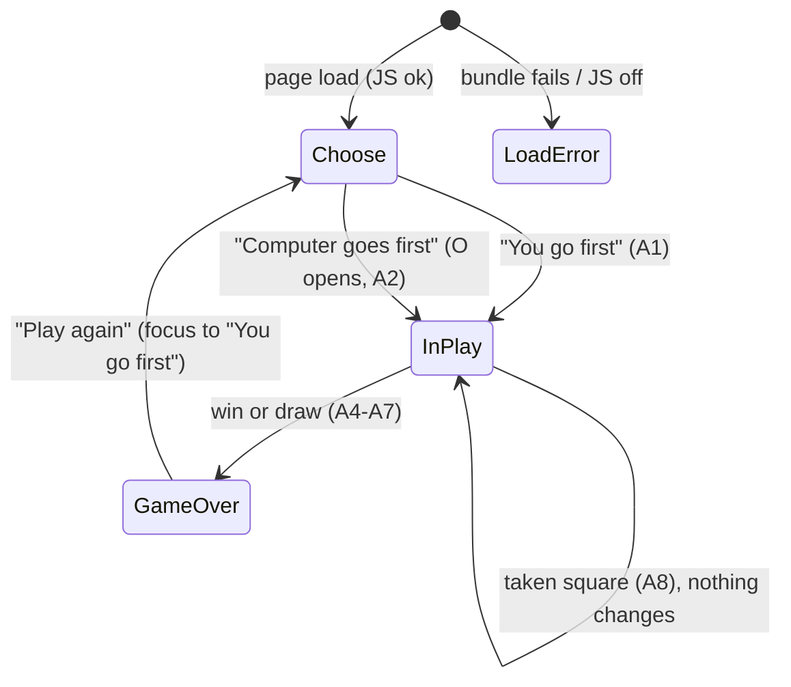
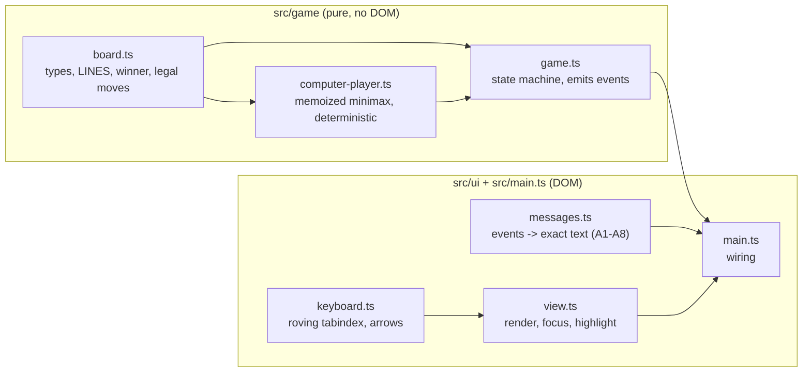
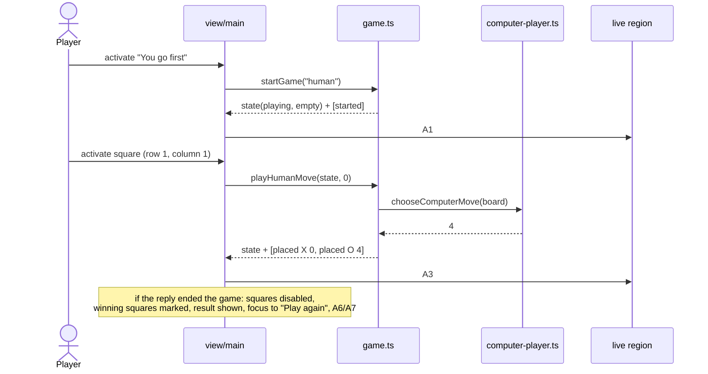
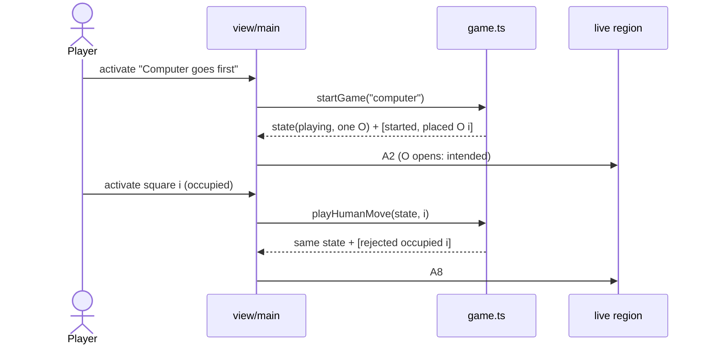
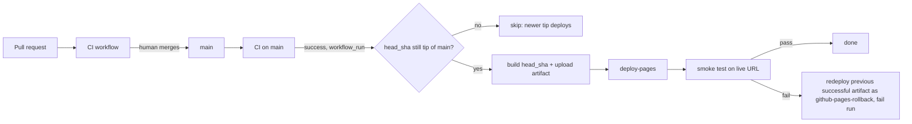

You are an independent second-opinion reviewer in a software factory pipeline.
A different AI (Claude) produced the DRAFT below. Your job is to find what it got
wrong, what it missed, and where a materially better approach exists. Do not
rubber-stamp, and do not inflate: report only findings you would defend with
evidence (a line, an input that breaks it, a requirement it violates). Do not
rewrite the whole thing. Be specific and terse.

Review kind: feature
Reviewer: {{REVIEWER}}
Project: factory-tictactoe

Focus especially on: Is this UI spec complete and correct before coding (markup, state rendering, taken-status persistence, disabled vs aria-disabled, touch vs click tests), and does it leave F-007/F-008 room without rework?

Respond in EXACTLY this format (markdown):

## Verdict
Exactly one of:
- AGREE — no CRITICAL or HIGH findings.
- AGREE-WITH-CONCERNS — CRITICAL or HIGH findings that can be fixed within this approach.
- DISAGREE — the approach itself is wrong: you would redo it rather than patch it, and you describe what instead under Alternative.
Findings alone, however many or severe, never make a DISAGREE; they make AGREE-WITH-CONCERNS.
One sentence of justification.

## Findings
Number every finding C1, C2, … so the author can answer each one. One bullet each:
- [C1] [CRITICAL|HIGH|MEDIUM|LOW] <where> — <what is wrong> — <evidence> — <what to do instead>
(CRITICAL = will cause data loss, security hole, wrong behavior, or blocks the goal. Use it sparingly and only when sure.)

## Missing
Bullets: things the draft should address but doesn't. Empty if none.

## Alternative
If you would take a materially different approach, describe it in <=8 lines and say why it's better. Otherwise write "None".

## Questions for the human
Bullets: decisions only the product owner can make. Empty if none.

=== CONTEXT (read-only, for reference) ===

--- .factory/acceptance.md ---
# Acceptance criteria: factory-tictactoe

_Traces to: `.factory/prd.md`. Every criterion is written to be checked by an automated test (Vitest unit tests, Playwright end-to-end tests, or a CI script), except where it says "verified in deploy phase"._

## Conventions used below

- Squares are numbered by **row 1–3 (top to bottom)** and **column 1–3 (left to right)**.
- `{R}`, `{C}` are the row and column of the human's move; `{R2}`, `{C2}` are those of the computer's move.
- `{LINE}` is one of: `row 1`, `row 2`, `row 3`, `column 1`, `column 2`, `column 3`, `the diagonal from top left to bottom right`, `the diagonal from top right to bottom left`.

### Announcement text (exact, used by R-002, R-004, R-005, R-008)

| ID | When | Exact live-region text |
|---|---|---|
| A1 | Game starts, human first | `New game. You go first. You are X. Your turn.` |
| A2 | Game starts, computer first | `New game. Computer goes first as O. Computer placed O in row {R2}, column {C2}. Your turn.` |
| A3 | Human moves, game continues | `You placed X in row {R}, column {C}. Computer placed O in row {R2}, column {C2}. Your turn.` |
| A4 | Human move wins (unreachable with a perfect computer, still defined) | `You placed X in row {R}, column {C}. You win with {LINE}.` |
| A5 | Human move fills the board with no winner | `You placed X in row {R}, column {C}. It's a draw.` |
| A6 | Computer move wins | `You placed X in row {R}, column {C}. Computer placed O in row {R2}, column {C2}. Computer wins with {LINE}.` |
| A7 | Computer move fills the board with no winner | `You placed X in row {R}, column {C}. Computer placed O in row {R2}, column {C2}. It's a draw.` |
| A8 | Human activates an occupied square | `Row {R}, column {C} is taken. Choose an empty square.` |

Square accessible names: `Row {R}, column {C}, empty` / `Row {R}, column {C}, X` / `Row {R}, column {C}, O`.

## R-001 Board and legal moves

- **Given** a game in progress with the human to move, **when** the human activates an empty square, **then** exactly that square shows X and no other square changes before the computer's reply.
- **Given** a game in progress, **when** the human activates a square showing X or O, **then** the board is unchanged and it is still the human's turn.
- **Given** the game state module, **when** a human move is submitted while it is the computer's turn or after the game has ended, **then** the move is rejected and the returned state equals the input state (unit test).

### Unhappy paths

- **Given** the first-mover choice has not been made, **when** the player clicks, taps or presses Enter on any square, **then** nothing is placed (squares are disabled).
- **Given** JavaScript is disabled, **when** the page loads, **then** a visible message says the game needs JavaScript (Playwright with `javaScriptEnabled: false`).
- **Given** JavaScript is enabled but the JavaScript bundle request fails (Playwright aborts it), **when** the page loads, **then** the visible message "The game didn't load. Try reloading the page." is shown (tested against the production build in `dist/`, not the dev server); **and given** the bundle loads normally, **then** that message is never visible at any point during the load (it ships `hidden`).
- **Given** the production build, **when** start-up throws (the Playwright test serves `index.html` with the board's root element removed, so `main.ts` fails to find it), **then** the same load-error message is shown.

## R-002 First-mover choice

- **Given** a fresh page load, **when** it renders, **then** two controls "You go first" and "Computer goes first" are visible, the board is empty, and no control to choose a symbol exists.
- **Given** the choice is shown, **when** the player chooses "You go first", **then** the board is empty, it is the human's turn as X, and the live region reads A1.
- **Given** the choice is shown, **when** the player chooses "Computer goes first", **then** exactly one square shows O, no square shows X, and the live region reads A2 naming that square.
- **Given** any game, **when** squares are filled, **then** every human-placed mark is X and every computer-placed mark is O, regardless of who started.

## R-003 Perfect, never-losing computer

- **Given** both starting sides, **when** a test enumerates every legal human move at every position where it is the human's turn and applies the computer's chosen reply at every position where it is the computer's turn, **then** no reachable finished game is a human (X) win, and the test reports the number of finished games examined (greater than 0) for each starting side.
- **Given** a position where the computer can complete three in a row, **when** it chooses a move, **then** it completes the line (unit test over all such reachable positions).
- **Given** the same position twice, **when** the computer chooses a move, **then** it returns the same square both times (deterministic).
- **Given** successive games in one process with alternating starters (human, computer, human, …), **when** the exhaustive enumeration runs for each, **then** results are identical to running each starter in a fresh process (the memo stays valid across starters).
- **Given** CI, **when** the unit-test job runs, **then** the exhaustive test runs on every push and pull request and finishes in under 60 seconds.

## R-004 Win and draw detection with result message

- **Given** each of the 8 lines filled with X, and separately with O, **when** the board is evaluated, **then** the winner is that symbol and the line is identified (unit test, 16 cases).
- **Given** a full board with no three in a row, **when** it is evaluated, **then** the result is a draw.
- **Given** a move that wins or fills the board, **when** it is applied, **then** the game ends, all squares become disabled, and the visible result text contains "Computer wins", "You win" or "It's a draw" accordingly, and the live region reads A4, A5, A6 or A7 accordingly.

## R-005 Winning line highlight

- **Given** a game the computer has won, **when** the result is shown, **then** exactly the three squares of the winning line are marked as winning and each of them differs from non-winning squares in at least one non-colour computed style (border width or style, outline, or text decoration) or carries an overlaid line element.
- **Given** a game the computer has won, **when** the result is shown, **then** the visible result text and the live region both name the line using `{LINE}` wording.
- **Given** a drawn game, **when** the result is shown, **then** no square is marked as winning.

## R-006 Play again

- **Given** a finished game, **when** the result is shown, **then** a "Play again" button is visible and has keyboard focus.
- **Given** a game in progress, **when** the page is inspected, **then** no "Play again" button is visible.
- **Given** a finished game, **when** the player activates "Play again", **then** the board is empty, the first-mover choice is shown, and focus is on "You go first".

## R-007 Keyboard-only play

- **Given** a fresh page, **when** a Playwright test plays a complete game using only Tab, Shift+Tab, arrow keys, Enter and Space (no pointer events), choosing "You go first", **then** the game reaches a result and "Play again" can be activated from the keyboard to start a second game choosing "Computer goes first", which also reaches a result.
- **Given** the board has focus, **when** an arrow key is pressed, **then** focus moves one square in that direction, stays put at the board edge, and exactly one square is in the Tab order at any time.
- **Given** a square has focus, **when** Enter or Space is pressed on an empty square, **then** X is placed there.
- **Given** the first-mover choice, **when** the player chooses "You go first", **then** focus is on row 1, column 1; **and when** the player chooses "Computer goes first", **then** focus is on the first empty square in reading order (row 1, column 2 after the opening O at row 1, column 1).
- **Given** any focused control, **when** its computed style is read, **then** it has a visible focus indicator with an outline or border at least 2 CSS px wide.

## R-008 Screen-reader announcements

- **Given** each situation A1–A3 and A5–A8, **when** it occurs in a Playwright test, **then** the live region (`role="status"`, polite) text equals the exact string in the announcement table, with placeholders filled.
- **Given** A4 (human win), which the real opponent makes unreachable, **when** a unit test drives the game state machine with an injected opponent that loses and passes the events to the message builder, **then** the text equals A4 exactly; the production bundle contains no way to inject an opponent.
- **Given** any board state, **when** the squares are inspected, **then** each square's accessible name matches `Row {R}, column {C}, empty|X|O` for its current content.
- **Given** a human move, **when** the computer replies, **then** a single announcement covers both moves (the live region is updated once per human action).

## R-009 WCAG 2.2 AA and zero axe violations

- **Given** each game state (choice shown, game in progress, computer won, draw), **when** axe-core runs with tags `wcag2a`, `wcag2aa`, `wcag21a`, `wcag21aa` and `wcag22aa` in Chromium, Firefox and WebKit, **then** it reports 0 violations.
- **Given** the page, **when** it loads, **then** it has a `lang` attribute, a descriptive `<title>`, one `h1`, and the board is exposed as a labelled group.

## R-010 Responsive layout for touch and mouse

- **Given** viewports of 320×568, 390×844 and 1280×800 CSS px, **when** the page is shown in each game state, **then** `document.documentElement.scrollWidth` does not exceed the viewport width and all nine squares and both choice buttons are fully visible without scrolling horizontally.
- **Given** those viewports, **when** the bounding boxes of the squares and buttons are measured, **then** each is at least 44×44 CSS px.
- **Given** a touch-enabled phone emulation, **when** the player taps "You go first" and then an empty square, **then** X is placed there.
- **Given** a desktop viewport, **when** the player clicks "You go first" and then an empty square, **then** X is placed there.
- **Given** viewports of 320×568 and 1280×800 at default text size, **when** the page moves through the choose state, play (including a taken-square message and the longest computer-move status), and the game-over state, **then** the board's bounding box (x, y, width, height) is identical in every state. At 200% text zoom reflow takes priority and this check does not apply.

## R-011 Bundle size

- **Given** a production build, **when** the CI size check sums the gzipped size of every JavaScript file in `dist/`, **then** the total is under 51,200 bytes, and the check fails the build otherwise.

## R-012 No tracking, storage or third-party requests

- **Given** a Playwright test that records every network request while loading the page and playing a full game, **when** the game ends, **then** every request went to the page's own origin.
- **Given** the same full game, **when** it ends, **then** `document.cookie` is empty and `localStorage.length` and `sessionStorage.length` are 0.
- **Given** the built `dist/` output, **when** it is scanned, **then** it contains no script, link or iframe pointing to another origin.

## R-013 Plain, high-contrast, system fonts

- **Given** the page, **when** the computed `font-family` of the body is read, **then** it begins with `system-ui`, and no font files are requested during a full game.
- **Given** the design tokens, **when** a unit test computes the contrast of every text colour against its background, **then** each ratio is at least 7:1, and every non-text indicator (square borders, focus ring, winning-line marker) is at least 3:1 against its background.

## R-014 Deploy to GitHub Pages with smoke test and minimal rollback

- **Given** a merge to main whose CI passes and which is still the latest commit on main, **when** the deploy workflow runs, **then** it builds exactly that commit (`workflow_run.head_sha`) and publishes it to GitHub Pages. The smoke test waits up to 3 minutes until the live page's `build-id` meta equals that SHA, then chooses "You go first", places one X, sees the computer's O, and passes. _Verified in deploy phase._
- **Given** CI passes for a commit that is no longer the latest commit on main, **when** its deploy run acquires the concurrency slot, **then** it skips without deploying. _Verified in deploy phase._
- **Given** deploy runs that overlap (one running, the latest commit's run queued, and an older commit's run queued after it), **when** they are processed, **then** none of them is discarded (`queue: max`, first in, first out), the older one skips as stale, and the latest commit ends up live. _Verified in deploy phase; the workflow's concurrency block is checked statically in CI._
- **Given** a manual `workflow_dispatch` run, **when** main's CI for its tip is pending or failed, **then** the run refuses to deploy and fails with a message. _Verified in deploy phase._
- **Given** a deploy whose smoke test fails (forced by the workflow's manual `force_smoke_failure` input), **when** the rollback job runs, **then** it redeploys, unchanged, the Pages artifact of the latest deploy run whose deploy and smoke jobs both succeeded (a stale no-op run in between is never chosen), under the artifact name `github-pages-rollback`, does nothing else, and the workflow run concludes as failed so GitHub emails the repo owner. _Verified in deploy phase._
- **Given** no previous successful deploy run exists, or its artifact has expired, **when** the smoke test fails, **then** the rollback job logs that no previous artifact is available and the run fails. _Verified in deploy phase._

## R-015 Browser coverage

- **Given** the Playwright configuration, **when** CI runs the end-to-end suite, **then** every spec runs in five projects — Chromium, Firefox, WebKit, a touch-enabled Android phone emulation (Chromium) and a touch-enabled iPhone emulation (WebKit) — and all pass.
- **Given** the production build, **when** Vite builds it, **then** its build target covers the current and previous versions of Chrome, Firefox, Safari and Edge and iOS Safari (build target `es2022`, supported by all of them).

--- .factory/design/screens.md ---
# Screens: factory-tictactoe

_Traces to: `.factory/prd.md` §6 (Flows A and B, unhappy paths), `.factory/acceptance.md`, `design-system.md`, `tokens.json`. One page with three states. Mockups are static HTML (`screens/*.html`), each showing every variant at 320 px and 760 px wide. Status: draft_

## Index

| Screen | File | Flow | Requirements | Components used | Notes |
|---|---|---|---|---|---|
| 1. Choose who goes first | `screens/game-01-choose-first.html` | A and B step 1; after Play again | R-001, R-002, R-006, R-007, R-010, R-012, R-013 | Title, status line, board (disabled squares), action area with choice button ×2, announcer, fallback message | Variants: 1a default (focus on "You go first" after Play again); 1b load error (hidden by default, revealed only on a script error); 1c JavaScript off (`noscript`). The empty disabled board is the empty state. No symbol picker. |
| 2. In play | `screens/game-02-in-play.html` | A steps 2–5; B steps 2–3 | R-001, R-002, R-003, R-007, R-008, R-009, R-010 | Title, status line, board (active and occupied squares, roving focus), action area with keyboard hint, announcer | Variants: 2a you first, empty board (A1); 2b computer first, O opens at row 1, column 1, focus on row 1, column 2 (A2); 2c mid-game after a move (A3); 2d taken square (A8). The visible status names the computer's last move. Always the human's turn when idle; no loading state (instant reply). Sample positions follow ADR-010 perfect play. |
| 3. Game over | `screens/game-03-game-over.html` | A steps 6–7 | R-004, R-005, R-006, R-007, R-008, R-009, R-010 | Title, status line, board (disabled, winning squares), action area with Play again button, announcer | Variants: 3a computer wins by diagonal (A6) with border, strike line and fill; 3b draw (A5/A7), no highlight; 3c computer wins by row (strike direction check). A4 "You win" is unreachable and not mocked; it uses the 3a layout with different words. |

## Navigation



## Focus map

| From | Action | Focus goes to |
|---|---|---|
| Fresh load | — | nothing (document start); Tab reaches "You go first" |
| Choose | either choice | first empty square in reading order (row 1, column 1 if you went first; row 1, column 2 after the computer's opening O) |
| In play | place X (game continues) | the square just played |
| In play | taken square | stays on that square (status keeps the taken message until the next valid move) |
| In play | move ends the game | "Play again" |
| Game over | "Play again" | "You go first" |

## Copy (exact; tests assert it)

- Title `h1`: "Tic-tac-toe". No tagline (the `<title>` carries "play against a computer that never loses").
- Status line: "Who goes first?" · "Your turn. You are X." · "Computer placed O in row R, column C. Your turn. You are X." (computer went first) · "Computer placed O in row R, column C. Your turn." · "Row R, column C is taken. Choose an empty square." · "Computer wins with {LINE}." · "It's a draw." · "You win with {LINE}."
- Keyboard hint (during play): "Arrow keys move between squares. Enter or Space places X."
- Buttons: "You go first" · "Computer goes first" · "Play again".
- Fallbacks: load error "The game didn't load. Try reloading the page." · `noscript` "This game needs JavaScript, which is turned off in this browser. Turn it on and reload the page."
- Announcer: A1–A8 exactly as in `acceptance.md`.

## Later (not designed; PRD non-goals)

Tally, symbol choice, difficulty, hot-seat, undo, history, rules page, themes/dark mode, sound, animation, translations.

## Refinements from the design review (now in the specification)

The approver chose option (a) on 2026-09-27. Both refinements are now in `architecture.md` §2 and §5 and in `acceptance.md` (R-001, R-007, R-010).
1. **Focus after a choice** goes to the first empty square in reading order, not always row 1, column 1 (architecture §5), because the computer's opening O sits there.
2. **Load-error fallback** is hidden by default and revealed only on a script error, with new wording (architecture §2 said a visible static message removed on start, which would flash on every load).

## Verification (now acceptance criteria R-010 and R-001)

- **The board never moves.** At 320 × 568 and 1280 × 800 at default text size, the board's bounding box is identical in choose, in play (including a taken-square message and the longest computer-move status), and game-over states. At 200% text zoom, reflow takes priority and the board may shift; that is accepted.
- **Load error.** Aborting the bundle request shows "The game didn't load. Try reloading the page."; a normal load never shows it, not even briefly.

## Sample games (checked against ADR-010 perfect play)

- 2c/2d: X r1c1 → O r2c2 → X r3c3 → O r1c2.
- 3a: X r1c1 → O r2c2 → X r1c2 → O r1c3 → X r2c1 → O r3c1 (diagonal from top right).
- 3b: X r1c1 → O r2c2 → X r1c2 → O r1c3 → X r3c1 → O r2c1 → X r2c3 → O r3c2 → X r3c3 (draw).
- 3c: X r1c1 → O r2c2 → X r3c1 → O r2c1 → X r1c2 → O r2c3 (row 2).
- Computer opening: r1c1.

--- .factory/design/design-system.md ---
# Design System: factory-tictactoe

_Traces to: `.factory/prd.md` (users, flows), `intent.constraints.quality_standards`, `intent.design` (plain, high-contrast, system fonts, no brand). Tokens live in `tokens.json`; this file explains them. Status: draft_

## 1. Principles

- **Nothing between the player and the first move.** The primary persona has two minutes, so the page is one centred column: title, status line, board, action area. No tagline, chrome, nav or footer links. (R-002, persona)
- **The board never moves.** The status line and the action area below the board reserve their height, so a tap never lands on something that just shifted. (R-010, UX review)
- **Plain and high-contrast, not decorative.** Near-black on white, one dark blue for actions and focus, all text at 7:1 or more. No brand, no web fonts, no shadows, no animation. (R-013, intent.design)
- **Every state is visible, sayable and reachable.** Whatever happens (whose turn, where the computer just played, a taken square, the result, the winning line) is shown in the visible status, spoken by the announcer, and reachable by keyboard. (R-005, R-007, R-008)
- **Marks are letters, not colours.** X and O use the same colour and differ by shape, and the winning line is shown by border weight and a strike line, not by colour alone. (R-005, WCAG 1.4.1)

## 2. Color

Light only: themes and dark mode are out of scope (PRD non-goals), so there are no dark values. Ratios were computed with the WCAG relative-luminance formula; the R-013 unit test recomputes them from `tokens.json`.

| Role | Light | Dark | Used for | Contrast vs surface |
|---|---|---|---|---|
| surface | #ffffff | n/a (out of scope) | page background, active squares | — |
| surface-sunken | #f2f2f2 | n/a | disabled squares (before choice, after game over) | — |
| text | #111111 | n/a | title, status, marks X/O | 18.88:1 on surface; 16.87:1 on surface-sunken; 16.81:1 on win-surface |
| text-muted | #3d3d3d | n/a | keyboard hint | 10.86:1 on surface |
| primary | #0b3d91 | n/a | button fill | on-primary text 10.04:1; fill vs surface 10.04:1 |
| on-primary | #ffffff | n/a | button labels | 10.04:1 on primary |
| border | #3d3d3d | n/a | active square outline (2px) | 10.86:1 on surface (≥ 3:1 non-text) |
| border-disabled | #595959 | n/a | disabled square outline (2px) | 6.26:1 on surface-sunken; 7.00:1 on surface |
| focus | #0b3d91 | n/a | focus ring (3px, 2px offset) | 10.04:1 on surface; 8.97:1 on surface-sunken |
| win-surface | #fff3b0 | n/a | winning squares background (supporting cue only) | text 16.81:1 on it |
| win-marker | #111111 | n/a | winning border (4px) and strike line (6px) | 16.81:1 on win-surface (≥ 3:1 non-text) |

There are no success/warning/danger colours. The game has no error styling: a taken square is reported in the status line in normal text. Rule: screens use roles only, never raw hex.

## 3. Typography

| Token | Size / line | Weight | Used for |
|---|---|---|---|
| display | 1.75rem / 1.2 | 700 | page title "Tic-tac-toe" (the one `h1`) |
| status | 1.125rem / 1.4 | 700 | status line: whose turn, taken square, result |
| body | 1rem / 1.5 | 400 | button labels (700) |
| small | 0.875rem / 1.4 | 400 | keyboard hint under the board |
| mark | clamp(2rem, 18cqi, 4rem) / 1 | 700 | X and O inside squares (cqi of the board container) |

Font stack: `system-ui, -apple-system, 'Segoe UI', Roboto, 'Helvetica Neue', Arial, sans-serif`. Nothing is loaded from the network (R-012, R-013). Sizes are in `rem`, so browser text zoom works; the layout reflows at 200% zoom and at 320 px wide (WCAG 1.4.4, 1.4.10).

## 4. Spacing, radius, elevation, motion

- **Spacing** (4-based): 4 / 8 / 12 / 16 / 24 px. Page padding is 16 px on phones and 24 px from 480 px up. Title, status, board and action area are 16 px apart. The gap between squares is 8 px.
- **Radius:** 4 px on squares and 8 px on buttons, only enough to avoid harshness.
- **Elevation:** none. Everything is flat. The only `box-shadow` is the 2 px inset hover ring on empty squares, which acts as a border, not elevation.
- **Motion:** none. State changes are instant (PRD open question 2: instant reply; animations beyond basics are a non-goal), so reduced-motion needs no special handling.
- **Sizes:** the page column is at most 28rem wide. The board is `min(100%, 360px, 50svh)` square, so at 320 px wide each square is about 90 px (smaller on short phones, never below 44 px), and on desktop 114 px. The status line reserves 3 lines below 480 px and 2 above. The action area reserves 100 px below 480 px (two stacked buttons) and 44 px above. So title, status, board and "Play again" fit on a 320 × 568 phone without the board moving. The minimum target is 44 × 44 px (R-010).

## 5. Components

### Choice button ("You go first" / "Computer goes first")
- **Purpose:** start a game and pick who moves first (R-002).
- **Variants:** one style; both choices are equal, so neither is visually preferred. They sit in the action area **below the board**, side by side, or stacked if they don't fit at 320 px.
- **States:** default (primary fill, on-primary label) · hover (underlined label) · focus-visible (3px focus ring, 2px offset) · active (same as hover). There are no disabled or loading states: the buttons only exist while choosing.
- **Anatomy:** native `<button type="button">` with a visible text label, at least 44 px tall, inside `div role="group" aria-label="Who goes first"`.
- **Do / Don't:** do keep the wording exact (tests assert it). Don't add icons or a symbol picker (a non-goal).

### Play again button
- **Purpose:** return to the choice after a game ends (R-006).
- **States:** as the choice button. It exists only in the game-over state and receives focus when it appears.
- **Do / Don't:** do place it in the action area under the board, full action-area width. Don't show it during play (PRD open question 1: no).

### Board square
- **Purpose:** show a cell and accept a move (R-001, R-007).
- **Variants:** empty · X · O.
- **States:**
  - *disabled* (before choice and after game over): `disabled` attribute, surface-sunken fill, border-disabled outline, out of the Tab order; marks stay in text colour.
  - *active empty* (during play): surface fill, border, pointer cursor.
  - *occupied during play*: `aria-disabled="true"`, same look as active but no pointer cursor; still focusable.
  - *hover* (active empty only): 2px inset ring in text colour (drawn with an inset box-shadow).
  - *focus-visible*: 3px focus ring, 2px offset. Exactly one square has `tabindex="0"`.
  - *winning*: `data-winning="true"`, win-surface fill, 4px win-marker border, plus a 6px strike line through the square's centre in the line's direction (`data-line="row|column|diagonal-down|diagonal-up"`), so the three squares form one continuous strike. The mark has a win-surface patch behind it so the O stays legible over the line.
- **Anatomy:** native `<button>` with accessible name `Row R, column C, empty|X|O`. The visible mark is `aria-hidden` because the name already carries it.
- **Do / Don't:** do keep X and O the same colour. Don't show the winning line by colour only.

### Board
- **Purpose:** the 3 × 3 grid (R-001).
- **Anatomy:** `div role="group" aria-label="Board"`, a CSS grid of 3 × 3 with 8 px gaps and a square aspect ratio. It is a size container (`container-type: inline-size`) so the marks scale with it. During play it has `aria-describedby="hint"`.
- **Keyboard:** roving tabindex; arrow keys move one square and stop at the edges; Enter/Space activate (ADR-012).

### Status line
- **Purpose:** visible text for the current state (R-004, R-005, R-008).
- **Content:**
  - choosing: "Who goes first?"
  - playing, you went first: "Your turn. You are X."
  - playing, computer went first: "Computer placed O in row R, column C. Your turn. You are X."
  - playing, after a move: "Computer placed O in row R, column C. Your turn."
  - taken square: "Row R, column C is taken. Choose an empty square." (It stays until the next valid move; moving focus does not clear it.)
  - over: "Computer wins with {LINE}." / "It's a draw." / "You win with {LINE}." (the last is unreachable)
- **Anatomy:** a `<p id="status">` in status type, with a reserved height of 3 lines below 480 px and 2 above. It is **not** a live region; the separate announcer is (below), which prevents double announcements.

### Keyboard hint
- **Purpose:** make the arrow-key model discoverable (R-007; Codex design review C2).
- **Content:** "Arrow keys move between squares. Enter or Space places X."
- **Anatomy:** `<p id="hint">` in small, text-muted type in the action area during play only. The board references it with `aria-describedby`.

### Announcer (visually hidden)
- **Purpose:** the exact spoken texts A1–A8 (R-008).
- **Anatomy:** `div role="status"` with the `visually-hidden` utility (clip-path pattern, not `display:none`), present in the page from load (included in every mockup). It is written once per action: cleared, then set on the next frame, so a repeated message (A8 twice) is spoken again.
- **Mockups:** shown as a dashed annotation box labelled "Screen reader hears", which is not part of the real UI.

### Fallback message
- **Purpose:** explain a failed load (R-001 unhappy paths).
- **Variants:**
  - `<noscript>`: "This game needs JavaScript, which is turned off in this browser. Turn it on and reload the page."
  - Load error: "The game didn't load. Try reloading the page." It is in `index.html` with `hidden`. It is revealed by a tiny inline capture-phase `error` listener in `index.html` (independent of the bundle, and it survives the Vite build) when the script fails to load, or by `main.ts` if it throws while starting (architecture §2). It never flashes on a normal load and never shows next to the `<noscript>` message.
- **Anatomy:** a `<p>` in status type (text colour, bold), in place of the board and action area.

## 6. Patterns

- **Forms & validation:** there are none. The only "invalid input" is a taken square, handled as a status message. There is no error colour and no dialog.
- **Empty state:** the empty disabled board under the choice shows what the game is before it starts.
- **Loading:** none in normal use; the bundle is tiny and the computer replies instantly. Nothing is shown while loading (no false error); the load-error message appears only on an actual failure.
- **Destructive actions:** none. "Play again" appears only after a game ends, so nothing is lost and no confirmation is needed.
- **Navigation:** none; a single page.
- **Responsive:** one fluid column from 320 px up, with one breakpoint at 480 px: page padding 16 → 24 px, status reserve 3 → 2 lines, action-area reserve 100 → 44 px. The board is `min(100%, 360px, 50svh)`. Choice buttons wrap to a column when they don't fit side by side.
- **Layout order:** title → status → board → action area (choice / keyboard hint / Play again). The mockups use `@container` on the frame to simulate the 480 px breakpoint; the implementation uses `@media (min-width: 480px)`.

## 7. Accessibility

- **Standard:** WCAG 2.2 AA (hard constraint). Text contrast is at least 7:1 and non-text at least 3:1, as a house rule above AA (R-013).
- **Keyboard model:** Tab reaches the board's one roving square during play (the disabled board is skipped otherwise), then the action area (the choice buttons, or "Play again"). Arrow keys work within the board; Enter/Space place a mark. The visible keyboard hint explains this.
- **Focus rules:**
  - after a choice → the first empty square in reading order (row 1, column 1 if you went first; row 1, column 2 if the computer opened there)
  - after a move → stays on the square played
  - on game over → "Play again"
  - after "Play again" → "You go first"
  - focus is never lost to `body`
- **Focus visibility:** 3px `focus` ring with a 2px offset on every interactive element. It is never removed (WCAG 2.4.7) and never obscured (2.4.11); nothing overlaps the board.
- **Target size:** at least 44 × 44 px for squares and buttons (R-010; above the 2.5.8 minimum).
- **Colour independence:** marks are letters; winning is a border weight plus a strike line plus text; disabled is also conveyed by the attribute and status text.
- **Reduced motion:** there is no motion, so nothing to reduce.
- **Language and structure:** `lang="en"`, `<title>Tic-tac-toe: play against a computer that never loses</title>`, one `h1`, and a `main` landmark. (The mockup pages have an extra heading for the mockup chrome; the product has only one `h1`.)

## 8. Second-opinion summary

UX reviewer: REQUEST-CHANGES (1 high, 6 medium, 9 low), all fixed except two lows where no change is needed. Codex: first pass AGREE with 2 medium findings (both fixed); second pass AGREE with no findings and 2 missing items (both addressed). Details: `.factory/reviews/design-reconciliation.md`.

--- .factory/architecture.md ---
# Architecture: factory-tictactoe

_Traces to: `.factory/prd.md`, `.factory/acceptance.md`, `.factory/tech-stack.md`. Stack is committed (ADR-001 to ADR-008); this document does not revisit it._

## 1. Shape

A single static page: `index.html` + one CSS file + one ES module bundle built by Vite from strict TypeScript, published to GitHub Pages. No backend, no network calls at run time, no storage.

The code has two layers with a one-way dependency:

- **Game core** (`src/game/`): pure, DOM-free TypeScript. It holds all the rules, the perfect computer player, and the state transitions, and it emits *events* describing what happened. Vitest tests it exhaustively.
- **UI shell** (`src/ui/`, `src/main.ts`): renders state to the DOM, turns clicks, taps and keys into core calls, and turns core events into announcement text. Playwright and axe-core test it.



## 2. Components and responsibilities

| Component | File | Responsibility | Requirements |
|---|---|---|---|
| Board model | `src/game/board.ts` | `Mark = "X" \| "O"`, `Board` (9 cells, index 0–8 row-major), the 8 `LINES`, `findWinner(board)` returning winner and line, `isFull`, `emptySquares`, immutable `placeMark` | R-001, R-004 |
| Computer player | `src/game/computer-player.ts` | `chooseComputerMove(board): SquareIndex` (O is always to move when it is called) — full-depth minimax. A position's value is node-relative: `10 − plies to the end` for an O win, `plies to the end − 10` for an X win, `0` for a draw, so O wins sooner and never loses. Ties go to the lowest square index. Values are memoized in a module-level map keyed by **board + side to move**; because the values are node-relative they are valid across searches, games and starters (at most 2 × 3⁹ keys) | R-003 |
| Game state machine | `src/game/game.ts` | `startGame(firstMover)` and `playHumanMove(state, index)` return `{ state, events }`; the computer's reply is applied synchronously inside `playHumanMove`; illegal moves return the input state unchanged plus a `rejected` event. The opponent is a parameter that defaults to `chooseComputerMove`, so unit tests can inject a weak opponent to reach the otherwise unreachable human win (A4); the UI always uses the default | R-001, R-002, R-003, R-004, R-006 |
| Messages | `src/ui/messages.ts` | Pure `describeEvents(events): string` producing exact texts A1–A8; `squareLabel(index, mark)`; `describeLine(line)` | R-005, R-008 |
| View | `src/ui/view.ts` | Renders choice buttons, 9 square buttons, visible status/result, "Play again"; sets accessible names, `disabled` / `aria-disabled`, winning markers; moves focus per the rules below | R-001, R-002, R-004–R-007, R-009, R-010 |
| Keyboard | `src/ui/keyboard.ts` | Roving tabindex over the 3×3 grid; arrow keys move one square and stop at edges; Enter/Space are native button activation | R-007 |
| Wiring | `src/main.ts` | Holds the single current `GameState`, calls core, renders, writes the live region | all UI |
| Styles | `src/styles.css` | System font stack, high-contrast tokens (from design phase), 44 px minimum targets, fluid grid from 320 px, 2 px+ focus ring, non-colour winning marker | R-005, R-010, R-013 |
| Page | `index.html` | `lang="en"`, title, `h1`, live region; `<noscript>` message plus a load-error message ("The game didn't load. Try reloading the page.") that ships with the `hidden` attribute. It is revealed in two ways. (1) A small inline classic `<script>` in `index.html`, placed before the module script, registers a capture-phase `window` `error` listener that unhides the message when a `<script>` element fails to load. This is independent of the bundle, and survives the Vite build, which rewrites the module tag and would drop an `onerror` attribute (Codex rework review C1). (2) `main.ts` wraps start-up in `try/catch`, unhides the message on any exception, then rethrows so the error still reaches the console. It never flashes during a normal load and never shows next to the `<noscript>` message (design review, 2026-09-27); `<meta name="build-id">` set to the commit SHA at build time | R-001, R-008, R-009, R-014 |
| CI scripts | `scripts/check-bundle-size.mjs`, `scripts/check-dist-origins.mjs` | Gzip-sum JS in `dist/` under 51,200 bytes; scan `dist/` for other-origin script/link/iframe URLs | R-011, R-012 |

Filenames are kebab-case and identifiers follow the factory naming rules (standards §6), enforced by ESLint.

## 3. Data model

In memory only, discarded on reload (R-012).

```ts
type Mark = "X" | "O";                 // human is always X, computer always O (R-002)
type Cell = Mark | null;
type Board = readonly Cell[];          // length 9, row-major: index = (row-1)*3 + (column-1)
type Line = readonly [number, number, number];
type FirstMover = "human" | "computer";
type Result = { kind: "win"; winner: Mark; line: Line } | { kind: "draw" };
type GameState =
  | { phase: "choosing" }                                        // before each game
  | { phase: "playing"; board: Board; firstMover: FirstMover }    // always the human's turn when idle
  | { phase: "over"; board: Board; firstMover: FirstMover; result: Result };
type GameEvent =
  | { type: "started"; firstMover: FirstMover }
  | { type: "placed"; mark: Mark; index: number }
  | { type: "ended"; result: Result }
  | { type: "rejected"; reason: "occupied" | "not-playing"; index: number };
```

Because the computer replies synchronously, a `playing` state at rest is always the human's turn; "out of turn" (R-001) therefore reduces to "not in the `playing` phase". The unit tests exercise that case directly on the state machine.

## 4. Key flows

### Flow A: human goes first and makes a move



### Flow B: computer goes first, then the human activates an occupied square



## 5. Accessibility design

- The board is a `div role="group" aria-label="Board"` containing 9 native `<button>`s laid out by CSS grid. Buttons give Enter/Space activation and touch/click for free.
- Accessible name of each square: `Row R, column C, empty|X|O` (R-008).
- **Before a choice and after the game ends**, squares have the `disabled` attribute and are out of the Tab order. **During play**, exactly one square has `tabindex="0"` (roving); occupied squares are `aria-disabled="true"` but stay focusable, so arrow navigation passes through them and activating one announces A8.
- **Live region**: one visually hidden `div role="status"` (polite). It is written once per player action. To make a repeated identical message (such as A8 twice) announce again, the text is cleared and then set on the next animation frame.
- **Focus**: after a choice, focus goes to the first empty square in reading order (row 1, column 1 when the human starts; row 1, column 2 after the computer's opening O at row 1, column 1). This keeps the first Enter off a taken square (design review, 2026-09-27). After a move it stays on the square played. When the game ends, it moves to "Play again". After "Play again" it goes to "You go first".
- **Winning line**: `data-winning="true"` on the three squares. The style adds a thick border plus an overlaid strike line (not colour alone), and the text names the line (R-005).

## 6. Integration points and failure modes

| Integration | Used for | Failure mode | Handling |
|---|---|---|---|
| GitHub Actions: CI workflow (`ci.yml`, on push and pull request) | format check, lint, typecheck, unit + exhaustive tests, build, bundle-size and dist-origin checks, Playwright e2e + axe in 5 projects | Any job fails | PR cannot merge (humans merge; branch protection set in ship phase). Owner gets the failure email |
| GitHub Actions: deploy workflow (`deploy.yml`) | Triggered by `workflow_run` when CI completes successfully on `main`: checks out **`workflow_run.head_sha`** (not `GITHUB_SHA`), so it builds exactly the commit whose CI passed. **After acquiring the `pages` concurrency slot**, it checks that SHA is still the tip of `main`; if not, it skips (a no-op run), because the newer tip's own queued run will deploy it and it already contains this change. `workflow_dispatch` (with a `force_smoke_failure` input) resolves the current tip of `main`, verifies a successful CI run exists for that exact SHA, and refuses (fails with a message) if main's CI is pending or failed; otherwise it deploys that SHA the same way. Steps: build with `build-id` = SHA → `actions/upload-pages-artifact` (retention 90 days) → `actions/deploy-pages` → smoke → rollback if smoke fails | Build or deploy fails | Nothing changes on the live site; run fails; email |
| GitHub Pages | hosting at `https://onelifemedia.github.io/factory-tictactoe/` | Outage | Accepted: GitHub's uptime, no SLA (intent.operations) |
| Smoke test | Playwright against the live URL. It first polls, for up to 3 minutes, until the page's `build-id` meta equals the deployed SHA, so the old deployment cannot pass for the new one. Then it chooses "You go first", places X and sees O | Fails, or the build-id never appears | Rollback job (ADR-011). It finds the latest `deploy.yml` run on `main` whose **deploy and smoke jobs both concluded `success`** (checked per run through the jobs API; a stale no-op run whose deploy was skipped is never chosen, even though that run concluded successfully) and downloads its `github-pages` artifact (`actions/download-artifact` with `run-id` and `github-token`). It re-uploads the downloaded `artifact.tar` **unchanged under the distinct name `github-pages-rollback`**, so it never clashes with this run's `github-pages` artifact and the tar is not nested. It deploys with `actions/deploy-pages` (`artifact_name: github-pages-rollback`), then exits non-zero. If there is no such run, or its artifact has expired (more than 90 days since the last successful deploy), it logs that and exits non-zero. Nothing more. |

A run that rolled back concludes as failed, so it is never chosen as "previous successful" later. Deploy, smoke and rollback run in one workflow under `concurrency: { group: pages, queue: max, cancel-in-progress: false }`. With the default `queue: single`, GitHub keeps at most one pending run and cancels the older one when a new run queues. That can discard the latest commit's run (A running, C latest pending, older B's CI finishes last and replaces C, then B skips as stale), so the site would never get C (Codex plan review C1). With `queue: max`, up to 100 runs wait and are processed first in, first out; `queue: max` with `cancel-in-progress: true` is a validation error ([GitHub docs: control workflow concurrency](https://docs.github.com/en/actions/how-tos/write-workflows/choose-when-workflows-run/control-workflow-concurrency), verified 2026-09-27). Because the latest-commit check runs only after a run acquires the slot, every queued run either deploys the tip that CI verified or skips harmlessly. "Latest" is evaluated once, when the run acquires the slot. If main advances while that run is building or deploying, the newer commit's own run is already queued behind it and deploys next. Accepted limit (Codex rework review C1, 2026-09-27): if more than 100 deploy runs are pending at once, GitHub cancels the overflow, which could include the latest commit's run. With humans merging one pull request at a time this is not a realistic load, so it is documented rather than engineered around; the remedy is to re-run the deploy workflow for main's tip.

## 7. Deployment shape



Vite `base: "./"` makes asset URLs relative, so the site works under the `/factory-tictactoe/` path. The build target is `es2022`. Node 22 is pinned in `.nvmrc` and `engines`, and CI uses `actions/setup-node` with `node-version-file: .nvmrc`.

## 8. Test architecture

| Layer | Tool | What | Where |
|---|---|---|---|
| Unit | Vitest | board rules (16 win cases, draw), state machine incl. rejections, messages A1–A8, token contrast | `tests/unit/*.test.ts` |
| Exhaustive | Vitest | every human move sequence against the computer, both starting sides, run in one process one after the other (so the shared memo is exercised across starters); asserts 0 human wins and reports game counts; under 60 s | `tests/unit/never-loses.test.ts` |
| End-to-end + a11y | Playwright + @axe-core/playwright | A1–A3 and A5–A8 exact text (A4 is unreachable with the real opponent, so it is covered by unit tests with an injected opponent), keyboard-only games, blocked-bundle fallback, touch/click, exact live-region text, focus rules, layout/target sizes at 3 viewports, requests/cookies/storage, axe in 4 states | `tests/e2e/*.spec.ts`, 5 projects (ADR-008) |
| Build checks | Node scripts | bundle < 51,200 B gzipped; no other-origin URLs in `dist/` | `scripts/*.mjs` |
| Post-deploy | Playwright | wait for expected build-id, then smoke on live URL | `tests/smoke/*.spec.ts` (deploy workflow only) |

Every test file names the F-ID it covers (governance).

## 9. What we are deliberately not building

- No server, API, database, storage, cookies, service worker or PWA manifest.
- No framework runtime, router, state library or CSS framework.
- No analytics, error reporting SDK or third-party script of any kind.
- No difficulty levels, symbol choice, hot-seat mode, tally, undo, history, sound, themes, translations, rules page or custom domain.
- No artificial "thinking" delay or animation beyond basics (PRD open question 2 default).
- No rollback logic beyond "redeploy the previous successful artifact and fail the run".
- No real-device or manual screen-reader testing by the factory (QA report lists it as human follow-up).

--- src/ui/messages.ts ---
// F-005 (R-005, R-008): every word the game shows or announces. Pure, no DOM.
// Exact texts: acceptance.md "Announcement text" (A1–A8) and design/screens.md "Copy".
import type { BoardResult, Cell, Line } from "../game/board";
import type { GameEvent, GameState } from "../game/game";

const COLUMN_COUNT = 3;

/** "row R, column C" for a square index 0–8. */
export function describeSquare(index: number): string {
  const row = Math.floor(index / COLUMN_COUNT) + 1;
  const column = (index % COLUMN_COUNT) + 1;
  return `row ${String(row)}, column ${String(column)}`;
}

function capitalize(text: string): string {
  return text.charAt(0).toUpperCase() + text.slice(1);
}

/** Accessible name of a square: "Row R, column C, empty|X|O". */
export function squareLabel(index: number, cell: Cell): string {
  return `${capitalize(describeSquare(index))}, ${cell ?? "empty"}`;
}

/** The {LINE} wording, classified by the line's squares. */
export function describeLine(line: Line): string {
  const [first, second, third] = line;
  if (first === 0 && second === 4 && third === 8) {
    return "the diagonal from top left to bottom right";
  }
  if (first === 2 && second === 4 && third === 6) {
    return "the diagonal from top right to bottom left";
  }
  if (second - first === 1) {
    return `row ${String(Math.floor(first / COLUMN_COUNT) + 1)}`;
  }
  return `column ${String(first + 1)}`;
}

function describeResult(result: BoardResult): string {
  if (result.kind === "draw") {
    return "It's a draw.";
  }
  const winner = result.winner === "X" ? "You win" : "Computer wins";
  return `${winner} with ${describeLine(result.line)}.`;
}

function describeTakenSquare(index: number): string {
  return `${capitalize(describeSquare(index))} is taken. Choose an empty square.`;
}

/** The live-region text for one player action (A1–A8); "" when nothing is announced. */
export function describeEvents(events: readonly GameEvent[]): string {
  const sentences: string[] = [];
  let hasEnded = false;
  for (const event of events) {
    switch (event.type) {
      case "rejected":
        return event.reason === "occupied"
          ? describeTakenSquare(event.index)
          : "";
      case "started":
        sentences.push(
          event.firstMover === "human"
            ? "New game. You go first. You are X."
            : "New game. Computer goes first as O.",
        );
        break;
      case "placed":
        sentences.push(
          event.mark === "X"
            ? `You placed X in ${describeSquare(event.index)}.`
            : `Computer placed O in ${describeSquare(event.index)}.`,
        );
        break;
      case "ended":
        sentences.push(describeResult(event.result));
        hasEnded = true;
        break;
    }
  }
  if (sentences.length === 0) {
    return "";
  }
  if (!hasEnded) {
    sentences.push("Your turn.");
  }
  return sentences.join(" ");
}

/** The visible status line for the current state and the events that led to it. */
export function statusText(
  state: GameState,
  events: readonly GameEvent[],
): string {
  if (state.phase === "choosing") {
    return "Who goes first?";
  }
  if (state.phase === "over") {
    return describeResult(state.result);
  }
  const rejection = events.find((event) => event.type === "rejected");
  if (rejection) {
    return describeTakenSquare(rejection.index);
  }
  const hasJustStarted = events.some((event) => event.type === "started");
  const computerMoves = events.filter(
    (event): event is Extract<GameEvent, { type: "placed" }> =>
      event.type === "placed" && event.mark === "O",
  );
  const computerMove = computerMoves.at(-1);
  if (!computerMove) {
    return "Your turn. You are X.";
  }
  const placedText = `Computer placed O in ${describeSquare(computerMove.index)}.`;
  return hasJustStarted
    ? `${placedText} Your turn. You are X.`
    : `${placedText} Your turn.`;
}

--- src/game/game.ts ---
// F-004 (R-001, R-002, R-004, R-006): the game as a pure state machine.
// Each call returns the next state plus the events that describe what happened
// (ADR-009); the UI turns events into text and never inspects the rules.
import {
  createEmptyBoard,
  evaluateResult,
  placeMark,
  type Board,
  type BoardResult,
  type Mark,
} from "./board";
import { chooseComputerMove } from "./computer-player";

export type FirstMover = "human" | "computer";
export type Opponent = (board: Board) => number;
export type GameState =
  | { phase: "choosing" }
  | { phase: "playing"; board: Board; firstMover: FirstMover }
  | {
      phase: "over";
      board: Board;
      firstMover: FirstMover;
      result: BoardResult;
    };
export type GameEvent =
  | { type: "started"; firstMover: FirstMover }
  | { type: "placed"; mark: Mark; index: number }
  | { type: "ended"; result: BoardResult }
  | { type: "rejected"; reason: "occupied" | "not-playing"; index: number };
export interface GameStep {
  state: GameState;
  events: GameEvent[];
}

const HUMAN_MARK: Mark = "X";
const COMPUTER_MARK: Mark = "O";

export function resetToChoosing(): GameStep {
  return { state: { phase: "choosing" }, events: [] };
}

// Places one mark and settles the state: `over` with an `ended` event if that
// mark finished the game, otherwise still `playing`.
function applyMark(
  board: Board,
  firstMover: FirstMover,
  index: number,
  mark: Mark,
  events: GameEvent[],
): GameState {
  const nextBoard = placeMark(board, index, mark);
  events.push({ type: "placed", mark, index });
  const result = evaluateResult(nextBoard);
  if (result) {
    events.push({ type: "ended", result });
    return { phase: "over", board: nextBoard, firstMover, result };
  }
  return { phase: "playing", board: nextBoard, firstMover };
}

export function startGame(
  firstMover: FirstMover,
  opponent: Opponent = chooseComputerMove,
): GameStep {
  const events: GameEvent[] = [{ type: "started", firstMover }];
  const board = createEmptyBoard();
  if (firstMover === "human") {
    return { state: { phase: "playing", board, firstMover }, events };
  }
  const state = applyMark(
    board,
    firstMover,
    opponent(board),
    COMPUTER_MARK,
    events,
  );
  return { state, events };
}

/**
 * Plays X on `index` and, if the game continues, the opponent's O in the same
 * call. Illegal moves return the same state and a `rejected` event. An index
 * outside 0–8 is a programming error and throws (from placeMark).
 */
export function playHumanMove(
  state: GameState,
  index: number,
  opponent: Opponent = chooseComputerMove,
): GameStep {
  if (state.phase !== "playing") {
    return {
      state,
      events: [{ type: "rejected", reason: "not-playing", index }],
    };
  }
  if (state.board[index] != null) {
    return { state, events: [{ type: "rejected", reason: "occupied", index }] };
  }
  const events: GameEvent[] = [];
  const afterHuman = applyMark(
    state.board,
    state.firstMover,
    index,
    HUMAN_MARK,
    events,
  );
  if (afterHuman.phase !== "playing") {
    return { state: afterHuman, events };
  }
  const afterComputer = applyMark(
    afterHuman.board,
    afterHuman.firstMover,
    opponent(afterHuman.board),
    COMPUTER_MARK,
    events,
  );
  return { state: afterComputer, events };
}


=== DRAFT UNDER REVIEW: .factory/features/F-006.md ===
# F-006: Render the choice and board and play a game by click or tap

- **Milestone:** M3 · **Size:** M · **Requirements:** R-001, R-002, R-010 · **Depends on:** F-005
- **Screens:** `design/screens/game-01-choose-first.html` (1a), `design/screens/game-02-in-play.html` (2a–2d)
- **Components:** choice buttons, board group, square buttons (disabled, active and occupied states), status line, action area
- **Branch:** `factory/F-006-render-and-pointer-play`, stacked on `factory/F-005-messages` (PR #6)

## Acceptance criteria

1. Given a fresh load, when it renders, then "Who goes first?", the two choice buttons ("You go first", "Computer goes first") and an empty, disabled board are shown, and there is no symbol picker.
2. Given the choice, when the player clicks or taps "You go first", then the board is empty and active and the status reads "Your turn. You are X.". When the player chooses "Computer goes first", then exactly one O is shown (row 1, column 1) and the status reads "Computer placed O in row 1, column 1. Your turn. You are X.".
3. Given play, when the player clicks or taps an empty square, then exactly that square shows X, the computer's O appears, and the status names the O's square. When the player activates an occupied square, then the board is unchanged and the status shows "Row R, column C is taken. Choose an empty square." until the next valid move replaces it.
4. Given the choice has not been made, when the player clicks, taps or presses Enter on a square, then nothing is placed (the squares have the `disabled` attribute).
5. Given touch (the mobile projects) and mouse (the desktop projects), when tapping or clicking, then X is placed.

## Out of scope here (later features)

- The game-over presentation: the winning-line highlight and "Play again" (F-007). In this feature a finished game shows the result status with all squares disabled.
- Roving tabindex, arrow keys, the focus rules and the keyboard hint (F-008).
- The live region (F-009).
- The load-error and no-JavaScript messages (F-011).
- The board-stability check (F-010). The reserved heights are styled here, but F-010 asserts them.

## Markup and modules

- **`index.html`** (static): inside `main.page`:
  - `h1.title`
  - `p#status.status`
  - `div#board.board[role=group][aria-label="Board"]`
  - `div#actions.actions`
- **`src/ui/view.ts`:** `createGameView(elements, handlers)`, where `handlers = { onChooseFirstMover(firstMover), onSquareActivated(index) }`. It returns `{ render(state, status) }`.
  - It builds 9 `button.square` elements once (`type=button`, `data-index`). Each holds a `span.mark[aria-hidden=true]` for X or O, and has `aria-label` = `squareLabel(index, cell)`.
  - Choosing and over: every square gets `disabled`. Playing: occupied squares get `aria-disabled="true"` and stay clickable (a click gives the A8 status); empty squares get neither attribute.
  - The action area holds `div.choice[role=group][aria-label="Who goes first"]` with two `button.button` elements while choosing, and is empty otherwise. It is rebuilt only when the phase changes.
  - Status text goes through `textContent` only; there is no HTML injection anywhere.
- **`src/main.ts`:** holds the single current `GameState` (starting from `resetToChoosing()`) and wires the handlers to `startGame` and `playHumanMove`. When a step has events, the status becomes `statusText(state, events)`. When a step has no events, the status is kept. This is how the taken message stays until the next valid move.
- **`src/styles.css`:** the mockups' "product styles", using the F-001 token variables:
  - status and action areas reserve their heights (3 lines and 100 px below 480 px; 2 lines and 44 px from 480 px up)
  - the board is `var(--size-board-max)` and square, with 44 px minimum targets
  - square states: disabled, occupied (`aria-disabled`), and hover on empty squares
  - buttons, with a `:focus-visible` ring from `--a11y-focus-ring`
  - media queries at 480 px (the mockups used `@container` only to simulate this)

## Tests to write first (`tests/e2e/play-pointer.spec.ts`, all 5 projects)

- **Fresh load:** the status is "Who goes first?"; both buttons are visible; the 9 squares are empty and disabled; no element offers X or O as a choice.
- **You go first:** the status is "Your turn. You are X." and all 9 squares are enabled and empty. After a click or tap on row 1, column 1, that square shows X (its accessible name ends ", X"), exactly one O appears at row 2, column 2, and the status is "Computer placed O in row 2, column 2. Your turn.".
- **Computer goes first:** exactly one O at row 1, column 1, and the status names it.
- **Occupied square:** activating the O square leaves every square's content unchanged and shows the taken message. It is still shown after moving the pointer or focus elsewhere, and is replaced by the next valid move's status.
- **Disabled before the choice:** a forced click on a disabled square places nothing. Pressing Enter with a square targeted also places nothing.
- **Input method:** the helper uses `tap()` when the project has touch and `click()` otherwise; the test asserts which one ran.

## Approach

- **Separation:** `view.ts` never calls the game rules and `main.ts` never touches the DOM beyond `createGameView`, so the rules stay in the pure core and the text in `messages.ts` (ADR-009).
- **Rendering:** it updates attributes and text on persistent square elements instead of re-creating them. That keeps focus stable for F-008 and avoids layout shifts.
- **Robustness:** the status only changes when events arrive.

## Review outcome

_Filled after the second opinion on the diff._
=== END DRAFT ===
