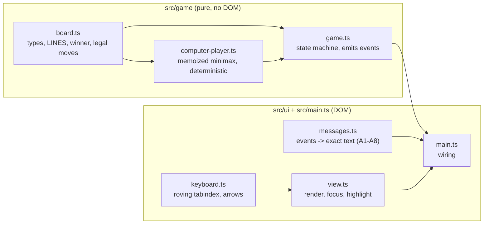
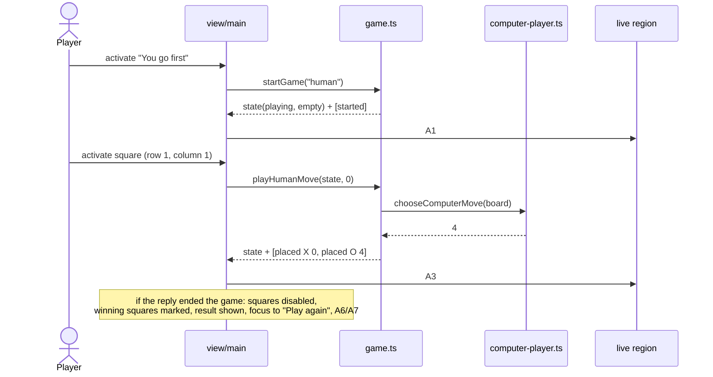
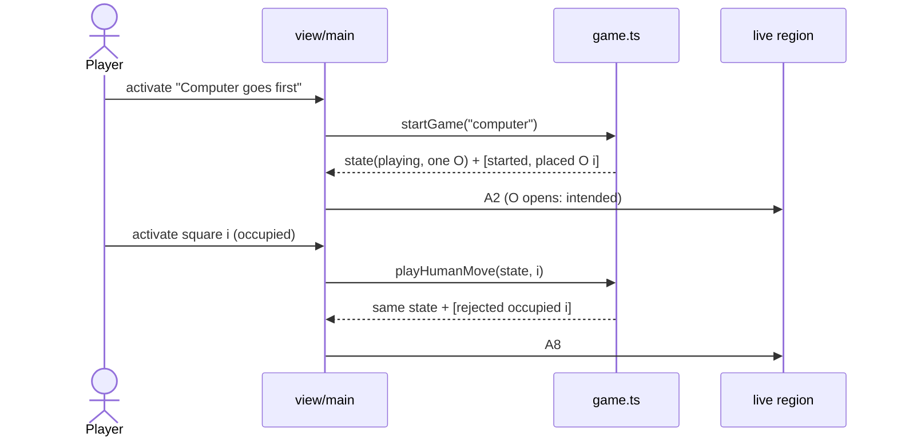
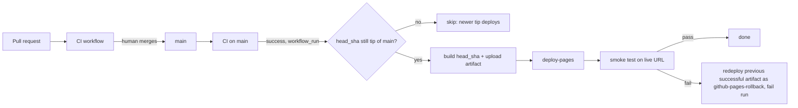

You are an independent second-opinion reviewer in a software factory pipeline.
A different AI (Claude) produced the DRAFT below. Your job is to find what it got
wrong, what it missed, and where a materially better approach exists. Do not
rubber-stamp, and do not inflate: report only findings you would defend with
evidence (a line, an input that breaks it, a requirement it violates). Do not
rewrite the whole thing. Be specific and terse.

Review kind: code
Reviewer: {{REVIEWER}}
Project: factory-tictactoe

Focus especially on: correctness against the acceptance criteria (fallback independent of the bundle, survives the Vite build, never flashes, rethrows), security of the inline script, and anything that will bite in production

Respond in EXACTLY this format (markdown):

## Verdict
Exactly one of:
- AGREE — no CRITICAL or HIGH findings.
- AGREE-WITH-CONCERNS — CRITICAL or HIGH findings that can be fixed within this approach.
- DISAGREE — the approach itself is wrong: you would redo it rather than patch it, and you describe what instead under Alternative.
Findings alone, however many or severe, never make a DISAGREE; they make AGREE-WITH-CONCERNS.
One sentence of justification.

## Findings
Number every finding C1, C2, … so the author can answer each one. One bullet each:
- [C1] [CRITICAL|HIGH|MEDIUM|LOW] <where> — <what is wrong> — <evidence> — <what to do instead>
(CRITICAL = will cause data loss, security hole, wrong behavior, or blocks the goal. Use it sparingly and only when sure.)

## Missing
Bullets: things the draft should address but doesn't. Empty if none.

## Alternative
If you would take a materially different approach, describe it in <=8 lines and say why it's better. Otherwise write "None".

## Questions for the human
Bullets: decisions only the product owner can make. Empty if none.

=== CONTEXT (read-only, for reference) ===

--- .factory/features/F-011.md ---
# F-011: Show a message when JavaScript is off or the game fails to load

- **Milestone:** M3 · **Size:** S · **Requirements:** R-001 (unhappy paths) · **Depends on:** F-006
- **Screens:** `design/screens/game-01-choose-first.html` (1b load error, 1c JavaScript off)
- **Components:** fallback message, noscript message
- **Branch:** `factory/F-011-load-error`, stacked on `factory/F-010-accessibility-and-layout` (PR #11)

## Acceptance criteria

1. Given JavaScript is disabled, when the page loads, then the noscript message "This game needs JavaScript, which is turned off in this browser. Turn it on and reload the page." is visible, and the load-error message is not.
2. Given the production build with the bundle request aborted, when the page loads, then "The game didn't load. Try reloading the page." is visible. This is revealed by the inline capture-phase error listener (architecture §2).
3. Given a normal load, when the page loads, then the load-error message is never visible at any point (it ships `hidden`).
4. Given `index.html` served without the board root, when `main.ts` starts, then it shows the load-error message and rethrows the error.

## Changes

- **`index.html`:**
  - `<noscript><p class="fallback">…</p></noscript>`.
  - `<p id="load-error" class="fallback" hidden>The game didn't load. Try reloading the page.</p>`, both inside `main` after the title.
  - A small inline **classic** `<script>` placed before the module script. It adds `window.addEventListener("error", handler, true)`, and the handler unhides `#load-error` when `event.target` is a `<script>` element (a resource load error). It is capture phase because resource `error` events don't bubble. It does not rely on an `onerror` attribute, which Vite's HTML build drops from the module tag (Codex rework review, architecture §2).
- **`src/main.ts`:** start-up (finding elements, creating the view and announcer, first render) moves into a `startApplication()` function called inside `try { … } catch (error) { reveal #load-error; throw error; }`, so the console still shows the error.
- **`src/styles.css`:** `.fallback` uses the status style (text colour, bold; design review).
- **No change to the dist-origin rule:** the inline script loads nothing (R-012 still holds; F-012 scans `dist/`).

## Tests to write first (`tests/e2e/load-error.spec.ts`, all 5 projects, against the production build served by `vite preview`)

- JavaScript disabled (`test.use({ javaScriptEnabled: false })` in its own describe): the noscript text is visible and `#load-error` is hidden.
- Bundle aborted (`page.route("**/assets/*.js", (route) => route.abort())`): the load-error text is visible and no squares are rendered.
- Normal load: a `MutationObserver` installed with `addInitScript` records whether `#load-error` ever lost `hidden` during the load. It never did, the game renders, and the message is still hidden.
- Start-up throws (`page.route("/", …)` serves `index.html` with the `id="board"` element removed): the load-error text is visible, and a `pageerror` whose message names `#board` was raised.

## Approach

Keep the fallback independent of the bundle. Revealing it is a single attribute change, and the text lives in static HTML so it works when nothing else does.

## Review outcome

_Filled after the second opinion on the diff._

--- .factory/architecture.md ---
# Architecture: factory-tictactoe

_Traces to: `.factory/prd.md`, `.factory/acceptance.md`, `.factory/tech-stack.md`. Stack is committed (ADR-001 to ADR-008); this document does not revisit it._

## 1. Shape

A single static page: `index.html` + one CSS file + one ES module bundle built by Vite from strict TypeScript, published to GitHub Pages. No backend, no network calls at run time, no storage.

The code has two layers with a one-way dependency:

- **Game core** (`src/game/`): pure, DOM-free TypeScript. It holds all the rules, the perfect computer player, and the state transitions, and it emits *events* describing what happened. Vitest tests it exhaustively.
- **UI shell** (`src/ui/`, `src/main.ts`): renders state to the DOM, turns clicks, taps and keys into core calls, and turns core events into announcement text. Playwright and axe-core test it.



## 2. Components and responsibilities

| Component | File | Responsibility | Requirements |
|---|---|---|---|
| Board model | `src/game/board.ts` | `Mark = "X" \| "O"`, `Board` (9 cells, index 0–8 row-major), the 8 `LINES`, `findWinner(board)` returning winner and line, `isFull`, `emptySquares`, immutable `placeMark` | R-001, R-004 |
| Computer player | `src/game/computer-player.ts` | `chooseComputerMove(board): SquareIndex` (O is always to move when it is called) — full-depth minimax. A position's value is node-relative: `10 − plies to the end` for an O win, `plies to the end − 10` for an X win, `0` for a draw, so O wins sooner and never loses. Ties go to the lowest square index. Values are memoized in a module-level map keyed by **board + side to move**; because the values are node-relative they are valid across searches, games and starters (at most 2 × 3⁹ keys) | R-003 |
| Game state machine | `src/game/game.ts` | `startGame(firstMover)` and `playHumanMove(state, index)` return `{ state, events }`; the computer's reply is applied synchronously inside `playHumanMove`; illegal moves return the input state unchanged plus a `rejected` event. The opponent is a parameter that defaults to `chooseComputerMove`, so unit tests can inject a weak opponent to reach the otherwise unreachable human win (A4); the UI always uses the default | R-001, R-002, R-003, R-004, R-006 |
| Messages | `src/ui/messages.ts` | Pure `describeEvents(events): string` producing exact texts A1–A8; `squareLabel(index, mark)`; `describeLine(line)` | R-005, R-008 |
| View | `src/ui/view.ts` | Renders choice buttons, 9 square buttons, visible status/result, "Play again"; sets accessible names, `disabled` / `aria-disabled`, winning markers; moves focus per the rules below | R-001, R-002, R-004–R-007, R-009, R-010 |
| Keyboard | `src/ui/keyboard.ts` | Roving tabindex over the 3×3 grid; arrow keys move one square and stop at edges; Enter/Space are native button activation | R-007 |
| Wiring | `src/main.ts` | Holds the single current `GameState`, calls core, renders, writes the live region | all UI |
| Styles | `src/styles.css` | System font stack, high-contrast tokens (from design phase), 44 px minimum targets, fluid grid from 320 px, 2 px+ focus ring, non-colour winning marker | R-005, R-010, R-013 |
| Page | `index.html` | `lang="en"`, title, `h1`, live region; `<noscript>` message plus a load-error message ("The game didn't load. Try reloading the page.") that ships with the `hidden` attribute. It is revealed in two ways. (1) A small inline classic `<script>` in `index.html`, placed before the module script, registers a capture-phase `window` `error` listener that unhides the message when a `<script>` element fails to load. This is independent of the bundle, and survives the Vite build, which rewrites the module tag and would drop an `onerror` attribute (Codex rework review C1). (2) `main.ts` wraps start-up in `try/catch`, unhides the message on any exception, then rethrows so the error still reaches the console. It never flashes during a normal load and never shows next to the `<noscript>` message (design review, 2026-09-27); `<meta name="build-id">` set to the commit SHA at build time | R-001, R-008, R-009, R-014 |
| CI scripts | `scripts/check-bundle-size.mjs`, `scripts/check-dist-origins.mjs` | Gzip-sum JS in `dist/` under 51,200 bytes; scan `dist/` for other-origin script/link/iframe URLs | R-011, R-012 |

Filenames are kebab-case and identifiers follow the factory naming rules (standards §6), enforced by ESLint.

## 3. Data model

In memory only, discarded on reload (R-012).

```ts
type Mark = "X" | "O";                 // human is always X, computer always O (R-002)
type Cell = Mark | null;
type Board = readonly Cell[];          // length 9, row-major: index = (row-1)*3 + (column-1)
type Line = readonly [number, number, number];
type FirstMover = "human" | "computer";
type Result = { kind: "win"; winner: Mark; line: Line } | { kind: "draw" };
type GameState =
  | { phase: "choosing" }                                        // before each game
  | { phase: "playing"; board: Board; firstMover: FirstMover }    // always the human's turn when idle
  | { phase: "over"; board: Board; firstMover: FirstMover; result: Result };
type GameEvent =
  | { type: "started"; firstMover: FirstMover }
  | { type: "placed"; mark: Mark; index: number }
  | { type: "ended"; result: Result }
  | { type: "rejected"; reason: "occupied" | "not-playing"; index: number };
```

Because the computer replies synchronously, a `playing` state at rest is always the human's turn; "out of turn" (R-001) therefore reduces to "not in the `playing` phase". The unit tests exercise that case directly on the state machine.

## 4. Key flows

### Flow A: human goes first and makes a move



### Flow B: computer goes first, then the human activates an occupied square



## 5. Accessibility design

- The board is a `div role="group" aria-label="Board"` containing 9 native `<button>`s laid out by CSS grid. Buttons give Enter/Space activation and touch/click for free.
- Accessible name of each square: `Row R, column C, empty|X|O` (R-008).
- **Before a choice and after the game ends**, squares have the `disabled` attribute and are out of the Tab order. **During play**, exactly one square has `tabindex="0"` (roving); occupied squares are `aria-disabled="true"` but stay focusable, so arrow navigation passes through them and activating one announces A8.
- **Live region**: one visually hidden `div role="status"` (polite). It is written once per player action. To make a repeated identical message (such as A8 twice) announce again, the text is cleared and then set on the next animation frame.
- **Focus**: after a choice, focus goes to the first empty square in reading order (row 1, column 1 when the human starts; row 1, column 2 after the computer's opening O at row 1, column 1). This keeps the first Enter off a taken square (design review, 2026-09-27). After a move it stays on the square played. When the game ends, it moves to "Play again". After "Play again" it goes to "You go first".
- **Winning line**: `data-winning="true"` on the three squares. The style adds a thick border plus an overlaid strike line (not colour alone), and the text names the line (R-005).

## 6. Integration points and failure modes

| Integration | Used for | Failure mode | Handling |
|---|---|---|---|
| GitHub Actions: CI workflow (`ci.yml`, on push and pull request) | format check, lint, typecheck, unit + exhaustive tests, build, bundle-size and dist-origin checks, Playwright e2e + axe in 5 projects | Any job fails | PR cannot merge (humans merge; branch protection set in ship phase). Owner gets the failure email |
| GitHub Actions: deploy workflow (`deploy.yml`) | Triggered by `workflow_run` when CI completes successfully on `main`: checks out **`workflow_run.head_sha`** (not `GITHUB_SHA`), so it builds exactly the commit whose CI passed. **After acquiring the `pages` concurrency slot**, it checks that SHA is still the tip of `main`; if not, it skips (a no-op run), because the newer tip's own queued run will deploy it and it already contains this change. `workflow_dispatch` (with a `force_smoke_failure` input) resolves the current tip of `main`, verifies a successful CI run exists for that exact SHA, and refuses (fails with a message) if main's CI is pending or failed; otherwise it deploys that SHA the same way. Steps: build with `build-id` = SHA → `actions/upload-pages-artifact` (retention 90 days) → `actions/deploy-pages` → smoke → rollback if smoke fails | Build or deploy fails | Nothing changes on the live site; run fails; email |
| GitHub Pages | hosting at `https://onelifemedia.github.io/factory-tictactoe/` | Outage | Accepted: GitHub's uptime, no SLA (intent.operations) |
| Smoke test | Playwright against the live URL. It first polls, for up to 3 minutes, until the page's `build-id` meta equals the deployed SHA, so the old deployment cannot pass for the new one. Then it chooses "You go first", places X and sees O | Fails, or the build-id never appears | Rollback job (ADR-011). It finds the latest `deploy.yml` run on `main` whose **deploy and smoke jobs both concluded `success`** (checked per run through the jobs API; a stale no-op run whose deploy was skipped is never chosen, even though that run concluded successfully) and downloads its `github-pages` artifact (`actions/download-artifact` with `run-id` and `github-token`). It re-uploads the downloaded `artifact.tar` **unchanged under the distinct name `github-pages-rollback`**, so it never clashes with this run's `github-pages` artifact and the tar is not nested. It deploys with `actions/deploy-pages` (`artifact_name: github-pages-rollback`), then exits non-zero. If there is no such run, or its artifact has expired (more than 90 days since the last successful deploy), it logs that and exits non-zero. Nothing more. |

A run that rolled back concludes as failed, so it is never chosen as "previous successful" later. Deploy, smoke and rollback run in one workflow under `concurrency: { group: pages, queue: max, cancel-in-progress: false }`. With the default `queue: single`, GitHub keeps at most one pending run and cancels the older one when a new run queues. That can discard the latest commit's run (A running, C latest pending, older B's CI finishes last and replaces C, then B skips as stale), so the site would never get C (Codex plan review C1). With `queue: max`, up to 100 runs wait and are processed first in, first out; `queue: max` with `cancel-in-progress: true` is a validation error ([GitHub docs: control workflow concurrency](https://docs.github.com/en/actions/how-tos/write-workflows/choose-when-workflows-run/control-workflow-concurrency), verified 2026-09-27). Because the latest-commit check runs only after a run acquires the slot, every queued run either deploys the tip that CI verified or skips harmlessly. "Latest" is evaluated once, when the run acquires the slot. If main advances while that run is building or deploying, the newer commit's own run is already queued behind it and deploys next. Accepted limit (Codex rework review C1, 2026-09-27): if more than 100 deploy runs are pending at once, GitHub cancels the overflow, which could include the latest commit's run. With humans merging one pull request at a time this is not a realistic load, so it is documented rather than engineered around; the remedy is to re-run the deploy workflow for main's tip.

## 7. Deployment shape



Vite `base: "./"` makes asset URLs relative, so the site works under the `/factory-tictactoe/` path. The build target is `es2022`. Node 22 is pinned in `.nvmrc` and `engines`, and CI uses `actions/setup-node` with `node-version-file: .nvmrc`.

## 8. Test architecture

| Layer | Tool | What | Where |
|---|---|---|---|
| Unit | Vitest | board rules (16 win cases, draw), state machine incl. rejections, messages A1–A8, token contrast | `tests/unit/*.test.ts` |
| Exhaustive | Vitest | every human move sequence against the computer, both starting sides, run in one process one after the other (so the shared memo is exercised across starters); asserts 0 human wins and reports game counts; under 60 s | `tests/unit/never-loses.test.ts` |
| End-to-end + a11y | Playwright + @axe-core/playwright | A1–A3 and A5–A8 exact text (A4 is unreachable with the real opponent, so it is covered by unit tests with an injected opponent), keyboard-only games, blocked-bundle fallback, touch/click, exact live-region text, focus rules, layout/target sizes at 3 viewports, requests/cookies/storage, axe in 4 states | `tests/e2e/*.spec.ts`, 5 projects (ADR-008) |
| Build checks | Node scripts | bundle < 51,200 B gzipped; no other-origin URLs in `dist/` | `scripts/*.mjs` |
| Post-deploy | Playwright | wait for expected build-id, then smoke on live URL | `tests/smoke/*.spec.ts` (deploy workflow only) |

Every test file names the F-ID it covers (governance).

## 9. What we are deliberately not building

- No server, API, database, storage, cookies, service worker or PWA manifest.
- No framework runtime, router, state library or CSS framework.
- No analytics, error reporting SDK or third-party script of any kind.
- No difficulty levels, symbol choice, hot-seat mode, tally, undo, history, sound, themes, translations, rules page or custom domain.
- No artificial "thinking" delay or animation beyond basics (PRD open question 2 default).
- No rollback logic beyond "redeploy the previous successful artifact and fail the run".
- No real-device or manual screen-reader testing by the factory (QA report lists it as human follow-up).


=== DRAFT UNDER REVIEW: git-diff-a3de557b9eb01e9b7dcaddfdd59d2ad87dc53e30-to-0e83312d1405c73805d1ae33b06a1d60376d39c7 ===
diff --git a/.factory/features/F-011.md b/.factory/features/F-011.md
new file mode 100644
index 0000000..cc8a18d
--- /dev/null
+++ b/.factory/features/F-011.md
@@ -0,0 +1,38 @@
+# F-011: Show a message when JavaScript is off or the game fails to load
+
+- **Milestone:** M3 · **Size:** S · **Requirements:** R-001 (unhappy paths) · **Depends on:** F-006
+- **Screens:** `design/screens/game-01-choose-first.html` (1b load error, 1c JavaScript off)
+- **Components:** fallback message, noscript message
+- **Branch:** `factory/F-011-load-error`, stacked on `factory/F-010-accessibility-and-layout` (PR #11)
+
+## Acceptance criteria
+
+1. Given JavaScript is disabled, when the page loads, then the noscript message "This game needs JavaScript, which is turned off in this browser. Turn it on and reload the page." is visible, and the load-error message is not.
+2. Given the production build with the bundle request aborted, when the page loads, then "The game didn't load. Try reloading the page." is visible. This is revealed by the inline capture-phase error listener (architecture §2).
+3. Given a normal load, when the page loads, then the load-error message is never visible at any point (it ships `hidden`).
+4. Given `index.html` served without the board root, when `main.ts` starts, then it shows the load-error message and rethrows the error.
+
+## Changes
+
+- **`index.html`:**
+  - `<noscript><p class="fallback">…</p></noscript>`.
+  - `<p id="load-error" class="fallback" hidden>The game didn't load. Try reloading the page.</p>`, both inside `main` after the title.
+  - A small inline **classic** `<script>` placed before the module script. It adds `window.addEventListener("error", handler, true)`, and the handler unhides `#load-error` when `event.target` is a `<script>` element (a resource load error). It is capture phase because resource `error` events don't bubble. It does not rely on an `onerror` attribute, which Vite's HTML build drops from the module tag (Codex rework review, architecture §2).
+- **`src/main.ts`:** start-up (finding elements, creating the view and announcer, first render) moves into a `startApplication()` function called inside `try { … } catch (error) { reveal #load-error; throw error; }`, so the console still shows the error.
+- **`src/styles.css`:** `.fallback` uses the status style (text colour, bold; design review).
+- **No change to the dist-origin rule:** the inline script loads nothing (R-012 still holds; F-012 scans `dist/`).
+
+## Tests to write first (`tests/e2e/load-error.spec.ts`, all 5 projects, against the production build served by `vite preview`)
+
+- JavaScript disabled (`test.use({ javaScriptEnabled: false })` in its own describe): the noscript text is visible and `#load-error` is hidden.
+- Bundle aborted (`page.route("**/assets/*.js", (route) => route.abort())`): the load-error text is visible and no squares are rendered.
+- Normal load: a `MutationObserver` installed with `addInitScript` records whether `#load-error` ever lost `hidden` during the load. It never did, the game renders, and the message is still hidden.
+- Start-up throws (`page.route("/", …)` serves `index.html` with the `id="board"` element removed): the load-error text is visible, and a `pageerror` whose message names `#board` was raised.
+
+## Approach
+
+Keep the fallback independent of the bundle. Revealing it is a single attribute change, and the text lives in static HTML so it works when nothing else does.
+
+## Review outcome
+
+_Filled after the second opinion on the diff._
diff --git a/index.html b/index.html
index 50040cb..9394c41 100644
--- a/index.html
+++ b/index.html
@@ -8,11 +8,34 @@
   <body>
     <main class="page">
       <h1 class="title">Tic-tac-toe</h1>
+      <noscript>
+        <p class="fallback">
+          This game needs JavaScript, which is turned off in this browser. Turn
+          it on and reload the page.
+        </p>
+      </noscript>
+      <p id="load-error" class="fallback" hidden>
+        The game didn't load. Try reloading the page.
+      </p>
       <p id="status" class="status"></p>
       <div id="board" class="board" role="group" aria-label="Board"></div>
       <div id="actions" class="actions"></div>
       <div id="announcer" class="visually-hidden" role="status"></div>
     </main>
+    <script>
+      // F-011: reveal the load-error message if a script fails to load. Capture
+      // phase, because resource error events do not bubble; kept out of the
+      // module script so it works when the bundle does not (architecture §2).
+      window.addEventListener(
+        "error",
+        (event) => {
+          if (event.target instanceof HTMLScriptElement) {
+            document.getElementById("load-error")?.removeAttribute("hidden");
+          }
+        },
+        true,
+      );
+    </script>
     <script type="module" src="/src/main.ts"></script>
   </body>
 </html>
diff --git a/src/main.ts b/src/main.ts
index ca30fd8..66b0213 100644
--- a/src/main.ts
+++ b/src/main.ts
@@ -1,4 +1,4 @@
-// F-001, F-006 to F-009: wires the pure game (src/game) to the page (src/ui).
+// F-001, F-006 to F-009, F-011: wires the pure game (src/game) to the page (src/ui).
 import "./styles.css";
 import {
   playHumanMove,
@@ -19,38 +19,53 @@ function findElement(id: string): HTMLElement {
   return element;
 }
 
-let current = resetToChoosing();
-const announcer = createAnnouncer(findElement("announcer"));
+function revealLoadError(): void {
+  document.getElementById("load-error")?.removeAttribute("hidden");
+}
 
-const view = createGameView(
-  {
-    status: findElement("status"),
-    board: findElement("board"),
-    actions: findElement("actions"),
-  },
-  {
-    onChooseFirstMover(firstMover) {
-      apply(startGame(firstMover));
-    },
-    onSquareActivated(index) {
-      apply(playHumanMove(current.state, index));
+function startApplication(): void {
+  let current = resetToChoosing();
+  const announcer = createAnnouncer(findElement("announcer"));
+
+  const view = createGameView(
+    {
+      status: findElement("status"),
+      board: findElement("board"),
+      actions: findElement("actions"),
     },
-    onPlayAgain() {
-      apply(resetToChoosing());
+    {
+      onChooseFirstMover(firstMover) {
+        apply(startGame(firstMover));
+      },
+      onSquareActivated(index) {
+        apply(playHumanMove(current.state, index));
+      },
+      onPlayAgain() {
+        apply(resetToChoosing());
+      },
     },
-  },
-);
+  );
 
-// The status is recomputed from every step; only square activations and
-// choices produce steps, so a taken-square message stays until the next one.
-// Focus follows the design's focus map; the first render moves no focus.
-function apply(
-  step: GameStep,
-  focusTarget: FocusTarget | null = chooseFocusTarget(step),
-): void {
-  current = step;
-  view.render(step.state, statusText(step.state, step.events), focusTarget);
-  announcer.announce(describeEvents(step.events));
+  // The status is recomputed from every step; only square activations and
+  // choices produce steps, so a taken-square message stays until the next one.
+  // Focus follows the design's focus map; the first render moves no focus.
+  function apply(
+    step: GameStep,
+    focusTarget: FocusTarget | null = chooseFocusTarget(step),
+  ): void {
+    current = step;
+    view.render(step.state, statusText(step.state, step.events), focusTarget);
+    announcer.announce(describeEvents(step.events));
+  }
+
+  apply(current, null);
 }
 
-apply(current, null);
+// F-011: if start-up fails, show the load-error message and rethrow so the
+// error still reaches the console.
+try {
+  startApplication();
+} catch (error) {
+  revealLoadError();
+  throw error;
+}
diff --git a/src/styles.css b/src/styles.css
index b52b29e..1491eb7 100644
--- a/src/styles.css
+++ b/src/styles.css
@@ -274,3 +274,15 @@ body {
   white-space: nowrap;
   border: 0;
 }
+
+/* F-011: no-JavaScript and load-error messages, in the status style. */
+.fallback {
+  margin: 0;
+  font-size: var(--font-size-status);
+  line-height: var(--font-line-status);
+  font-weight: var(--font-weight-bold);
+}
+
+.fallback[hidden] {
+  display: none;
+}
diff --git a/tests/e2e/load-error.spec.ts b/tests/e2e/load-error.spec.ts
new file mode 100644
index 0000000..59f4884
--- /dev/null
+++ b/tests/e2e/load-error.spec.ts
@@ -0,0 +1,125 @@
+// F-011 R-001: the page tells the player when JavaScript is off or the game
+// fails to load, and never shows the load-error message on a normal load.
+import { test, expect, type Page } from "@playwright/test";
+import { locateSquares, SQUARE_COUNT } from "./game-page";
+
+const LOAD_ERROR_TEXT = "The game didn't load. Try reloading the page.";
+const NOSCRIPT_TEXT =
+  "This game needs JavaScript, which is turned off in this browser. Turn it on and reload the page.";
+const BOARD_ELEMENT_PATTERN = /<div\b[^>]*\bid="board"[^>]*><\/div>/;
+
+interface LoadErrorProbeWindow {
+  loadErrorWasShown?: boolean;
+}
+
+function locateLoadError(page: Page) {
+  return page.locator("#load-error");
+}
+
+test.describe("load error fallback (F-011 R-001)", () => {
+  test("shows the load-error message and renders no squares when the bundle request is aborted (F-011 R-001)", async ({
+    page,
+  }) => {
+    await page.route("**/assets/*.js", (route) => route.abort());
+
+    await page.goto("/");
+    await page.waitForLoadState("load");
+
+    await expect(page.getByText(LOAD_ERROR_TEXT)).toBeVisible();
+    await expect(locateLoadError(page)).toBeVisible();
+    await expect(locateSquares(page)).toHaveCount(0);
+  });
+
+  test("never shows the load-error message during a normal load, renders the game, and keeps the message hidden (F-011 R-001)", async ({
+    page,
+  }) => {
+    await page.addInitScript(() => {
+      const probeWindow = window as unknown as LoadErrorProbeWindow;
+      probeWindow.loadErrorWasShown = false;
+      const recordIfLoadErrorShown = (): void => {
+        const loadError = document.getElementById("load-error");
+        if (loadError && !loadError.hasAttribute("hidden")) {
+          probeWindow.loadErrorWasShown = true;
+        }
+      };
+      const observer = new MutationObserver(recordIfLoadErrorShown);
+      observer.observe(document.documentElement, {
+        childList: true,
+        subtree: true,
+        attributes: true,
+        attributeFilter: ["hidden"],
+      });
+      document.addEventListener("DOMContentLoaded", recordIfLoadErrorShown);
+    });
+
+    await page.goto("/");
+    await page.waitForLoadState("load");
+
+    await expect(locateSquares(page)).toHaveCount(SQUARE_COUNT);
+    await expect(locateLoadError(page)).toHaveCount(1);
+    await expect(locateLoadError(page)).toHaveAttribute("hidden", "");
+    await expect(locateLoadError(page)).toHaveText(LOAD_ERROR_TEXT);
+    await expect(locateLoadError(page)).toBeHidden();
+    const wasLoadErrorShown = await page.evaluate(
+      () => (window as unknown as LoadErrorProbeWindow).loadErrorWasShown,
+    );
+    expect(wasLoadErrorShown, "load error was never shown during load").toBe(
+      false,
+    );
+  });
+
+  test("shows the load-error message and rethrows when start-up cannot find the board (F-011 R-001)", async ({
+    page,
+  }) => {
+    const pageErrorMessages: string[] = [];
+    page.on("pageerror", (pageError) => {
+      pageErrorMessages.push(pageError.message);
+    });
+    await page.route("**/*", async (route) => {
+      if (route.request().resourceType() !== "document") {
+        await route.fallback();
+        return;
+      }
+      const response = await route.fetch();
+      const originalHtml = await response.text();
+      expect(originalHtml, "the served page contains the board root").toMatch(
+        BOARD_ELEMENT_PATTERN,
+      );
+      await route.fulfill({
+        response,
+        body: originalHtml.replace(BOARD_ELEMENT_PATTERN, ""),
+      });
+    });
+
+    await page.goto("/");
+    await page.waitForLoadState("load");
+
+    await expect(page.locator("#board")).toHaveCount(0);
+    await expect(page.getByText(LOAD_ERROR_TEXT)).toBeVisible();
+    await expect(locateLoadError(page)).toBeVisible();
+    await expect
+      .poll(() =>
+        pageErrorMessages.some((message) => message.includes("#board")),
+      )
+      .toBe(true);
+  });
+});
+
+test.describe("JavaScript turned off (F-011 R-001)", () => {
+  test.use({ javaScriptEnabled: false });
+
+  test("shows the noscript message and keeps the load-error message hidden (F-011 R-001)", async ({
+    page,
+  }) => {
+    await page.goto("/");
+    await page.waitForLoadState("load");
+
+    // Playwright's text engine skips <noscript> content, so the paragraph is
+    // located by CSS and its visibility and text are asserted directly.
+    const noscriptMessage = page.locator("noscript .fallback");
+    await expect(noscriptMessage).toBeVisible();
+    await expect(noscriptMessage).toHaveText(NOSCRIPT_TEXT);
+    await expect(locateLoadError(page)).toHaveCount(1);
+    await expect(locateLoadError(page)).toBeHidden();
+  });
+});
=== END DRAFT ===
