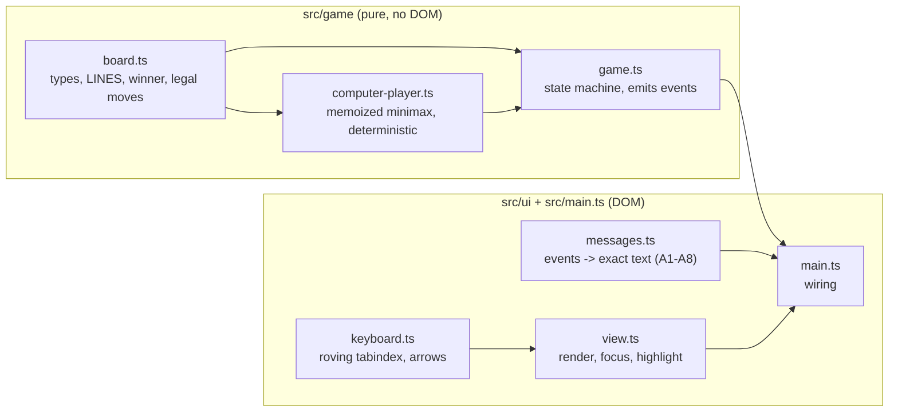
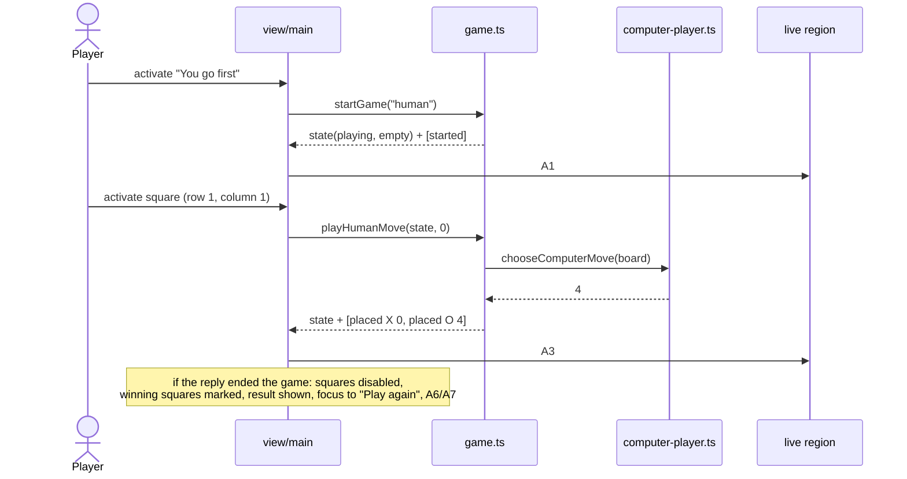
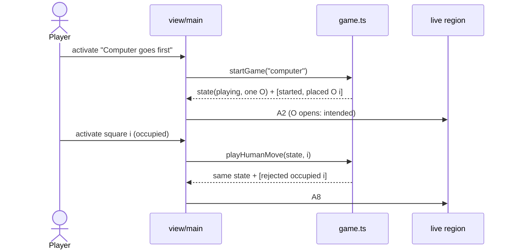
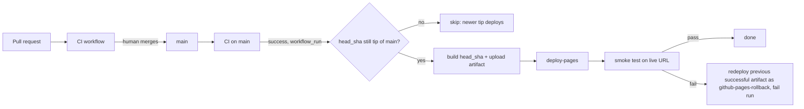

You are an independent second-opinion reviewer in a software factory pipeline.
A different AI (Claude) produced the DRAFT below. Your job is to find what it got
wrong, what it missed, and where a materially better approach exists. Do not
rubber-stamp, and do not inflate: report only findings you would defend with
evidence (a line, an input that breaks it, a requirement it violates). Do not
rewrite the whole thing. Be specific and terse.

Review kind: code
Reviewer: {{REVIEWER}}
Project: factory-tictactoe

Focus especially on: Whole-change QA review of 0d19214..932c9a9 (all 13 features plus QA fixes; package-lock.json and .factory records excluded): anything the per-feature reviews would miss: cross-feature interactions, data integrity, operational risk (first deploy, rollback, CI), and whether the QA fixes (renames, shared script helpers, workflow hardening) changed behaviour.

Respond in EXACTLY this format (markdown):

## Verdict
Exactly one of:
- AGREE — no CRITICAL or HIGH findings.
- AGREE-WITH-CONCERNS — CRITICAL or HIGH findings that can be fixed within this approach.
- DISAGREE — the approach itself is wrong: you would redo it rather than patch it, and you describe what instead under Alternative.
Findings alone, however many or severe, never make a DISAGREE; they make AGREE-WITH-CONCERNS.
One sentence of justification.

## Findings
Number every finding C1, C2, … so the author can answer each one. One bullet each:
- [C1] [CRITICAL|HIGH|MEDIUM|LOW] <where> — <what is wrong> — <evidence> — <what to do instead>
(CRITICAL = will cause data loss, security hole, wrong behavior, or blocks the goal. Use it sparingly and only when sure.)

## Missing
Bullets: things the draft should address but doesn't. Empty if none.

## Alternative
If you would take a materially different approach, describe it in <=8 lines and say why it's better. Otherwise write "None".

## Questions for the human
Bullets: decisions only the product owner can make. Empty if none.

=== CONTEXT (read-only, for reference) ===

--- .factory/acceptance.md ---
# Acceptance criteria: factory-tictactoe

_Traces to: `.factory/prd.md`. Every criterion is written to be checked by an automated test (Vitest unit tests, Playwright end-to-end tests, or a CI script), except where it says "verified in deploy phase"._

## Conventions used below

- Squares are numbered by **row 1–3 (top to bottom)** and **column 1–3 (left to right)**.
- `{R}`, `{C}` are the row and column of the human's move; `{R2}`, `{C2}` are those of the computer's move.
- `{LINE}` is one of: `row 1`, `row 2`, `row 3`, `column 1`, `column 2`, `column 3`, `the diagonal from top left to bottom right`, `the diagonal from top right to bottom left`.

### Announcement text (exact, used by R-002, R-004, R-005, R-008)

| ID | When | Exact live-region text |
|---|---|---|
| A1 | Game starts, human first | `New game. You go first. You are X. Your turn.` |
| A2 | Game starts, computer first | `New game. Computer goes first as O. Computer placed O in row {R2}, column {C2}. Your turn.` |
| A3 | Human moves, game continues | `You placed X in row {R}, column {C}. Computer placed O in row {R2}, column {C2}. Your turn.` |
| A4 | Human move wins (unreachable with a perfect computer, still defined) | `You placed X in row {R}, column {C}. You win with {LINE}.` |
| A5 | Human move fills the board with no winner | `You placed X in row {R}, column {C}. It's a draw.` |
| A6 | Computer move wins | `You placed X in row {R}, column {C}. Computer placed O in row {R2}, column {C2}. Computer wins with {LINE}.` |
| A7 | Computer move fills the board with no winner | `You placed X in row {R}, column {C}. Computer placed O in row {R2}, column {C2}. It's a draw.` |
| A8 | Human activates an occupied square | `Row {R}, column {C} is taken. Choose an empty square.` |

Square accessible names: `Row {R}, column {C}, empty` / `Row {R}, column {C}, X` / `Row {R}, column {C}, O`.

## R-001 Board and legal moves

- **Given** a game in progress with the human to move, **when** the human activates an empty square, **then** exactly that square shows X and no other square changes before the computer's reply.
- **Given** a game in progress, **when** the human activates a square showing X or O, **then** the board is unchanged and it is still the human's turn.
- **Given** the game state module, **when** a human move is submitted while it is the computer's turn or after the game has ended, **then** the move is rejected and the returned state equals the input state (unit test).

### Unhappy paths

- **Given** the first-mover choice has not been made, **when** the player clicks, taps or presses Enter on any square, **then** nothing is placed (squares are disabled).
- **Given** JavaScript is disabled, **when** the page loads, **then** a visible message says the game needs JavaScript (Playwright with `javaScriptEnabled: false`).
- **Given** JavaScript is enabled but the JavaScript bundle request fails (Playwright aborts it), **when** the page loads, **then** the visible message "The game didn't load. Try reloading the page." is shown (tested against the production build in `dist/`, not the dev server); **and given** the bundle loads normally, **then** that message is never visible at any point during the load (it ships `hidden`).
- **Given** the production build, **when** start-up throws (the Playwright test serves `index.html` with the board's root element removed, so `main.ts` fails to find it), **then** the same load-error message is shown.

## R-002 First-mover choice

- **Given** a fresh page load, **when** it renders, **then** two controls "You go first" and "Computer goes first" are visible, the board is empty, and no control to choose a symbol exists.
- **Given** the choice is shown, **when** the player chooses "You go first", **then** the board is empty, it is the human's turn as X, and the live region reads A1.
- **Given** the choice is shown, **when** the player chooses "Computer goes first", **then** exactly one square shows O, no square shows X, and the live region reads A2 naming that square.
- **Given** any game, **when** squares are filled, **then** every human-placed mark is X and every computer-placed mark is O, regardless of who started.

## R-003 Perfect, never-losing computer

- **Given** both starting sides, **when** a test enumerates every legal human move at every position where it is the human's turn and applies the computer's chosen reply at every position where it is the computer's turn, **then** no reachable finished game is a human (X) win, and the test reports the number of finished games examined (greater than 0) for each starting side.
- **Given** a position where the computer can complete three in a row, **when** it chooses a move, **then** it completes the line (unit test over all such reachable positions).
- **Given** the same position twice, **when** the computer chooses a move, **then** it returns the same square both times (deterministic).
- **Given** successive games in one process with alternating starters (human, computer, human, …), **when** the exhaustive enumeration runs for each, **then** results are identical to running each starter in a fresh process (the memo stays valid across starters).
- **Given** CI, **when** the unit-test job runs, **then** the exhaustive test runs on every push and pull request and finishes in under 60 seconds.

## R-004 Win and draw detection with result message

- **Given** each of the 8 lines filled with X, and separately with O, **when** the board is evaluated, **then** the winner is that symbol and the line is identified (unit test, 16 cases).
- **Given** a full board with no three in a row, **when** it is evaluated, **then** the result is a draw.
- **Given** a move that wins or fills the board, **when** it is applied, **then** the game ends, all squares become disabled, and the visible result text contains "Computer wins", "You win" or "It's a draw" accordingly, and the live region reads A4, A5, A6 or A7 accordingly.

## R-005 Winning line highlight

- **Given** a game the computer has won, **when** the result is shown, **then** exactly the three squares of the winning line are marked as winning and each of them differs from non-winning squares in at least one non-colour computed style (border width or style, outline, or text decoration) or carries an overlaid line element.
- **Given** a game the computer has won, **when** the result is shown, **then** the visible result text and the live region both name the line using `{LINE}` wording.
- **Given** a drawn game, **when** the result is shown, **then** no square is marked as winning.

## R-006 Play again

- **Given** a finished game, **when** the result is shown, **then** a "Play again" button is visible and has keyboard focus.
- **Given** a game in progress, **when** the page is inspected, **then** no "Play again" button is visible.
- **Given** a finished game, **when** the player activates "Play again", **then** the board is empty, the first-mover choice is shown, and focus is on "You go first".

## R-007 Keyboard-only play

- **Given** a fresh page, **when** a Playwright test plays a complete game using only Tab, Shift+Tab, arrow keys, Enter and Space (no pointer events), choosing "You go first", **then** the game reaches a result and "Play again" can be activated from the keyboard to start a second game choosing "Computer goes first", which also reaches a result.
- **Given** the board has focus, **when** an arrow key is pressed, **then** focus moves one square in that direction, stays put at the board edge, and exactly one square is in the Tab order at any time.
- **Given** a square has focus, **when** Enter or Space is pressed on an empty square, **then** X is placed there.
- **Given** the first-mover choice, **when** the player chooses "You go first", **then** focus is on row 1, column 1; **and when** the player chooses "Computer goes first", **then** focus is on the first empty square in reading order (row 1, column 2 after the opening O at row 1, column 1).
- **Given** any focused control, **when** its computed style is read, **then** it has a visible focus indicator with an outline or border at least 2 CSS px wide.

## R-008 Screen-reader announcements

- **Given** each situation A1–A3 and A5–A8, **when** it occurs in a Playwright test, **then** the live region (`role="status"`, polite) text equals the exact string in the announcement table, with placeholders filled.
- **Given** A4 (human win), which the real opponent makes unreachable, **when** a unit test drives the game state machine with an injected opponent that loses and passes the events to the message builder, **then** the text equals A4 exactly; the production bundle contains no way to inject an opponent.
- **Given** any board state, **when** the squares are inspected, **then** each square's accessible name matches `Row {R}, column {C}, empty|X|O` for its current content.
- **Given** a human move, **when** the computer replies, **then** a single announcement covers both moves (the live region is updated once per human action).

## R-009 WCAG 2.2 AA and zero axe violations

- **Given** each game state (choice shown, game in progress, computer won, draw), **when** axe-core runs with tags `wcag2a`, `wcag2aa`, `wcag21a`, `wcag21aa` and `wcag22aa` in Chromium, Firefox and WebKit, **then** it reports 0 violations.
- **Given** the page, **when** it loads, **then** it has a `lang` attribute, a descriptive `<title>`, one `h1`, and the board is exposed as a labelled group.

## R-010 Responsive layout for touch and mouse

- **Given** viewports of 320×568, 390×844 and 1280×800 CSS px, **when** the page is shown in each game state, **then** `document.documentElement.scrollWidth` does not exceed the viewport width and all nine squares and both choice buttons are fully visible without scrolling horizontally.
- **Given** those viewports, **when** the bounding boxes of the squares and buttons are measured, **then** each is at least 44×44 CSS px.
- **Given** a touch-enabled phone emulation, **when** the player taps "You go first" and then an empty square, **then** X is placed there.
- **Given** a desktop viewport, **when** the player clicks "You go first" and then an empty square, **then** X is placed there.
- **Given** viewports of 320×568 and 1280×800 at default text size, **when** the page moves through the choose state, play (including a taken-square message and the longest computer-move status), and the game-over state, **then** the board's bounding box (x, y, width, height) is identical in every state. At 200% text zoom reflow takes priority and this check does not apply.

## R-011 Bundle size

- **Given** a production build, **when** the CI size check sums the gzipped size of every JavaScript file in `dist/`, **then** the total is under 51,200 bytes, and the check fails the build otherwise.

## R-012 No tracking, storage or third-party requests

- **Given** a Playwright test that records every network request while loading the page and playing a full game, **when** the game ends, **then** every request went to the page's own origin.
- **Given** the same full game, **when** it ends, **then** `document.cookie` is empty and `localStorage.length` and `sessionStorage.length` are 0.
- **Given** the built `dist/` output, **when** it is scanned, **then** it contains no script, link or iframe pointing to another origin.

## R-013 Plain, high-contrast, system fonts

- **Given** the page, **when** the computed `font-family` of the body is read, **then** it begins with `system-ui`, and no font files are requested during a full game.
- **Given** the design tokens, **when** a unit test computes the contrast of every text colour against its background, **then** each ratio is at least 7:1, and every non-text indicator (square borders, focus ring, winning-line marker) is at least 3:1 against its background.

## R-014 Deploy to GitHub Pages with smoke test and minimal rollback

- **Given** a merge to main whose CI passes and which is still the latest commit on main, **when** the deploy workflow runs, **then** it builds exactly that commit (`workflow_run.head_sha`) and publishes it to GitHub Pages. The smoke test waits up to 3 minutes until the live page's `build-id` meta equals that SHA, then chooses "You go first", places one X, sees the computer's O, and passes. _Verified in deploy phase._
- **Given** CI passes for a commit that is no longer the latest commit on main, **when** its deploy run acquires the concurrency slot, **then** it skips without deploying. _Verified in deploy phase._
- **Given** deploy runs that overlap (one running, the latest commit's run queued, and an older commit's run queued after it), **when** they are processed, **then** none of them is discarded (`queue: max`, first in, first out), the older one skips as stale, and the latest commit ends up live. _Verified in deploy phase; the workflow's concurrency block is checked statically in CI._
- **Given** a manual `workflow_dispatch` run, **when** main's CI for its tip is pending or failed, **then** the run refuses to deploy and fails with a message. _Verified in deploy phase._
- **Given** a deploy whose smoke test fails (forced by the workflow's manual `force_smoke_failure` input), **when** the rollback job runs, **then** it redeploys, unchanged, the Pages artifact of the latest deploy run whose deploy and smoke jobs both succeeded (a stale no-op run in between is never chosen), under the artifact name `github-pages-rollback`, does nothing else, and the workflow run concludes as failed so GitHub emails the repo owner. _Verified in deploy phase._
- **Given** no previous successful deploy run exists, or its artifact has expired, **when** the smoke test fails, **then** the rollback job logs that no previous artifact is available and the run fails. _Verified in deploy phase._

## R-015 Browser coverage

- **Given** the Playwright configuration, **when** CI runs the end-to-end suite, **then** every spec runs in five projects — Chromium, Firefox, WebKit, a touch-enabled Android phone emulation (Chromium) and a touch-enabled iPhone emulation (WebKit) — and all pass.
- **Given** the production build, **when** Vite builds it, **then** its build target covers the current and previous versions of Chrome, Firefox, Safari and Edge and iOS Safari (build target `es2022`, supported by all of them).

--- .factory/architecture.md ---
# Architecture: factory-tictactoe

_Traces to: `.factory/prd.md`, `.factory/acceptance.md`, `.factory/tech-stack.md`. Stack is committed (ADR-001 to ADR-008); this document does not revisit it._

## 1. Shape

A single static page: `index.html` + one CSS file + one ES module bundle built by Vite from strict TypeScript, published to GitHub Pages. No backend, no network calls at run time, no storage.

The code has two layers with a one-way dependency:

- **Game core** (`src/game/`): pure, DOM-free TypeScript. It holds all the rules, the perfect computer player, and the state transitions, and it emits *events* describing what happened. Vitest tests it exhaustively.
- **UI shell** (`src/ui/`, `src/main.ts`): renders state to the DOM, turns clicks, taps and keys into core calls, and turns core events into announcement text. Playwright and axe-core test it.



## 2. Components and responsibilities

| Component | File | Responsibility | Requirements |
|---|---|---|---|
| Board model | `src/game/board.ts` | `Mark = "X" \| "O"`, `Board` (9 cells, index 0–8 row-major), the 8 `LINES`, `findWinner(board)` returning winner and line, `isFull`, `emptySquares`, immutable `placeMark` | R-001, R-004 |
| Computer player | `src/game/computer-player.ts` | `chooseComputerMove(board): SquareIndex` (O is always to move when it is called) — full-depth minimax. A position's value is node-relative: `10 − plies to the end` for an O win, `plies to the end − 10` for an X win, `0` for a draw, so O wins sooner and never loses. Ties go to the lowest square index. Values are memoized in a module-level map keyed by **board + side to move**; because the values are node-relative they are valid across searches, games and starters (at most 2 × 3⁹ keys) | R-003 |
| Game state machine | `src/game/game.ts` | `startGame(firstMover)` and `playHumanMove(state, index)` return `{ state, events }`; the computer's reply is applied synchronously inside `playHumanMove`; illegal moves return the input state unchanged plus a `rejected` event. The opponent is a parameter that defaults to `chooseComputerMove`, so unit tests can inject a weak opponent to reach the otherwise unreachable human win (A4); the UI always uses the default | R-001, R-002, R-003, R-004, R-006 |
| Messages | `src/ui/messages.ts` | Pure `describeEvents(events): string` producing exact texts A1–A8; `squareLabel(index, mark)`; `describeLine(line)` | R-005, R-008 |
| View | `src/ui/view.ts` | Renders choice buttons, 9 square buttons, visible status/result, "Play again"; sets accessible names, `disabled` / `aria-disabled`, winning markers; moves focus per the rules below | R-001, R-002, R-004–R-007, R-009, R-010 |
| Keyboard | `src/ui/keyboard.ts` | Roving tabindex over the 3×3 grid; arrow keys move one square and stop at edges; Enter/Space are native button activation | R-007 |
| Wiring | `src/main.ts` | Holds the single current `GameState`, calls core, renders, writes the live region | all UI |
| Styles | `src/styles.css` | System font stack, high-contrast tokens (from design phase), 44 px minimum targets, fluid grid from 320 px, 2 px+ focus ring, non-colour winning marker | R-005, R-010, R-013 |
| Page | `index.html` | `lang="en"`, title, `h1`, live region; `<noscript>` message plus a load-error message ("The game didn't load. Try reloading the page.") that ships with the `hidden` attribute. It is revealed in two ways. (1) A small inline classic `<script>` in `index.html`, placed before the module script, registers a capture-phase `window` `error` listener that unhides the message when a `<script>` element fails to load. This is independent of the bundle, and survives the Vite build, which rewrites the module tag and would drop an `onerror` attribute (Codex rework review C1). (2) `main.ts` wraps start-up in `try/catch`, unhides the message on any exception, then rethrows so the error still reaches the console. It never flashes during a normal load and never shows next to the `<noscript>` message (design review, 2026-09-27); `<meta name="build-id">` set to the commit SHA at build time | R-001, R-008, R-009, R-014 |
| CI scripts | `scripts/check-bundle-size.mjs`, `scripts/check-dist-origins.mjs` | Gzip-sum JS in `dist/` under 51,200 bytes; scan `dist/` for other-origin script/link/iframe URLs | R-011, R-012 |

Filenames are kebab-case and identifiers follow the factory naming rules (standards §6), enforced by ESLint.

## 3. Data model

In memory only, discarded on reload (R-012).

```ts
type Mark = "X" | "O";                 // human is always X, computer always O (R-002)
type Cell = Mark | null;
type Board = readonly Cell[];          // length 9, row-major: index = (row-1)*3 + (column-1)
type Line = readonly [number, number, number];
type FirstMover = "human" | "computer";
type Result = { kind: "win"; winner: Mark; line: Line } | { kind: "draw" };
type GameState =
  | { phase: "choosing" }                                        // before each game
  | { phase: "playing"; board: Board; firstMover: FirstMover }    // always the human's turn when idle
  | { phase: "over"; board: Board; firstMover: FirstMover; result: Result };
type GameEvent =
  | { type: "started"; firstMover: FirstMover }
  | { type: "placed"; mark: Mark; index: number }
  | { type: "ended"; result: Result }
  | { type: "rejected"; reason: "occupied" | "not-playing"; index: number };
```

Because the computer replies synchronously, a `playing` state at rest is always the human's turn; "out of turn" (R-001) therefore reduces to "not in the `playing` phase". The unit tests exercise that case directly on the state machine.

## 4. Key flows

### Flow A: human goes first and makes a move



### Flow B: computer goes first, then the human activates an occupied square



## 5. Accessibility design

- The board is a `div role="group" aria-label="Board"` containing 9 native `<button>`s laid out by CSS grid. Buttons give Enter/Space activation and touch/click for free.
- Accessible name of each square: `Row R, column C, empty|X|O` (R-008).
- **Before a choice and after the game ends**, squares have the `disabled` attribute and are out of the Tab order. **During play**, exactly one square has `tabindex="0"` (roving); occupied squares are `aria-disabled="true"` but stay focusable, so arrow navigation passes through them and activating one announces A8.
- **Live region**: one visually hidden `div role="status"` (polite). It is written once per player action. To make a repeated identical message (such as A8 twice) announce again, the text is cleared and then set on the next animation frame.
- **Focus**: after a choice, focus goes to the first empty square in reading order (row 1, column 1 when the human starts; row 1, column 2 after the computer's opening O at row 1, column 1). This keeps the first Enter off a taken square (design review, 2026-09-27). After a move it stays on the square played. When the game ends, it moves to "Play again". After "Play again" it goes to "You go first".
- **Winning line**: `data-winning="true"` on the three squares. The style adds a thick border plus an overlaid strike line (not colour alone), and the text names the line (R-005).

## 6. Integration points and failure modes

| Integration | Used for | Failure mode | Handling |
|---|---|---|---|
| GitHub Actions: CI workflow (`ci.yml`, on push and pull request) | format check, lint, typecheck, unit + exhaustive tests, build, bundle-size and dist-origin checks, Playwright e2e + axe in 5 projects | Any job fails | PR cannot merge (humans merge; branch protection set in ship phase). Owner gets the failure email |
| GitHub Actions: deploy workflow (`deploy.yml`) | Triggered by `workflow_run` when CI completes successfully on `main`: checks out **`workflow_run.head_sha`** (not `GITHUB_SHA`), so it builds exactly the commit whose CI passed. **After acquiring the `pages` concurrency slot**, it checks that SHA is still the tip of `main`; if not, it skips (a no-op run), because the newer tip's own queued run will deploy it and it already contains this change. `workflow_dispatch` (with a `force_smoke_failure` input) resolves the current tip of `main`, verifies a successful CI run exists for that exact SHA, and refuses (fails with a message) if main's CI is pending or failed; otherwise it deploys that SHA the same way. Steps: build with `build-id` = SHA → `actions/upload-pages-artifact` (retention 90 days) → `actions/deploy-pages` → smoke → rollback if smoke fails | Build or deploy fails | Nothing changes on the live site; run fails; email |
| GitHub Pages | hosting at `https://onelifemedia.github.io/factory-tictactoe/` | Outage | Accepted: GitHub's uptime, no SLA (intent.operations) |
| Smoke test | Playwright against the live URL. It first polls, for up to 3 minutes, until the page's `build-id` meta equals the deployed SHA, so the old deployment cannot pass for the new one. Then it chooses "You go first", places X and sees O | Fails, or the build-id never appears | Rollback job (ADR-011). It finds the latest `deploy.yml` run on `main` whose **deploy and smoke jobs both concluded `success`** (checked per run through the jobs API; a stale no-op run whose deploy was skipped is never chosen, even though that run concluded successfully) and downloads its `github-pages` artifact (`actions/download-artifact` with `run-id` and `github-token`). It re-uploads the downloaded `artifact.tar` **unchanged under the distinct name `github-pages-rollback`**, so it never clashes with this run's `github-pages` artifact and the tar is not nested. It deploys with `actions/deploy-pages` (`artifact_name: github-pages-rollback`), then exits non-zero. If there is no such run, or its artifact has expired (more than 90 days since the last successful deploy), it logs that and exits non-zero. Nothing more. |

A run that rolled back concludes as failed, so it is never chosen as "previous successful" later. Deploy, smoke and rollback run in one workflow under `concurrency: { group: pages, queue: max, cancel-in-progress: false }`. With the default `queue: single`, GitHub keeps at most one pending run and cancels the older one when a new run queues. That can discard the latest commit's run (A running, C latest pending, older B's CI finishes last and replaces C, then B skips as stale), so the site would never get C (Codex plan review C1). With `queue: max`, up to 100 runs wait and are processed first in, first out; `queue: max` with `cancel-in-progress: true` is a validation error ([GitHub docs: control workflow concurrency](https://docs.github.com/en/actions/how-tos/write-workflows/choose-when-workflows-run/control-workflow-concurrency), verified 2026-09-27). Because the latest-commit check runs only after a run acquires the slot, every queued run either deploys the tip that CI verified or skips harmlessly. "Latest" is evaluated once, when the run acquires the slot. If main advances while that run is building or deploying, the newer commit's own run is already queued behind it and deploys next. Accepted limit (Codex rework review C1, 2026-09-27): if more than 100 deploy runs are pending at once, GitHub cancels the overflow, which could include the latest commit's run. With humans merging one pull request at a time this is not a realistic load, so it is documented rather than engineered around; the remedy is to re-run the deploy workflow for main's tip.

## 7. Deployment shape



Vite `base: "./"` makes asset URLs relative, so the site works under the `/factory-tictactoe/` path. The build target is `es2022`. Node 22 is pinned in `.nvmrc` and `engines`, and CI uses `actions/setup-node` with `node-version-file: .nvmrc`.

## 8. Test architecture

| Layer | Tool | What | Where |
|---|---|---|---|
| Unit | Vitest | board rules (16 win cases, draw), state machine incl. rejections, messages A1–A8, token contrast | `tests/unit/*.test.ts` |
| Exhaustive | Vitest | every human move sequence against the computer, both starting sides, run in one process one after the other (so the shared memo is exercised across starters); asserts 0 human wins and reports game counts; under 60 s | `tests/unit/never-loses.test.ts` |
| End-to-end + a11y | Playwright + @axe-core/playwright | A1–A3 and A5–A8 exact text (A4 is unreachable with the real opponent, so it is covered by unit tests with an injected opponent), keyboard-only games, blocked-bundle fallback, touch/click, exact live-region text, focus rules, layout/target sizes at 3 viewports, requests/cookies/storage, axe in 4 states | `tests/e2e/*.spec.ts`, 5 projects (ADR-008) |
| Build checks | Node scripts | bundle < 51,200 B gzipped; no other-origin URLs in `dist/` | `scripts/*.mjs` |
| Post-deploy | Playwright | wait for expected build-id, then smoke on live URL | `tests/smoke/*.spec.ts` (deploy workflow only) |

Every test file names the F-ID it covers (governance).

## 9. What we are deliberately not building

- No server, API, database, storage, cookies, service worker or PWA manifest.
- No framework runtime, router, state library or CSS framework.
- No analytics, error reporting SDK or third-party script of any kind.
- No difficulty levels, symbol choice, hot-seat mode, tally, undo, history, sound, themes, translations, rules page or custom domain.
- No artificial "thinking" delay or animation beyond basics (PRD open question 2 default).
- No rollback logic beyond "redeploy the previous successful artifact and fail the run".
- No real-device or manual screen-reader testing by the factory (QA report lists it as human follow-up).

--- .factory/adrs/ADR-011-minimal-rollback.md ---
# ADR-011: Minimal automatic rollback: redeploy the last successful Pages artifact

- **Status:** proposed (accepted when the specification bundle is approved)
- **Date:** 2026-09-27
- **Deciders:** Claude (test operator, authorized by Jim Gibbs)
- **Traces to:** R-014, intent.operations

## Context
The human requires automatic rollback when the post-deploy smoke test fails, kept minimal. Pages has no built-in rollback. By default `upload-pages-artifact` keeps artifacts for 1 day.

## Decision
We will upload each Pages artifact with 90-day retention. When the smoke test fails, a rollback job finds the latest `deploy.yml` run on main whose deploy **and** smoke jobs both concluded `success` (per-run jobs API; a stale no-op run that skipped deployment is never chosen), downloads its `github-pages` artifact (`actions/download-artifact` with `run-id` and `github-token`), re-uploads the `artifact.tar` unchanged under the distinct name `github-pages-rollback`, deploys it with `actions/deploy-pages` (`artifact_name: github-pages-rollback`), and fails the run. If there is no such run, or its artifact has expired (the 90-day retention limit), it logs that and fails. The smoke test waits for the deployed build-id before playing, and every deploy builds `workflow_run.head_sha` only when it is still the tip of main, checked after the run acquires the concurrency slot. The workflow uses `concurrency: { group: pages, queue: max, cancel-in-progress: false }`. `queue: max` keeps up to 100 pending runs in first-in-first-out order instead of the default `queue: single`, which cancels an older pending run whenever a new one queues; `queue: max` cannot be combined with `cancel-in-progress: true`. Source: GitHub docs, https://docs.github.com/en/actions/how-tos/write-workflows/choose-when-workflows-run/control-workflow-concurrency (fetched and verified 2026-09-27). Manual `workflow_dispatch` deploys only main's tip, and only if CI succeeded for that exact SHA; it refuses when CI is pending or failed. "Latest" is evaluated once, when the run acquires the slot. If main advances while that run is building or deploying, the newer commit's own run is already queued behind it and deploys next. Accepted limit (Codex rework review C1, 2026-09-27): if more than 100 deploy runs are pending at once, GitHub cancels the overflow, which could include the latest commit's run. With humans merging one pull request at a time this is not a realistic load, so it is documented rather than engineered around; the remedy is to re-run the deploy workflow for main's tip.

## Alternatives considered
| Option | Pros | Cons | Why not |
|---|---|---|---|
| Rebuild the previous commit | No artifact retention needed | Not the same bytes; slower | Human asked for the previous artifact |
| Manual rollback only | No custom logic | Site stays broken until a human acts | Human chose automatic |

## Consequences
Positive: a bad deploy is replaced within minutes. Negative: custom workflow logic that is only verifiable in the deploy phase (a `force_smoke_failure` dispatch input exists for that). A rolled-back run concludes failed, so it is never chosen later. No new dependencies (first-party GitHub actions).

## Second opinion
Codex plan review (2026-09-27): C1 (HIGH), the default single-pending concurrency could discard the latest commit's run, fixed with `queue: max` and a post-slot latest-commit check. C2 (HIGH), the latest *successful* run could be a stale no-op with no artifact, fixed by requiring successful deploy and smoke jobs. C4 (MEDIUM), manual dispatch eligibility is now specified. Earlier, Codex raised C1 (HIGH, reusing the `github-pages` name clashes), C2 (HIGH, `workflow_run` builds the wrong SHA), C3 (HIGH, artifacts expire after 90 days), C5 (MEDIUM, the smoke test could pass against the old deployment) and C6 (MEDIUM, a pending run can be replaced). C1, C2, C5 and C6 are accepted and applied. For C3, the approver accepted the 90-day expiry limit on 2026-09-27: after expiry, rollback logs and fails, and R-014 now says so. The approver also accepted "latest commit on main" wording for C6. See `.factory/reviews/specification-reconciliation.md` (architecture review, with ADRs as context).


=== DRAFT UNDER REVIEW: .factory/checkpoints/qa-whole-change.diff ===
diff --git a/.githooks/pre-commit b/.githooks/pre-commit
new file mode 100755
index 0000000..93af413
--- /dev/null
+++ b/.githooks/pre-commit
@@ -0,0 +1,7 @@
+#!/usr/bin/env bash
+# software-factory: managed hook. Regenerate with standards.sh install;
+# change the commands in .factory/config.json -> standards.commands.
+set -euo pipefail
+cd "$(git rev-parse --show-toplevel)"
+run() { echo "pre-commit: $1" >&2; bash -c "$2"; }
+run format_check 'npm run format:check'
diff --git a/.githooks/pre-push b/.githooks/pre-push
new file mode 100755
index 0000000..7ff72ca
--- /dev/null
+++ b/.githooks/pre-push
@@ -0,0 +1,10 @@
+#!/usr/bin/env bash
+# software-factory: managed hook. Regenerate with standards.sh install;
+# change the commands in .factory/config.json -> standards.commands.
+set -euo pipefail
+cd "$(git rev-parse --show-toplevel)"
+run() { echo "pre-push: $1" >&2; bash -c "$2"; }
+run format_check 'npm run format:check'
+run lint 'npm run lint'
+run typecheck 'npm run typecheck'
+run test 'npm test'
diff --git a/.github/workflows/ci.yml b/.github/workflows/ci.yml
new file mode 100644
index 0000000..1400ff7
--- /dev/null
+++ b/.github/workflows/ci.yml
@@ -0,0 +1,64 @@
+# F-001: CI runs the same commands as the git hooks (.factory/config.json standards.commands),
+# plus the production build and the Playwright suite.
+name: CI
+
+on:
+  pull_request:
+  push:
+    branches: [main]
+
+permissions:
+  contents: read
+
+jobs:
+  checks:
+    runs-on: ubuntu-latest
+    steps:
+      - uses: actions/checkout@3d3c42e5aac5ba805825da76410c181273ba90b1 # v7.0.1
+      - uses: actions/setup-node@820762786026740c76f36085b0efc47a31fe5020 # v7.0.0
+        with:
+          node-version-file: .nvmrc
+          cache: npm
+      - run: npm ci
+      - name: Hooks are activated by npm ci
+        run: test "$(git config core.hooksPath)" = ".githooks"
+      - run: npm run format:check
+      - run: npm run lint
+      - run: npm run typecheck
+      - run: npm test
+      - run: npm run build
+      - name: Bundle size under 50 KB gzipped (R-011)
+        run: npm run check:size
+      - name: No references to other origins (R-012)
+        run: npm run check:origins
+      # F-013: lint every workflow. actionlint 1.7.12 does not know GitHub's
+      # concurrency `queue` key yet, so exactly that diagnostic is ignored;
+      # tests/unit/deploy-workflow.test.ts checks the concurrency block itself.
+      - name: Lint workflows (actionlint 1.7.12)
+        uses: docker://rhysd/actionlint@sha256:b1934ee5f1c509618f2508e6eb47ee0d3520686341fec936f3b79331f9315667 # 1.7.12
+        with:
+          args: -color -ignore unexpected.key..queue..for..concurrency..section
+
+  e2e:
+    runs-on: ubuntu-latest
+    steps:
+      - uses: actions/checkout@3d3c42e5aac5ba805825da76410c181273ba90b1 # v7.0.1
+      - uses: actions/setup-node@820762786026740c76f36085b0efc47a31fe5020 # v7.0.0
+        with:
+          node-version-file: .nvmrc
+          cache: npm
+      - run: npm ci
+      - run: npx playwright install --with-deps chromium firefox webkit
+      - run: npm run test:e2e
+      # F-013: the smoke test itself, against a local server (right, wrong and
+      # late build id). Slow, so it runs once here instead of in npm test.
+      - name: Smoke-test harness
+        env:
+          RUN_SMOKE_HARNESS: "1"
+        run: npx vitest run tests/unit/smoke-harness.test.ts
+      - uses: actions/upload-artifact@043fb46d1a93c77aae656e7c1c64a875d1fc6a0a # v7.0.1
+        if: failure()
+        with:
+          name: playwright-report
+          path: playwright-report/
+          retention-days: 14
diff --git a/.github/workflows/deploy.yml b/.github/workflows/deploy.yml
new file mode 100644
index 0000000..32ebb67
--- /dev/null
+++ b/.github/workflows/deploy.yml
@@ -0,0 +1,198 @@
+# F-013 (R-014): deploy the latest commit on main to GitHub Pages after CI
+# passes, smoke-test the live site, and roll back to the previous good build if
+# the smoke test fails (ADR-011). Pages itself is enabled in the deploy phase.
+name: Deploy
+
+on:
+  workflow_run:
+    workflows: [CI]
+    types: [completed]
+    branches: [main]
+  workflow_dispatch:
+    inputs:
+      force_smoke_failure:
+        description: Fail the smoke test on purpose to exercise the rollback
+        type: boolean
+        default: false
+
+# One queue for every deploy: runs wait their turn (first in, first out) and
+# none is cancelled. `queue: max` keeps up to 100 pending runs; the default
+# `single` would drop a waiting run for a newer one (ADR-011).
+concurrency:
+  group: pages
+  queue: max
+  cancel-in-progress: false
+
+permissions:
+  contents: read
+  actions: read
+  pages: write
+  id-token: write
+
+jobs:
+  prepare:
+    name: prepare
+    # A deploy starts from a manual dispatch, or from CI that succeeded for a
+    # push to main in this repository (not a fork's pull request whose branch
+    # happens to be called main; QA security review).
+    if: >-
+      ${{ github.event_name == 'workflow_dispatch' ||
+      (github.event.workflow_run.conclusion == 'success' &&
+      github.event.workflow_run.event == 'push' &&
+      github.event.workflow_run.head_repository.full_name == github.repository) }}
+    runs-on: ubuntu-latest
+    outputs:
+      sha: ${{ steps.decide.outputs.sha }}
+      should_deploy: ${{ steps.decide.outputs.should_deploy }}
+    steps:
+      - uses: actions/checkout@3d3c42e5aac5ba805825da76410c181273ba90b1 # v7.0.1
+      - uses: actions/setup-node@820762786026740c76f36085b0efc47a31fe5020 # v7.0.0
+        with:
+          node-version-file: .nvmrc
+      - name: Decide what to deploy (checked after acquiring the pages slot)
+        id: decide
+        env:
+          GH_TOKEN: ${{ github.token }}
+          EVENT_NAME: ${{ github.event_name }}
+          RUN_HEAD_SHA: ${{ github.event.workflow_run.head_sha }}
+          REPOSITORY: ${{ github.repository }}
+        run: |
+          set -euo pipefail
+          main_tip=$(gh api "repos/$REPOSITORY/commits/main" --jq .sha)
+          if [ "$EVENT_NAME" = "workflow_dispatch" ]; then
+            gh api "repos/$REPOSITORY/actions/workflows/ci.yml/runs?head_sha=$main_tip&event=push&branch=main&per_page=100" \
+              | jq --arg tip "$main_tip" '{mainTipSha: $tip, ciRuns: [.workflow_runs[] | {id, head_sha, status, conclusion, event, head_branch}]}' \
+              > dispatch-input.json
+            if ! node scripts/deploy/resolve-dispatch-sha.mjs dispatch-input.json > resolution.json; then
+              jq -r .refusal resolution.json
+              exit 1
+            fi
+            candidate=$(jq -r .sha resolution.json)
+          else
+            candidate="$RUN_HEAD_SHA"
+          fi
+          jq -n --arg candidate "$candidate" --arg tip "$main_tip" \
+            '{candidateSha: $candidate, mainTipSha: $tip}' > decision-input.json
+          node scripts/deploy/decide-deployment.mjs decision-input.json > decision.json
+          jq -r .reason decision.json
+          echo "sha=$candidate" >> "$GITHUB_OUTPUT"
+          echo "should_deploy=$(jq -r .shouldDeploy decision.json)" >> "$GITHUB_OUTPUT"
+
+  build:
+    name: build
+    needs: prepare
+    if: ${{ needs.prepare.outputs.should_deploy == 'true' }}
+    runs-on: ubuntu-latest
+    steps:
+      - uses: actions/checkout@3d3c42e5aac5ba805825da76410c181273ba90b1 # v7.0.1
+        with:
+          ref: ${{ needs.prepare.outputs.sha }}
+      - uses: actions/setup-node@820762786026740c76f36085b0efc47a31fe5020 # v7.0.0
+        with:
+          node-version-file: .nvmrc
+          cache: npm
+      - run: npm ci
+      - name: Build with the commit as build id
+        env:
+          BUILD_ID: ${{ needs.prepare.outputs.sha }}
+        run: npm run build
+      - uses: actions/upload-pages-artifact@fc324d3547104276b827a68afc52ff2a11cc49c9 # v5.0.0
+        with:
+          path: dist
+          retention-days: 90
+
+  deploy:
+    name: deploy
+    needs: build
+    runs-on: ubuntu-latest
+    environment:
+      name: github-pages
+      url: ${{ steps.deployment.outputs.page_url }}
+    outputs:
+      page_url: ${{ steps.deployment.outputs.page_url }}
+    steps:
+      - id: deployment
+        uses: actions/deploy-pages@368f82528645a54fb793d4d04e342629a3f51346 # v5.0.1
+
+  smoke:
+    name: smoke
+    needs: [prepare, deploy]
+    runs-on: ubuntu-latest
+    steps:
+      - name: Fail on purpose (force_smoke_failure)
+        if: ${{ inputs.force_smoke_failure }}
+        run: |
+          echo "force_smoke_failure is set: failing the smoke test to exercise the rollback."
+          exit 1
+      - uses: actions/checkout@3d3c42e5aac5ba805825da76410c181273ba90b1 # v7.0.1
+        with:
+          ref: ${{ needs.prepare.outputs.sha }}
+      - uses: actions/setup-node@820762786026740c76f36085b0efc47a31fe5020 # v7.0.0
+        with:
+          node-version-file: .nvmrc
+          cache: npm
+      - run: npm ci
+      - run: npx playwright install --with-deps chromium
+      - name: Smoke-test the live site
+        env:
+          SMOKE_URL: ${{ needs.deploy.outputs.page_url }}
+          EXPECTED_BUILD_ID: ${{ needs.prepare.outputs.sha }}
+        run: npx playwright test -c playwright.smoke.config.ts
+
+  rollback:
+    name: rollback
+    needs: [deploy, smoke]
+    if: ${{ always() && needs.deploy.result == 'success' && needs.smoke.result == 'failure' }}
+    runs-on: ubuntu-latest
+    environment:
+      name: github-pages
+      url: ${{ steps.rollback-deployment.outputs.page_url }}
+    steps:
+      - uses: actions/checkout@3d3c42e5aac5ba805825da76410c181273ba90b1 # v7.0.1
+      - uses: actions/setup-node@820762786026740c76f36085b0efc47a31fe5020 # v7.0.0
+        with:
+          node-version-file: .nvmrc
+      - name: Find the latest run whose deploy and smoke jobs succeeded
+        id: target
+        env:
+          GH_TOKEN: ${{ github.token }}
+          REPOSITORY: ${{ github.repository }}
+          CURRENT_RUN_ID: ${{ github.run_id }}
+        run: |
+          set -euo pipefail
+          status=0
+          node scripts/deploy/find-rollback-run.mjs "$REPOSITORY" "$CURRENT_RUN_ID" > target.json || status=$?
+          if [ "$status" -eq 1 ]; then
+            echo "No earlier successful deploy to roll back to; the site keeps the failed build."
+            exit 1
+          elif [ "$status" -ne 0 ]; then
+            echo "Could not read the deploy history from the GitHub API (exit $status); rollback not attempted."
+            exit "$status"
+          fi
+          echo "run_id=$(jq -r .runId target.json)" >> "$GITHUB_OUTPUT"
+      - name: Download that run's Pages artifact
+        uses: actions/download-artifact@3e5f45b2cfb9172054b4087a40e8e0b5a5461e7c # v8.0.1
+        with:
+          name: github-pages
+          run-id: ${{ steps.target.outputs.run_id }}
+          github-token: ${{ github.token }}
+          path: rollback-artifact
+      - name: Explain a missing artifact
+        if: ${{ failure() && steps.target.outcome == 'success' }}
+        run: echo "The previous build's artifact is unavailable (expired after 90 days or deleted); nothing to roll back to."
+      - name: Re-upload it unchanged under its own name
+        uses: actions/upload-artifact@043fb46d1a93c77aae656e7c1c64a875d1fc6a0a # v7.0.1
+        with:
+          name: github-pages-rollback
+          path: rollback-artifact/artifact.tar
+          retention-days: 1
+      - id: rollback-deployment
+        uses: actions/deploy-pages@368f82528645a54fb793d4d04e342629a3f51346 # v5.0.1
+        with:
+          artifact_name: github-pages-rollback
+      - name: Fail the run so the owner is emailed
+        env:
+          TARGET_RUN_ID: ${{ steps.target.outputs.run_id }}
+        run: |
+          echo "Smoke test failed; rolled back to the build from run $TARGET_RUN_ID."
+          exit 1
diff --git a/.gitignore b/.gitignore
index c7783c5..d6e6e1e 100644
--- a/.gitignore
+++ b/.gitignore
@@ -8,3 +8,9 @@
 .factory/checkpoints/
 .factory/.state-*.tmp
 .factory/state.v1.backup.json
+
+# Build and test output
+node_modules/
+dist/
+playwright-report/
+test-results/
diff --git a/.nvmrc b/.nvmrc
new file mode 100644
index 0000000..de889f8
--- /dev/null
+++ b/.nvmrc
@@ -0,0 +1 @@
+22.23.3
diff --git a/.prettierignore b/.prettierignore
new file mode 100644
index 0000000..27ad4f8
--- /dev/null
+++ b/.prettierignore
@@ -0,0 +1,5 @@
+.factory/
+dist/
+playwright-report/
+test-results/
+package-lock.json
diff --git a/.prettierrc.json b/.prettierrc.json
new file mode 100644
index 0000000..0967ef4
--- /dev/null
+++ b/.prettierrc.json
@@ -0,0 +1 @@
+{}
diff --git a/CLAUDE.md b/CLAUDE.md
new file mode 100644
index 0000000..75be53d
--- /dev/null
+++ b/CLAUDE.md
@@ -0,0 +1,5 @@
+# Project instructions
+
+## Engineering standards
+
+Follow `docs/engineering-standards.md` for every change, especially the naming convention. Never bypass the git hooks with `--no-verify`.
diff --git a/README.md b/README.md
index 200048f..dc09dcd 100644
--- a/README.md
+++ b/README.md
@@ -1,3 +1,29 @@
 # Tic-tac-toe
 
 A browser tic-tac-toe game with an unbeatable computer opponent, built end to end by the Software Factory plugin as a live test.
+
+No install, no sign-up, no ads, no tracking. Plays by touch, mouse, keyboard and screen reader.
+
+## Develop
+
+Requires Node 22 (see `.nvmrc`; `nvm use`).
+
+```sh
+npm ci              # also activates the git hooks in .githooks
+npm run dev         # local dev server
+npm run build       # production build into dist/
+```
+
+## Checks
+
+The same commands run in the git hooks and in CI (`.factory/config.json` → `standards.commands`):
+
+| Command                | What                                                                                                       |
+| ---------------------- | ---------------------------------------------------------------------------------------------------------- |
+| `npm run format:check` | Prettier                                                                                                   |
+| `npm run lint`         | ESLint with the naming rules (`docs/engineering-standards.md`)                                             |
+| `npm run typecheck`    | `tsc --noEmit`, strict                                                                                     |
+| `npm test`             | Vitest unit tests                                                                                          |
+| `npm run test:e2e`     | Playwright in Chromium, Firefox, WebKit and Android/iPhone emulation (first run: `npx playwright install`) |
+
+Product and design documents live in `.factory/` (PRD, acceptance criteria, architecture, ADRs, design system, plan).
diff --git a/docs/engineering-standards.md b/docs/engineering-standards.md
new file mode 100644
index 0000000..564244d
--- /dev/null
+++ b/docs/engineering-standards.md
@@ -0,0 +1,285 @@
+# Engineering standards
+
+Every change follows these rules — human or agent, feature or hotfix. The git
+hooks and CI enforce what a machine can check; code review enforces the rest.
+`bash <factory>/scripts/standards.sh check` verifies the setup, and the
+implementation gate will not pass while it reports findings.
+
+## 1. Naming
+
+Names are the documentation that is always read. Be pedantic: a review finding
+about a name is never "just style".
+
+### 1.1 Whole words, no abbreviations
+
+- Spell words out: `request` not `req`, `response` not `res`, `error` not `err`/`e`,
+  `callback` not `cb`, `context` not `ctx`, `index` not `idx`/`i`, `element` not `el`,
+  `button` not `btn`, `message` not `msg`, `number` not `num`, `count` not `cnt`,
+  `configuration` not `cfg`/`conf`, `database` not `db`, `temporary` not `tmp`/`temp`.
+- No single-letter names anywhere, including loop counters, lambda parameters,
+  `catch` variables and type parameters: `for (const invoice of invoices)`,
+  `catch (error)`, `<Item>` not `<T>`.
+- Minimum length is **3 characters**. The only shorter names allowed are `id`,
+  `ui`, and `_` for a deliberately unused value.
+- Acronyms are allowed only when the acronym _is_ the everyday word: `id`, `url`,
+  `api`, `html`, `css`, `json`, `http`, `sql`, `uuid`, `ui`. Treat them as words
+  in camelCase and PascalCase: `userId`, `HttpClient`, `parseJson` (Go keeps its
+  own `userID` convention).
+
+### 1.2 Say what it is, not what type it has
+
+- Banned vague names: `data`, `info`, `temp`, `tmp`, `obj`, `val`, `thing`,
+  `stuff`, `foo`, `bar`, `baz`, `qux`, `dummy`, `misc`. Name the domain concept
+  instead: `invoice`, `unpaidInvoices`, `invoiceTotalCents`.
+- No type encoding: no `strName`, `arrUsers`, `userList` for an array, no `I`
+  prefix on interfaces, no `Impl` suffix on the only implementation.
+- Use the PRD's domain terms verbatim, and one word per concept across the
+  codebase: if it is a `customer` in the PRD it is never a `client` or `user` in
+  the code, and if loading is `fetch` it is never also `get`/`retrieve`/`load`.
+
+### 1.3 Shape follows role
+
+| Role                     | Rule                                                                     | Good                                        | Bad                                 |
+| ------------------------ | ------------------------------------------------------------------------ | ------------------------------------------- | ----------------------------------- |
+| Function / method        | Verb phrase naming the effect                                            | `calculateInvoiceTotal`, `sendReceiptEmail` | `invoice`, `process`, `doWork`      |
+| Generic verbs            | `handle`, `process`, `manage`, `run`, `do` need a specific object        | `handleCheckoutSubmit`                      | `handleClick`, `processData`        |
+| Boolean                  | Reads as a yes/no question: `is`/`has`/`can`/`should`/`was`/`did`/`will` | `isExpired`, `hasUnpaidInvoices`            | `expired`, `flag`, `status`         |
+| Negation                 | Never name the negative                                                  | `isValid` / `isInvalid`                     | `isNotValid`, `notDisabled`         |
+| Collection               | Plural noun                                                              | `invoices`, `lineItems`                     | `invoiceList`, `items2`             |
+| Map / dictionary         | `<values>By<Key>`                                                        | `invoicesByCustomerId`                      | `invoiceMap`, `lookup`              |
+| Quantity with a unit     | Unit in the name unless the type carries it                              | `timeoutMilliseconds`, `priceCents`         | `timeout`, `price`                  |
+| Count                    | `<noun>Count`                                                            | `retryCount`                                | `retries` (ambiguous), `n`          |
+| Type / class / component | Noun, PascalCase                                                         | `InvoiceSummary`                            | `InvoiceSummaryData`, `Helper`      |
+| Constant                 | Language convention, still whole words                                   | `MAXIMUM_RETRY_COUNT`                       | `MAX_RETRIES_N`                     |
+| Test                     | A sentence describing the behavior, with feature/requirement IDs         | `rejects an expired card (F-004 R-012)`     | `test1`, `works`                    |
+| File / module            | Named after its main export, language case convention                    | `invoice-summary.ts`                        | `utils.ts`, `helpers.py`, `misc.go` |
+
+### 1.4 Case
+
+| Language                | Variables, functions | Types, classes, components | Constants                              | Files            |
+| ----------------------- | -------------------- | -------------------------- | -------------------------------------- | ---------------- |
+| TypeScript / JavaScript | `strictCamelCase`    | `StrictPascalCase`         | `UPPER_SNAKE_CASE` (module level only) | `kebab-case`     |
+| Python                  | `snake_case`         | `PascalCase`               | `UPPER_SNAKE_CASE`                     | `snake_case.py`  |
+| Swift                   | `lowerCamelCase`     | `UpperCamelCase`           | `lowerCamelCase`                       | `TypeName.swift` |
+| Go                      | `mixedCaps`          | `MixedCaps`                | `MixedCaps`                            | `snake_case.go`  |
+| Rust                    | `snake_case`         | `UpperCamelCase`           | `UPPER_SNAKE_CASE`                     | `snake_case.rs`  |
+
+### 1.5 Exceptions
+
+A name required by a framework or an external contract (a JSON field from a
+third-party API, a React `props` parameter, a database column you do not own)
+is allowed at that boundary only. Map it to a compliant name immediately, and
+add it to the linter's allow list with a comment naming the reason. Never
+disable a naming rule for a whole file.
+
+## 2. Git hooks
+
+Hooks live in `.githooks/`, are committed, and are activated with
+`git config core.hooksPath .githooks` (the factory does this; new clones run it
+once, or it runs from the package manager's `prepare`/setup script).
+
+- **pre-commit:** format check (fast; keeps every commit formatted).
+- **pre-push:** format check, lint (including the naming rules), type check,
+  full test suite.
+
+Never bypass them with `--no-verify`. If a hook is wrong, fix the hook. CI runs
+the same commands, so a skipped hook is caught anyway.
+
+## 3. Formatting and linting
+
+- One formatter, run by the check command, with no per-file overrides. Formatter
+  and linter skip `.factory/` (factory artifacts, not source code).
+- The linter runs with warnings treated as errors; no inline disables without
+  a comment explaining why and naming the ticket or ADR.
+- The commands live in `.factory/config.json` → `standards.commands`
+  (`format_check`, `lint`, `typecheck`, `test`) and are the only way to run
+  those checks, for hooks, CI and humans alike.
+
+## 4. Commits and branches
+
+- One pull request per feature, from `factory/F-nnn-short-slug`, titled
+  `F-nnn: <title>`. Features stack in plan order: each branch starts from the
+  newest unmerged feature below it, and is rebased onto the main branch once
+  that merges. Small pull requests are what keep review fast.
+- Conventional Commits with the feature ID: `test(F-004): …`, `feat(F-004): …`,
+  `refactor(F-004): …`, `docs(F-004): …`, `ci: …`, `chore: …`.
+- Every commit leaves the suite green except the deliberate red `test(…)` commit.
+
+## 5. Secrets and configuration
+
+- No secrets in the repository. `.env` is git-ignored; `.env.example` lists
+  every key with a placeholder.
+- Configuration comes from the environment, validated at startup, with a clear
+  error naming the missing key.
+
+## 6. Enforcement recipes
+
+`standards.sh check` looks for these rules in the listed files. Use the recipe
+for the project's language; for anything else, configure the closest
+equivalent and record it in an ADR named by `standards.naming.waiver`.
+
+### TypeScript / JavaScript — `eslint.config.js`
+
+Needs `eslint`, `@eslint/js`, `typescript-eslint`, and `eslint-plugin-unicorn` (76 or later;
+earlier versions call `name-replacements` `prevent-abbreviations`).
+
+```js
+import eslint from "@eslint/js";
+import tseslint from "typescript-eslint";
+import unicorn from "eslint-plugin-unicorn";
+
+const vagueNames = [
+  "data",
+  "info",
+  "temp",
+  "tmp",
+  "obj",
+  "val",
+  "thing",
+  "stuff",
+  "foo",
+  "bar",
+  "baz",
+  "qux",
+  "dummy",
+  "misc",
+];
+
+export default tseslint.config(
+  eslint.configs.recommended,
+  ...tseslint.configs.recommendedTypeChecked,
+  {
+    languageOptions: { parserOptions: { projectService: true } },
+    plugins: { unicorn },
+    rules: {
+      "id-length": [
+        "error",
+        { min: 3, exceptions: ["id", "ui", "_"], properties: "never" },
+      ],
+      "id-denylist": ["error", ...vagueNames],
+      // unicorn 76's defaults also *shorten* four whole words (repository -> repo,
+      // configuration -> config, application(s) -> app(s)); switch those off.
+      "unicorn/name-replacements": [
+        "error",
+        {
+          checkFilenames: true,
+          replacements: {
+            application: false,
+            applications: false,
+            configuration: false,
+            repository: false,
+          },
+        },
+      ],
+      "unicorn/consistent-boolean-name": "error",
+      "unicorn/filename-case": ["error", { case: "kebabCase" }],
+      "@typescript-eslint/naming-convention": [
+        "error",
+        {
+          selector: "default",
+          format: ["strictCamelCase"],
+          leadingUnderscore: "allow",
+        },
+        {
+          selector: "variable",
+          modifiers: ["const", "global"],
+          format: ["strictCamelCase", "UPPER_CASE"],
+        },
+        { selector: "typeLike", format: ["StrictPascalCase"] },
+        {
+          selector: "interface",
+          format: ["StrictPascalCase"],
+          custom: { regex: "^I[A-Z]", match: false },
+        },
+        {
+          selector: "variable",
+          types: ["boolean"],
+          format: ["StrictPascalCase"],
+          prefix: ["is", "has", "can", "should", "was", "did", "will"],
+        },
+        { selector: ["objectLiteralProperty", "import"], format: null },
+      ],
+    },
+  },
+);
+```
+
+Framework components that must be PascalCase (React, Svelte) get a
+`{ selector: "function", format: ["strictCamelCase", "StrictPascalCase"] }` entry.
+
+### Python — `pyproject.toml`
+
+Ruff for formatting and PEP 8 naming; pylint only for the naming checks ruff
+lacks (`pylint --disable=all --enable=invalid-name,disallowed-name <paths>` in
+the lint command).
+
+pylint is GPL-2.0-or-later and its dependency astroid is LGPL-2.1-or-later.
+A virtual environment does not say which packages are development-only, so the
+license audit asks about both. They are linters that never ship with the
+product; record that decision once in `governance.license_exceptions`.
+
+```toml
+[tool.ruff.lint]
+select = ["E", "F", "W", "I", "N", "B", "UP", "SIM"]
+
+[tool.pylint.basic]
+bad-names = ["data", "info", "temp", "tmp", "obj", "val", "thing", "stuff",
+             "foo", "bar", "baz", "qux", "dummy", "misc"]
+good-names = ["id", "_"]
+variable-rgx = "^(?=[a-z0-9_]{3,}$)[a-z][a-z0-9]*(_[a-z0-9]+)*$"
+argument-rgx = "^(?=[a-z0-9_]{3,}$)[a-z][a-z0-9]*(_[a-z0-9]+)*$"
+attr-rgx = "^(?=_?[a-z0-9_]{3,}$)_?[a-z][a-z0-9]*(_[a-z0-9]+)*$"
+function-rgx = "^(?=_?[a-z0-9_]{3,}$)_?[a-z][a-z0-9]*(_[a-z0-9]+)*$"
+```
+
+### Swift — `.swiftlint.yml`
+
+```yaml
+identifier_name:
+  min_length: { error: 3 }
+  excluded: [id, ui]
+  validates_start_with_lowercase: error
+type_name:
+  min_length: { error: 3 }
+  max_length: { warning: 50, error: 60 }
+```
+
+### Go — `.golangci.yml`
+
+Go's community style favors very short names; this standard deliberately does
+not. `err`, `ok`, and `id` are the only allowed short names.
+
+```yaml
+version: "2"
+linters:
+  enable: [revive, varnamelen]
+  settings:
+    varnamelen:
+      min-name-length: 3
+      ignore-names: [err, ok, id]
+      check-receiver: true
+      check-return: true
+      check-type-param: true
+    revive:
+      rules:
+        - name: var-naming
+```
+
+### Rust — `clippy.toml` plus `Cargo.toml`
+
+```toml
+# clippy.toml
+min-ident-chars-threshold = 2  # inclusive: lints names of 1-2 characters
+allowed-idents-below-min-chars = ["id", "ui", "_"]
+disallowed-names = ["data", "info", "temp", "tmp", "obj", "val", "thing", "stuff",
+                    "foo", "bar", "baz", "qux", "dummy", "misc"]
+
+# Cargo.toml
+[lints.clippy]
+min_ident_chars = "deny"
+disallowed_names = "deny"
+```
+
+What no linter can check (verb phrases, units, one word per concept, names that
+lie) is the code reviewer's job; every such finding is at least MEDIUM, and a
+name that misleads about behavior is HIGH.
diff --git a/eslint.config.js b/eslint.config.js
new file mode 100644
index 0000000..1160f81
--- /dev/null
+++ b/eslint.config.js
@@ -0,0 +1,94 @@
+import eslint from "@eslint/js";
+import tseslint from "typescript-eslint";
+import unicorn from "eslint-plugin-unicorn";
+
+const vagueNames = [
+  "data",
+  "info",
+  "temp",
+  "tmp",
+  "obj",
+  "val",
+  "thing",
+  "stuff",
+  "foo",
+  "bar",
+  "baz",
+  "qux",
+  "dummy",
+  "misc",
+];
+
+export default tseslint.config(
+  {
+    ignores: [
+      "dist/",
+      ".factory/",
+      "playwright-report/",
+      "test-results/",
+      "node_modules/",
+    ],
+  },
+  eslint.configs.recommended,
+  ...tseslint.configs.recommendedTypeChecked,
+  {
+    // F-012: the CI guard scripts run in Node, so its globals are declared.
+    files: ["scripts/**/*.mjs"],
+    languageOptions: {
+      globals: { console: "readonly", process: "readonly" },
+    },
+  },
+  {
+    languageOptions: { parserOptions: { projectService: true } },
+    plugins: { unicorn },
+    rules: {
+      "id-length": [
+        "error",
+        { min: 3, exceptions: ["id", "ui", "_"], properties: "never" },
+      ],
+      "id-denylist": ["error", ...vagueNames],
+      // unicorn 76's defaults also *shorten* four whole words (repository -> repo,
+      // configuration -> config, application(s) -> app(s)); switch those off.
+      "unicorn/name-replacements": [
+        "error",
+        {
+          checkFilenames: true,
+          replacements: {
+            application: false,
+            applications: false,
+            configuration: false,
+            repository: false,
+          },
+        },
+      ],
+      "unicorn/consistent-boolean-name": "error",
+      "unicorn/filename-case": ["error", { case: "kebabCase" }],
+      "@typescript-eslint/naming-convention": [
+        "error",
+        {
+          selector: "default",
+          format: ["strictCamelCase"],
+          leadingUnderscore: "allow",
+        },
+        {
+          selector: "variable",
+          modifiers: ["const", "global"],
+          format: ["strictCamelCase", "UPPER_CASE"],
+        },
+        { selector: "typeLike", format: ["StrictPascalCase"] },
+        {
+          selector: "interface",
+          format: ["StrictPascalCase"],
+          custom: { regex: "^I[A-Z]", match: false },
+        },
+        {
+          selector: "variable",
+          types: ["boolean"],
+          format: ["StrictPascalCase"],
+          prefix: ["is", "has", "can", "should", "was", "did", "will"],
+        },
+        { selector: ["objectLiteralProperty", "import"], format: null },
+      ],
+    },
+  },
+);
diff --git a/index.html b/index.html
new file mode 100644
index 0000000..9394c41
--- /dev/null
+++ b/index.html
@@ -0,0 +1,41 @@
+<!doctype html>
+<html lang="en">
+  <head>
+    <meta charset="utf-8" />
+    <meta name="viewport" content="width=device-width, initial-scale=1" />
+    <title>Tic-tac-toe: play against a computer that never loses</title>
+  </head>
+  <body>
+    <main class="page">
+      <h1 class="title">Tic-tac-toe</h1>
+      <noscript>
+        <p class="fallback">
+          This game needs JavaScript, which is turned off in this browser. Turn
+          it on and reload the page.
+        </p>
+      </noscript>
+      <p id="load-error" class="fallback" hidden>
+        The game didn't load. Try reloading the page.
+      </p>
+      <p id="status" class="status"></p>
+      <div id="board" class="board" role="group" aria-label="Board"></div>
+      <div id="actions" class="actions"></div>
+      <div id="announcer" class="visually-hidden" role="status"></div>
+    </main>
+    <script>
+      // F-011: reveal the load-error message if a script fails to load. Capture
+      // phase, because resource error events do not bubble; kept out of the
+      // module script so it works when the bundle does not (architecture §2).
+      window.addEventListener(
+        "error",
+        (event) => {
+          if (event.target instanceof HTMLScriptElement) {
+            document.getElementById("load-error")?.removeAttribute("hidden");
+          }
+        },
+        true,
+      );
+    </script>
+    <script type="module" src="/src/main.ts"></script>
+  </body>
+</html>
diff --git a/package.json b/package.json
new file mode 100644
index 0000000..243576d
--- /dev/null
+++ b/package.json
@@ -0,0 +1,38 @@
+{
+  "name": "factory-tictactoe",
+  "version": "0.1.0",
+  "private": true,
+  "description": "Browser tic-tac-toe against a computer that never loses.",
+  "license": "UNLICENSED",
+  "type": "module",
+  "engines": {
+    "node": ">=22.13.0 <23"
+  },
+  "scripts": {
+    "dev": "vite",
+    "build": "vite build",
+    "preview": "vite preview",
+    "format": "prettier --write .",
+    "format:check": "prettier --check .",
+    "lint": "eslint . --max-warnings 0",
+    "typecheck": "tsc --noEmit",
+    "test": "vitest run",
+    "test:e2e": "playwright test",
+    "prepare": "git config core.hooksPath .githooks",
+    "check:size": "node scripts/check-bundle-size.mjs dist",
+    "check:origins": "node scripts/check-build-origins.mjs dist"
+  },
+  "devDependencies": {
+    "@axe-core/playwright": "4.13.0",
+    "@eslint/js": "10.0.1",
+    "@playwright/test": "1.63.0",
+    "@types/node": "22.20.4",
+    "eslint": "10.11.0",
+    "eslint-plugin-unicorn": "76.0.0",
+    "prettier": "3.9.9",
+    "typescript": "6.0.3",
+    "typescript-eslint": "8.70.1",
+    "vite": "8.3.1",
+    "vitest": "5.0.2"
+  }
+}
diff --git a/playwright.config.ts b/playwright.config.ts
new file mode 100644
index 0000000..b2670c9
--- /dev/null
+++ b/playwright.config.ts
@@ -0,0 +1,30 @@
+import { defineConfig, devices } from "@playwright/test";
+
+const previewPort = 4173;
+const isContinuousIntegration = Boolean(process.env["CI"]);
+
+export default defineConfig({
+  testDir: "tests/e2e",
+  fullyParallel: true,
+  forbidOnly: isContinuousIntegration,
+  retries: isContinuousIntegration ? 1 : 0,
+  reporter: isContinuousIntegration
+    ? [["github"], ["html", { open: "never" }]]
+    : "list",
+  use: {
+    baseURL: `http://localhost:${String(previewPort)}`,
+    trace: "on-first-retry",
+  },
+  webServer: {
+    command: `npm run build && npm run preview -- --port ${String(previewPort)} --strictPort`,
+    url: `http://localhost:${String(previewPort)}`,
+    reuseExistingServer: false,
+  },
+  projects: [
+    { name: "chromium", use: { ...devices["Desktop Chrome"] } },
+    { name: "firefox", use: { ...devices["Desktop Firefox"] } },
+    { name: "webkit", use: { ...devices["Desktop Safari"] } },
+    { name: "mobile-android", use: { ...devices["Pixel 7"] } },
+    { name: "mobile-iphone", use: { ...devices["iPhone 14"] } },
+  ],
+});
diff --git a/playwright.smoke.config.ts b/playwright.smoke.config.ts
new file mode 100644
index 0000000..101ee35
--- /dev/null
+++ b/playwright.smoke.config.ts
@@ -0,0 +1,18 @@
+import { defineConfig, devices } from "@playwright/test";
+
+// F-013 (R-014): the post-deploy smoke test, run against the live site
+// (SMOKE_URL) by deploy.yml, or against a local server by the harness test.
+// The base URL always ends in "/", so "./" in the spec stays inside the
+// project path (GitHub Pages serves this site under /factory-tictactoe/).
+const smokeUrl = process.env["SMOKE_URL"] ?? "http://localhost:4173/";
+const normalizedBaseUrl = smokeUrl.endsWith("/") ? smokeUrl : `${smokeUrl}/`;
+
+export default defineConfig({
+  testDir: "tests/smoke",
+  retries: 0,
+  reporter: "list",
+  use: {
+    baseURL: normalizedBaseUrl,
+  },
+  projects: [{ name: "chromium", use: { ...devices["Desktop Chrome"] } }],
+});
diff --git a/scripts/check-build-origins.mjs b/scripts/check-build-origins.mjs
new file mode 100644
index 0000000..5cafe00
--- /dev/null
+++ b/scripts/check-build-origins.mjs
@@ -0,0 +1,322 @@
+// F-012 (R-012): fails when the build references another origin (third-party
+// scripts, stylesheets, fonts, frames or imports). Used by CI after the build:
+// node scripts/check-build-origins.mjs dist
+//
+// Every URL is decoded (HTML entities, JavaScript escapes) and resolved against
+// the document's <base> and a stand-in site origin; anything that resolves to a
+// different origin, or an inline data: script, is reported.
+import { readFileSync } from "node:fs";
+import path from "node:path";
+import { isRunAsCommandLine, listFilesRecursively } from "./command-line.mjs";
+
+/** @typedef {{ file: string; kind: string; url: string }} ExternalReference */
+
+const SITE_ORIGIN = "https://site.invalid";
+const REFERENCING_ATTRIBUTES = new Map([
+  ["script", "src"],
+  ["link", "href"],
+  ["iframe", "src"],
+  ["img", "src"],
+  ["source", "src"],
+  ["embed", "src"],
+  ["object", "data"],
+  ["base", "href"],
+]);
+// Quote-aware: a ">" inside a quoted attribute value does not end the tag.
+const TAG_PATTERN = /<([a-z][a-z0-9-]*)\b((?:[^>"']|"[^"]*"|'[^']*')*)>/gi;
+const ATTRIBUTE_PATTERN =
+  /([^\s"'<>/=]+)(?:\s*=\s*(?:"([^"]*)"|'([^']*)'|([^\s"'=<>`]+)))?/g;
+const INLINE_SCRIPT_PATTERN = /<script\b[^>]*>([\s\S]*?)<\/script\s*>/gi;
+const INLINE_STYLE_PATTERN = /<style\b[^>]*>([\s\S]*?)<\/style\s*>/gi;
+const JAVASCRIPT_SPECIFIER_PATTERN =
+  /(?:\bfrom\s*|\bimport\s*\(\s*|\bimport\s+)(["'`])((?:\\.|(?!\1)[^\\])*)\1/g;
+// Quoted and unquoted url(...) are matched separately (Vite's minified CSS
+// drops the quotes).
+const CSS_URL_PATTERN =
+  /url\(\s*(?:"((?:\\.|[^"\\])*)"|'((?:\\.|[^'\\])*)'|((?:\\.|[^\s"'()\\])+))\s*\)/gi;
+const CSS_IMPORT_PATTERN = /@import\s+(["'])((?:\\.|(?!\1)[^\\])*)\1/gi;
+const NAMED_ENTITIES = new Map([
+  ["amp", "&"],
+  ["lt", "<"],
+  ["gt", ">"],
+  ["quot", '"'],
+  ["apos", "'"],
+  ["sol", "/"],
+  ["colon", ":"],
+  ["period", "."],
+  ["tab", "\t"],
+  ["newline", "\n"],
+]);
+
+/**
+ * @param {string} text
+ * @returns {string}
+ */
+function decodeHtmlEntities(text) {
+  return text.replace(
+    /&(?:#(\d+)|#x([0-9a-f]+)|([a-z]+));?/gi,
+    (
+      /** @type {string} */ entity,
+      /** @type {string | undefined} */ decimal,
+      /** @type {string | undefined} */ hexadecimal,
+      /** @type {string | undefined} */ name,
+    ) => {
+      if (decimal !== undefined) {
+        return String.fromCodePoint(Number(decimal));
+      }
+      if (hexadecimal !== undefined) {
+        return String.fromCodePoint(Number.parseInt(hexadecimal, 16));
+      }
+      return NAMED_ENTITIES.get(String(name).toLowerCase()) ?? entity;
+    },
+  );
+}
+
+/**
+ * @param {string} text
+ * @returns {string}
+ */
+function decodeStringEscapes(text) {
+  return text.replace(
+    /\\(?:x([0-9a-f]{2})|u\{([0-9a-f]+)\}|u([0-9a-f]{4})|([0-9a-f]{1,6})\s?|(.))/gi,
+    (
+      /** @type {string} */ escape,
+      /** @type {string | undefined} */ hexByte,
+      /** @type {string | undefined} */ codePoint,
+      /** @type {string | undefined} */ unicodeUnit,
+      /** @type {string | undefined} */ cssHexadecimal,
+      /** @type {string | undefined} */ character,
+    ) => {
+      const hexadecimal = hexByte ?? codePoint ?? unicodeUnit ?? cssHexadecimal;
+      if (hexadecimal !== undefined) {
+        return String.fromCodePoint(Number.parseInt(hexadecimal, 16));
+      }
+      return character ?? escape;
+    },
+  );
+}
+
+/**
+ * @param {string} attributeText
+ * @returns {Map<string, string>}
+ */
+function parseAttributes(attributeText) {
+  /** @type {Map<string, string>} */
+  const attributes = new Map();
+  for (const match of attributeText.matchAll(ATTRIBUTE_PATTERN)) {
+    const name = match[1]?.toLowerCase();
+    if (name !== undefined && !attributes.has(name)) {
+      attributes.set(
+        name,
+        decodeHtmlEntities(match[2] ?? match[3] ?? match[4] ?? ""),
+      );
+    }
+  }
+  return attributes;
+}
+
+/**
+ * @param {string} rawUrl
+ * @param {string} baseUrl
+ * @returns {URL | null}
+ */
+function resolveUrl(rawUrl, baseUrl) {
+  // Browsers strip leading/trailing ASCII whitespace and control characters
+  // (code points up to U+0020).
+  let start = 0;
+  let end = rawUrl.length;
+  while (start < end && (rawUrl.codePointAt(start) ?? 0) <= 0x20) {
+    start += 1;
+  }
+  while (end > start && (rawUrl.codePointAt(end - 1) ?? 0) <= 0x20) {
+    end -= 1;
+  }
+  const trimmed = rawUrl.slice(start, end);
+  try {
+    return new URL(trimmed, baseUrl);
+  } catch {
+    return null;
+  }
+}
+
+/**
+ * @param {string} rawUrl
+ * @param {string} baseUrl
+ * @param {string} kind
+ * @returns {boolean}
+ */
+function isExternal(rawUrl, baseUrl, kind) {
+  if (rawUrl.trim() === "" || rawUrl.trim().startsWith("#")) {
+    return false;
+  }
+  const resolved = resolveUrl(rawUrl, baseUrl);
+  if (resolved === null) {
+    return false;
+  }
+  if (resolved.protocol === "data:") {
+    // An inline data: script runs code that did not come from the site's files.
+    return kind === "script" || kind === "import";
+  }
+  if (resolved.protocol === "http:" || resolved.protocol === "https:") {
+    return resolved.origin !== SITE_ORIGIN;
+  }
+  return false;
+}
+
+/**
+ * @param {string} text
+ * @param {RegExp} pattern
+ * @param {number} group
+ * @returns {string[]}
+ */
+function capture(text, pattern, group) {
+  return [...text.matchAll(pattern)].flatMap((match) => {
+    const value = match[group];
+    return value === undefined ? [] : [value];
+  });
+}
+
+/**
+ * @param {string} source
+ * @returns {string[]}
+ */
+function javaScriptSpecifiers(source) {
+  return capture(source, JAVASCRIPT_SPECIFIER_PATTERN, 2).map(
+    decodeStringEscapes,
+  );
+}
+
+/**
+ * @param {string} source
+ * @returns {{ kind: string; url: string }[]}
+ */
+function cssReferences(source) {
+  return [
+    ...[...source.matchAll(CSS_URL_PATTERN)].flatMap((match) => {
+      const url = match[1] ?? match[2] ?? match[3];
+      return url === undefined ? [] : [{ kind: "css-url", url }];
+    }),
+    ...capture(source, CSS_IMPORT_PATTERN, 2).map((url) => ({
+      kind: "css-import",
+      url,
+    })),
+  ].map(({ kind, url }) => ({ kind, url: decodeStringEscapes(url) }));
+}
+
+/**
+ * @param {string} html
+ * @returns {{ kind: string; url: string }[]}
+ */
+function htmlReferences(html) {
+  const references = [];
+  for (const match of html.matchAll(TAG_PATTERN)) {
+    const tag = match[1]?.toLowerCase() ?? "";
+    const attributeName = REFERENCING_ATTRIBUTES.get(tag);
+    const url =
+      attributeName === undefined
+        ? undefined
+        : parseAttributes(match[2] ?? "").get(attributeName);
+    if (url !== undefined) {
+      references.push({ kind: tag, url });
+    }
+  }
+  for (const inlineScript of capture(html, INLINE_SCRIPT_PATTERN, 1)) {
+    for (const url of javaScriptSpecifiers(inlineScript)) {
+      references.push({ kind: "import", url });
+    }
+  }
+  for (const inlineStyle of capture(html, INLINE_STYLE_PATTERN, 1)) {
+    references.push(...cssReferences(inlineStyle));
+  }
+  return references;
+}
+
+/**
+ * The document base: the first <base href>, resolved against the site origin.
+ * @param {string} html
+ * @returns {string}
+ */
+function documentBase(html) {
+  for (const match of html.matchAll(TAG_PATTERN)) {
+    if (match[1]?.toLowerCase() === "base") {
+      const href = parseAttributes(match[2] ?? "").get("href");
+      const resolved =
+        href === undefined ? null : resolveUrl(href, `${SITE_ORIGIN}/`);
+      if (resolved !== null) {
+        return resolved.href;
+      }
+    }
+  }
+  return `${SITE_ORIGIN}/`;
+}
+
+/**
+ * Every reference in the build that points to another origin.
+ * @param {string} directory
+ * @returns {ExternalReference[]}
+ */
+export function findExternalReferences(directory) {
+  /** @type {ExternalReference[]} */
+  const references = [];
+  for (const filePath of listFilesRecursively(directory).sort()) {
+    const file = path.relative(directory, filePath);
+    const text = readFileSync(filePath, "utf8");
+    let baseUrl = `${SITE_ORIGIN}/${file.split(path.sep).join("/")}`;
+    /** @type {{ kind: string; url: string }[]} */
+    let candidates = [];
+    if (filePath.endsWith(".html")) {
+      baseUrl = documentBase(text);
+      candidates = htmlReferences(text);
+    } else if (filePath.endsWith(".css")) {
+      candidates = cssReferences(text);
+    } else if (filePath.endsWith(".js") || filePath.endsWith(".mjs")) {
+      candidates = javaScriptSpecifiers(text).map((url) => ({
+        kind: "import",
+        url,
+      }));
+    }
+    for (const { kind, url } of candidates) {
+      if (kind !== "base" && isExternal(url, baseUrl, kind)) {
+        references.push({ file, kind, url });
+      }
+    }
+    if (
+      filePath.endsWith(".html") &&
+      baseUrl !== `${SITE_ORIGIN}/` &&
+      !baseUrl.startsWith(`${SITE_ORIGIN}/`)
+    ) {
+      references.push({ file, kind: "base", url: baseUrl });
+    }
+  }
+  return references;
+}
+
+/**
+ * @param {string[]} commandArguments
+ * @returns {number} exit code
+ */
+function runCommandLine(commandArguments) {
+  const directory = commandArguments[0] ?? "dist";
+  let references;
+  try {
+    references = findExternalReferences(directory);
+  } catch (error) {
+    console.error(`Cannot read ${directory}: ${String(error)}`);
+    return 2;
+  }
+  for (const reference of references) {
+    console.error(
+      `${reference.file}: ${reference.kind} points to another origin: ${reference.url}`,
+    );
+  }
+  if (references.length > 0) {
+    console.error("The build references other origins (R-012).");
+    return 1;
+  }
+  console.log(`No references to other origins in ${directory}.`);
+  return 0;
+}
+
+if (isRunAsCommandLine(import.meta.url)) {
+  process.exitCode = runCommandLine(process.argv.slice(2));
+}
diff --git a/scripts/check-bundle-size.mjs b/scripts/check-bundle-size.mjs
new file mode 100644
index 0000000..eb445ef
--- /dev/null
+++ b/scripts/check-bundle-size.mjs
@@ -0,0 +1,81 @@
+// F-012 (R-011): fails when the gzipped JavaScript in the build reaches the
+// 50 KB budget. Used by CI after `npm run build`: node scripts/check-bundle-size.mjs dist
+import { readFileSync } from "node:fs";
+import path from "node:path";
+import { isRunAsCommandLine, listFilesRecursively } from "./command-line.mjs";
+import { gzipSync } from "node:zlib";
+
+export const DEFAULT_LIMIT_BYTES = 51_200;
+
+/**
+ * Gzip size (level 9) of every .js file under `directory`, and their total.
+ * @param {string} directory
+ * @returns {{ files: { path: string; gzippedBytes: number }[]; totalBytes: number }}
+ */
+export function measureGzippedJavaScript(directory) {
+  const files = listFilesRecursively(directory)
+    .filter((filePath) => filePath.endsWith(".js"))
+    .sort()
+    .map((filePath) => ({
+      path: path.relative(directory, filePath),
+      gzippedBytes: gzipSync(readFileSync(filePath), { level: 9 }).length,
+    }));
+  const totalBytes = files.reduce((sum, file) => sum + file.gzippedBytes, 0);
+  return { files, totalBytes };
+}
+
+/**
+ * @param {string[]} commandArguments
+ * @returns {number} exit code
+ */
+function runCommandLine(commandArguments) {
+  const limitFlagIndex = commandArguments.indexOf("--limit");
+  let limitBytes = DEFAULT_LIMIT_BYTES;
+  if (limitFlagIndex !== -1) {
+    // A malformed limit must never disable the check (Codex F-012 review C3).
+    const limitText = commandArguments[limitFlagIndex + 1] ?? "";
+    limitBytes = Number(limitText);
+    if (
+      !/^\d+$/.test(limitText) ||
+      !Number.isSafeInteger(limitBytes) ||
+      limitBytes <= 0
+    ) {
+      console.error(
+        `--limit needs a positive whole number of bytes, got "${limitText}".`,
+      );
+      return 2;
+    }
+  }
+  const isLimitValue = (/** @type {number} */ index) =>
+    limitFlagIndex !== -1 && index === limitFlagIndex + 1;
+  const directory =
+    commandArguments.find(
+      (argument, index) => !argument.startsWith("--") && !isLimitValue(index),
+    ) ?? "dist";
+  let measurement;
+  try {
+    measurement = measureGzippedJavaScript(directory);
+  } catch (error) {
+    console.error(`Cannot read ${directory}: ${String(error)}`);
+    return 2;
+  }
+  for (const file of measurement.files) {
+    console.log(`${file.path}: ${String(file.gzippedBytes)} bytes gzipped`);
+  }
+  console.log(
+    `Total: ${String(measurement.totalBytes)} bytes gzipped (limit: under ${String(limitBytes)})`,
+  );
+  if (measurement.files.length === 0) {
+    console.error(`No JavaScript files found in ${directory}.`);
+    return 1;
+  }
+  if (measurement.totalBytes >= limitBytes) {
+    console.error("The JavaScript bundle is over budget (R-011).");
+    return 1;
+  }
+  return 0;
+}
+
+if (isRunAsCommandLine(import.meta.url)) {
+  process.exitCode = runCommandLine(process.argv.slice(2));
+}
diff --git a/scripts/command-line.mjs b/scripts/command-line.mjs
new file mode 100644
index 0000000..fdac8fb
--- /dev/null
+++ b/scripts/command-line.mjs
@@ -0,0 +1,48 @@
+// Shared plumbing for the Node scripts CI runs (F-012, F-013): walking a
+// directory, knowing whether a module was started as a command, and reading
+// a JSON input file. One copy instead of three (QA code review).
+import { readdirSync, readFileSync } from "node:fs";
+import path from "node:path";
+import { fileURLToPath } from "node:url";
+
+/**
+ * @param {string} directory
+ * @returns {string[]}
+ */
+export function listFilesRecursively(directory) {
+  return readdirSync(directory, { withFileTypes: true }).flatMap((entry) => {
+    const entryPath = path.join(directory, entry.name);
+    return entry.isDirectory() ? listFilesRecursively(entryPath) : [entryPath];
+  });
+}
+
+/**
+ * True when `moduleUrl` is the script Node was asked to run.
+ * @param {string} moduleUrl
+ * @returns {boolean}
+ */
+export function isRunAsCommandLine(moduleUrl) {
+  return (
+    process.argv[1] !== undefined &&
+    path.resolve(process.argv[1]) === fileURLToPath(moduleUrl)
+  );
+}
+
+/**
+ * Reads the JSON input named by the only argument; exits 2 with a message on
+ * a missing, unreadable or malformed file (that is not a decision).
+ * @returns {unknown}
+ */
+export function readJsonInput() {
+  const inputPath = process.argv[2];
+  if (inputPath === undefined) {
+    console.error("Usage: node <script> <input.json>");
+    process.exit(2);
+  }
+  try {
+    return JSON.parse(readFileSync(inputPath, "utf8"));
+  } catch (error) {
+    console.error(`Cannot read JSON input ${inputPath}: ${String(error)}`);
+    process.exit(2);
+  }
+}
diff --git a/scripts/deploy/decide-deployment.mjs b/scripts/deploy/decide-deployment.mjs
new file mode 100644
index 0000000..338f5fd
--- /dev/null
+++ b/scripts/deploy/decide-deployment.mjs
@@ -0,0 +1,34 @@
+// F-013 (R-014): deploy only the latest commit on main. Checked after the run
+// has acquired the `pages` concurrency slot (ADR-011).
+import { isRunAsCommandLine, readJsonInput } from "../command-line.mjs";
+
+/**
+ * @param {{ candidateSha?: string; mainTipSha?: string }} input
+ * @returns {{ shouldDeploy: boolean; reason: string }}
+ */
+export function decideDeployment({ candidateSha = "", mainTipSha = "" }) {
+  if (candidateSha === "" || mainTipSha === "") {
+    return {
+      shouldDeploy: false,
+      reason:
+        "The candidate or main's tip SHA is missing; nothing is deployed.",
+    };
+  }
+  if (candidateSha === mainTipSha) {
+    return {
+      shouldDeploy: true,
+      reason: `${candidateSha} is the latest commit on main.`,
+    };
+  }
+  return {
+    shouldDeploy: false,
+    reason: `${candidateSha} is no longer the latest commit on main (${mainTipSha}); the newer commit's queued run deploys it.`,
+  };
+}
+
+if (isRunAsCommandLine(import.meta.url)) {
+  const input = /** @type {{ candidateSha?: string; mainTipSha?: string }} */ (
+    readJsonInput()
+  );
+  console.log(JSON.stringify(decideDeployment(input)));
+}
diff --git a/scripts/deploy/find-rollback-run.mjs b/scripts/deploy/find-rollback-run.mjs
new file mode 100644
index 0000000..5c1d5d9
--- /dev/null
+++ b/scripts/deploy/find-rollback-run.mjs
@@ -0,0 +1,98 @@
+// F-013 (R-014): the rollback job's entry point. Pages through this
+// workflow's runs with `gh api` (100 per page) and prints { runId } of the
+// newest completed run on main whose deploy and smoke jobs succeeded.
+// Usage: node scripts/deploy/find-rollback-run.mjs <owner/repo> <current-run-id>
+import { execFileSync } from "node:child_process";
+import { isRunAsCommandLine } from "../command-line.mjs";
+import { findRollbackRun } from "./select-rollback-run.mjs";
+
+const PAGE_SIZE = 100;
+// Output limit for one `gh api` call. The --jq projections keep responses
+// small; this is headroom, not the fix (Codex F-013 review round 2).
+const MAXIMUM_OUTPUT_BYTES = 64 * 1024 * 1024;
+const RUN_FIELDS = "[.workflow_runs[] | {id, head_branch, status}]";
+const JOB_FIELDS = "[.jobs[] | {name, conclusion}]";
+
+/**
+ * The runs listing for one page, deliberately without branch/status/event
+ * filters: GitHub caps filtered searches at 1,000 results (Codex F-013 review
+ * C3). findRollbackRun filters to completed runs on main itself.
+ * @param {string} repository
+ * @param {number} pageNumber
+ * @returns {string}
+ */
+export function buildRunsEndpoint(repository, pageNumber) {
+  return `repos/${repository}/actions/workflows/deploy.yml/runs?per_page=${String(PAGE_SIZE)}&page=${String(pageNumber)}`;
+}
+
+const REQUEST_TIMEOUT_MILLISECONDS = 30_000;
+const ATTEMPT_COUNT = 2;
+
+class GitHubApiError extends Error {}
+
+/**
+ * Fetches `endpoint` with `gh api`, letting gh project only the fields the
+ * decision needs (a 100-run page is over 1 MiB raw). A failed call is retried
+ * once; a second failure is a GitHubApiError, never "no run found" (QA code
+ * review).
+ * @param {string} endpoint
+ * @param {string} fieldFilter
+ * @returns {unknown}
+ */
+function fetchGitHubJson(endpoint, fieldFilter) {
+  let lastError;
+  for (let attempt = 1; attempt <= ATTEMPT_COUNT; attempt += 1) {
+    try {
+      return JSON.parse(
+        execFileSync("gh", ["api", endpoint, "--jq", fieldFilter], {
+          encoding: "utf8",
+          maxBuffer: MAXIMUM_OUTPUT_BYTES,
+          timeout: REQUEST_TIMEOUT_MILLISECONDS,
+          stdio: ["ignore", "pipe", "pipe"],
+        }),
+      );
+    } catch (error) {
+      lastError = error;
+    }
+  }
+  throw new GitHubApiError(
+    `GitHub API request failed after ${String(ATTEMPT_COUNT)} attempts: ${endpoint}: ${String(lastError)}`,
+  );
+}
+
+if (isRunAsCommandLine(import.meta.url)) {
+  const [repository, currentRunText] = process.argv.slice(2);
+  if (repository === undefined || currentRunText === undefined) {
+    console.error(
+      "Usage: node find-rollback-run.mjs <owner/repo> <current-run-id>",
+    );
+    process.exit(2);
+  }
+  let runId;
+  try {
+    runId = await findRollbackRun({
+      fetchRunsPage: (pageNumber) =>
+        /** @type {{ id: number; head_branch: string; status: string }[]} */ (
+          fetchGitHubJson(buildRunsEndpoint(repository, pageNumber), RUN_FIELDS)
+        ),
+      fetchJobs: (candidateRunId) =>
+        /** @type {{ name: string; conclusion: string | null }[]} */ (
+          fetchGitHubJson(
+            `repos/${repository}/actions/runs/${String(candidateRunId)}/jobs?per_page=100`,
+            JOB_FIELDS,
+          )
+        ),
+      currentRunId: Number(currentRunText),
+      pageSize: PAGE_SIZE,
+    });
+  } catch (error) {
+    if (!(error instanceof GitHubApiError)) {
+      throw error;
+    }
+    // Exit 2: an API failure, distinct from exit 1 (no earlier good run).
+    console.error(error.message);
+    process.exit(2);
+  }
+  console.log(JSON.stringify({ runId }));
+  process.exitCode = runId === null ? 1 : 0;
+}
diff --git a/scripts/deploy/resolve-dispatch-sha.mjs b/scripts/deploy/resolve-dispatch-sha.mjs
new file mode 100644
index 0000000..ad3694b
--- /dev/null
+++ b/scripts/deploy/resolve-dispatch-sha.mjs
@@ -0,0 +1,57 @@
+// F-013 (R-014): a manual deploy targets main's tip, and only when CI passed
+// for that exact SHA; otherwise it refuses (ADR-011).
+import { isRunAsCommandLine, readJsonInput } from "../command-line.mjs";
+
+const STATE_DESCRIPTIONS = new Map([
+  ["in_progress", "in progress"],
+  ["queued", "queued (pending)"],
+  ["failure", "failed"],
+]);
+
+/** @typedef {{ id: number; head_sha: string; status: string; conclusion: string | null; event?: string; head_branch?: string }} CiRun */
+
+/**
+ * @param {{ mainTipSha?: string; ciRuns?: CiRun[] }} input
+ * @returns {{ sha: string } | { refusal: string }}
+ */
+export function resolveDispatchSha({ mainTipSha = "", ciRuns = [] }) {
+  if (mainTipSha === "") {
+    return { refusal: "Main's tip SHA is missing; refusing to deploy." };
+  }
+  // Only main's own push CI counts; a pull request's run for the same commit
+  // does not (Codex F-013 review C2).
+  const runsForTip = ciRuns.filter(
+    (run) =>
+      run.head_sha === mainTipSha &&
+      run.event === "push" &&
+      run.head_branch === "main",
+  );
+  if (runsForTip.some((run) => run.conclusion === "success")) {
+    return { sha: mainTipSha };
+  }
+  if (runsForTip.length === 0) {
+    return {
+      refusal: `No CI run found for main's tip ${mainTipSha}; refusing to deploy.`,
+    };
+  }
+  const states = new Set(
+    runsForTip.map((run) =>
+      run.status === "completed" ? String(run.conclusion) : run.status,
+    ),
+  );
+  const stateDescriptions = [...states]
+    .map((state) => STATE_DESCRIPTIONS.get(state) ?? state)
+    .join(", ");
+  return {
+    refusal: `CI for main's tip ${mainTipSha} is ${stateDescriptions}, not successful; refusing to deploy.`,
+  };
+}
+
+if (isRunAsCommandLine(import.meta.url)) {
+  const input = /** @type {{ mainTipSha?: string; ciRuns?: CiRun[] }} */ (
+    readJsonInput()
+  );
+  const resolution = resolveDispatchSha(input);
+  console.log(JSON.stringify(resolution));
+  process.exitCode = "sha" in resolution ? 0 : 1;
+}
diff --git a/scripts/deploy/select-rollback-run.mjs b/scripts/deploy/select-rollback-run.mjs
new file mode 100644
index 0000000..c59ba06
--- /dev/null
+++ b/scripts/deploy/select-rollback-run.mjs
@@ -0,0 +1,71 @@
+// F-013 (R-014): the rollback target is the newest earlier deploy run whose
+// `deploy` and `smoke` jobs both succeeded. A stale no-op run concludes
+// "success" with its deploy skipped, so run conclusions alone are not enough
+// (ADR-011). Job display names are frozen in deploy.yml for this.
+
+/** @typedef {{ id: number; conclusion?: string | null; head_branch?: string; status?: string }} DeployRun */
+/** @typedef {{ name: string; conclusion: string | null }} DeployJob */
+
+/**
+ * @param {DeployJob[] | undefined} jobs
+ * @returns {boolean}
+ */
+function hasDeployedAndPassedSmoke(jobs) {
+  if (jobs === undefined) {
+    return false;
+  }
+  const hasJobSucceeded = (/** @type {string} */ name) =>
+    jobs.some((job) => job.name === name && job.conclusion === "success");
+  return hasJobSucceeded("deploy") && hasJobSucceeded("smoke");
+}
+
+/**
+ * @param {{ runs: DeployRun[]; jobsByRunId: Record<string, DeployJob[]>; currentRunId: number }} input
+ * @returns {number | null}
+ */
+export function selectRollbackRun({ runs, jobsByRunId, currentRunId }) {
+  const eligible = runs.find(
+    (run) =>
+      run.id !== currentRunId &&
+      hasDeployedAndPassedSmoke(jobsByRunId[String(run.id)]),
+  );
+  return eligible === undefined ? null : eligible.id;
+}
+
+/**
+ * Walks the run history page by page (pages start at 1), newest first, and
+ * stops at the first eligible run.
+ * @param {{
+ *   fetchRunsPage: (pageNumber: number) => DeployRun[] | Pro

[... truncated 274539 chars ...]
=== END DRAFT ===
