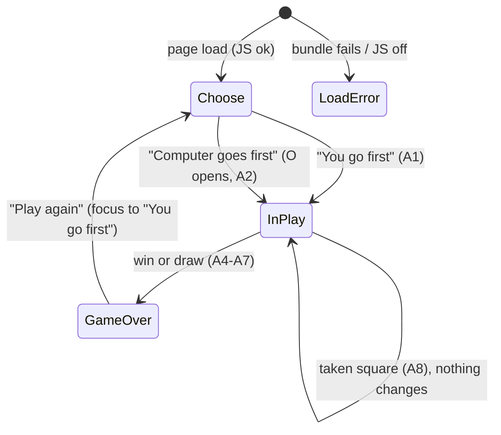

You are an independent second-opinion reviewer in a software factory pipeline.
A different AI (Claude) produced the DRAFT below. Your job is to find what it got
wrong, what it missed, and where a materially better approach exists. Do not
rubber-stamp, and do not inflate: report only findings you would defend with
evidence (a line, an input that breaks it, a requirement it violates). Do not
rewrite the whole thing. Be specific and terse.

Review kind: other
Reviewer: {{REVIEWER}}
Project: factory-tictactoe

Focus especially on: Second pass after fixes. The first pass found: C1 reduced motion still moved controls; C2 the tokens test's --motion-fast assertion and shadow coverage were not in the implementation impact. A UX review also found: no board floor (tiles spilled on short viewports), a drop animation that hid pieces (opacity 0 plus a 120 ms stagger), off-centre win line maths, token/CSS name drift, X/O contrast class ambiguity, weak disabled-vs-active distinction and a 320x568 fold problem, a button focus ring lost on the button edge, winning pieces shrinking, and iOS :active. Verify that each is resolved in design-system.md, tokens.json, screens.md and the mockup CSS, and report anything new or still wrong.

Respond in EXACTLY this format (markdown):

## Verdict
Exactly one of:
- AGREE — no CRITICAL or HIGH findings.
- AGREE-WITH-CONCERNS — CRITICAL or HIGH findings that can be fixed within this approach.
- DISAGREE — the approach itself is wrong: you would redo it rather than patch it, and you describe what instead under Alternative.
Findings alone, however many or severe, never make a DISAGREE; they make AGREE-WITH-CONCERNS.
One sentence of justification.

## Findings
Number every finding C1, C2, … so the author can answer each one. One bullet each:
- [C1] [CRITICAL|HIGH|MEDIUM|LOW] <where> — <what is wrong> — <evidence> — <what to do instead>
(CRITICAL = will cause data loss, security hole, wrong behavior, or blocks the goal. Use it sparingly and only when sure.)

## Missing
Bullets: things the draft should address but doesn't. Empty if none.

## Alternative
If you would take a materially different approach, describe it in <=8 lines and say why it's better. Otherwise write "None".

## Questions for the human
Bullets: decisions only the product owner can make. Empty if none.

=== CONTEXT (read-only, for reference) ===

--- .factory/design/tokens.json ---
{
  "$comment": "Design tokens for factory-tictactoe, direction C 'Tabletop Tiles' (chosen 2026-09-28). Consumed as CSS custom properties (--color-text etc.). One light scheme only: themes and dark mode are out of scope (PRD non-goals). Contrast ratios are against the background named in design-system.md section 2 and are re-checked by a unit test (acceptance R-013).",
  "version": 2,
  "color": {
    "light": {
      "surface": "#f3e8d4",
      "surface-tile": "#fffaf0",
      "surface-sunken": "#ecdfc6",
      "board-well": "#e3cfae",
      "tile-edge": "#c6a57b",
      "text": "#2b1d13",
      "text-muted": "#4f3b2b",
      "primary": "#0b5b62",
      "primary-hover": "#08494f",
      "primary-edge": "#06363a",
      "on-primary": "#fffaf0",
      "border": "#7a5f44",
      "border-disabled": "#7a5f44",
      "focus": "#2b1d13",
      "mark-x": "#b3261e",
      "mark-o": "#0b5b62",
      "win-surface": "#ffd766",
      "win-edge": "#b98d1c",
      "win-marker": "#2b1d13"
    }
  },
  "font": {
    "family": "system-ui, -apple-system, 'Segoe UI', Roboto, 'Helvetica Neue', Arial, sans-serif",
    "family-display": "ui-rounded, system-ui, -apple-system, 'Segoe UI', Roboto, 'Helvetica Neue', Arial, sans-serif",
    "size": {
      "small": "0.875rem",
      "body": "1rem",
      "button": "1.125rem",
      "status": "1.125rem",
      "display": "2.25rem",
      "display-narrow": "1.75rem"
    },
    "line": {
      "small": "1.4",
      "body": "1.5",
      "status": "1.4",
      "display": "1.1",
      "button": "1.4"
    },
    "weight": {
      "regular": 400,
      "semibold": 600,
      "bold": 700,
      "heavy": 800
    },
    "$comment": "Both stacks are system fonts; nothing is downloaded. ui-rounded exists on Apple platforms and falls back to system-ui elsewhere. The body stack starts with system-ui (acceptance R-013)."
  },
  "space": {
    "1": "4px",
    "2": "8px",
    "3": "12px",
    "4": "16px",
    "5": "24px"
  },
  "radius": {
    "tile": "18px",
    "tray": "26px",
    "pill": "999px"
  },
  "shadow": {
    "tile": "0 6px 0 var(--color-tile-edge), 0 8px 10px rgba(84, 56, 26, 0.25)",
    "tile-resting": "0 2px 0 var(--color-tile-edge)",
    "tile-pressed": "0 2px 0 var(--color-tile-edge)",
    "tile-win": "0 9px 0 var(--color-win-edge), 0 12px 16px rgba(84, 56, 26, 0.3)",
    "tray": "inset 0 3px 8px rgba(84, 56, 26, 0.25)",
    "button": "0 5px 0 var(--color-primary-edge)",
    "button-pressed": "0 1px 0 var(--color-primary-edge)",
    "mark": "drop-shadow(0 2px 0 rgba(43, 29, 19, 0.28))",
    "$comment": "Hard, offset 'wooden edge' shadows make tiles and buttons read as physical pieces. The rgba blurs are decorative; no information depends on them."
  },
  "motion": {
    "press": "80ms ease-out",
    "drop": "280ms cubic-bezier(0.3, 1.6, 0.5, 1)",
    "lift": "240ms ease-out",
    "lift-delay": "280ms",
    "$comment": "Basic feedback only (PRD non-goal: animations beyond basics). Game state, status text and announcements change instantly, and a placed piece is visible from the first frame (the drop moves it, never hides it). No single animation exceeds 280 ms; a winning move settles by 520 ms. Under prefers-reduced-motion: reduce, every animation, transition and press/hover movement is removed; pressed and lifted states are shown without movement."
  },
  "size": {
    "page-max": "28rem",
    "board-max": "max(180px, min(100%, 360px, 45svh))",
    "tray-padding": "12px",
    "square-gap": "12px",
    "win-line-inset": "calc(var(--size-tray-padding) - var(--size-square-gap) / 2)",
    "border": "2px",
    "border-win": "4px",
    "win-line": "12px",
    "press-depth": "4px",
    "lift-height": "3px",
    "mark-inset": "14%",
    "status-min-lines": {
      "narrow": 3,
      "wide": 2,
      "$comment": "Reserved so the board never moves when the status wraps; narrow is below 480px."
    },
    "actions-min-height": {
      "narrow": "calc(2 * 44px + 12px + 5px)",
      "wide": "calc(44px + 5px)",
      "$comment": "Buttons are exactly 44px tall at default text size (min-height, no vertical padding) plus the 5px button edge, so the board never moves between states."
    },
    "button-edge": "5px",
    "button-padding-inline": "22px",
    "button-padding-inline-compact": "16px",
    "$comment": "board-max has a 180px floor = 3 x 44px tiles + 2 gaps + 2 tray paddings, so tiles never drop below 44px or spill out of the tray; 45svh keeps both stacked choice buttons on screen at 320 x 568. win-line-inset makes the overlay's 1/6, 1/2, 5/6 points land on tile centres."
  },
  "breakpoint": {
    "phone": "0",
    "wide": "480px",
    "desktop": "none (single fluid column from 320px up)"
  },
  "a11y": {
    "min-target": "44px",
    "focus-ring": "3px solid var(--color-focus)",
    "focus-offset": "3px",
    "focus-offset-button": "6px",
    "$comment": "Buttons use a 6px offset so the ring clears the 5px button edge."
  }
}

--- .factory/design/screens.md ---
# Screens: factory-tictactoe

_Traces to: `.factory/prd.md` §6 (Flows A and B, unhappy paths), `.factory/acceptance.md`, `design-system.md`, `tokens.json`. Direction C, Tabletop Tiles (design-system.md §1). One page with three states. Mockups are static HTML (`screens/*.html`), each showing every variant at 320 px and 760 px wide. Status: draft_

## Index

| Screen | File | Flow | Requirements | Components used | Notes |
|---|---|---|---|---|---|
| 1. Choose who goes first | `screens/game-01-choose-first.html` | A and B step 1; after Play again | R-001, R-002, R-006, R-007, R-010, R-012, R-013 | Title, status line, board (tray, disabled resting tiles), action area with choice button ×2, announcer, fallback message (tile card) | Variants: 1a default (focus on "You go first" after Play again); 1b load error (hidden by default, revealed only on a script error); 1c JavaScript off (`noscript`). The empty disabled board is the empty state. No symbol picker. |
| 2. In play | `screens/game-02-in-play.html` | A steps 2–5; B steps 2–3 | R-001, R-002, R-003, R-007, R-008, R-009, R-010 | Title, status line, board (tray; active and occupied tiles with X/O pieces, roving focus), action area with keyboard hint, announcer | Variants: 2a you first, empty board (A1); 2b computer first, O opens at row 1, column 1, focus on row 1, column 2 (A2); 2c mid-game after a move (A3); 2d taken square (A8). The visible status names the computer's last move. Always the human's turn when idle; no loading state (instant reply). Sample positions follow ADR-010 perfect play. Pieces placed by the last action (your X and the computer's O) drop in together, fully visible from the first frame; reload to replay, no motion with reduced motion. |
| 3. Game over | `screens/game-03-game-over.html` | A steps 6–7 | R-004, R-005, R-006, R-007, R-008, R-009, R-010 | Title, status line, board (disabled tiles, winning tiles), win line, action area with Play again button, announcer | Variants: 3a computer wins by diagonal (A6): gold lifted tiles with 4 px border and one continuous bar under the pieces; 3b draw (A5/A7), no highlight; 3c computer wins by row (bar direction check). A4 "You win" is unreachable and not mocked; it uses the 3a layout with different words. |

## Navigation

## Focus map

| From | Action | Focus goes to |
|---|---|---|
| Fresh load | — | nothing (document start); Tab reaches "You go first" |
| Choose | either choice | first empty square in reading order (row 1, column 1 if you went first; row 1, column 2 after the computer's opening O) |
| In play | place X (game continues) | the square just played |
| In play | taken square | stays on that square (status keeps the taken message until the next valid move) |
| In play | move ends the game | "Play again" |
| Game over | "Play again" | "You go first" |

## Copy (exact; tests assert it)

- Title `h1`: "Tic-tac-toe". No tagline (the `<title>` carries "play against a computer that never loses").
- Status line: "Who goes first?" · "Your turn. You are X." · "Computer placed O in row R, column C. Your turn. You are X." (computer went first) · "Computer placed O in row R, column C. Your turn." · "Row R, column C is taken. Choose an empty square." · "Computer wins with {LINE}." · "It's a draw." · "You win with {LINE}."
- Keyboard hint (during play): "Arrow keys move between squares. Enter or Space places X."
- Buttons: "You go first" · "Computer goes first" · "Play again".
- Fallbacks: load error "The game didn't load. Try reloading the page." · `noscript` "This game needs JavaScript, which is turned off in this browser. Turn it on and reload the page."
- Announcer: A1–A8 exactly as in `acceptance.md`.

## Later (not designed; PRD non-goals)

Tally, symbol choice, difficulty, hot-seat, undo, history, rules page, themes/dark mode, sound, animation beyond the basic press/drop/lift, translations. Rejected directions A (Chalkboard Night) and B (Arcade Cabinet) stay in `directions/` for the record only.

## Refinements from the design review (now in the specification)

The approver chose option (a) on 2026-09-27. Both refinements are now in `architecture.md` §2 and §5 and in `acceptance.md` (R-001, R-007, R-010).
1. **Focus after a choice** goes to the first empty square in reading order, not always row 1, column 1 (architecture §5), because the computer's opening O sits there.
2. **Load-error fallback** is hidden by default and revealed only on a script error, with new wording (architecture §2 said a visible static message removed on start, which would flash on every load).

## Verification (now acceptance criteria R-010 and R-001)

- **The board never moves.** At 320 × 568 and 1280 × 800 at default text size, the board's bounding box is identical in choose, in play (including a taken-square message and the longest computer-move status), and game-over states. At 200% text zoom, reflow takes priority and the board may shift; that is accepted.
- **Load error.** Aborting the bundle request shows "The game didn't load. Try reloading the page."; a normal load never shows it, not even briefly.

## Sample games (checked against ADR-010 perfect play)

- 2c/2d: X r1c1 → O r2c2 → X r3c3 → O r1c2.
- 3a: X r1c1 → O r2c2 → X r1c2 → O r1c3 → X r2c1 → O r3c1 (diagonal from top right).
- 3b: X r1c1 → O r2c2 → X r1c2 → O r1c3 → X r3c1 → O r2c1 → X r2c3 → O r3c2 → X r3c3 (draw).
- 3c: X r1c1 → O r2c2 → X r3c1 → O r2c1 → X r1c2 → O r2c3 (row 2).
- Computer opening: r1c1.

## Implementation impact (for planning)

The built app has the earlier flat look. This design changes only presentation; behaviour, copy, focus rules and announcements are unchanged. Planning needs a restyle feature, traced to R-005, R-010 and R-013, that covers:
- **Tokens:** `src/styles.css` `:root` takes the `tokens.json` (version 2) values 1:1; the mockups' `:root` is generated with the same mapping. `tests/unit/tokens.test.ts` compares the two, so it fails until the styles match. Its hard-coded `--motion-fast` = `0ms` assertion is obsolete and must change, and the now-meaningful `shadow` group (excluded today) should be covered.
- **Contrast test:** `tests/unit/contrast.test.ts` must list the pairs in design-system.md §2 by class: X and O are non-text (3:1) SVG graphics, not text. Its hard-coded published ratios change too.
- **Pieces:** X and O become inline SVG pieces (`<use href="#mark-x|#mark-o">`) from one hidden `<defs>` block; there are no text glyphs in tiles. Accessible names are unchanged.
- **Win line:** a single `.win-line` SVG overlay in the board replaces the per-square strike segments. The winning tiles keep the 4 px border (R-005's non-colour computed style).
- **Motion:** press, drop and lift, all inside `prefers-reduced-motion: no-preference`. Game state and announcements stay instant. The board-stability check (R-010) still holds, because motion happens inside tiles and the tray. Tests should assert:
  - under reduced motion, hover and press don't move anything;
  - only the pieces from the last action animate;
  - status, announcement and game-over focus are already updated in the frame the move lands, not after the animation.
- **Board size:** `max(180px, min(100%, 360px, 45svh))`. The R-010 board-stability check stays; add a check that tiles stay at least 44 px and inside the tray at 844 × 390.
- **Touch:** add a passive `touchstart` listener on `document` so iOS Safari shows `:active` presses.
- **Guards:** the new R-013 criterion (no font or image file requested; no `@font-face`, `` or file `url()` in `dist/`) needs a test.

--- .factory/design/screens/game-03-game-over.html ---
<!doctype html>
<!--
  MOCKUP, not implementation. Generated in the factory design phase for factory-tictactoe.
  Static HTML, CSS and inline SVG only; no JavaScript, fonts or image files. Direction C, Tabletop Tiles. Focus rings are drawn with .is-focused to show where
  focus sits; .is-new marks the pieces that drop in (reload to replay). Duplicate main/role=status per frame is mockup chrome. The frames, labels and dashed "Screen reader hears" boxes are presentation
  chrome and are not part of the product. Implementation copies the tokens (tokens.json) and the
  "product styles" block, and builds real components per architecture.md.
-->
<html lang="en">
<head><meta charset="utf-8"><meta name="viewport" content="width=device-width, initial-scale=1">
<title>Mockup: 3. Game over</title>
</head>
<body>
<svg width="0" height="0" style="position:absolute" aria-hidden="true" focusable="false"><defs><symbol id="mark-x" viewBox="0 0 100 100"><rect class="mark-x-bar" x="41" y="12" width="18" height="76" rx="9" transform="rotate(45 50 50)"/><rect class="mark-x-bar" x="41" y="12" width="18" height="76" rx="9" transform="rotate(-45 50 50)"/></symbol><symbol id="mark-o" viewBox="0 0 100 100"><circle class="mark-o-ring" cx="50" cy="50" r="28"/></symbol></defs></svg>
<header class="mock-header"><h1>Mockup: 3. Game over</h1>
Squares are disabled and “Play again” appears in the action area with focus. Traces to R-004, R-005, R-006, R-007, R-008, R-009 and R-010. A human win (“You win with …”, A4) cannot happen against the perfect computer, so it isn't mocked; it uses the same layout as 3a with the words changed. Sample games are real perfect-play games (ADR-010).
</header>
<section class="mock-state" aria-labelledby="3a"><h2 id="3a">3a. Computer wins with a diagonal, winning line highlighted</h2>
You played row 1, column 1, then row 1, column 2, then row 2, column 1. The computer played row 2, column 2, then row 1, column 3, then won at row 3, column 1. The three winning tiles turn gold, lift 3 px and get a 4 px dark border; one continuous dark bar runs through them, and the line is named in text, so colour isn't the only cue. The bar runs under the pieces, so the O stays readable.

Phone, 320 px wide
<main class="page"><h1 class="title">Tic-tac-toe</h1>
Computer wins with the diagonal from top right to bottom left.

<button type="button" class="square" aria-label="Row 1, column 1, X" disabled><svg class="mark mark--x" aria-hidden="true" viewBox="0 0 100 100"><use href="#mark-x"/></svg></button><button type="button" class="square" aria-label="Row 1, column 2, X" disabled><svg class="mark mark--x" aria-hidden="true" viewBox="0 0 100 100"><use href="#mark-x"/></svg></button><button type="button" class="square" aria-label="Row 1, column 3, O" disabled data-winning="true"><svg class="mark mark--o" aria-hidden="true" viewBox="0 0 100 100"><use href="#mark-o"/></svg></button><button type="button" class="square is-new" aria-label="Row 2, column 1, X" disabled><svg class="mark mark--x" aria-hidden="true" viewBox="0 0 100 100"><use href="#mark-x"/></svg></button><button type="button" class="square" aria-label="Row 2, column 2, O" disabled data-winning="true"><svg class="mark mark--o" aria-hidden="true" viewBox="0 0 100 100"><use href="#mark-o"/></svg></button><button type="button" class="square" aria-label="Row 2, column 3, empty" disabled></button><button type="button" class="square is-new" aria-label="Row 3, column 1, O" disabled data-winning="true"><svg class="mark mark--o" aria-hidden="true" viewBox="0 0 100 100"><use href="#mark-o"/></svg></button><button type="button" class="square" aria-label="Row 3, column 2, empty" disabled></button><button type="button" class="square" aria-label="Row 3, column 3, empty" disabled></button><svg class="win-line" aria-hidden="true" viewBox="0 0 300 300" preserveAspectRatio="none"><path d="M268 32 L32 268"/></svg>

<button type="button" class="button button--play-again is-focused">Play again</button>

You placed X in row 2, column 1. Computer placed O in row 3, column 1. Computer wins with the diagonal from top right to bottom left.
</main>
<strong>Screen reader hears (live region, not visible):</strong>A6: “You placed X in row 2, column 1. Computer placed O in row 3, column 1. Computer wins with the diagonal from top right to bottom left.”

Desktop, 760 px wide
<main class="page"><h1 class="title">Tic-tac-toe</h1>
Computer wins with the diagonal from top right to bottom left.

<button type="button" class="square" aria-label="Row 1, column 1, X" disabled><svg class="mark mark--x" aria-hidden="true" viewBox="0 0 100 100"><use href="#mark-x"/></svg></button><button type="button" class="square" aria-label="Row 1, column 2, X" disabled><svg class="mark mark--x" aria-hidden="true" viewBox="0 0 100 100"><use href="#mark-x"/></svg></button><button type="button" class="square" aria-label="Row 1, column 3, O" disabled data-winning="true"><svg class="mark mark--o" aria-hidden="true" viewBox="0 0 100 100"><use href="#mark-o"/></svg></button><button type="button" class="square is-new" aria-label="Row 2, column 1, X" disabled><svg class="mark mark--x" aria-hidden="true" viewBox="0 0 100 100"><use href="#mark-x"/></svg></button><button type="button" class="square" aria-label="Row 2, column 2, O" disabled data-winning="true"><svg class="mark mark--o" aria-hidden="true" viewBox="0 0 100 100"><use href="#mark-o"/></svg></button><button type="button" class="square" aria-label="Row 2, column 3, empty" disabled></button><button type="button" class="square is-new" aria-label="Row 3, column 1, O" disabled data-winning="true"><svg class="mark mark--o" aria-hidden="true" viewBox="0 0 100 100"><use href="#mark-o"/></svg></button><button type="button" class="square" aria-label="Row 3, column 2, empty" disabled></button><button type="button" class="square" aria-label="Row 3, column 3, empty" disabled></button><svg class="win-line" aria-hidden="true" viewBox="0 0 300 300" preserveAspectRatio="none"><path d="M268 32 L32 268"/></svg>

<button type="button" class="button button--play-again is-focused">Play again</button>

You placed X in row 2, column 1. Computer placed O in row 3, column 1. Computer wins with the diagonal from top right to bottom left.
</main>
<strong>Screen reader hears (live region, not visible):</strong>A6: “You placed X in row 2, column 1. Computer placed O in row 3, column 1. Computer wins with the diagonal from top right to bottom left.”

</section><section class="mock-state" aria-labelledby="3b"><h2 id="3b">3b. Draw</h2>
A full board with no winner (you went first, and your ninth-move X filled it). No square is marked as winning.

Phone, 320 px wide
<main class="page"><h1 class="title">Tic-tac-toe</h1>
It's a draw.

<button type="button" class="square" aria-label="Row 1, column 1, X" disabled><svg class="mark mark--x" aria-hidden="true" viewBox="0 0 100 100"><use href="#mark-x"/></svg></button><button type="button" class="square" aria-label="Row 1, column 2, X" disabled><svg class="mark mark--x" aria-hidden="true" viewBox="0 0 100 100"><use href="#mark-x"/></svg></button><button type="button" class="square" aria-label="Row 1, column 3, O" disabled><svg class="mark mark--o" aria-hidden="true" viewBox="0 0 100 100"><use href="#mark-o"/></svg></button><button type="button" class="square" aria-label="Row 2, column 1, O" disabled><svg class="mark mark--o" aria-hidden="true" viewBox="0 0 100 100"><use href="#mark-o"/></svg></button><button type="button" class="square" aria-label="Row 2, column 2, O" disabled><svg class="mark mark--o" aria-hidden="true" viewBox="0 0 100 100"><use href="#mark-o"/></svg></button><button type="button" class="square" aria-label="Row 2, column 3, X" disabled><svg class="mark mark--x" aria-hidden="true" viewBox="0 0 100 100"><use href="#mark-x"/></svg></button><button type="button" class="square" aria-label="Row 3, column 1, X" disabled><svg class="mark mark--x" aria-hidden="true" viewBox="0 0 100 100"><use href="#mark-x"/></svg></button><button type="button" class="square" aria-label="Row 3, column 2, O" disabled><svg class="mark mark--o" aria-hidden="true" viewBox="0 0 100 100"><use href="#mark-o"/></svg></button><button type="button" class="square" aria-label="Row 3, column 3, X" disabled><svg class="mark mark--x" aria-hidden="true" viewBox="0 0 100 100"><use href="#mark-x"/></svg></button>

<button type="button" class="button button--play-again is-focused">Play again</button>

You placed X in row 3, column 3. It's a draw.
</main>
<strong>Screen reader hears (live region, not visible):</strong>A5: “You placed X in row 3, column 3. It's a draw.” When the computer went first, its O fills the board and A7 is spoken instead.

Desktop, 760 px wide
<main class="page"><h1 class="title">Tic-tac-toe</h1><p class="status" id="status-3b-

--- .factory/prd.md ---
# PRD: factory-tictactoe

_Traces to: `.factory/intent.json` (v2, captured 2026-09-27T20:20:18Z). Status: draft_

## 1. Problem

Casual players who want a quick game of tic-tac-toe in a browser have to put up with ad-heavy, slow game sites that are awkward to use with a keyboard or screen reader, because those sites are built to maximise ad impressions rather than to play well. We will ship a fast, ad-free game with a computer opponent that never loses, playable by touch, mouse, keyboard and screen reader, with no install, sign-up or tracking. Severity is low for players; the build is also the end-to-end live test of the Software Factory, so every phase is exercised properly.

## 2. Users

| Persona | Context | Goal | Pain today |
|---|---|---|---|
| Casual novice player (primary) | About two minutes to spare, on a phone (touch) or laptop (mouse/trackpad); opens a link, plays one or two games, closes the tab | A quick game with zero friction | Ads, slow loads and sign-up prompts before the first move |
| Keyboard-only or screen-reader player (hard constraint, not a trade-off) | Same situations, using keyboard navigation and/or a screen reader | Play a complete game and always know the board state and result | Most game sites cannot be played without a pointer or give no spoken feedback |

A player who wants to beat the machine is served automatically by perfect play. By design a player can never win; the best outcome for the player is a draw.

## 3. Goals & Success Metrics

| Goal | Metric | Target | How measured |
|---|---|---|---|
| The computer is unbeatable | Computer losses across every reachable game position, both starting sides | 0 | Exhaustive automated test in CI (R-003) |
| Live and correct within 30 days | Done checklist: live URL loads; exhaustive test passes in CI; zero axe-core violations; JS bundle under 50 KB gzipped; full keyboard-only game completes | All 5 items true | Post-deploy smoke test (R-014), CI jobs (R-003, R-009, R-011), Playwright keyboard test (R-007) |

## 4. Non-goals (explicitly out of scope)

- Easier modes or difficulty levels
- Hot-seat two-player mode
- Win/draw tally
- Choosing X or O (picking a symbol)
- Sound
- Animations beyond basics
- Themes / dark mode
- PWA / offline install
- Translations
- Accounts
- Persistence
- Bigger boards
- Analytics
- Ads
- Real-device iOS/Android testing (this build)
- Screen readers other than VoiceOver; any manual screen-reader pass by the factory
- Undo / take-back
- Move history
- Rules / help page
- Custom domain

Complexity ceiling: anything that needs a server or storage.

## 5. Requirements

| ID | Requirement | Priority | Rationale |
|---|---|---|---|
| R-001 | The game shows a 3×3 board. Only legal moves are accepted: a move on an occupied square, out of turn, or after the game has ended changes nothing. | MUST | intent.scope.mvp[0] — legal moves only |
| R-002 | Before each game the player chooses who moves first: "You" or "Computer". The human is always X and the computer always O; when the computer starts, O opens (intended, not a bug). | MUST | intent.scope.mvp[0]; context.remember (first-mover rule) |
| R-003 | The computer plays perfectly and never loses: from every position reachable in a game against any sequence of legal human moves, with either side starting, the computer's play never produces a human win. Verified by an exhaustive automated test. | MUST | intent.success.primary_metric (target 0) |
| R-004 | The game detects a win (three in a row for X or O) and a draw (full board, no winner), ends the game at that moment, and shows a result message. | MUST | intent.scope.mvp[0] |
| R-005 | When a game is won, the three squares of the winning line are highlighted by a means that does not rely on colour alone, and the winning line is described in text. | MUST | intent.scope.mvp[0]; WCAG 2.2 AA 1.4.1 |
| R-006 | After a game ends, a "Play again" control returns the player to the first-mover choice with an empty board. | MUST | intent.scope.mvp[0] |
| R-007 | A full game, including the first-mover choice and "Play again", can be played with the keyboard only: Tab reaches the board, arrow keys move between squares, Enter or Space places X, and focus is always visible. | MUST | intent.scope.mvp[1]; success done-checklist item 5 |
| R-008 | A polite live region announces, with exact fixed wording, the start of each game, each human move, each computer move, invalid-move attempts, and the result including the winning line. The exact texts are the announcement contract A1–A8 in `acceptance.md`: a human move and the computer reply form one message that ends with either "Your turn." or the result. Each square exposes its position and contents as its accessible name. | MUST | intent.scope.mvp[1]; constraints (announcement text asserted in tests) |
| R-009 | The page meets WCAG 2.2 AA and has zero axe-core violations in every game state (choice, in play, won, drawn) in Chromium, Firefox and WebKit. | MUST | intent.constraints.quality_standards |
| R-010 | The layout works from 320 CSS px wide phones to laptop screens without horizontal scrolling or zoom, is playable by touch and mouse, and every square and button is at least 44×44 CSS px (above the WCAG 2.2 AA 2.5.8 minimum of 24 px, chosen for the touch-first primary persona; confirmed by the approver 2026-09-27). | MUST | intent.scope.mvp[2]; WCAG 2.2 1.4.10, 2.5.8 |
| R-011 | The production JavaScript bundle is under 50 KB gzipped; CI fails the build if it is not. | MUST | intent.constraints (performance) |
| R-012 | The game makes no network requests beyond its own static files, sets no cookies, uses no web storage, and contains no analytics, ads, sign-up or install prompt. | MUST | intent.constraints; technology.excluded; complexity ceiling |
| R-013 | The visual style is high-contrast (text at least 7:1, non-text indicators at least 3:1), uses only the system font stack, and draws every visual locally with CSS or inline SVG: no web fonts, no external images, no existing brand. Its personality is set in the design phase (intent.design.personality). | MUST | intent.constraints; intent.design |
| R-014 | Whenever CI passes for the latest commit on main, GitHub Actions builds exactly that commit and deploys it to GitHub Pages. An older merge whose CI finishes after a newer merge is not deployed separately; it goes live as part of the newer commit. A post-deploy smoke test waits until the live page shows the deployed commit, then plays one move. If it fails, the workflow redeploys the Pages artifact of the most recent deploy run whose deploy and smoke test both succeeded, and the run fails, so the repo owner gets the Actions failure email. If no such run exists (first deployment) or its artifact has expired (artifacts are kept 90 days), the workflow only logs that and fails. Nothing more. | MUST | intent.operations; success done-checklist item 1; approver decisions 2026-09-27 |
| R-015 | Supported browsers are the current and previous versions of Chrome, Firefox, Safari and Edge, plus iOS Safari and Android Chrome; the build targets `es2022`, which all of them support. Automated verification is narrower and engine-level only: every end-to-end test runs in Chromium, Firefox and WebKit plus touch-enabled Android and iPhone emulations. Testing specific browser versions or real devices is not performed; the QA report lists it as human follow-up. | MUST | intent.constraints (browser support, verification) |

## 6. User Flows

**Flow A — player moves first (primary)**
1. Player opens the URL. The page shows the title and the first-mover choice ("You go first" / "Computer goes first"); the board is empty.
2. Player chooses "You go first". The board becomes active; status reads "Your turn. You are X."
3. Player places X on an empty square (tap, click, or Enter/Space on the focused square).
4. The computer immediately places O. Both moves are announced in one message.
5. Steps 3–4 repeat until a win or draw.
6. The result is shown and announced; on a win the three squares are highlighted and the line described. "Play again" appears and receives focus.
7. "Play again" returns to step 1's choice with an empty board.

**Flow B — computer moves first**
1–2. As Flow A, but the player chooses "Computer goes first". The computer places O immediately; the announcement states that O opens.
3. Play continues as Flow A from step 3.

**Unhappy paths**
- Player activates an occupied square: nothing changes on the board; the live region says the square is taken.
- Player activates a square after the game has ended: nothing changes (squares are disabled).
- Player tries to play before choosing who goes first: squares are disabled until a choice is made.
- JavaScript disabled or failing to load: a static message says the game needs JavaScript.

## 7. Data

No stored data. Game state lives in memory for the life of the tab and is discarded on reload. No personal data, cookies, web storage or telemetry (R-012).

## 8. Integrations & External Dependencies

| System | Purpose | Auth | Failure mode |
|---|---|---|---|
| GitHub Actions | CI (format, lint, typecheck, unit, exhaustive, bundle size, e2e/axe) and deploy | Repository GITHUB_TOKEN | Build fails; nothing deploys; owner gets failure email |
| GitHub Pages | Static hosting | Pages deploy permission in workflow | Site unavailable (GitHub's uptime; no separate SLA); bad deploy triggers R-014 rollback |

At run time the game has no integrations.

## 9. Quality Requirements

- **Correctness:** 0 computer losses in the exhaustive test (R-003).
- **Accessibility:** WCAG 2.2 AA; zero axe-core violations in all game states; exact live-region text asserted in Playwright; keyboard-only full game in CI (R-007–R-009). A real VoiceOver pass and a real-device iOS/Android check are **not performed** by the factory; the QA report lists them as human follow-up.
- **Performance:** JS under 50 KB gzipped (R-011); no web fonts (R-013); no third-party requests (R-012).
- **Privacy/security:** no data collected, no cookies, no storage, no third-party scripts (R-012). Compliance: none applicable.
- **Browser support:** the supported browser list is a requirement; automated verification is engine-level only (R-015). Version-specific and real-device checks are human follow-up.

## 10. Open Questions

| # | Question | Owner | Blocking? |
|---|---|---|---|
| 1 | Should a "New game" control also be available mid-game (not only after the game ends)? **Resolved 2026-09-27: no.** "Play again" appears only after a game ends. | Approver | No (resolved) |
| 2 | Should the computer's reply be instant or shown after a short pause? **Resolved 2026-09-27: instant.** No animations beyond basics; both moves are announced in one message. | Approver | No (resolved) |

## 11. Second-opinion summary

Reviewed 2026-09-27 by Codex (AGREE, 2 MEDIUM) and Ollama qwen2.5:14b (summary only, no findings in the required format).
- Accepted: R-015 now separates the supported-browser requirement from the narrower engine-level verification (Codex C1). R-014 now defines the rollback target as the latest deploy run that concluded successfully, and states the first-deploy behaviour (Codex C2). R-008 points to the exact announcement contract A1–A8 (Codex, Missing).
- Rejected: Ollama's suggestions of a help page and testing more screen readers are explicit non-goals.
- Architecture review (Codex AGREE-WITH-CONCERNS, 3 HIGH and 4 MEDIUM, all resolved; Ollama non-conforming): R-014 changed by approver decision to deploy only the latest commit on main and to accept the 90-day artifact expiry limit on rollback.
Details: `.factory/reviews/specification-reconciliation.md`.

--- .factory/acceptance.md ---
# Acceptance criteria: factory-tictactoe

_Traces to: `.factory/prd.md`. Every criterion is written to be checked by an automated test (Vitest unit tests, Playwright end-to-end tests, or a CI script), except where it says "verified in deploy phase"._

## Conventions used below

- Squares are numbered by **row 1–3 (top to bottom)** and **column 1–3 (left to right)**.
- `{R}`, `{C}` are the row and column of the human's move; `{R2}`, `{C2}` are those of the computer's move.
- `{LINE}` is one of: `row 1`, `row 2`, `row 3`, `column 1`, `column 2`, `column 3`, `the diagonal from top left to bottom right`, `the diagonal from top right to bottom left`.

### Announcement text (exact, used by R-002, R-004, R-005, R-008)

| ID | When | Exact live-region text |
|---|---|---|
| A1 | Game starts, human first | `New game. You go first. You are X. Your turn.` |
| A2 | Game starts, computer first | `New game. Computer goes first as O. Computer placed O in row {R2}, column {C2}. Your turn.` |
| A3 | Human moves, game continues | `You placed X in row {R}, column {C}. Computer placed O in row {R2}, column {C2}. Your turn.` |
| A4 | Human move wins (unreachable with a perfect computer, still defined) | `You placed X in row {R}, column {C}. You win with {LINE}.` |
| A5 | Human move fills the board with no winner | `You placed X in row {R}, column {C}. It's a draw.` |
| A6 | Computer move wins | `You placed X in row {R}, column {C}. Computer placed O in row {R2}, column {C2}. Computer wins with {LINE}.` |
| A7 | Computer move fills the board with no winner | `You placed X in row {R}, column {C}. Computer placed O in row {R2}, column {C2}. It's a draw.` |
| A8 | Human activates an occupied square | `Row {R}, column {C} is taken. Choose an empty square.` |

Square accessible names: `Row {R}, column {C}, empty` / `Row {R}, column {C}, X` / `Row {R}, column {C}, O`.

## R-001 Board and legal moves

- **Given** a game in progress with the human to move, **when** the human activates an empty square, **then** exactly that square shows X and no other square changes before the computer's reply.
- **Given** a game in progress, **when** the human activates a square showing X or O, **then** the board is unchanged and it is still the human's turn.
- **Given** the game state module, **when** a human move is submitted while it is the computer's turn or after the game has ended, **then** the move is rejected and the returned state equals the input state (unit test).

### Unhappy paths

- **Given** the first-mover choice has not been made, **when** the player clicks, taps or presses Enter on any square, **then** nothing is placed (squares are disabled).
- **Given** JavaScript is disabled, **when** the page loads, **then** a visible message says the game needs JavaScript (Playwright with `javaScriptEnabled: false`).
- **Given** JavaScript is enabled but the JavaScript bundle request fails (Playwright aborts it), **when** the page loads, **then** the visible message "The game didn't load. Try reloading the page." is shown (tested against the production build in `dist/`, not the dev server); **and given** the bundle loads normally, **then** that message is never visible at any point during the load (it ships `hidden`).
- **Given** the production build, **when** start-up throws (the Playwright test serves `index.html` with the board's root element removed, so `main.ts` fails to find it), **then** the same load-error message is shown.

## R-002 First-mover choice

- **Given** a fresh page load, **when** it renders, **then** two controls "You go first" and "Computer goes first" are visible, the board is empty, and no control to choose a symbol exists.
- **Given** the choice is shown, **when** the player chooses "You go first", **then** the board is empty, it is the human's turn as X, and the live region reads A1.
- **Given** the choice is shown, **when** the player chooses "Computer goes first", **then** exactly one square shows O, no square shows X, and the live region reads A2 naming that square.
- **Given** any game, **when** squares are filled, **then** every human-placed mark is X and every computer-placed mark is O, regardless of who started.

## R-003 Perfect, never-losing computer

- **Given** both starting sides, **when** a test enumerates every legal human move at every position where it is the human's turn and applies the computer's chosen reply at every position where it is the computer's turn, **then** no reachable finished game is a human (X) win, and the test reports the number of finished games examined (greater than 0) for each starting side.
- **Given** a position where the computer can complete three in a row, **when** it chooses a move, **then** it completes the line (unit test over all such reachable positions).
- **Given** the same position twice, **when** the computer chooses a move, **then** it returns the same square both times (deterministic).
- **Given** successive games in one process with alternating starters (human, computer, human, …), **when** the exhaustive enumeration runs for each, **then** results are identical to running each starter in a fresh process (the memo stays valid across starters).
- **Given** CI, **when** the unit-test job runs, **then** the exhaustive test runs on every push and pull request and finishes in under 60 seconds.

## R-004 Win and draw detection with result message

- **Given** each of the 8 lines filled with X, and separately with O, **when** the board is evaluated, **then** the winner is that symbol and the line is identified (unit test, 16 cases).
- **Given** a full board with no three in a row, **when** it is evaluated, **then** the result is a draw.
- **Given** a move that wins or fills the board, **when** it is applied, **then** the game ends, all squares become disabled, and the visible result text contains "Computer wins", "You win" or "It's a draw" accordingly, and the live region reads A4, A5, A6 or A7 accordingly.

## R-005 Winning line highlight

- **Given** a game the computer has won, **when** the result is shown, **then** exactly the three squares of the winning line are marked as winning and each of them differs from non-winning squares in at least one non-colour computed style (border width or style, outline, or text decoration) or carries an overlaid line element.
- **Given** a game the computer has won, **when** the result is shown, **then** the visible result text and the live region both name the line using `{LINE}` wording.
- **Given** a drawn game, **when** the result is shown, **then** no square is marked as winning.

## R-006 Play again

- **Given** a finished game, **when** the result is shown, **then** a "Play again" button is visible and has keyboard focus.
- **Given** a game in progress, **when** the page is inspected, **then** no "Play again" button is visible.
- **Given** a finished game, **when** the player activates "Play again", **then** the board is empty, the first-mover choice is shown, and focus is on "You go first".

## R-007 Keyboard-only play

- **Given** a fresh page, **when** a Playwright test plays a complete game using only Tab, Shift+Tab, arrow keys, Enter and Space (no pointer events), choosing "You go first", **then** the game reaches a result and "Play again" can be activated from the keyboard to start a second game choosing "Computer goes first", which also reaches a result.
- **Given** the board has focus, **when** an arrow key is pressed, **then** focus moves one square in that direction, stays put at the board edge, and exactly one square is in the Tab order at any time.
- **Given** a square has focus, **when** Enter or Space is pressed on an empty square, **then** X is placed there.
- **Given** the first-mover choice, **when** the player chooses "You go first", **then** focus is on row 1, column 1; **and when** the player chooses "Computer goes first", **then** focus is on the first empty square in reading order (row 1, column 2 after the opening O at row 1, column 1).
- **Given** any focused control, **when** its computed style is read, **then** it has a visible focus indicator with an outline or border at least 2 CSS px wide.

## R-008 Screen-reader announcements

- **Given** each situation A1–A3 and A5–A8, **when** it occurs in a Playwright test, **then** the live region (`role="status"`, polite) text equals the exact string in the announcement table, with placeholders filled.
- **Given** A4 (human win), which the real opponent makes unreachable, **when** a unit test drives the game state machine with an injected opponent that loses and passes the events to the message builder, **then** the text equals A4 exactly; the production bundle contains no way to inject an opponent.
- **Given** any board state, **when** the squares are inspected, **then** each square's accessible name matches `Row {R}, column {C}, empty|X|O` for its current content.
- **Given** a human move, **when** the computer replies, **then** a single announcement covers both moves (the live region is updated once per human action).

## R-009 WCAG 2.2 AA and zero axe violations

- **Given** each game state (choice shown, game in progress, computer won, draw), **when** axe-core runs with tags `wcag2a`, `wcag2aa`, `wcag21a`, `wcag21aa` and `wcag22aa` in Chromium, Firefox and WebKit, **then** it reports 0 violations.
- **Given** the page, **when** it loads, **then** it has a `lang` attribute, a descriptive `<title>`, one `h1`, and the board is exposed as a labelled group.

## R-010 Responsive layout for touch and mouse

- **Given** viewports of 320×568, 390×844 and 1280×800 CSS px, **when** the page is shown in each game state, **then** `document.documentElement.scrollWidth` does not exceed the viewport width and all nine squares and both choice buttons are fully visible without scrolling horizontally.
- **Given** those viewports, **when** the bounding boxes of the squares and buttons are measured, **then** each is at least 44×44 CSS px.
- **Given** a touch-enabled phone emulation, **when** the player taps "You go first" and then an empty square, **then** X is placed there.
- **Given** a desktop viewport, **when** the player clicks "You go first" and then an empty square, **then** X is placed there.
- **Given** viewports of 320×568 and 1280×800 at default text size, **when** the page moves through the choose state, play (including a taken-square message and the longest computer-move status), and the game-over state, **then** the board's bounding box (x, y, width, height) is identical in every state. At 200% text zoom reflow takes priority and this check does not apply.

## R-011 Bundle size

- **Given** a production build, **when** the CI size check sums the gzipped size of every JavaScript file in `dist/`, **then** the total is under 51,200 bytes, and the check fails the build otherwise.

## R-012 No tracking, storage or third-party requests

- **Given** a Playwright test that records every network request while loading the page and playing a full game, **when** the game ends, **then** every request went to the page's own origin.
- **Given** the same full game, **when** it ends, **then** `document.cookie` is empty and `localStorage.length` and `sessionStorage.length` are 0.
- **Given** the built `dist/` output, **when** it is scanned, **then** it contains no script, link or iframe pointing to another origin.

## R-013 High-contrast, system fonts, locally drawn visuals

- **Given** the page, **when** the computed `font-family` of the body is read, **then** it begins with `system-ui`, and no font files are requested during a full game.
- **Given** the design tokens, **when** a unit test computes the contrast of every text colour against its background, **then** each ratio is at least 7:1, and every non-text indicator (square borders, focus ring, winning-line marker) is at least 3:1 against its background.
- **Given** a Playwright test that records every request while loading the page and playing a full game, **when** the game ends, **then** no font file and no image file (raster or SVG, from any origin, including the page's own) was requested, and the built `dist/` contains no `@font-face` rule, no `` element, and no `url()` that references a file (every visual is CSS or inline SVG).

## R-014 Deploy to GitHub Pages with smoke test and minimal rollback

- **Given** a merge to main whose CI passes and which is still the latest commit on main, **when** the deploy workflow runs, **then** it builds exactly that commit (`workflow_run.head_sha`) and publishes it to GitHub Pages. The smoke test waits up to 3 minutes until the live page's `build-id` meta equals that SHA, then chooses "You go first", places one X, sees the computer's O, and passes. _Verified in deploy phase._
- **Given** CI passes for a commit that is no longer the latest commit on main, **when** its deploy run acquires the concurrency slot, **then** it skips without deploying. _Verified in deploy phase._
- **Given** deploy runs that overlap (one running, the latest commit's run queued, and an older commit's run queued after it), **when** they are processed, **then** none of them is discarded (`queue: max`, first in, first out), the older one skips as stale, and the latest commit ends up live. _Verified in deploy phase; the workflow's concurrency block is checked statically in CI._
- **Given** a manual `workflow_dispatch` run, **when** main's CI for its tip is pending or failed, **then** the run refuses to deploy and fails with a message. _Verified in deploy phase._
- **Given** a deploy whose smoke test fails (forced by the workflow's manual `force_smoke_failure` input), **when** the rollback job runs, **then** it redeploys, unchanged, the Pages artifact of the latest deploy run whose deploy and smoke jobs both succeeded (a stale no-op run in between is never chosen), under the artifact name `github-pages-rollback`, does nothing else, and the workflow run concludes as failed so GitHub emails the repo owner. _Verified in deploy phase._
- **Given** no previous successful deploy run exists, or its artifact has expired, **when** the smoke test fails, **then** the rollback job logs that no previous artifact is available and the run fails. _Verified in deploy phase._

## R-015 Browser coverage

- **Given** the Playwright configuration, **when** CI runs the end-to-end suite, **then** every spec runs in five projects — Chromium, Firefox, WebKit, a touch-enabled Android phone emulation (Chromium) and a touch-enabled iPhone emulation (WebKit) — and all pass.
- **Given** the production build, **when** Vite builds it, **then** its build target covers the current and previous versions of Chrome, Firefox, Safari and Edge and iOS Safari (build target `es2022`, supported by all of them).

=== DRAFT UNDER REVIEW: .factory/design/design-system.md ===
# Design System: factory-tictactoe

_Traces to: `.factory/prd.md` (users, flows), `intent.constraints.quality_standards`, `intent.design` (personality: playful, tactile, confident; references: "a chalkboard at a game night", "classic arcade cabinets"; avoid: generic web-app blue, flat grey admin look). Tokens live in `tokens.json`; this file explains them. Direction boards: `directions/`. Status: draft_

## 1. Direction and principles

**Chosen direction: C, Tabletop Tiles** (`directions/c-tabletop-tiles.html`). The approver chose it on 2026-09-28 as shown: chunky cream tiles on a warm table, tomato-red X and teal O pieces, tiles that sink when pressed, pieces that drop in with a small bounce, gold lifted winning tiles, and a teal pill button. C takes the game-night warmth of the chalkboard reference but not its dark slate, and the chunky, press-me buttons of the arcade reference but not its neon. There is one light scheme only; dark mode is a PRD non-goal, meaning no second or switchable theme.

- **Rejected:** A, Chalkboard Night (hand-drawn chalk on a dark slate), and B, Arcade Cabinet (pixel marks, neon on ink). Nothing from them is combined into C.
- **Why C:** it is the most *tactile* of the three. Every square reads as a physical piece you press, which suits the touch-first primary persona. It is *playful* through its shapes and bounce, not through decoration, and *confident* through big, saturated pieces and a heavy rounded title. It avoids both things the intent rules out: tomato and teal instead of web-app blue, and a warm wooden table instead of a flat grey panel. It is also the only light direction, so it stays calm and easy to read in daylight on a phone.

**Who and what.** The game is for a casual player with a couple of minutes, often on a phone, who wants to play at once. It should feel like pulling a sturdy wooden game off the shelf: warm, solid and a little bouncy. It is deliberately not a skeuomorphic toy with textures or images; the whole look comes from colour, radius and hard offset shadows drawn in CSS and inline SVG (R-013).

- **Nothing between the player and the first move.** One centred column: title, status line, board, action area. No tagline, nav or footer. (R-002, persona)
- **Pieces you can press.** Tiles and buttons have a visible wooden edge underneath and sink into it when pressed. The feedback is physical, not a colour flash. (intent.design.personality: tactile)
- **The board never moves.** The status line and the action area reserve their height, and tile motion (press, drop, lift) happens inside the board's box, never changing its size or position. (R-010)
- **Every state is visible, sayable and reachable.** Turn, the computer's last move, a taken square, the result and the winning line are all shown in the status, spoken by the announcer, and reachable by keyboard. (R-005, R-007, R-008)
- **Shape first, colour second.** X is a cross and O is a ring, so they differ by shape; their colours (tomato and teal) only reinforce that. The winning line is shown by a thick border, a continuous dark bar and the status text, with the gold fill as a supporting cue. (R-005, WCAG 1.4.1)
- **Motion is a garnish.** Game state, the status text and announcements change instantly. Press, drop and lift are short decoration on top, and all of it is removed under reduced motion. (PRD non-goal: animations beyond basics; PRD open question 2: instant reply)

## 2. Color

One light scheme: themes and dark mode are out of scope (PRD non-goals), so there are no dark values. Ratios were computed with the WCAG relative-luminance formula (by `.factory/checkpoints/gen_directions.py`'s `contrast`); the R-013 unit test recomputes them from `tokens.json`. The house rule is text at least 7:1 and non-text at least 3:1.

| Role | Light | Dark | Used for | Class | Contrast |
|---|---|---|---|---|---|
| surface | #f3e8d4 | n/a (out of scope) | page background (the table) | background | — |
| surface-tile | #fffaf0 | n/a | active tile face | background | — |
| surface-sunken | #ecdfc6 | n/a | disabled tile face (before a choice, after game over); darker than an active tile and closer to the tray, so a disabled tile reads as settled | background | — |
| board-well | #e3cfae | n/a | the tray the tiles sit in (decorative; tiles carry their own border) | background | — |
| tile-edge | #c6a57b | n/a | the 6 px wooden edge under each tile (decorative) | decorative | — |
| text | #2b1d13 | n/a | title, status | text (7:1) | 13.44:1 on surface; 15.67:1 on surface-tile; 12.37:1 on surface-sunken; 11.77:1 on win-surface |
| text-muted | #4f3b2b | n/a | keyboard hint | text (7:1) | 8.68:1 on surface |
| primary | #0b5b62 | n/a | button fill (teal pill) | non-text (3:1) | 6.44:1 vs surface (non-text) |
| primary-hover | #08494f | n/a | button fill on hover | background | on-primary 9.72:1 on it |
| primary-edge | #06363a | n/a | the 5 px button edge (decorative) | decorative | — |
| on-primary | #fffaf0 | n/a | button labels | text (7:1) | 7.51:1 on primary |
| border | #7a5f44 | n/a | tile outline (2 px) | non-text (3:1) | 3.89:1 on board-well; 5.69:1 on surface-tile; 2.56:1 on tile-edge (bottom side only; the other three sides and the edge itself mark the tile's boundary) |
| border-disabled | #7a5f44 | n/a | disabled tile outline (2 px); a separate role so the disabled look can change without touching the active one | non-text (3:1) | 3.89:1 on board-well; 4.49:1 on surface-sunken |
| focus | #2b1d13 | n/a | focus ring (3 px, 3 px offset) | non-text (3:1) | 13.44:1 on surface; 10.72:1 on board-well (a tile's ring lands on the tray); a button's ring sits 6 px out, clear of its 5 px edge |
| mark-x | #b3261e | n/a | X piece (tomato) | non-text (3:1): SVG graphic | 6.28:1 on surface-tile; 4.96:1 on surface-sunken; 4.72:1 on win-surface |
| mark-o | #0b5b62 | n/a | O piece (teal) | non-text (3:1): SVG graphic | 7.51:1 on surface-tile; 5.93:1 on surface-sunken; 5.64:1 on win-surface |
| win-surface | #ffd766 | n/a | winning tile face (gold; supporting cue only) | background | text 11.77:1 on it |
| win-edge | #b98d1c | n/a | the deeper edge under a lifted winning tile (decorative) | decorative | — |
| win-marker | #2b1d13 | n/a | winning border (4 px) and bar (12 px) | non-text (3:1) | 11.77:1 on win-surface; 10.72:1 on board-well; 5.35:1 on win-edge |

X and O are SVG graphics, not text, so they are held to the non-text 3:1 rule; each is also identified by shape and by the square's accessible name. There are no success, warning or danger colours; a taken square is reported in the status line in normal text. Rule: screens use roles only, never raw hex. The rgba shadow blurs in `tokens.json` are decorative and carry no information.

## 3. Typography

| Token | Size / line | Weight | Family | Used for |
|---|---|---|---|---|
| display | 2.25rem / 1.1 (1.75rem below 480 px) | 800 | display | page title "Tic-tac-toe" (the one `h1`) |
| status | 1.125rem / 1.4 | 600 | body | status line |
| button | 1.125rem / 1.4 | 700 | body | button labels |
| body | 1rem / 1.5 | 400 | body | default |
| small | 0.875rem / 1.4 | 400 | body | keyboard hint |

- **Body stack:** `system-ui, -apple-system, 'Segoe UI', Roboto, 'Helvetica Neue', Arial, sans-serif` (the `body` computed `font-family` begins with `system-ui`, R-013).
- **Display stack:** `ui-rounded, system-ui, …`: the rounded system face on Apple platforms, the normal system face elsewhere. Both are installed fonts; no font file is ever requested (R-012, R-013).
- X and O are not type. They are inline SVG pieces (§5 Board square), so they no longer depend on a font's glyphs.
- Sizes are in `rem`, so text zoom works; the layout reflows at 200% zoom and at 320 px wide (WCAG 1.4.4, 1.4.10).

## 4. Spacing, radius, elevation, motion

- **Spacing** (4-based): 4 / 8 / 12 / 16 / 24 px. Page padding is 16 px on phones and 24 px from 480 px up. Title, status, board and action area are 16 px apart. The tray has 12 px padding and 12 px gaps between tiles.
- **Radius:** tiles 18 px, the tray 26 px, buttons fully rounded (pill). Rounded everywhere; nothing is sharp.
- **Elevation:** hard offset "wooden edge" shadows, not soft floating cards.
  - `tile`: a 6 px edge plus a soft contact shadow; active tiles.
  - `tile-resting`: a 2 px edge; with the darker surface-sunken face, disabled tiles look settled into the tray, not ready to press.
  - `tile-pressed`: a 2 px edge while pressed; the tile moves down 4 px, so its top meets where the edge was.
  - `tile-win`: a 9 px gold edge; winning tiles are lifted 3 px.
  - `tray`: an inset shadow, so the tray reads as a recess in the table.
  - `button` / `button-pressed`: a 5 px teal edge that shrinks to 1 px as the button moves down 4 px.
  - `mark`: a 2 px drop shadow under each piece.
- **Motion** (all inside `@media (prefers-reduced-motion: no-preference)`):
  - *press*: 80 ms ease-out. A tile or button moves down 4 px as its edge shrinks; an empty tile rises 1 px on hover.
  - *drop*: every piece placed by the last action (your X and the computer's reply) drops in from 22 px above at 1.15× scale with a small overshoot (280 ms, `cubic-bezier(0.3, 1.6, 0.5, 1)`). The piece is fully opaque from the first frame, so a taken square never looks empty. The board state, status and announcement are already final; this is decoration only.
  - *lift*: on a win, the three winning tiles and the bar rise 3 px and the tiles' edge deepens (240 ms, starting at 280 ms when the last piece has landed). The whole sequence settles by 520 ms; no single animation exceeds 280 ms.
  - *reduced motion*: no transitions, no animations, no hover or press movement. Pieces simply appear, and winning tiles are shown lifted without moving. A press is shown by the edge shrinking in place.
  - *refinement from the board*: the direction board used a 200 ms drop delay, a 250 ms lift delay and a 3 px sink. The design system starts the drop at once, lifts when the drop ends, and sinks 4 px so the tile meets its edge. It drops the board's X-then-O stagger, because a delayed piece looked like an empty square (UX review).
- **Sizes:**
  - **Column and board:** the page column is at most 28rem. The board (the tray) is `max(180px, min(100%, 360px, 45svh))` square.
    - 180 px is the floor, 3 × 44 px tiles plus 2 gaps and 2 paddings, so tiles never fall below 44 px or spill out of the tray on short screens (phone landscape, 400% zoom); the page scrolls instead.
    - 45svh keeps both stacked choice buttons on screen on a 320 × 568 phone.
    - Tiles are about 69 px on a 320 × 568 phone, 44 px in phone landscape and 104 px on desktop.
  - **Reserved heights:** the status reserves 3 lines below 480 px and 2 above. The action area reserves `2 × 44 + 12 + 5` px below 480 px and `44 + 5` px above. Buttons are exactly 44 px tall at default text size (a minimum height with no vertical padding), and the 5 px is the button edge. The title drops to 1.75rem below 480 px to leave room.
  - **Minimum target:** 44 × 44 px (R-010).

## 5. Components

### Choice button ("You go first" / "Computer goes first")
- **Purpose:** start a game and pick who moves first (R-002).
- **Variants:** one style, the teal pill. Both choices are equal, so neither is visually preferred. They sit in the action area below the board, side by side, or stacked when they don't fit at 320 px.
- **States:**
  - *default*: primary fill, on-primary label, `button` edge.
  - *hover*: primary-hover fill.
  - *active/pressed*: the edge shrinks to `button-pressed` and the button moves down 4 px (no movement under reduced motion).
  - *focus-visible*: 3 px focus ring with a 6 px offset, clear of the 5 px edge.
  - No disabled or loading states: the buttons only exist while choosing.
- **Anatomy:** native `<button type="button">` with a visible text label, at least 44 px tall (22 px side padding; 16 px for the two choice buttons, which size to their labels so both fit on one row at the 360 px board width and stack on phones), inside `div role="group" aria-label="Who goes first"`.
- **Do / Don't:** do keep the wording exact (tests assert it). Don't add icons or a symbol picker (a non-goal).

### Play again button
- **Purpose:** return to the choice after a game ends (R-006).
- **States:** as the choice button. It exists only in the game-over state and receives focus when it appears.
- **Do / Don't:** do make it the full width of the action area. Don't show it during play.

### Board (the tray)
- **Purpose:** the 3 × 3 grid (R-001).
- **Anatomy:** `div role="group" aria-label="Board"`, a CSS grid of 3 × 3 with 12 px gaps and padding, board-well fill, `tray` inset shadow, 26 px radius and a square aspect ratio. During play it has `aria-describedby="hint"`. It is `position: relative` so the win line (below) can overlay it.
- **Keyboard:** roving tabindex; arrow keys move one square and stop at the edges; Enter/Space activate (ADR-012).

### Board square (tile)
- **Purpose:** show a cell and accept a move (R-001, R-007).
- **Variants:** empty · X · O.
- **States:**
  - *disabled* (before a choice and after game over): `disabled` attribute, surface-sunken face, border-disabled outline, `tile-resting` edge, out of the Tab order. The darker face and low edge make it read as not pressable. Marks keep their colours.
  - *active empty* (during play): surface-tile face, border outline, `tile` edge, pointer cursor.
  - *occupied during play*: `aria-disabled="true"`. Same look as active but no pointer cursor and no press movement; still focusable.
  - *hover* (active empty only): rises 1 px (no movement under reduced motion).
  - *pressed* (active empty only): the `tile-pressed` edge, moving down 4 px (the edge change only, under reduced motion). iOS Safari applies `:active` only when the page has a `touchstart` listener; the implementation adds a passive one on `document`.
  - *focus-visible*: 3 px focus ring, 3 px offset; it lands on the tray colour. Exactly one tile has `tabindex="0"`.
  - *winning*: `data-winning="true"`, win-surface face, 4 px win-marker border, `tile-win` edge, lifted 3 px (with `top`, not `transform`, so the piece above the bar keeps its stacking order). The padding shrinks by the extra 2 px of border, so the piece keeps its size.
- **Mark (piece):** an inline `<svg viewBox="0 0 100 100" aria-hidden="true">` inset 14% inside the tile, using `<use href="#mark-x">` or `#mark-o` from one hidden `<svg><defs>` block in the page (same-document fragments, not files; R-013).
  - X: two 18 × 76 rounded bars (rx 9) crossed at ±45°, in mark-x.
  - O: a ring with radius 28 and a 17-unit stroke, in mark-o.
  - Each piece has the `mark` drop shadow.
- **Anatomy:** native `<button>` with accessible name `Row R, column C, empty|X|O`. The piece is `aria-hidden` because the name already carries it.
- **Do / Don't:** do keep X and O different in shape. Don't show the winning line by colour only, and don't put text glyphs in the tile.

### Win line
- **Purpose:** a single continuous bar through the three winning tiles (R-005).
- **Anatomy:** one `<svg class="win-line" aria-hidden="true" viewBox="0 0 300 300" preserveAspectRatio="none">` absolutely covering the board, with one `<path>` in win-marker, 12 px round-capped stroke (`vector-effect: non-scaling-stroke`). It is drawn from the centre of the first winning tile to the centre of the third, extended 18 units at each end:
  - rows: y = 50, 150 or 250, from x = 32 to 268;
  - columns: the same with x and y swapped;
  - the diagonal from top left to bottom right: (32, 32) to (268, 268);
  - the diagonal from top right to bottom left: (268, 32) to (32, 268).
  The overlay is inset by `tray-padding − gap / 2` (6 px), which puts tile centres exactly at 1/6, 1/2 and 5/6 of it, and it rises 3 px with the winning tiles. In the mockups, every one of the 8 lines was measured through the lifted tile centres at both board sizes (worst error 0.01 px).
- **Layering:** the bar sits above the tile faces and below the pieces (bar `z-index: 1`, piece `z-index: 2`), so the O stays readable. It never overlaps the action area.

### Status line
- **Purpose:** visible text for the current state (R-004, R-005, R-008).
- **Content:**
  - choosing: "Who goes first?"
  - playing, you went first: "Your turn. You are X."
  - playing, computer went first: "Computer placed O in row R, column C. Your turn. You are X."
  - playing, after a move: "Computer placed O in row R, column C. Your turn."
  - taken square: "Row R, column C is taken. Choose an empty square." It stays until the next valid move; moving focus does not clear it.
  - over: "Computer wins with {LINE}." / "It's a draw." / "You win with {LINE}." (the last is unreachable)
- **Anatomy:** `
` in status type, reserving 3 lines below 480 px and 2 above. It is not a live region; the announcer is.

### Keyboard hint
- **Purpose:** make the arrow-key model discoverable (R-007).
- **Content:** "Arrow keys move between squares. Enter or Space places X."
- **Anatomy:** `
` in small, text-muted type, centred in the action area during play only. The board references it with `aria-describedby`.

### Announcer (visually hidden)
- **Purpose:** the exact spoken texts A1–A8 (R-008).
- **Anatomy:** `div role="status"` with the `visually-hidden` utility, present from load. It is cleared, then set on the next frame, so a repeated message is spoken again.
- **Mockups:** shown as a dashed "Screen reader hears" box, which is not part of the real UI.

### Fallback message
- **Purpose:** explain a failed load (R-001 unhappy paths).
- **Variants:**
  - `<noscript>`: "This game needs JavaScript, which is turned off in this browser. Turn it on and reload the page."
  - Load error: "The game didn't load. Try reloading the page." It sits in `index.html` with `hidden` and is revealed only on a real failure (architecture §2).
- **Anatomy:** a `
` in status type (text colour, semibold) on a surface-tile card with a 2 px border, 18 px radius and the `tile` edge, in place of the board and action area. The card keeps the table look even when the game can't start.

## 6. Patterns

- **Forms & validation:** there are none. The only "invalid input" is a taken square, handled as a status message: no error colour, no shake, no dialog.
- **Empty state:** the empty disabled tray of settled tiles under the choice shows what the game is before it starts.
- **Loading:** none in normal use; the bundle is tiny and the computer replies instantly. The load-error message appears only on an actual failure.
- **Destructive actions:** none. "Play again" appears only after a game ends.
- **Navigation:** none; a single page.
- **Responsive:** one fluid column from 320 px up, with one breakpoint at 480 px. Across it, page padding goes 16 → 24 px, the status reserve 3 → 2 lines, and the action reserve from two stacked buttons to one row. The board is `max(180px, min(100%, 360px, 45svh))`, and the choice buttons wrap to a column when they don't fit. The mockups use `@container` on the frame to simulate the breakpoint; the implementation uses `@media (min-width: 480px)`.
- **Layout order:** title → status → board → action area (choice / keyboard hint / Play again).

## 7. Accessibility

- **Standard:** WCAG 2.2 AA (hard constraint). House rule: text at least 7:1 and non-text at least 3:1 (R-013).
- **Keyboard model:** Tab reaches the board's one roving tile during play (the disabled board is skipped otherwise), then the action area. Arrow keys move within the board; Enter/Space place a mark. The visible hint explains this.
- **Focus rules:**
  - after a choice → the first empty square in reading order;
  - after a move → stays on the square played;
  - on game over → "Play again";
  - after "Play again" → "You go first";
  - focus is never lost to `body`.
- **Focus visibility:** 3 px ring in focus colour with a 3 px offset on every interactive element. It is never removed (WCAG 2.4.7) or obscured (2.4.11). A pressed or lifted tile moves at most 4 px, so the ring still clears the neighbouring tiles across the 12 px gap. Buttons use a 6 px offset so the ring isn't lost against the dark button edge.
- **Target size:** at least 44 × 44 px for tiles and buttons (R-010).
- **Colour independence:**
  - marks differ by shape (cross vs ring);
  - winning is shown by a 4 px border, the bar and the result text, with gold as a supporting cue;
  - disabled is also conveyed by the attribute and the status text.
- **Reduced motion:** `prefers-reduced-motion: reduce` removes every transition and animation (§4). Nothing flashes or repeats; no single animation exceeds 280 ms and a move settles by 520 ms.
- **Language and structure:** `lang="en"`, `<title>Tic-tac-toe: play against a computer that never loses</title>`, one `h1` and a `main` landmark.

## 8. Second-opinion summary

To be completed after the design review (`.factory/reviews/design-reconciliation.md`).
=== END DRAFT ===
