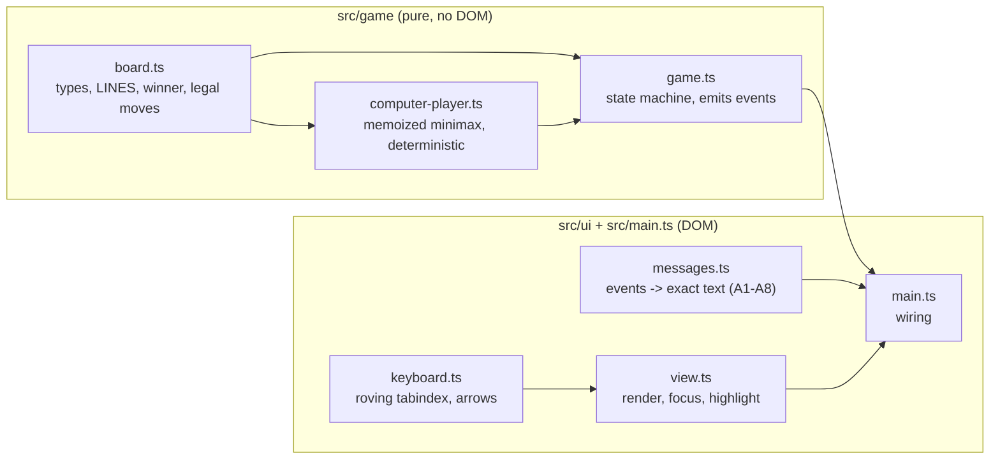
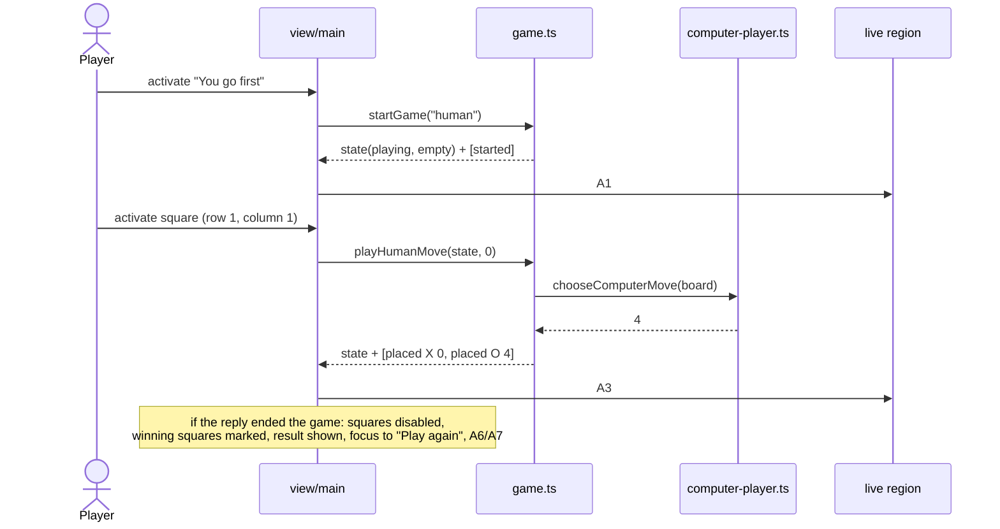
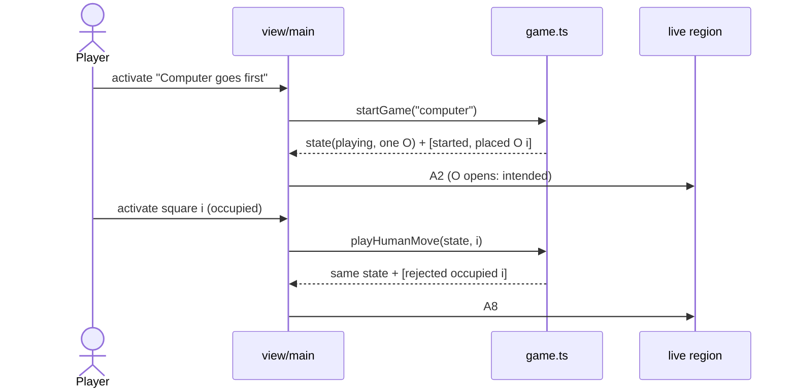
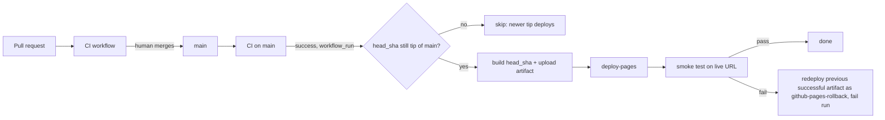

You are an independent second-opinion reviewer in a software factory pipeline.
A different AI (Claude) produced the DRAFT below. Your job is to find what it got
wrong, what it missed, and where a materially better approach exists. Do not
rubber-stamp, and do not inflate: report only findings you would defend with
evidence (a line, an input that breaks it, a requirement it violates). Do not
rewrite the whole thing. Be specific and terse.

Review kind: code
Reviewer: {{REVIEWER}}
Project: factory-tictactoe

Focus especially on: Whole-change QA (F-014 restyle + F-015 motion, since the last QA): anything the per-feature reviews would miss: cross-feature interactions, data integrity, operational risk

Respond in EXACTLY this format (markdown):

## Verdict
Exactly one of:
- AGREE — no CRITICAL or HIGH findings.
- AGREE-WITH-CONCERNS — CRITICAL or HIGH findings that can be fixed within this approach.
- DISAGREE — the approach itself is wrong: you would redo it rather than patch it, and you describe what instead under Alternative.
Findings alone, however many or severe, never make a DISAGREE; they make AGREE-WITH-CONCERNS.
One sentence of justification.

## Findings
Number every finding C1, C2, … so the author can answer each one. One bullet each:
- [C1] [CRITICAL|HIGH|MEDIUM|LOW] <where> — <what is wrong> — <evidence> — <what to do instead>
(CRITICAL = will cause data loss, security hole, wrong behavior, or blocks the goal. Use it sparingly and only when sure.)

## Missing
Bullets: things the draft should address but doesn't. Empty if none.

## Alternative
If you would take a materially different approach, describe it in <=8 lines and say why it's better. Otherwise write "None".

## Questions for the human
Bullets: decisions only the product owner can make. Empty if none.

=== CONTEXT (read-only, for reference) ===

--- .factory/acceptance.md ---
# Acceptance criteria: factory-tictactoe

_Traces to: `.factory/prd.md`. Every criterion is written to be checked by an automated test (Vitest unit tests, Playwright end-to-end tests, or a CI script), except where it says "verified in deploy phase"._

## Conventions used below

- Squares are numbered by **row 1–3 (top to bottom)** and **column 1–3 (left to right)**.
- `{R}`, `{C}` are the row and column of the human's move; `{R2}`, `{C2}` are those of the computer's move.
- `{LINE}` is one of: `row 1`, `row 2`, `row 3`, `column 1`, `column 2`, `column 3`, `the diagonal from top left to bottom right`, `the diagonal from top right to bottom left`.

### Announcement text (exact, used by R-002, R-004, R-005, R-008)

| ID | When | Exact live-region text |
|---|---|---|
| A1 | Game starts, human first | `New game. You go first. You are X. Your turn.` |
| A2 | Game starts, computer first | `New game. Computer goes first as O. Computer placed O in row {R2}, column {C2}. Your turn.` |
| A3 | Human moves, game continues | `You placed X in row {R}, column {C}. Computer placed O in row {R2}, column {C2}. Your turn.` |
| A4 | Human move wins (unreachable with a perfect computer, still defined) | `You placed X in row {R}, column {C}. You win with {LINE}.` |
| A5 | Human move fills the board with no winner | `You placed X in row {R}, column {C}. It's a draw.` |
| A6 | Computer move wins | `You placed X in row {R}, column {C}. Computer placed O in row {R2}, column {C2}. Computer wins with {LINE}.` |
| A7 | Computer move fills the board with no winner | `You placed X in row {R}, column {C}. Computer placed O in row {R2}, column {C2}. It's a draw.` |
| A8 | Human activates an occupied square | `Row {R}, column {C} is taken. Choose an empty square.` |

Square accessible names: `Row {R}, column {C}, empty` / `Row {R}, column {C}, X` / `Row {R}, column {C}, O`.

## R-001 Board and legal moves

- **Given** a game in progress with the human to move, **when** the human activates an empty square, **then** exactly that square shows X and no other square changes before the computer's reply.
- **Given** a game in progress, **when** the human activates a square showing X or O, **then** the board is unchanged and it is still the human's turn.
- **Given** the game state module, **when** a human move is submitted while it is the computer's turn or after the game has ended, **then** the move is rejected and the returned state equals the input state (unit test).

### Unhappy paths

- **Given** the first-mover choice has not been made, **when** the player clicks, taps or presses Enter on any square, **then** nothing is placed (squares are disabled).
- **Given** JavaScript is disabled, **when** the page loads, **then** a visible message says the game needs JavaScript (Playwright with `javaScriptEnabled: false`).
- **Given** JavaScript is enabled but the JavaScript bundle request fails (Playwright aborts it), **when** the page loads, **then** the visible message "The game didn't load. Try reloading the page." is shown (tested against the production build in `dist/`, not the dev server); **and given** the bundle loads normally, **then** that message is never visible at any point during the load (it ships `hidden`).
- **Given** the production build, **when** start-up throws (the Playwright test serves `index.html` with the board's root element removed, so `main.ts` fails to find it), **then** the same load-error message is shown.

## R-002 First-mover choice

- **Given** a fresh page load, **when** it renders, **then** two controls "You go first" and "Computer goes first" are visible, the board is empty, and no control to choose a symbol exists.
- **Given** the choice is shown, **when** the player chooses "You go first", **then** the board is empty, it is the human's turn as X, and the live region reads A1.
- **Given** the choice is shown, **when** the player chooses "Computer goes first", **then** exactly one square shows O, no square shows X, and the live region reads A2 naming that square.
- **Given** any game, **when** squares are filled, **then** every human-placed mark is X and every computer-placed mark is O, regardless of who started.

## R-003 Perfect, never-losing computer

- **Given** both starting sides, **when** a test enumerates every legal human move at every position where it is the human's turn and applies the computer's chosen reply at every position where it is the computer's turn, **then** no reachable finished game is a human (X) win, and the test reports the number of finished games examined (greater than 0) for each starting side.
- **Given** a position where the computer can complete three in a row, **when** it chooses a move, **then** it completes the line (unit test over all such reachable positions).
- **Given** the same position twice, **when** the computer chooses a move, **then** it returns the same square both times (deterministic).
- **Given** successive games in one process with alternating starters (human, computer, human, …), **when** the exhaustive enumeration runs for each, **then** results are identical to running each starter in a fresh process (the memo stays valid across starters).
- **Given** CI, **when** the unit-test job runs, **then** the exhaustive test runs on every push and pull request and finishes in under 60 seconds.

## R-004 Win and draw detection with result message

- **Given** each of the 8 lines filled with X, and separately with O, **when** the board is evaluated, **then** the winner is that symbol and the line is identified (unit test, 16 cases).
- **Given** a full board with no three in a row, **when** it is evaluated, **then** the result is a draw.
- **Given** a move that wins or fills the board, **when** it is applied, **then** the game ends, all squares become disabled, and the visible result text contains "Computer wins", "You win" or "It's a draw" accordingly, and the live region reads A4, A5, A6 or A7 accordingly.

## R-005 Winning line highlight

- **Given** a game the computer has won, **when** the result is shown, **then** exactly the three squares of the winning line are marked as winning and each of them differs from non-winning squares in at least one non-colour computed style (border width or style, outline, or text decoration) or carries an overlaid line element.
- **Given** a game the computer has won, **when** the result is shown, **then** the visible result text and the live region both name the line using `{LINE}` wording.
- **Given** a drawn game, **when** the result is shown, **then** no square is marked as winning.

## R-006 Play again

- **Given** a finished game, **when** the result is shown, **then** a "Play again" button is visible and has keyboard focus.
- **Given** a game in progress, **when** the page is inspected, **then** no "Play again" button is visible.
- **Given** a finished game, **when** the player activates "Play again", **then** the board is empty, the first-mover choice is shown, and focus is on "You go first".

## R-007 Keyboard-only play

- **Given** a fresh page, **when** a Playwright test plays a complete game using only Tab, Shift+Tab, arrow keys, Enter and Space (no pointer events), choosing "You go first", **then** the game reaches a result and "Play again" can be activated from the keyboard to start a second game choosing "Computer goes first", which also reaches a result.
- **Given** the board has focus, **when** an arrow key is pressed, **then** focus moves one square in that direction, stays put at the board edge, and exactly one square is in the Tab order at any time.
- **Given** a square has focus, **when** Enter or Space is pressed on an empty square, **then** X is placed there.
- **Given** the first-mover choice, **when** the player chooses "You go first", **then** focus is on row 1, column 1; **and when** the player chooses "Computer goes first", **then** focus is on the first empty square in reading order (row 1, column 2 after the opening O at row 1, column 1).
- **Given** any focused control, **when** its computed style is read, **then** it has a visible focus indicator with an outline or border at least 2 CSS px wide.

## R-008 Screen-reader announcements

- **Given** each situation A1–A3 and A5–A8, **when** it occurs in a Playwright test, **then** the live region (`role="status"`, polite) text equals the exact string in the announcement table, with placeholders filled.
- **Given** A4 (human win), which the real opponent makes unreachable, **when** a unit test drives the game state machine with an injected opponent that loses and passes the events to the message builder, **then** the text equals A4 exactly; the production bundle contains no way to inject an opponent.
- **Given** any board state, **when** the squares are inspected, **then** each square's accessible name matches `Row {R}, column {C}, empty|X|O` for its current content.
- **Given** a human move, **when** the computer replies, **then** a single announcement covers both moves (the live region is updated once per human action).

## R-009 WCAG 2.2 AA and zero axe violations

- **Given** each game state (choice shown, game in progress, computer won, draw), **when** axe-core runs with tags `wcag2a`, `wcag2aa`, `wcag21a`, `wcag21aa` and `wcag22aa` in Chromium, Firefox and WebKit, **then** it reports 0 violations.
- **Given** the page, **when** it loads, **then** it has a `lang` attribute, a descriptive `<title>`, one `h1`, and the board is exposed as a labelled group.

## R-010 Responsive layout for touch and mouse

- **Given** viewports of 320×568, 390×844 and 1280×800 CSS px, **when** the page is shown in each game state, **then** `document.documentElement.scrollWidth` does not exceed the viewport width and all nine squares and both choice buttons are fully visible without scrolling horizontally.
- **Given** those viewports, **when** the bounding boxes of the squares and buttons are measured, **then** each is at least 44×44 CSS px.
- **Given** a touch-enabled phone emulation, **when** the player taps "You go first" and then an empty square, **then** X is placed there.
- **Given** a desktop viewport, **when** the player clicks "You go first" and then an empty square, **then** X is placed there.
- **Given** viewports of 320×568 and 1280×800 at default text size, **when** the page moves through the choose state, play (including a taken-square message and the longest computer-move status), and the game-over state, **then** the board's bounding box (x, y, width, height) is identical in every state. At 200% text zoom reflow takes priority and this check does not apply.

## R-011 Bundle size

- **Given** a production build, **when** the CI size check sums the gzipped size of every JavaScript file in `dist/`, **then** the total is under 51,200 bytes, and the check fails the build otherwise.

## R-012 No tracking, storage or third-party requests

- **Given** a Playwright test that records every network request while loading the page and playing a full game, **when** the game ends, **then** every request went to the page's own origin.
- **Given** the same full game, **when** it ends, **then** `document.cookie` is empty and `localStorage.length` and `sessionStorage.length` are 0.
- **Given** the built `dist/` output, **when** it is scanned, **then** it contains no script, link or iframe pointing to another origin.

## R-013 High-contrast, system fonts, locally drawn visuals

- **Given** the page, **when** the computed `font-family` of the body is read, **then** it begins with `system-ui`, and no font files are requested during a full game.
- **Given** the design tokens, **when** a unit test computes the contrast of every text colour against its background, **then** each ratio is at least 7:1, and every non-text indicator (square borders, focus ring, winning-line marker) is at least 3:1 against its background.
- **Given** a Playwright test that records every request while loading the page and playing a full game, **when** the game ends, **then** no font file and no image file (raster or SVG, from any origin, including the page's own) was requested, and the built `dist/` contains no `@font-face` rule, no `` element, and no `url()` that references a file (every visual is CSS or inline SVG).

## R-014 Deploy to GitHub Pages with smoke test and minimal rollback

- **Given** a merge to main whose CI passes and which is still the latest commit on main, **when** the deploy workflow runs, **then** it builds exactly that commit (`workflow_run.head_sha`) and publishes it to GitHub Pages. The smoke test waits up to 3 minutes until the live page's `build-id` meta equals that SHA, then chooses "You go first", places one X, sees the computer's O, and passes. _Verified in deploy phase._
- **Given** CI passes for a commit that is no longer the latest commit on main, **when** its deploy run acquires the concurrency slot, **then** it skips without deploying. _Verified in deploy phase._
- **Given** deploy runs that overlap (one running, the latest commit's run queued, and an older commit's run queued after it), **when** they are processed, **then** none of them is discarded (`queue: max`, first in, first out), the older one skips as stale, and the latest commit ends up live. _Verified in deploy phase; the workflow's concurrency block is checked statically in CI._
- **Given** a manual `workflow_dispatch` run, **when** main's CI for its tip is pending or failed, **then** the run refuses to deploy and fails with a message. _Verified in deploy phase._
- **Given** a deploy whose smoke test fails (forced by the workflow's manual `force_smoke_failure` input), **when** the rollback job runs, **then** it redeploys, unchanged, the Pages artifact of the latest deploy run whose deploy and smoke jobs both succeeded (a stale no-op run in between is never chosen), under the artifact name `github-pages-rollback`, does nothing else, and the workflow run concludes as failed so GitHub emails the repo owner. _Verified in deploy phase._
- **Given** no previous successful deploy run exists, or its artifact has expired, **when** the smoke test fails, **then** the rollback job logs that no previous artifact is available and the run fails. _Verified in deploy phase._

## R-015 Browser coverage

- **Given** the Playwright configuration, **when** CI runs the end-to-end suite, **then** every spec runs in five projects — Chromium, Firefox, WebKit, a touch-enabled Android phone emulation (Chromium) and a touch-enabled iPhone emulation (WebKit) — and all pass.
- **Given** the production build, **when** Vite builds it, **then** its build target covers the current and previous versions of Chrome, Firefox, Safari and Edge and iOS Safari (build target `es2022`, supported by all of them).

--- .factory/architecture.md ---
# Architecture: factory-tictactoe

_Traces to: `.factory/prd.md`, `.factory/acceptance.md`, `.factory/tech-stack.md`. Stack is committed (ADR-001 to ADR-008); this document does not revisit it._

## 1. Shape

A single static page: `index.html` + one CSS file + one ES module bundle built by Vite from strict TypeScript, published to GitHub Pages. No backend, no network calls at run time, no storage.

The code has two layers with a one-way dependency:

- **Game core** (`src/game/`): pure, DOM-free TypeScript. It holds all the rules, the perfect computer player, and the state transitions, and it emits *events* describing what happened. Vitest tests it exhaustively.
- **UI shell** (`src/ui/`, `src/main.ts`): renders state to the DOM, turns clicks, taps and keys into core calls, and turns core events into announcement text. Playwright and axe-core test it.



## 2. Components and responsibilities

| Component | File | Responsibility | Requirements |
|---|---|---|---|
| Board model | `src/game/board.ts` | `Mark = "X" \| "O"`, `Board` (9 cells, index 0–8 row-major), the 8 `LINES`, `findWinner(board)` returning winner and line, `isFull`, `emptySquares`, immutable `placeMark` | R-001, R-004 |
| Computer player | `src/game/computer-player.ts` | `chooseComputerMove(board): SquareIndex` (O is always to move when it is called) — full-depth minimax. A position's value is node-relative: `10 − plies to the end` for an O win, `plies to the end − 10` for an X win, `0` for a draw, so O wins sooner and never loses. Ties go to the lowest square index. Values are memoized in a module-level map keyed by **board + side to move**; because the values are node-relative they are valid across searches, games and starters (at most 2 × 3⁹ keys) | R-003 |
| Game state machine | `src/game/game.ts` | `startGame(firstMover)` and `playHumanMove(state, index)` return `{ state, events }`; the computer's reply is applied synchronously inside `playHumanMove`; illegal moves return the input state unchanged plus a `rejected` event. The opponent is a parameter that defaults to `chooseComputerMove`, so unit tests can inject a weak opponent to reach the otherwise unreachable human win (A4); the UI always uses the default | R-001, R-002, R-003, R-004, R-006 |
| Messages | `src/ui/messages.ts` | Pure `describeEvents(events): string` producing exact texts A1–A8; `squareLabel(index, mark)`; `describeLine(line)` | R-005, R-008 |
| View | `src/ui/view.ts` | Renders choice buttons, 9 square buttons, visible status/result, "Play again"; sets accessible names, `disabled` / `aria-disabled`, winning markers; moves focus per the rules below | R-001, R-002, R-004–R-007, R-009, R-010 |
| Keyboard | `src/ui/keyboard.ts` | Roving tabindex over the 3×3 grid; arrow keys move one square and stop at edges; Enter/Space are native button activation | R-007 |
| Wiring | `src/main.ts` | Holds the single current `GameState`, calls core, renders, writes the live region | all UI |
| Styles | `src/styles.css` | System font stack, high-contrast tokens (from design phase), 44 px minimum targets, fluid grid from 320 px, 2 px+ focus ring, non-colour winning marker | R-005, R-010, R-013 |
| Page | `index.html` | `lang="en"`, title, `h1`, live region; `<noscript>` message plus a load-error message ("The game didn't load. Try reloading the page.") that ships with the `hidden` attribute. It is revealed in two ways. (1) A small inline classic `<script>` in `index.html`, placed before the module script, registers a capture-phase `window` `error` listener that unhides the message when a `<script>` element fails to load. This is independent of the bundle, and survives the Vite build, which rewrites the module tag and would drop an `onerror` attribute (Codex rework review C1). (2) `main.ts` wraps start-up in `try/catch`, unhides the message on any exception, then rethrows so the error still reaches the console. It never flashes during a normal load and never shows next to the `<noscript>` message (design review, 2026-09-27); `<meta name="build-id">` set to the commit SHA at build time | R-001, R-008, R-009, R-014 |
| CI scripts | `scripts/check-bundle-size.mjs`, `scripts/check-dist-origins.mjs` | Gzip-sum JS in `dist/` under 51,200 bytes; scan `dist/` for other-origin script/link/iframe URLs | R-011, R-012 |

Filenames are kebab-case and identifiers follow the factory naming rules (standards §6), enforced by ESLint.

## 3. Data model

In memory only, discarded on reload (R-012).

```ts
type Mark = "X" | "O";                 // human is always X, computer always O (R-002)
type Cell = Mark | null;
type Board = readonly Cell[];          // length 9, row-major: index = (row-1)*3 + (column-1)
type Line = readonly [number, number, number];
type FirstMover = "human" | "computer";
type Result = { kind: "win"; winner: Mark; line: Line } | { kind: "draw" };
type GameState =
  | { phase: "choosing" }                                        // before each game
  | { phase: "playing"; board: Board; firstMover: FirstMover }    // always the human's turn when idle
  | { phase: "over"; board: Board; firstMover: FirstMover; result: Result };
type GameEvent =
  | { type: "started"; firstMover: FirstMover }
  | { type: "placed"; mark: Mark; index: number }
  | { type: "ended"; result: Result }
  | { type: "rejected"; reason: "occupied" | "not-playing"; index: number };
```

Because the computer replies synchronously, a `playing` state at rest is always the human's turn; "out of turn" (R-001) therefore reduces to "not in the `playing` phase". The unit tests exercise that case directly on the state machine.

## 4. Key flows

### Flow A: human goes first and makes a move



### Flow B: computer goes first, then the human activates an occupied square



## 5. Accessibility design

- The board is a `div role="group" aria-label="Board"` containing 9 native `<button>`s laid out by CSS grid. Buttons give Enter/Space activation and touch/click for free.
- Accessible name of each square: `Row R, column C, empty|X|O` (R-008).
- **Before a choice and after the game ends**, squares have the `disabled` attribute and are out of the Tab order. **During play**, exactly one square has `tabindex="0"` (roving); occupied squares are `aria-disabled="true"` but stay focusable, so arrow navigation passes through them and activating one announces A8.
- **Live region**: one visually hidden `div role="status"` (polite). It is written once per player action. To make a repeated identical message (such as A8 twice) announce again, the text is cleared and then set on the next animation frame.
- **Focus**: after a choice, focus goes to the first empty square in reading order (row 1, column 1 when the human starts; row 1, column 2 after the computer's opening O at row 1, column 1). This keeps the first Enter off a taken square (design review, 2026-09-27). After a move it stays on the square played. When the game ends, it moves to "Play again". After "Play again" it goes to "You go first".
- **Winning line**: `data-winning="true"` on the three squares. The style adds a thick border plus an overlaid strike line (not colour alone), and the text names the line (R-005).

## 6. Integration points and failure modes

| Integration | Used for | Failure mode | Handling |
|---|---|---|---|
| GitHub Actions: CI workflow (`ci.yml`, on push and pull request) | format check, lint, typecheck, unit + exhaustive tests, build, bundle-size and dist-origin checks, Playwright e2e + axe in 5 projects | Any job fails | PR cannot merge (humans merge; branch protection set in ship phase). Owner gets the failure email |
| GitHub Actions: deploy workflow (`deploy.yml`) | Triggered by `workflow_run` when CI completes successfully on `main`: checks out **`workflow_run.head_sha`** (not `GITHUB_SHA`), so it builds exactly the commit whose CI passed. **After acquiring the `pages` concurrency slot**, it checks that SHA is still the tip of `main`; if not, it skips (a no-op run), because the newer tip's own queued run will deploy it and it already contains this change. `workflow_dispatch` (with a `force_smoke_failure` input) resolves the current tip of `main`, verifies a successful CI run exists for that exact SHA, and refuses (fails with a message) if main's CI is pending or failed; otherwise it deploys that SHA the same way. Steps: build with `build-id` = SHA → `actions/upload-pages-artifact` (retention 90 days) → `actions/deploy-pages` → smoke → rollback if smoke fails | Build or deploy fails | Nothing changes on the live site; run fails; email |
| GitHub Pages | hosting at `https://onelifemedia.github.io/factory-tictactoe/` | Outage | Accepted: GitHub's uptime, no SLA (intent.operations) |
| Smoke test | Playwright against the live URL. It first polls, for up to 3 minutes, until the page's `build-id` meta equals the deployed SHA, so the old deployment cannot pass for the new one. Then it chooses "You go first", places X and sees O | Fails, or the build-id never appears | Rollback job (ADR-011). It finds the latest `deploy.yml` run on `main` whose **deploy and smoke jobs both concluded `success`** (checked per run through the jobs API; a stale no-op run whose deploy was skipped is never chosen, even though that run concluded successfully) and downloads its `github-pages` artifact (`actions/download-artifact` with `run-id` and `github-token`). It re-uploads the downloaded `artifact.tar` **unchanged under the distinct name `github-pages-rollback`**, so it never clashes with this run's `github-pages` artifact and the tar is not nested. It deploys with `actions/deploy-pages` (`artifact_name: github-pages-rollback`), then exits non-zero. If there is no such run, or its artifact has expired (more than 90 days since the last successful deploy), it logs that and exits non-zero. Nothing more. |

A run that rolled back concludes as failed, so it is never chosen as "previous successful" later. Deploy, smoke and rollback run in one workflow under `concurrency: { group: pages, queue: max, cancel-in-progress: false }`. With the default `queue: single`, GitHub keeps at most one pending run and cancels the older one when a new run queues. That can discard the latest commit's run (A running, C latest pending, older B's CI finishes last and replaces C, then B skips as stale), so the site would never get C (Codex plan review C1). With `queue: max`, up to 100 runs wait and are processed first in, first out; `queue: max` with `cancel-in-progress: true` is a validation error ([GitHub docs: control workflow concurrency](https://docs.github.com/en/actions/how-tos/write-workflows/choose-when-workflows-run/control-workflow-concurrency), verified 2026-09-27). Because the latest-commit check runs only after a run acquires the slot, every queued run either deploys the tip that CI verified or skips harmlessly. "Latest" is evaluated once, when the run acquires the slot. If main advances while that run is building or deploying, the newer commit's own run is already queued behind it and deploys next. Accepted limit (Codex rework review C1, 2026-09-27): if more than 100 deploy runs are pending at once, GitHub cancels the overflow, which could include the latest commit's run. With humans merging one pull request at a time this is not a realistic load, so it is documented rather than engineered around; the remedy is to re-run the deploy workflow for main's tip.

## 7. Deployment shape



Vite `base: "./"` makes asset URLs relative, so the site works under the `/factory-tictactoe/` path. The build target is `es2022`. Node 22 is pinned in `.nvmrc` and `engines`, and CI uses `actions/setup-node` with `node-version-file: .nvmrc`.

## 8. Test architecture

| Layer | Tool | What | Where |
|---|---|---|---|
| Unit | Vitest | board rules (16 win cases, draw), state machine incl. rejections, messages A1–A8, token contrast | `tests/unit/*.test.ts` |
| Exhaustive | Vitest | every human move sequence against the computer, both starting sides, run in one process one after the other (so the shared memo is exercised across starters); asserts 0 human wins and reports game counts; under 60 s | `tests/unit/never-loses.test.ts` |
| End-to-end + a11y | Playwright + @axe-core/playwright | A1–A3 and A5–A8 exact text (A4 is unreachable with the real opponent, so it is covered by unit tests with an injected opponent), keyboard-only games, blocked-bundle fallback, touch/click, exact live-region text, focus rules, layout/target sizes at 3 viewports, requests/cookies/storage, axe in 4 states | `tests/e2e/*.spec.ts`, 5 projects (ADR-008) |
| Build checks | Node scripts | bundle < 51,200 B gzipped; no other-origin URLs in `dist/` | `scripts/*.mjs` |
| Post-deploy | Playwright | wait for expected build-id, then smoke on live URL | `tests/smoke/*.spec.ts` (deploy workflow only) |

Every test file names the F-ID it covers (governance).

## 9. What we are deliberately not building

- No server, API, database, storage, cookies, service worker or PWA manifest.
- No framework runtime, router, state library or CSS framework.
- No analytics, error reporting SDK or third-party script of any kind.
- No difficulty levels, symbol choice, hot-seat mode, tally, undo, history, sound, themes, translations, rules page or custom domain.
- No artificial "thinking" delay or animation beyond basics (PRD open question 2 default).
- No rollback logic beyond "redeploy the previous successful artifact and fail the run".
- No real-device or manual screen-reader testing by the factory (QA report lists it as human follow-up).

--- .factory/features/F-014.md ---
# F-014: Restyle to Tabletop Tiles: tokens v2, tray and tiles, SVG pieces, win-line overlay

- **Requirements:** R-005, R-010, R-013
- **Milestone:** M3. **Size:** M. **Depends on:** F-010, F-011, F-012
- **Design:** approved 2026-09-28 at revision 8885b635 (direction C, Tabletop Tiles). References: `design/design-system.md`, `design/tokens.json` (version 2), and the "product styles" block of `design/screens/game-0{1,2,3}-*.html`, whose `:root` is a 1:1 flatten of tokens.json.
- **Branch:** `factory/F-014-tabletop-tiles-restyle`. It already carries three `.factory/` commits: the intent/spec approval, the design approval and the plan approval. tokens.json v2 fails the token and contrast tests until this feature lands, so nothing reaches main before this pull request.

## Acceptance criteria (from plan.json)

1. **Tokens.** Every tokens.json v2 token (color.light, font, space, radius, shadow, motion, size, a11y) is a `:root` custom property in `src/styles.css` with an equivalent value. Shadow is no longer excluded, and the obsolete `--motion-fast` = `0ms` assertion is replaced by one on a version-2 token.
2. **Contrast.**
   - Text pairs are at least 7:1; non-text pairs (border, border-disabled, focus, primary, mark-x, mark-o, win-marker on their listed backgrounds) are at least 3:1.
   - The one exception, border on tile-edge (2.56:1), is asserted only at its published value.
   - Every ratio published in design-system.md §2 is reproduced to 2 decimals.
3. **Pieces.** Occupied squares hold an aria-hidden inline svg whose use element references the same-document `#mark-x` or `#mark-o`. There is no X/O text glyph, and accessible names are unchanged. Empty squares hold no piece.
4. **Win line.**
   - Exactly the three winning squares carry `data-winning` with a 4 px border (the others 2 px).
   - The board has one aria-hidden `.win-line` overlay whose path passes within 1 px of the rendered centres of the three lifted winning tiles.
   - Pieces paint above the bar on a win-surface backing disc. There is no strike pseudo-element.
   - This is checked for a row and a diagonal in real games, and for all 8 lines in a unit test.
5. **Tile and button states.** Disabled squares use surface-sunken with the tile-resting edge. Active empty squares use surface-tile with the tile edge. Buttons use the primary fill with a 6 px focus offset (squares 3 px).
6. **Board size.** At 320×568, 390×844, 844×390 and 1280×800:
   - the board is `max(180px, min(100%, 360px, 45svh))` square;
   - tiles are at least 44×44 CSS px and inside the tray;
   - there is no horizontal overflow;
   - the board box is identical across states at 320×568 and 1280×800;
   - at 320×568, both stacked choice buttons including their 5 px edge end inside the viewport.
7. **Local visuals only.**
   - A full game requests no font file and no image file of any origin.
   - `scripts/check-local-visuals.mjs` fails on `@font-face`, an img element, or a `url()` that references a file. It is unit-tested with fixtures only, and CI runs it after the build on `dist/`.
8. **Fonts.** The body font-family begins with `system-ui`; the title's begins with `ui-rounded, system-ui`.
9. **No regressions.**
   - axe reports 0 violations in every state in all three engines, and the bundle stays under 50 KB gzipped.
   - The announcement, keyboard, focus, pointer, load-error and never-lose suites pass.
   - Only the mark-reading and strike-line helpers change.

## Tests to write first

- `tests/unit/tokens.test.ts`: version-2 mapping including shadow; `--motion-drop`, `--size-board-max` and `--shadow-button` spot checks.
- `tests/unit/contrast.test.ts`: the §2 pairs by class, the border-on-tile-edge exception, and the published ratios.
- `tests/unit/win-line-path.test.ts` (new): the 8 lines map to paths through the 50/150/250 centres, extended 18 units at both ends.
- `tests/unit/check-local-visuals.test.ts` (new, fixtures only): `@font-face`, `` and `url(file.png)` fail; `url(#fragment)`, `data:`-free CSS and product-like markup pass.
- `tests/e2e/pieces.spec.ts` (new):
  - pieces are SVG use elements, with no glyphs and unchanged names;
  - empty squares contain no piece element, both at first and after Play again empties a board;
  - the referenced `#mark-x` and `#mark-o` symbols exist and render (the use element's bounding box is non-empty).
- `tests/e2e/game-over.spec.ts`:
  - 4 px winning borders, the overlay path within 1 px of the lifted centres for a row and a diagonal win, and no `::after` strike;
  - winning pieces' backing disc computes to the win-surface colour, and a screenshot pixel at a winning O's centre is win-surface, not the bar colour (piece paints above the bar);
  - after win → Play again the overlay is hidden, and it stays hidden through the next game and a subsequent draw.
- `tests/e2e/layout.spec.ts`:
  - the board formula, tiles ≥ 44 and inside the tray, and no horizontal overflow, at 4 viewports including 844×390;
  - both choice buttons plus their edge fit at 320×568;
  - the existing board-stability test is kept.
- `tests/e2e/styles.spec.ts` (new): disabled vs active faces and edges, focus offsets, title and body fonts.
- `tests/e2e/privacy.spec.ts`: no image requests either.
- `tests/e2e/game-page.ts`: the piece reader uses the use element's href.

## Files

`src/styles.css`, `index.html`, `src/ui/view.ts`, `src/ui/line-direction.ts`, `scripts/check-local-visuals.mjs`, `package.json` (`check:visuals`), `.github/workflows/ci.yml`, and the tests above.

No migration and no feature flag.

## Approach

1. **Tokens and styles.** Replace the `:root` block with the tokens.json v2 flatten, then port the mockups' product styles block (tray, tiles, pieces, win line, pill buttons, fallback card) using `@media (min-width: 480px)` where the mockups use `@container`.
2. **Pieces.** `index.html` gets one hidden SVG defs block with the `#mark-x` / `#mark-o` symbols, each with a backing circle whose fill is `var(--mark-backing, none)`. `view.ts` builds each occupied square's piece as an svg with a use element and sets its href and class per cell. It removes the piece when a square becomes empty, so empty squares hold no piece element.
3. **Win line.** The board gets one `.win-line` overlay svg, created once and hidden without a win. Its path comes from a new pure `describeWinLinePath(line)` in `line-direction.ts`.
4. **Squares' `data-line`.** It stays, because existing tests and the direction classifier use it; it no longer draws anything.
5. **Motion.** None here; that is F-015.
6. **Local-visuals check.** A new `check-local-visuals.mjs` mirrors `check-build-origins.mjs` (a command-line entry plus exported functions) and runs in CI after the build.

## Pre-code review (Codex, `20260928-033632-F-014.md-codex.md`): AGREE, 2 medium and 1 missing, all accepted

- **C1:** hiding the svg would contradict "empty squares hold no piece". The piece is now removed, and tested initially and after Play again.
- **C2:** reference checks alone would pass with a dangling href or a missing backing disc. Added rendered checks: symbol bounding boxes, the backing-disc fill, and a pixel at a winning O's centre.
- **Missing:** the overlay could stay after Play again. Added the win → Play again → next game → draw check.

## What was built

- **`src/styles.css`:** the `:root` block is the tokens.json v2 flatten (shadow included). It carries the design's product styles: tray, tiles (active, occupied, disabled, winning), teal pill buttons with an edge, and the fallback tile card.
  - `--size-win-line-inset` has a `prettier-ignore` so it stays on one line and matches the token exactly.
  - `.board:empty` is hidden, so without JavaScript only the fallback card shows (mockups 1b and 1c).
- **`index.html`:** one hidden SVG symbol sheet with `#mark-x` and `#mark-o`, each starting with the r=37 backing disc.
- **`src/ui/view.ts`:** occupied squares get an svg whose use element points at `#mark-x` or `#mark-o`. The piece is removed when the square empties. One `.win-line` overlay is created with the squares and hidden without a win. Squares keep `data-winning` and `data-line`.
- **`src/ui/line-direction.ts`:** `describeWinLinePath(line)`.
- **`scripts/check-local-visuals.mjs`:** fails on `@font-face`, img elements and file `url()`s. It scans all non-script HTML and all CSS. It runs as `npm run check:visuals`, a CI step after the build.

## Deviations from the design

- **Title padding.** The title has `padding-block-end: 0.1em`. The 1.1 display line height clipped Verdana's descenders in the 200% text test (F-010), and the approved token stays unchanged.
- **Piece sizing.** Tiles are a centred grid, and pieces are sized by width with `aspect-ratio: 1`. WebKit does not resolve a percentage height inside a button, which made pieces render small and off-centre, and failed the winning-O pixel test.

## Test results

- Unit: 507 passed, 4 skipped.
- Playwright: 565 passed across all projects.
- Bundle: 3,646 bytes gzipped.
- `check:origins` and `check:visuals` are clean.

## Review outcome

- **Pre-code (Codex):** AGREE; 2 medium and 1 missing, all accepted (see above).
- **Diff (Codex, 58d189b..c9d9dc2):** AGREE; 1 medium, accepted and fixed in b6ec7c6 with regression fixtures.
  - C1: the scanner missed unquoted style attributes and SVG presentation `url()`s.
  - No second round, because the finding was medium only.
- Rejected or disputed: none.

--- .factory/features/F-015.md ---
# F-015: Tactile motion: press, drop and lift, all off under reduced motion

- **Requirements:** R-008 (announcements never delayed), R-010 (board never moves), R-013 (visual style and personality set in design)
- **Milestone:** M3. **Size:** M. **Depends on:** F-014 (stacked on PR #18)
- **Design:** `design/design-system.md` §4 Motion and §5 Board square / buttons; tokens `motion.press` (80 ms ease-out), `motion.drop` (280 ms `cubic-bezier(0.3, 1.6, 0.5, 1)`), `motion.lift` (240 ms ease-out), `motion.lift-delay` (280 ms), `size.press-depth` (4 px), `size.lift-height` (3 px). These are already in `:root` since F-014. Approved deviation from the board: X and O drop together, with no stagger.

## Acceptance criteria (from plan.json)

1. **Drop, only new pieces.** With no-preference, the squares whose piece the last action placed carry `is-new`, and their pieces run the 280 ms drop. Older pieces don't animate, and the drop keyframes never change opacity.
2. **Nothing waits for motion.**
   - In the first animation frame after the click, the status and (on game over) focus on Play again are already final.
   - The live region is final by the second frame. The announcer deliberately clears it, then sets it on the next frame (F-009), which is still long before the 280 ms drop ends.
   - This is measured by a probe inside the browser, scheduled from the click, not by eventual assertions.
3. **Lift.** A win lifts the winning tiles and the win line (240 ms, starting at 280 ms). The tiles' edge deepens during the lift, from `--shadow-tile` to `--shadow-tile-win`, not before it. `document.getAnimations()` is empty 600 ms after the move.
4. **Reduced motion.** Under `prefers-reduced-motion: reduce`, `getAnimations()` is always empty. Squares and buttons never get a transform on hover or press; a press shows only the shorter edge.
5. **Press and hover.** With no-preference:
   - an active empty square rises 1 px on hover;
   - squares and buttons move down 4 px when pressed, with the pressed edge, over an 80 ms transition;
   - occupied and disabled squares ignore hover and press. They have no transition, so a hovered square that becomes occupied or disabled drops its transform at once and never traps its piece under the win bar (Codex C2).
   - the drop starts at `translateY(-22px) scale(1.15)`.
6. **iOS presses.** One passive `touchstart` listener is registered on `document`, so iOS Safari applies `:active`.
7. **Board stability.** At 320×568 and 1280×800 with no-preference, the board box is identical during and after animations and after a win.
8. **Regressions.**
   - The computer's opening O drops.
   - A taken-square attempt animates nothing and adds no `is-new`.
   - After Play again no `is-new` remains, and the next game animates only its own pieces.
   - A second move made before the previous drop finishes moves `is-new` to the new pieces only.
   - Switching to reduced motion mid-animation cancels all animations at once, leaving the final appearance.

## Tests to write first

- **`tests/unit/new-pieces.test.ts`** (node, pure):
  - `findNewlyPlacedSquares(previousBoard, nextBoard)` gives your X and the computer's O → both indices;
  - the opening O → its index;
  - an unchanged board (taken square) → none;
  - an empty next board (Play again) → none.
- **`tests/unit/touch-active.test.ts`** (node, fake EventTarget): `enableActiveStatesOnTouch(target)` registers exactly one `touchstart` listener with `{ passive: true }`.
- **`tests/unit/production-wiring.test.ts`** (existing pattern): `main.ts` calls `enableActiveStatesOnTouch(document)`.
- **`tests/e2e/motion.spec.ts`** (new): covers criteria 1–5, 7 and 8 with `page.emulateMedia({ reducedMotion })`, `getAnimations()`, computed transforms, and board boxes sampled during and after animations. Timing is deterministic:
  - Animations are paused and seeked (`animation.pause(); animation.currentTime = t`) at these checkpoints: drop start, lift delay (before 280 ms), lift midpoint and settled. Transforms are compared numerically with tolerances, not as matrix strings.
  - First-frame values come from a browser-side probe that registers the click and requestAnimationFrame callbacks.
  - Natural completion is checked once, at 600 ms, without polling.
  - Taken-square attempts use the existing forced activation helper, because Playwright treats `aria-disabled` as disabled.
  - Regression: X on 0, 1 and 3 by pointer, with square 6 hovered before the winning move, is made by keyboard. The O on square 6 must paint above the bar, checked with a pixel sample like F-014's.

## Files

`src/styles.css` (motion block), `src/ui/new-pieces.ts` (new), `src/ui/view.ts`, `src/ui/touch-active.ts` (new), `src/main.ts`, and the tests above.

No migration and no feature flag.

## Approach

1. **Styles.** Everything goes in one `@media (prefers-reduced-motion: no-preference)` block in `styles.css`: square and button transitions on transform and box-shadow, hover and press transforms, the `drop` keyframes on `.is-new .mark` (transform only), and the `lift` / `lift-line` keyframes with `backwards` fill and a 280 ms delay. `lift` animates `top` and `box-shadow`, starting from `--shadow-tile`. Transitions apply only to active empty squares (`:not([disabled], [aria-disabled="true"])`) and to buttons. These follow the mockups' product block.
2. **Marking new pieces.** Outside the block, the pressed edge shadows already exist from F-014. `view.ts` keeps the last rendered board and applies `is-new` to the squares that `findNewlyPlacedSquares` returns; every render recomputes the class, so stale marks never linger.
3. **Game logic.** Untouched. The computer's reply and the status update are synchronous, the announcer keeps its clear-then-set-next-frame contract, and motion is CSS only.
4. **iOS presses.** `touch-active.ts` registers a no-op passive listener, called once from `main.ts`. Whether iOS Safari shows the press can't be emulated. It is listed as a manual real-device check (QA human follow-up), next to the existing real-device item.

## Pre-code review (Codex, `20260928-040624-F-015.md-codex.md`): AGREE, 3 medium and 5 missing, all accepted

- **C1:** the timing assertions were unreliable, and the announcer is not synchronous. Tests now use a browser-side first-frame probe and paused, seeked animations; criterion 2 states the two-frame announcer contract.
- **C2:** a hovered square's transition could trap its piece under the bar. Transitions are scoped to active empty squares, with a regression test.
- **C3:** the lift didn't animate the edge. `lift` now animates the box-shadow too.
- **Missing:**
  - timing checkpoints;
  - switching to reduced motion mid-animation;
  - a second move during a drop;
  - forced activation for taken squares;
  - the real iOS press, recorded as a manual follow-up.

## What was built

- **`src/ui/new-pieces.ts`:** `findNewlyPlacedSquares`, a pure function. `view.ts` remembers the last rendered board and toggles `is-new` on every render, so stale marks never linger (Play again, taken squares).
- **`src/ui/touch-active.ts`:** `enableActiveStatesOnTouch(document)`, called from `main.ts` before start-up.
- **`src/styles.css`:** one `prefers-reduced-motion: no-preference` block.
  - Transitions (transform and box-shadow, 80 ms) apply to active empty squares and buttons only.
  - Hover rises 1 px and a press moves down 4 px.
  - `drop` runs on `.square.is-new .mark` and is transform only.
  - `lift` (top and box-shadow) runs on winning squares and `lift-line` on the overlay, 240 ms after 280 ms with a `backwards` fill.
  - Occupied and disabled squares carry an explicit `transition: none`.

## Deviations from the spec

- **Explicit `transition: none`.** Without it, a square that became disabled kept the initial `transition-property: all`, so browsers didn't cancel a press transition still running. That left a paused box-shadow transition after a switch to reduced motion (e2e failure, attempt 1). The rule also makes the C2 guarantee hold (no lingering transform).
- **Announcer timing.** As recorded in criterion 2, the live region is final by the second frame, per the announcer's clear-then-set contract (F-009).

## Test results

- Unit: 515 passed, 4 skipped.
- Playwright: 645 passed. The 10 skipped are hover/press tests on the touch-only phone projects.
- Bundle: 3,738 bytes gzipped.
- `check:origins` and `check:visuals` are clean.

## Human follow-up (not automatable)

On a real iPhone, check that pressing a tile or button visibly sinks it. The touchstart listener is unit-tested, but iOS Safari's `:active` behaviour can't be emulated. This joins the existing real-device item in the QA report.

## Review outcome

- **Pre-code (Codex):** AGREE; 3 medium and 5 missing, all accepted (see above).
- **Diff (Codex, 30b6aa1..ccfb380):** AGREE; 2 medium, both in test timing, accepted and fixed in 3dd20a5. No new round, because both were medium.
  - C1: the 600 ms deadline is now measured in the page from the click.
  - C2: the hover regression is now frozen in the first frame after the keypress and sampled without fast-forwarding.
- Rejected or disputed: none.


=== DRAFT UNDER REVIEW: git-diff-5ebe604eaf9f941d9573997a318ece7b1aefb098-to-661b82e668dcdac28708f6e263808eebadb5a6d3 ===
diff --git a/.github/workflows/ci.yml b/.github/workflows/ci.yml
index 1400ff7..88ec378 100644
--- a/.github/workflows/ci.yml
+++ b/.github/workflows/ci.yml
@@ -31,6 +31,8 @@ jobs:
         run: npm run check:size
       - name: No references to other origins (R-012)
         run: npm run check:origins
+      - name: No font or image files; visuals are CSS and inline SVG (R-013)
+        run: npm run check:visuals
       # F-013: lint every workflow. actionlint 1.7.12 does not know GitHub's
       # concurrency `queue` key yet, so exactly that diagnostic is ignored;
       # tests/unit/deploy-workflow.test.ts checks the concurrency block itself.
diff --git a/index.html b/index.html
index 9394c41..a9bbbdb 100644
--- a/index.html
+++ b/index.html
@@ -6,6 +6,44 @@
     <title>Tic-tac-toe: play against a computer that never loses</title>
   </head>
   <body>
+    <!-- F-014: the X and O pieces, drawn once and used by every square (R-013:
+         inline SVG, no image files). The backing disc is transparent except
+         on winning tiles, where it keeps the bar under the piece. -->
+    <svg
+      class="piece-symbols"
+      width="0"
+      height="0"
+      aria-hidden="true"
+      focusable="false"
+    >
+      <defs>
+        <symbol id="mark-x" viewBox="0 0 100 100">
+          <circle class="mark-backing" cx="50" cy="50" r="37" />
+          <rect
+            class="mark-x-bar"
+            x="41"
+            y="12"
+            width="18"
+            height="76"
+            rx="9"
+            transform="rotate(45 50 50)"
+          />
+          <rect
+            class="mark-x-bar"
+            x="41"
+            y="12"
+            width="18"
+            height="76"
+            rx="9"
+            transform="rotate(-45 50 50)"
+          />
+        </symbol>
+        <symbol id="mark-o" viewBox="0 0 100 100">
+          <circle class="mark-backing" cx="50" cy="50" r="37" />
+          <circle class="mark-o-ring" cx="50" cy="50" r="28" />
+        </symbol>
+      </defs>
+    </svg>
     <main class="page">
       <h1 class="title">Tic-tac-toe</h1>
       <noscript>
diff --git a/package.json b/package.json
index 243576d..01816cd 100644
--- a/package.json
+++ b/package.json
@@ -20,7 +20,8 @@
     "test:e2e": "playwright test",
     "prepare": "git config core.hooksPath .githooks",
     "check:size": "node scripts/check-bundle-size.mjs dist",
-    "check:origins": "node scripts/check-build-origins.mjs dist"
+    "check:origins": "node scripts/check-build-origins.mjs dist",
+    "check:visuals": "node scripts/check-local-visuals.mjs dist"
   },
   "devDependencies": {
     "@axe-core/playwright": "4.13.0",
diff --git a/scripts/check-local-visuals.mjs b/scripts/check-local-visuals.mjs
new file mode 100644
index 0000000..95f6a93
--- /dev/null
+++ b/scripts/check-local-visuals.mjs
@@ -0,0 +1,117 @@
+// F-014 (R-013): fails when the build uses a visual file: an @font-face rule,
+// an  element or a CSS url() that references a file (same-document
+// url(#fragment) is allowed). Used by CI after the build:
+// node scripts/check-local-visuals.mjs dist
+//
+// Every visual is CSS or same-document inline SVG, so none of these should
+// ever appear. Scripts are not scanned: they build <use href="#mark-x">.
+import { readFileSync } from "node:fs";
+import path from "node:path";
+import { isRunAsCommandLine, listFilesRecursively } from "./command-line.mjs";
+
+/** @typedef {{ file: string; kind: "font-face" | "img" | "url"; text: string }} VisualFileReference */
+
+const FONT_FACE_PATTERN = /@font-face\b/gi;
+// Quoted and unquoted url(...) are matched separately (Vite's minified CSS
+// drops the quotes).
+const CSS_URL_PATTERN =
+  /url\(\s*(?:"((?:\\.|[^"\\])*)"|'((?:\\.|[^'\\])*)'|((?:\\.|[^\s"'()\\])+))\s*\)/gi;
+const IMG_TAG_PATTERN = /]*>/gi;
+const INLINE_SCRIPT_PATTERN = /<script\b[^>]*>[\s\S]*?<\/script\s*>/gi;
+
+/**
+ * Font faces and file url()s in a piece of CSS.
+ * @param {string} css
+ * @returns {{ kind: "font-face" | "url"; text: string }[]}
+ */
+function findCssVisualFiles(css) {
+  /** @type {{ kind: "font-face" | "url"; text: string }[]} */
+  const findings = [];
+  for (const match of css.matchAll(FONT_FACE_PATTERN)) {
+    findings.push({ kind: "font-face", text: match[0] });
+  }
+  for (const match of css.matchAll(CSS_URL_PATTERN)) {
+    const reference = (match[1] ?? match[2] ?? match[3] ?? "").trim();
+    if (!reference.startsWith("#")) {
+      findings.push({ kind: "url", text: reference });
+    }
+  }
+  return findings;
+}
+
+/**
+ * Image elements, and font faces and file url()s anywhere in the markup:
+ * style blocks, quoted or unquoted style attributes and SVG presentation
+ * attributes such as fill="url(paint.svg#gradient)" (Codex F-014 C1).
+ * Inline scripts are skipped.
+ * @param {string} html
+ * @returns {{ kind: "font-face" | "img" | "url"; text: string }[]}
+ */
+function findHtmlVisualFiles(html) {
+  /** @type {{ kind: "font-face" | "img" | "url"; text: string }[]} */
+  const findings = [];
+  for (const match of html.matchAll(IMG_TAG_PATTERN)) {
+    findings.push({ kind: "img", text: match[0] });
+  }
+  findings.push(
+    ...findCssVisualFiles(html.replaceAll(INLINE_SCRIPT_PATTERN, "")),
+  );
+  return findings;
+}
+
+/**
+ * Every font face, image element and file url() in the build.
+ * @param {string} directory
+ * @returns {VisualFileReference[]}
+ */
+export function findVisualFileReferences(directory) {
+  /** @type {VisualFileReference[]} */
+  const references = [];
+  for (const filePath of listFilesRecursively(directory).sort()) {
+    const file = path.relative(directory, filePath);
+    if (filePath.endsWith(".html")) {
+      const text = readFileSync(filePath, "utf8");
+      references.push(
+        ...findHtmlVisualFiles(text).map((finding) => ({ file, ...finding })),
+      );
+    } else if (filePath.endsWith(".css")) {
+      const text = readFileSync(filePath, "utf8");
+      references.push(
+        ...findCssVisualFiles(text).map((finding) => ({ file, ...finding })),
+      );
+    }
+  }
+  return references;
+}
+
+/**
+ * @param {string[]} commandArguments
+ * @returns {number} exit code
+ */
+function runCommandLine(commandArguments) {
+  const directory = commandArguments[0] ?? "dist";
+  let references;
+  try {
+    references = findVisualFileReferences(directory);
+  } catch (error) {
+    console.error(`Cannot read ${directory}: ${String(error)}`);
+    return 2;
+  }
+  for (const reference of references) {
+    console.error(
+      `${reference.file}: ${reference.kind} uses a visual file: ${reference.text}`,
+    );
+  }
+  if (references.length > 0) {
+    console.error(
+      "The build uses font or image files; every visual must be CSS or inline SVG (R-013).",
+    );
+    return 1;
+  }
+  console.log(`No font or image files in ${directory}.`);
+  return 0;
+}
+
+if (isRunAsCommandLine(import.meta.url)) {
+  process.exitCode = runCommandLine(process.argv.slice(2));
+}
diff --git a/src/main.ts b/src/main.ts
index e01046b..de697fb 100644
--- a/src/main.ts
+++ b/src/main.ts
@@ -1,4 +1,4 @@
-// F-001, F-006 to F-009, F-011: wires the pure game (src/game) to the page (src/ui).
+// F-001, F-006 to F-009, F-011, F-015: wires the pure game (src/game) to the page (src/ui).
 import "./styles.css";
 import {
   playHumanMove,
@@ -9,6 +9,7 @@ import {
 import { createAnnouncer } from "./ui/announcer";
 import { chooseFocusTarget, type FocusTarget } from "./ui/focus";
 import { describeEvents, describeStatus } from "./ui/messages";
+import { enableActiveStatesOnTouch } from "./ui/touch-active";
 import { createGameView } from "./ui/view";
 
 function findElement(id: string): HTMLElement {
@@ -68,6 +69,7 @@ function startApplication(): void {
 // F-011: if start-up fails, show the load-error message and rethrow so the
 // error still reaches the console.
 try {
+  enableActiveStatesOnTouch(document);
   startApplication();
 } catch (error) {
   revealLoadError();
diff --git a/src/styles.css b/src/styles.css
index 839c7d4..d16030c 100644
--- a/src/styles.css
+++ b/src/styles.css
@@ -1,52 +1,94 @@
-/* F-001: design tokens from .factory/design/tokens.json (checked by tests/unit/tokens.test.ts). */
+/* F-001, F-014: design tokens from .factory/design/tokens.json (version 2,
+   direction C "Tabletop Tiles"), one custom property per token (checked by
+   tests/unit/tokens.test.ts). Shadows are included; breakpoints are media
+   queries. */
 :root {
-  --color-surface: #ffffff;
-  --color-surface-sunken: #f2f2f2;
-  --color-text: #111111;
-  --color-text-muted: #3d3d3d;
-  --color-primary: #0b3d91;
-  --color-on-primary: #ffffff;
-  --color-border: #3d3d3d;
-  --color-border-disabled: #595959;
-  --color-focus: #0b3d91;
-  --color-win-surface: #fff3b0;
-  --color-win-marker: #111111;
+  --color-surface: #f3e8d4;
+  --color-surface-tile: #fffaf0;
+  --color-surface-sunken: #ecdfc6;
+  --color-board-well: #e3cfae;
+  --color-tile-edge: #c6a57b;
+  --color-text: #2b1d13;
+  --color-text-muted: #4f3b2b;
+  --color-primary: #0b5b62;
+  --color-primary-hover: #08494f;
+  --color-primary-edge: #06363a;
+  --color-on-primary: #fffaf0;
+  --color-border: #7a5f44;
+  --color-border-disabled: #7a5f44;
+  --color-focus: #2b1d13;
+  --color-mark-x: #b3261e;
+  --color-mark-o: #0b5b62;
+  --color-win-surface: #ffd766;
+  --color-win-edge: #b98d1c;
+  --color-win-marker: #2b1d13;
   --font-family:
     system-ui, -apple-system, "Segoe UI", Roboto, "Helvetica Neue", Arial,
     sans-serif;
+  --font-family-display:
+    ui-rounded, system-ui, -apple-system, "Segoe UI", Roboto, "Helvetica Neue",
+    Arial, sans-serif;
   --font-size-small: 0.875rem;
   --font-size-body: 1rem;
+  --font-size-button: 1.125rem;
   --font-size-status: 1.125rem;
-  --font-size-display: 1.75rem;
-  --font-size-mark: clamp(2rem, 18cqi, 4rem);
+  --font-size-display: 2.25rem;
+  --font-size-display-narrow: 1.75rem;
   --font-line-small: 1.4;
   --font-line-body: 1.5;
   --font-line-status: 1.4;
-  --font-line-display: 1.2;
-  --font-line-mark: 1;
+  --font-line-display: 1.1;
+  --font-line-button: 1.4;
   --font-weight-regular: 400;
+  --font-weight-semibold: 600;
   --font-weight-bold: 700;
+  --font-weight-heavy: 800;
   --space-1: 4px;
   --space-2: 8px;
   --space-3: 12px;
   --space-4: 16px;
   --space-5: 24px;
-  --radius-sm: 4px;
-  --radius-md: 8px;
+  --radius-tile: 18px;
+  --radius-tray: 26px;
+  --radius-pill: 999px;
+  --shadow-tile:
+    0 6px 0 var(--color-tile-edge), 0 8px 10px rgba(84, 56, 26, 0.25);
+  --shadow-tile-resting: 0 2px 0 var(--color-tile-edge);
+  --shadow-tile-pressed: 0 2px 0 var(--color-tile-edge);
+  --shadow-tile-win:
+    0 9px 0 var(--color-win-edge), 0 12px 16px rgba(84, 56, 26, 0.3);
+  --shadow-tray: inset 0 3px 8px rgba(84, 56, 26, 0.25);
+  --shadow-button: 0 5px 0 var(--color-primary-edge);
+  --shadow-button-pressed: 0 1px 0 var(--color-primary-edge);
+  --shadow-mark: drop-shadow(0 2px 0 rgba(43, 29, 19, 0.28));
+  --motion-press: 80ms ease-out;
+  --motion-drop: 280ms cubic-bezier(0.3, 1.6, 0.5, 1);
+  --motion-lift: 240ms ease-out;
+  --motion-lift-delay: 280ms;
   --size-page-max: 28rem;
-  --size-board-max: min(100%, 360px, 50svh);
-  --size-square-gap: 8px;
+  --size-board-max: max(180px, min(100%, 360px, 45svh));
+  --size-tray-padding: 12px;
+  --size-square-gap: 12px;
+  /* Kept on one line so the value matches tokens.json exactly. */
+  /* prettier-ignore */
+  --size-win-line-inset: calc(var(--size-tray-padding) - var(--size-square-gap) / 2);
   --size-border: 2px;
   --size-border-win: 4px;
-  --size-win-line: 6px;
+  --size-win-line: 12px;
+  --size-press-depth: 4px;
+  --size-lift-height: 3px;
+  --size-mark-inset: 14%;
   --size-status-min-lines-narrow: 3;
   --size-status-min-lines-wide: 2;
-  --size-actions-min-height-narrow: calc(2 * 44px + 12px);
-  --size-actions-min-height-wide: 44px;
+  --size-actions-min-height-narrow: calc(2 * 44px + 12px + 5px);
+  --size-actions-min-height-wide: calc(44px + 5px);
+  --size-button-edge: 5px;
+  --size-button-padding-inline: 22px;
+  --size-button-padding-inline-compact: 16px;
   --a11y-min-target: 44px;
   --a11y-focus-ring: 3px solid var(--color-focus);
-  --a11y-focus-offset: 2px;
-  --motion-fast: 0ms;
+  --a11y-focus-offset: 3px;
+  --a11y-focus-offset-button: 6px;
 }
 
 *,
@@ -73,25 +115,23 @@ body {
   gap: var(--space-4);
 }
 
-@media (min-width: 480px) {
-  .page {
-    padding: var(--space-5);
-  }
-}
-
 .title {
   margin: 0;
-  font-size: var(--font-size-display);
+  font-family: var(--font-family-display);
+  font-size: var(--font-size-display-narrow);
   line-height: var(--font-line-display);
-  font-weight: var(--font-weight-bold);
+  font-weight: var(--font-weight-heavy);
+  /* The tight display line height clips tall fallback fonts' descenders
+     (Verdana at 200% text, F-010 test); this keeps them inside the box. */
+  padding-block-end: 0.1em;
 }
 
-/* F-006: status line, board, squares, buttons and the action area (design/screens). */
+/* F-006, F-014: status line, board, squares, buttons and the action area (design/screens). */
 .status {
   margin: 0;
   font-size: var(--font-size-status);
   line-height: var(--font-line-status);
-  font-weight: var(--font-weight-bold);
+  font-weight: var(--font-weight-semibold);
   min-height: calc(
     var(--size-status-min-lines-narrow) * var(--font-line-status) * 1em
   );
@@ -101,12 +141,20 @@ body {
   display: flex;
   flex-direction: column;
   gap: var(--space-3);
-  width: min(100%, 360px);
+  width: min(100%, var(--size-board-max));
   margin: 0 auto;
   min-height: var(--size-actions-min-height-narrow);
 }
 
 @media (min-width: 480px) {
+  .page {
+    padding: var(--space-5);
+  }
+
+  .title {
+    font-size: var(--font-size-display);
+  }
+
   .status {
     min-height: calc(
       var(--size-status-min-lines-wide) * var(--font-line-status) * 1em
@@ -124,15 +172,24 @@ body {
   gap: var(--space-3);
 }
 
+/* Teal pill with a wooden-style edge underneath (box-shadow), exactly 44 px
+   tall at default text size so the action area's reserve holds. */
 .button {
+  display: inline-flex;
+  align-items: center;
+  justify-content: center;
   min-height: var(--a11y-min-target);
   min-width: var(--a11y-min-target);
-  padding: var(--space-2) var(--space-4);
-  border: var(--size-border) solid var(--color-primary);
-  border-radius: var(--radius-md);
+  margin: 0 0 var(--size-button-edge);
+  padding: 0 var(--size-button-padding-inline);
+  border: 0;
+  border-radius: var(--radius-pill);
   background: var(--color-primary);
   color: var(--color-on-primary);
+  box-shadow: var(--shadow-button);
   font: inherit;
+  font-size: var(--font-size-button);
+  line-height: var(--font-line-button);
   font-weight: var(--font-weight-bold);
   cursor: pointer;
 }
@@ -143,42 +200,65 @@ body {
 .choice .button {
   flex: 1 0 auto;
   max-width: 100%;
+  padding-inline: var(--size-button-padding-inline-compact);
 }
 
 .button:hover {
-  text-decoration: underline;
+  background: var(--color-primary-hover);
+}
+
+.button:active {
+  box-shadow: var(--shadow-button-pressed);
+}
+
+/* The button ring sits outside its 5 px edge; a tile's ring lands on the tray. */
+.button:focus-visible {
+  outline: var(--a11y-focus-ring);
+  outline-offset: var(--a11y-focus-offset-button);
 }
 
-.button:focus-visible,
 .square:focus-visible {
   outline: var(--a11y-focus-ring);
   outline-offset: var(--a11y-focus-offset);
 }
 
+/* The board is the tray the tiles sit in. It is positioned so the win line can
+   overlay it, and hidden while it has no squares (no JavaScript or a failed
+   start), where only the fallback message shows. */
 .board {
+  position: relative;
   display: grid;
   grid-template-columns: repeat(3, 1fr);
   gap: var(--size-square-gap);
+  padding: var(--size-tray-padding);
   width: var(--size-board-max);
   aspect-ratio: 1;
   margin: 0 auto;
-  container-type: inline-size;
+  border-radius: var(--radius-tray);
+  background: var(--color-board-well);
+  box-shadow: var(--shadow-tray);
+}
+
+.board:empty {
+  display: none;
 }
 
 .square {
   position: relative;
+  top: 0;
+  display: grid;
+  place-items: center;
   min-width: var(--a11y-min-target);
   min-height: var(--a11y-min-target);
   aspect-ratio: 1;
-  padding: 0;
+  margin: 0;
+  padding: var(--size-mark-inset);
   border: var(--size-border) solid var(--color-border);
-  border-radius: var(--radius-sm);
-  background: var(--color-surface);
+  border-radius: var(--radius-tile);
+  background: var(--color-surface-tile);
   color: var(--color-text);
+  box-shadow: var(--shadow-tile);
   font: inherit;
-  font-size: var(--font-size-mark);
-  line-height: var(--font-line-mark);
-  font-weight: var(--font-weight-bold);
   cursor: pointer;
 }
 
@@ -186,74 +266,109 @@ body {
   cursor: default;
 }
 
-.square:not([disabled], [aria-disabled="true"]):hover {
-  box-shadow: inset 0 0 0 2px var(--color-text);
+/* F-015: an explicit none (not the initial "all") cancels a press transition
+   still running when the square becomes occupied or disabled. */
+.square[disabled],
+.square[aria-disabled="true"] {
+  transition: none;
+}
+
+.square:not([disabled], [aria-disabled="true"]):active {
+  box-shadow: var(--shadow-tile-pressed);
 }
 
 .square[disabled] {
-  background: var(--color-surface-sunken);
   border-color: var(--color-border-disabled);
-  color: var(--color-text);
+  background: var(--color-surface-sunken);
+  box-shadow: var(--shadow-tile-resting);
   cursor: default;
 }
 
+/* Pieces are inline SVG (symbols #mark-x and #mark-o in index.html), never
+   text glyphs; X and O differ by shape. They paint above the win line. */
 .mark {
   position: relative;
-  z-index: 1;
-}
-
-/* F-007: game over. Winning squares: thicker border, strike line and a pale
-   fill, so colour is never the only cue (R-005, WCAG 1.4.1). */
-.button--play-again {
+  z-index: 2;
+  display: block;
+  /* Sized by width: WebKit does not resolve a percentage height inside a
+     button, which shrank and shifted the pieces. */
   width: 100%;
+  height: auto;
+  aspect-ratio: 1;
+  overflow: visible;
+  filter: var(--shadow-mark);
 }
 
-.square[data-winning="true"] {
-  background: var(--color-win-surface);
-  border: var(--size-border-win) solid var(--color-win-marker);
+/* The hidden symbol sheet takes no space in the layout. */
+.piece-symbols {
+  position: absolute;
 }
 
-.square[data-winning="true"]::after {
-  content: "";
-  position: absolute;
-  left: 50%;
-  top: 50%;
-  background: var(--color-win-marker);
-  pointer-events: none;
+.mark--x {
+  color: var(--color-mark-x);
 }
 
-.square[data-line="row"]::after {
-  width: calc(100% + var(--size-square-gap) + 2 * var(--size-border-win) + 2px);
-  height: var(--size-win-line);
-  transform: translate(-50%, -50%);
+.mark--o {
+  color: var(--color-mark-o);
 }
 
-.square[data-line="column"]::after {
-  width: var(--size-win-line);
-  height: calc(
-    100% + var(--size-square-gap) + 2 * var(--size-border-win) + 2px
-  );
-  transform: translate(-50%, -50%);
+.mark-backing {
+  fill: var(--mark-backing, none);
 }
 
-.square[data-line="diagonal-down"]::after,
-.square[data-line="diagonal-up"]::after {
-  width: calc(141% + var(--size-square-gap) * 1.41 + 12px);
-  height: var(--size-win-line);
+.mark-x-bar {
+  fill: currentcolor;
 }
 
-.square[data-line="diagonal-down"]::after {
-  transform: translate(-50%, -50%) rotate(45deg);
+.mark-o-ring {
+  fill: none;
+  stroke: currentcolor;
+  stroke-width: 17;
 }
 
-.square[data-line="diagonal-up"]::after {
-  transform: translate(-50%, -50%) rotate(-45deg);
+/* F-007, F-014: game over. Winning tiles: gold, lifted, a 4 px border, and one
+   continuous bar under the pieces, so colour is never the only cue (R-005,
+   WCAG 1.4.1). The padding absorbs the thicker border so pieces keep their
+   size, and each piece gets a win-surface backing disc over the bar. */
+.button--play-again {
+  width: 100%;
 }
 
-.square[data-winning="true"] .mark {
+.square[data-winning="true"] {
+  --mark-backing: var(--color-win-surface);
+
+  top: calc(-1 * var(--size-lift-height));
+  padding: calc(
+    var(--size-mark-inset) - (var(--size-border-win) - var(--size-border))
+  );
+  border: var(--size-border-win) solid var(--color-win-marker);
   background: var(--color-win-surface);
-  border-radius: 50%;
-  padding: 0 0.08em;
+  box-shadow: var(--shadow-tile-win);
+}
+
+/* Inset by tray padding − gap / 2, the tile centres sit at 1/6, 1/2 and 5/6 of
+   the overlay (describeWinLinePath); it rises with the lifted tiles. */
+.win-line {
+  position: absolute;
+  z-index: 1;
+  top: calc(var(--size-win-line-inset) - var(--size-lift-height));
+  left: var(--size-win-line-inset);
+  width: calc(100% - 2 * var(--size-win-line-inset));
+  height: calc(100% - 2 * var(--size-win-line-inset));
+  overflow: visible;
+  pointer-events: none;
+}
+
+.win-line[hidden] {
+  display: none;
+}
+
+.win-line path {
+  fill: none;
+  stroke: var(--color-win-marker);
+  stroke-width: var(--size-win-line);
+  stroke-linecap: round;
+  vector-effect: non-scaling-stroke;
 }
 
 /* F-008: keyboard hint shown in the action area during play. */
@@ -278,14 +393,75 @@ body {
   border: 0;
 }
 
-/* F-011: no-JavaScript and load-error messages, in the status style. */
+/* F-011, F-014: no-JavaScript and load-error messages, on a tile card. */
 .fallback {
   margin: 0;
+  padding: var(--space-4);
+  border: var(--size-border) solid var(--color-border);
+  border-radius: var(--radius-tile);
+  background: var(--color-surface-tile);
+  box-shadow: var(--shadow-tile);
   font-size: var(--font-size-status);
   line-height: var(--font-line-status);
-  font-weight: var(--font-weight-bold);
+  font-weight: var(--font-weight-semibold);
 }
 
 .fallback[hidden] {
   display: none;
 }
+
+/* F-015: tactile motion, basic feedback only (PRD non-goal: animations beyond
+   basics). Game state, status and announcements never wait for it, pieces are
+   visible from the first frame (the drop moves them, never hides them), and
+   none of it runs under prefers-reduced-motion: reduce. Transitions apply only
+   to active empty squares and buttons, so a hovered square that becomes
+   occupied or disabled loses its transform at once and never traps its piece
+   under the win line (Codex F-015 C2). */
+@media (prefers-reduced-motion: no-preference) {
+  .square:not([disabled], [aria-disabled="true"]),
+  .button {
+    transition:
+      transform var(--motion-press),
+      box-shadow var(--motion-press);
+  }
+
+  .square:not([disabled], [aria-disabled="true"]):hover {
+    transform: translateY(-1px);
+  }
+
+  .square:not([disabled], [aria-disabled="true"]):active,
+  .button:active {
+    transform: translateY(var(--size-press-depth));
+  }
+
+  .square.is-new .mark {
+    animation: drop var(--motion-drop);
+  }
+
+  .square[data-winning="true"] {
+    animation: lift var(--motion-lift) var(--motion-lift-delay) backwards;
+  }
+
+  .win-line {
+    animation: lift-line var(--motion-lift) var(--motion-lift-delay) backwards;
+  }
+}
+
+@keyframes drop {
+  from {
+    transform: translateY(-22px) scale(1.15);
+  }
+}
+
+@keyframes lift {
+  from {
+    top: 0;
+    box-shadow: var(--shadow-tile);
+  }
+}
+
+@keyframes lift-line {
+  from {
+    top: var(--size-win-line-inset);
+  }
+}
diff --git a/src/ui/line-direction.ts b/src/ui/line-direction.ts
index 5e0d3af..553a4c9 100644
--- a/src/ui/line-direction.ts
+++ b/src/ui/line-direction.ts
@@ -1,6 +1,6 @@
-// F-007, F-005 (R-005): which way a winning line runs. One classifier for both
-// the strike line (view) and its wording (messages), so they cannot drift
-// apart (QA code review).
+// F-007, F-005, F-014 (R-005): which way a winning line runs, and where its
+// win-line overlay is drawn. One classifier for both the view and the wording
+// (messages), so they cannot drift apart (QA code review).
 import type { Line } from "../game/board";
 
 export type LineDirection = "row" | "column" | "diagonal-down" | "diagonal-up";
@@ -16,3 +16,28 @@ export function classifyLine(line: Line): LineDirection {
   }
   return second - first === 1 ? "row" : "column";
 }
+
+// F-014 R-005: the overlay is a 300×300 box whose inset puts the tile centres
+// at 50, 150 and 250 (design-system §5 Win line). The bar runs from the first
+// winning centre to the third, extended by WIN_LINE_OVERHANG_UNITS at each end.
+const TILE_CENTRES = [50, 150, 250] as const;
+const WIN_LINE_OVERHANG_UNITS = 18;
+const CENTRE_DISTANCE_UNITS = 200;
+
+function findTileCentre(index: number): [number, number] {
+  return [
+    TILE_CENTRES[index % 3] ?? 0,
+    TILE_CENTRES[Math.floor(index / 3)] ?? 0,
+  ];
+}
+
+/** The win-line overlay path ("M x1 y1 L x2 y2") in the overlay's coordinates. */
+export function describeWinLinePath(line: Line): string {
+  const [startX, startY] = findTileCentre(line[0]);
+  const [endX, endY] = findTileCentre(line[2]);
+  const overhangX =
+    ((endX - startX) / CENTRE_DISTANCE_UNITS) * WIN_LINE_OVERHANG_UNITS;
+  const overhangY =
+    ((endY - startY) / CENTRE_DISTANCE_UNITS) * WIN_LINE_OVERHANG_UNITS;
+  return `M${startX - overhangX} ${startY - overhangY} L${endX + overhangX} ${endY + overhangY}`;
+}
diff --git a/src/ui/new-pieces.ts b/src/ui/new-pieces.ts
new file mode 100644
index 0000000..481fab6
--- /dev/null
+++ b/src/ui/new-pieces.ts
@@ -0,0 +1,16 @@
+// F-015 R-013: which squares gained a piece between two rendered boards, so
+// the view can mark them `is-new` and only those pieces drop. Pure and DOM-free.
+import type { Board } from "../game/board";
+
+/**
+ * Indexes (ascending) of squares empty in `previousBoard` and holding a piece
+ * in `nextBoard`.
+ */
+export function findNewlyPlacedSquares(
+  previousBoard: Board,
+  nextBoard: Board,
+): number[] {
+  return nextBoard.flatMap((cell, index) =>
+    cell !== null && (previousBoard[index] ?? null) === null ? [index] : [],
+  );
+}
diff --git a/src/ui/touch-active.ts b/src/ui/touch-active.ts
new file mode 100644
index 0000000..9c08518
--- /dev/null
+++ b/src/ui/touch-active.ts
@@ -0,0 +1,13 @@
+// F-015 R-013: iOS Safari applies :active only when the document has a
+// touchstart listener; one passive no-op listener turns the press state on.
+
+function ignoreTouch(): void {
+  // Deliberately empty: the listener's presence is what enables :active.
+}
+
+/** Registers one passive no-op touchstart listener on `target`. */
+export function enableActiveStatesOnTouch(
+  target: Pick<EventTarget, "addEventListener">,
+): void {
+  target.addEventListener("touchstart", ignoreTouch, { passive: true });
+}
diff --git a/src/ui/view.ts b/src/ui/view.ts
index 1f06d0b..eb97003 100644
--- a/src/ui/view.ts
+++ b/src/ui/view.ts
@@ -1,17 +1,23 @@
-// F-006, F-007, F-008 (R-001, R-002, R-006, R-007, R-010): renders the game
-// state into the page and manages keyboard focus (roving tabindex, ADR-012).
+// F-006, F-007, F-008, F-014, F-015 (R-001, R-002, R-005, R-006, R-007, R-010,
+// R-013): renders
+// the game state into the page and manages keyboard focus (roving tabindex,
+// ADR-012). Pieces are inline SVG using the #mark-x / #mark-o symbols in
+// index.html, and a win is drawn by one overlay on the board. Squares whose
+// piece the last action placed carry is-new, so only those pieces drop in.
 // Every attribute is derived from the state on each render, and stale ones are
 // removed, so any phase can follow any other (render contract, F-006 spec).
 import {
   createEmptyBoard,
   SQUARE_COUNT,
+  type Board,
   type Cell,
   type Line,
 } from "../game/board";
 import type { FirstMover, GameState } from "../game/game";
 import { nextSquareIndex, type FocusTarget } from "./focus";
-import { classifyLine } from "./line-direction";
+import { classifyLine, describeWinLinePath } from "./line-direction";
 import { describeSquareLabel } from "./messages";
+import { findNewlyPlacedSquares } from "./new-pieces";
 
 const EMPTY_BOARD = createEmptyBoard();
 
@@ -35,6 +41,7 @@ export interface GameView {
   ) => void;
 }
 
+const SVG_NAMESPACE = "http://www.w3.org/2000/svg";
 const HINT_ID = "hint";
 const HINT_TEXT = "Arrow keys move between squares. Enter or Space places X.";
 
@@ -47,16 +54,62 @@ function createSquare(
   square.className = "square";
   square.dataset["index"] = String(index);
   square.tabIndex = -1;
-  const markElement = document.createElement("span");
-  markElement.className = "mark";
-  markElement.setAttribute("aria-hidden", "true");
-  square.append(markElement);
   square.addEventListener("click", () => {
     handlers.onSquareActivated(index);
   });
   return square;
 }
 
+function createPiece(mark: NonNullable<Cell>): SVGSVGElement {
+  const piece = document.createElementNS(SVG_NAMESPACE, "svg");
+  piece.setAttribute("aria-hidden", "true");
+  piece.setAttribute("viewBox", "0 0 100 100");
+  piece.append(document.createElementNS(SVG_NAMESPACE, "use"));
+  showPieceMark(piece, mark);
+  return piece;
+}
+
+function showPieceMark(piece: SVGSVGElement, mark: NonNullable<Cell>): void {
+  const symbolName = mark === "X" ? "mark-x" : "mark-o";
+  piece.setAttribute("class", `mark mark--${mark === "X" ? "x" : "o"}`);
+  piece.firstElementChild?.setAttribute("href", `#${symbolName}`);
+}
+
+/** Shows the cell's piece, or removes it so an empty square holds no piece. */
+function renderPiece(square: HTMLButtonElement, cell: Cell): void {
+  const piece = square.querySelector<SVGSVGElement>(".mark");
+  if (cell === null) {
+    piece?.remove();
+  } else if (piece) {
+    showPieceMark(piece, cell);
+  } else {
+    square.append(createPiece(cell));
+  }
+}
+
+function createWinLine(): SVGSVGElement {
+  const winLine = document.createElementNS(SVG_NAMESPACE, "svg");
+  winLine.setAttribute("class", "win-line");
+  winLine.setAttribute("aria-hidden", "true");
+  winLine.setAttribute("viewBox", "0 0 300 300");
+  winLine.setAttribute("preserveAspectRatio", "none");
+  winLine.setAttribute("hidden", "");
+  winLine.append(document.createElementNS(SVG_NAMESPACE, "path"));
+  return winLine;
+}
+
+function renderWinLine(winLine: SVGSVGElement, winningLine: Line | null): void {
+  if (winningLine === null) {
+    winLine.setAttribute("hidden", "");
+    return;
+  }
+  winLine.firstElementChild?.setAttribute(
+    "d",
+    describeWinLinePath(winningLine),
+  );
+  winLine.removeAttribute("hidden");
+}
+
 function createChoice(handlers: GameViewHandlers): HTMLElement {
   const choice = document.createElement("div");
   choice.className = "choice";
@@ -114,10 +167,7 @@ function renderSquare(
   isPlaying: boolean,
   winningLine: Line | null,
 ): void {
-  const markElement = square.firstElementChild;
-  if (markElement) {
-    markElement.textContent = cell ?? "";
-  }
+  renderPiece(square, cell);
   square.setAttribute("aria-label", describeSquareLabel(index, cell));
   square.disabled = !isPlaying;
   if (isPlaying) {
@@ -155,8 +205,10 @@ export function createGameView(
   const squares = Array.from({ length: SQUARE_COUNT }, (_, index) =>
     createSquare(index, handlers),
   );
-  elements.board.replaceChildren(...squares);
+  const winLine = createWinLine();
+  elements.board.replaceChildren(...squares, winLine);
   let renderedPhase: GameState["phase"] | null = null;
+  let renderedBoard: Board = EMPTY_BOARD;
   let activeIndex = 0;
 
   // Roving tabindex: exactly one square is tabbable during play, and it is
@@ -228,6 +280,8 @@ export function createGameView(
       const board = state.phase === "choosing" ? EMPTY_BOARD : state.board;
       const isPlaying = state.phase === "playing";
       const winningLine = findWinningLine(state);
+      const newlyPlacedSquares = findNewlyPlacedSquares(renderedBoard, board);
+      renderedBoard = board;
       squares.forEach((square, index) => {
         renderSquare(
           square,
@@ -236,7 +290,9 @@ export function createGameView(
           isPlaying,
           winningLine,
         );
+        square.classList.toggle("is-new", newlyPlacedSquares.includes(index));
       });
+      renderWinLine(winLine, winningLine);
       if (isPlaying) {
         makeSquareActive(activeIndex, false);
       }
diff --git a/tests/e2e/game-over.spec.ts b/tests/e2e/game-over.spec.ts
index 25ae34a..4c7a4d7 100644
--- a/tests/e2e/game-over.spec.ts
+++ b/tests/e2e/game-over.spec.ts
@@ -1,6 +1,10 @@
 // F-007 R-004 R-005 R-006: show the result, highlight the winning line and
-// play again. Target markup: .factory/design/screens/game-03-game-over.html
-// (3a, 3b, 3c). Move sequences follow the real computer player (ADR-010).
+// play again. F-014 R-005: the winning line is one aria-hidden .win-line
+// overlay whose path runs through the lifted winning tiles' centres, under
+// the pieces, which sit on a win-surface backing disc; there is no ::after
+// strike, and the overlay is hidden again after Play again. Target markup:
+// .factory/design/screens/game-03-game-over.html (3a, 3b, 3c). Move sequences
+// follow the real computer player (ADR-010).
 import { test, expect, type Page, type TestInfo } from "@playwright/test";
 import {
   SQUARE_COUNT,
@@ -13,13 +17,39 @@ import {
   locateSquares,
   locateStatus,
   playMoves,
+  readPiece,
+  waitForAnimationsToFinish,
   type MovePair,
 } from "./game-page";
+import type { PixelColor } from "./read-png-pixel";
+import {
+  expectColorNear,
+  readScreenColor,
+  type ScreenPoint,
+} from "./screen-color";
 
 type LineKind = "row" | "column" | "diagonal-down" | "diagonal-up";
 
+interface WinLineMeasurement {
+  overlayCount: number;
+  isShown: boolean;
+  tagName: string;
+  ariaHidden: string | null;
+  pathCount: number;
+  stroke: string;
+  start: ScreenPoint | null;
+  end: ScreenPoint | null;
+}
+
 const WINNING_BORDER_WIDTH = "4px";
 const REGULAR_BORDER_WIDTH = "2px";
+const COLUMN_COUNT = 3;
+const CENTRE_TOLERANCE_PIXELS = 1;
+const LIFT_HEIGHT_PIXELS = 3;
+const WIN_SURFACE: PixelColor = { red: 0xff, green: 0xd7, blue: 0x66 };
+const WIN_MARKER: PixelColor = { red: 0x2b, green: 0x1d, blue: 0x13 };
+const WIN_SURFACE_RGB = "rgb(255, 215, 102)";
+const WIN_MARKER_RGB = "rgb(43, 29, 19)";
 
 // 3a: human 0, 1, 3; the computer wins on squares 2, 4, 6.
 const DIAGONAL_WIN_MOVES: readonly MovePair[] = [
@@ -87,6 +117,209 @@ async function readStrikeContent(page: Page, index: number): Promise<string> {
   );
 }
 
+/**
+ * The board's .win-line overlay: how many there are, whether the first is
+ * shown (displayed, visible, with a non-empty path), and its path's rendered
+ * endpoints in viewport pixels.
+ */
+async function measureWinLine(page: Page): Promise<WinLineMeasurement> {
+  return locateBoard(page).evaluate((board) => {
+    const overlays = board.querySelectorAll(".win-line");
+    const [overlay] = overlays;
+    const paths = overlay?.querySelectorAll("path") ?? [];
+    const [path] = paths;
+    if (overlay === undefined) {
+      return {
+        overlayCount: 0,
+        isShown: false,
+        tagName: "",
+        ariaHidden: null,
+        pathCount: 0,
+        stroke: "",
+        start: null,
+        end: null,
+      };
+    }
+    const overlayStyle = getComputedStyle(overlay);
+    const overlayBox = overlay.getBoundingClientRect();
+    const pathLength =
+      path === undefined || (path.getAttribute("d") ?? "").trim() === ""
+        ? 0
+        : path.getTotalLength();
+    const isShown =
+      !overlay.hasAttribute("hidden") &&
+      overlayStyle.display !== "none" &&
+      overlayStyle.visibility !== "hidden" &&
+      Number(overlayStyle.opacity) > 0 &&
+      overlayBox.width > 0 &&
+      overlayBox.height > 0 &&
+      path !== undefined &&
+      getComputedStyle(path).display !== "none" &&
+      pathLength > 0;
+    const screenMatrix = path?.getScreenCTM() ?? null;
+    const toScreenPoint = (distance: number) => {
+      if (path === undefined || screenMatrix === null || pathLength === 0) {
+        return null;
+      }
+      const point = path
+        .getPointAtLength(distance)
+        .matrixTransform(screenMatrix);
+      return { x: point.x, y: point.y };
+    };
+    return {
+      overlayCount: overlays.length,
+      isShown,
+      tagName: overlay.tagName.toLowerCase(),
+      ariaHidden: overlay.getAttribute("aria-hidden"),
+      pathCount: paths.length,
+      stroke: path === undefined ? "" : getComputedStyle(path).stroke,
+      start: toScreenPoint(0),
+      end: toScreenPoint(pathLength),
+    };
+  });
+}
+
+async function readSquareCentres(page: Page): Promise<ScreenPoint[]> {
+  return locateSquares(page).evaluateAll((squares) =>
+    squares.map((square) => {
+      const box = square.getBoundingClientRect();
+      return { x: box.left + box.width / 2, y: box.top + box.height / 2 };
+    }),
+  );
+}
+
+function measureDistanceToSegment(
+  point: ScreenPoint,
+  start: ScreenPoint,
+  end: ScreenPoint,
+): number {
+  const segmentX = end.x - start.x;
+  const segmentY = end.y - start.y;
+  const lengthSquared = segmentX * segmentX + segmentY * segmentY;
+  const projection =
+    lengthSquared === 0
+      ? 0
+      : Math.min(
+          1,
+          Math.max(
+            0,
+            ((point.x - start.x) * segmentX + (point.y - start.y) * segmentY) /
+              lengthSquared,
+          ),
+        );
+  return Math.hypot(
+    point.x - (start.x + projection * segmentX),
+    point.y - (start.y + projection * segmentY),
+  );
+}
+
+function findCentre(
+  centres: readonly ScreenPoint[],
+  index: number,
+): ScreenPoint {
+  const centre = centres[index];
+  if (centre === undefined) {
+    throw new Error(`no rendered centre for square ${String(index)}`);
+  }
+  return centre;
+}
+
+/**
+ * Where a winning tile's centre would be if it were not lifted, taken from a
+ * non-winning tile in the same row, or else from the non-winning tiles above
+ * and below it in the same column.
+ */
+function locateRestingCentreY(
+  centres: readonly ScreenPoint[],
+  winningSquares: readonly number[],
+  index: number,
+): number {
+  const row = Math.floor(index / COLUMN_COUNT);
+  const column = index % COLUMN_COUNT;
+  for (let peerColumn = 0; peerColumn < COLUMN_COUNT; peerColumn += 1) {
+    const peer = row * COLUMN_COUNT + peerColumn;
+    if (!winningSquares.includes(peer)) {
+      return findCentre(centres, peer).y;
+    }
+  }
+  const above = findCentre(centres, column);
+  const below = findCentre(centres, (COLUMN_COUNT - 1) * COLUMN_COUNT + column);
+  return above.y + ((below.y - above.y) * row) / (COLUMN_COUNT - 1);
+}
+
+/**
+ * One shown, aria-hidden svg.win-line with one path in win-marker, whose
+ * rendered segment passes within 1 px of the three winning tiles' centres,
+ * and those tiles are lifted 3 px.
+ */
+async function expectWinLineThroughLiftedCentres(
+  page: Page,
+  winningSquares: readonly number[],
+): Promise<void> {
+  await waitForAnimationsToFinish(page);
+  const winLine = await measureWinLine(page);
+  expect(winLine).toMatchObject({
+    overlayCount: 1,
+    isShown: true,
+    tagName: "svg",
+    ariaHidden: "true",
+    pathCount: 1,
+    stroke: WIN_MARKER_RGB,
+  });
+  const { start, end } = winLine;
+  if (start === null || end === null) {
+    throw new Error("the win-line path has no rendered endpoints");
+  }
+  const centres = await readSquareCentres(page);
+  for (const index of winningSquares) {
+    const centre = findCentre(centres, index);
+    expect(
+      measureDistanceToSegment(centre, start, end),
+      `distance from square ${String(index)}'s centre (${centre.x.toFixed(1)}, ${centre.y.toFixed(1)}) to the bar from (${start.x.toFixed(1)}, ${start.y.toFixed(1)}) to (${end.x.toFixed(1)}, ${end.y.toFixed(1)})`,
+    ).toBeLessThanOrEqual(CENTRE_TOLERANCE_PIXELS);
+    expect(
+      locateRestingCentreY(centres, winningSquares, index) - centre.y,
+      `square ${String(index)} lift in px`,
+    ).toBeCloseTo(LIFT_HEIGHT_PIXELS, 0);
+  }
+}
+
+/** The overlay is absent, or present once and not shown (Codex F-014 missing). */
+async function expectWinLineHidden(
+  page: Page,
+  stepName: string,
+): Promise<void> {
+  const winLine = await measureWinLine(page);
+  expect(
+    winLine.overlayCount,
+    `win-line overlays ${stepName}`,
+  ).toBeLessThanOrEqual(1);
+  expect(winLine.isShown, `win line shown ${stepName}`).toBe(false);
+}
+
+/** A custom property of the square's piece, resolved to rgb() ("" if unset). */
+async function readPieceBackingColor(
+  page: Page,
+  index: number,
+): Promise<string> {
+  return locateSquare(page, index)
+    .locator(".mark")
+    .evaluate((piece) => {
+      const backing = getComputedStyle(piece)
+        .getPropertyValue("--mark-backing")
+        .trim();
+      if (backing === "" || backing === "none") {
+        return backing;
+      }
+      const probe = document.createElement("span");
+      probe.style.color = backing;
+      document.body.append(probe);
+      const resolved = getComputedStyle(probe).color;
+      probe.remove();
+      return resolved;
+    });
+}
+
 /** Exactly the winning squares carry data-winning and data-line; no others. */
 async function expectWinningLine(
   page: Page,
@@ -128,7 +361,7 @@ test.describe("game over: result, winning line and play again (F-007)", () => {
     await expectVisibleMarksMatchNames(page);
   });
 
-  test("winning squares have a 4px border and a strike line, and the other squares keep a 2px border with no strike (F-007 R-005)", async ({
+  test("winning squares have a 4px border and the other squares a 2px border, and no square draws an ::after strike (F-007 R-005, F-014 R-005)", async ({
     page,
   }, testInfo) => {
     await playGame(page, testInfo, DIAGONAL_WIN_MOVES);
@@ -139,22 +372,128 @@ test.describe("game over: result, winning line and play again (F-007)", () => {
     for (let index = 0; index < SQUARE_COUNT; index += 1) {
       const borderTopWidth = await readBorderTopWidth(page, index);
       const strikeContent = await readStrikeContent(page, index);
-      if (DIAGONAL_WIN_SQUARES.includes(index)) {
-        expect(borderTopWidth, `square ${String(index)} border`).toBe(
-          WINNING_BORDER_WIDTH,
-        );
-        expect(strikeContent, `square ${String(index)} strike`).not.toBe(
-          "none",
-        );
-      } else {
-        expect(borderTopWidth, `square ${String(index)} border`).toBe(
-          REGULAR_BORDER_WIDTH,
-        );
-        expect(strikeContent, `square ${String(index)} strike`).toBe("none");
-      }
+      expect(borderTopWidth, `square ${String(index)} border`).toBe(
+        DIAGONAL_WIN_SQUARES.includes(index)
+          ? WINNING_BORDER_WIDTH
+          : REGULAR_BORDER_WIDTH,
+      );
+      expect(strikeContent, `square ${String(index)} ::after strike`).toBe(
+        "none",
+      );
+    }
+  });
+
+  test("a diagonal win shows one aria-hidden win-line overlay whose path passes within 1 px of the lifted centres of squares 2, 4 and 6 (F-014 R-005)", async ({
+    page,
+  }, testInfo) => {
+    await playGame(page, testInfo, DIAGONAL_WIN_MOVES);
+    await expect(locateStatus(page)).toHaveText(
+      "Computer wins with the diagonal from top right to bottom left.",
+    );
+
+    await expectWinLineThroughLiftedCentres(page, DIAGONAL_WIN_SQUARES);
+  });
+
+  test("a row win shows one aria-hidden win-line overlay whose path passes within 1 px of the lifted centres of squares 3, 4 and 5 (F-014 R-005)", async ({
+    page,
+  }, testInfo) => {
+    await playGame(page, testInfo, ROW_WIN_MOVES);
+    await expect(locateStatus(page)).toHaveText("Computer wins with row 2.");
+
+    await expectWinLineThroughLiftedCentres(page, ROW_WIN_SQUARES);
+  });
+
+  test("winning pieces sit on a win-surface backing disc and other pieces have none (F-014 R-005, Codex F-014 C2)", async ({
+    page,
+  }, testInfo) => {
+    await playGame(page, testInfo, DIAGONAL_WIN_MOVES);
+    await expect(locateStatus(page)).toHaveText(
+      "Computer wins with the diagonal from top right to bottom left.",
+    );
+
+    for (const index of DIAGONAL_WIN_SQUARES) {
+      expect(await readPiece(locateSquare(page, index))).toBe("O");
+      expect(
+        await readPieceBackingColor(page, index),
+        `square ${String(index)} backing`,
+      ).toBe(WIN_SURFACE_RGB);
+    }
+    for (const index of [0, 1, 3]) {
+      expect(await readPiece(locateSquare(page, index))).toBe("X");
+      expect(
+        await readPieceBackingColor(page, index),
+        `square ${String(index)} backing`,
+      ).toMatch(/^(none)?$/);
     }
   });
 
+  test("the winning O at the centre paints above the bar: its centre pixel is win-surface while the bar shows between tiles (F-014 R-005, Codex F-014 C2)", async ({
+    page,
+  }, testInfo) => {
+    await playGame(page, testInfo, DIAGONAL_WIN_MOVES);
+    await expect(locateStatus(page)).toHaveText(
+      "Computer wins with the diagonal from top right to bottom left.",
+    );
+    expect(await readPiece(locateSquare(page, 4))).toBe("O");
+    await waitForAnimationsToFinish(page);
+
+    const centres = await readSquareCentres(page);
+    const centreOfO = findCentre(centres, 4);
+    const topRightCentre = findCentre(centres, 2);
+    const gapOnTheBar = {
+      x: (centreOfO.x + topRightCentre.x) / 2,
+      y: (centreOfO.y + topRightCentre.y) / 2,
+    };
+
+    expectColorNear(
+      await readScreenColor(page, gapOnTheBar),
+      WIN_MARKER,
+      "the bar between squares 4 and 2",
+    );
+    expectColorNear(
+      await readScreenColor(page, centreOfO),
+      WIN_SURFACE,
+      "the centre of the winning O in square 4",
+    );
+  });
+
+  test("after a win, Play again hides the win line, and it stays hidden through the next game and a following draw (F-014 R-005 R-006, Codex F-014 missing)", async ({
+    page,
+  }, testInfo) => {
+    await expectWinLineHidden(page, "on the choice screen");
+    await playGame(page, testInfo, DIAGONAL_WIN_MOVES);
+    await expect(locateStatus(page)).toHaveText(
+      "Computer wins with the diagonal from top right to bottom left.",
+    );
+    expect((await measureWinLine(page)).isShown, "win line after the win").toBe(
+      true,
+    );
+
+    await activate(locatePlayAgain(page), testInfo);
+    await expect(locateStatus(page)).toHaveText("Who goes first?");
+    await expectWinLineHidden(page, "after Play again");
+
+    await chooseFirstMover(page, testInfo, "You go first");
+    await expect(locateStatus(page)).toHaveText("Your turn. You are X.");
+    await expectWinLineHidden(page, "after You go first");
+
+    await playMoves(page, testInfo, DRAW_MOVES.slice(0, 2));
+    await expectWinLineHidden(page, "during the next game");
+
+    await playMoves(page, testInfo, DRAW_MOVES.slice(2));
+    await expect(locateStatus(page)).toHaveText("It's a draw.");
+    await expectWinLineHidden(page, "after the following draw");
+  });
+
+  test("a draw from a fresh page shows no win line (F-014 R-005)", async ({
+    page,
+  }, testInfo) => {
+    await playGame(page, testInfo, DRAW_MOVES);
+    await expect(locateStatus(page)).toHaveText("It's a draw.");
+
+    await expectWinLineHidden(page, "after a draw");
+  });
+
   test("a computer row win marks squares 3, 4 and 5 as row and names row 2 (F-007 R-004 R-005)", async ({
     page,
   }, testInfo) => {
diff --git a/tests/e2e/game-page.ts b/tests/e2e/game-page.ts
index b3581bd..0d1980c 100644
--- a/tests/e2e/game-page.ts
+++ b/tests/e2e/game-page.ts
@@ -1,5 +1,6 @@
-// F-006 R-001 R-010, F-007: shared page helpers for the e2e game specs:
-// touch-aware activation, board and status locators, and board expectations.
+// F-006 R-001 R-010, F-007, F-014 R-005 R-013: shared page helpers for the e2e
+// game specs: touch-aware activation, board and status locators, board
+// expectations, and reading the SVG piece a square shows.
 import {
   expect,
   type Locator,
@@ -75,22 +76,69 @@ export async function readSquareContents(page: Page): Promise<string[]> {
 }
 
 /**
- * The visible mark in every square matches its accessible name (Codex F-006
- * review C1): a board that announces X or O must also show it.
+ * The piece a square shows, read from its inline SVG (F-014 R-005 R-013):
+ * "X" for `<use href="#mark-x">`, "O" for `#mark-o`, "" when the square holds
+ * no `.mark` element, and a description of anything else (a text glyph, a
+ * piece without exactly one use element, or another href).
+ */
+export async function readPiece(square: Locator): Promise<string> {
+  return square.evaluate((element) => {
+    const pieces = element.querySelectorAll(".mark");
+    const [piece] = pieces;
+    if (piece === undefined) {
+      return "";
+    }
+    if (pieces.length > 1) {
+      return `${String(pieces.length)} .mark elements`;
+    }
+    const useElements = piece.querySelectorAll("use");
+    const [useElement] = useElements;
+    if (useElement === undefined || useElements.length > 1) {
+      return `a <${piece.tagName.toLowerCase()}> .mark with ${String(useElements.length)} use elements and text "${piece.textContent ?? ""}"`;
+    }
+    const href =
+      useElement.getAttribute("href") ??
+      useElement.getAttribute("xlink:href") ??
+      "";
+    if (href === "#mark-x") {
+      return "X";
+    }
+    if (href === "#mark-o") {
+      return "O";
+    }
+    return `use href "${href}"`;
+  });
+}
+
+/**
+ * The visible piece in every square matches its accessible name (Codex F-006
+ * review C1): a board that announces X or O must also show it. F-014: the
+ * piece is read from the SVG use element's href, and an empty square holds no
+ * piece at all.
  */
 export async function expectVisibleMarksMatchNames(page: Page): Promise<void> {
   for (const square of await locateSquares(page).all()) {
     const name = (await square.getAttribute("aria-label")) ?? "";
-    const expectedMark =
+    const expectedPiece =
       name.endsWith(", X") || name.endsWith(", O") ? name.slice(-1) : "";
-    const mark = square.locator(".mark");
-    await expect(mark).toHaveText(expectedMark);
-    if (expectedMark !== "") {
-      await expect(mark).toBeVisible();
+    await expect
+      .poll(() => readPiece(square), { message: `the piece shown in ${name}` })
+      .toBe(expectedPiece);
+    if (expectedPiece !== "") {
+      await expect(square.locator(".mark")).toBeVisible();
     }
   }
 }
 
+/** Resolves once every running CSS animation and transition has finished. */
+export async function waitForAnimationsToFinish(page: Page): Promise<void> {
+  await page.evaluate(async () => {
+    await Promise.all(
+      document.getAnimations().map((animation) => animation.finished),
+    );
+  });
+}
+
 export async function expectEverySquareNativelyDisabled(
   page: Page,
 ): Promise<void> {
diff --git a/tests/e2e/layout.spec.ts b/tests/e2e/layout.spec.ts
index 99ef7fc..48df6c6 100644
--- a/tests/e2e/layout.spec.ts
+++ b/tests/e2e/layout.spec.ts
@@ -3,6 +3,10 @@
 // in every game state, and a board whose bounding box
 // never moves between choose, play (taken message, longest status) and game
 // over at 320×568 and 1280×800.
+// F-014 R-010: at 320×568, 390×844, 844×390 and 1280×800 the board (the
+// tray) is max(180px, min(100%, 360px, 45svh)) square, every tile is at least
+// 44×44 and inside the tray, nothing overflows horizontally, and at 320×568
+// both stacked choice buttons end, with their 5 px edge, inside the viewport.
 import { test, expect, type Page, type TestInfo } from "@playwright/test";
 import {
   activate,
@@ -11,6 +15,7 @@ import {
   locateSquare,
   locateStatus,
   playMoves,
+  waitForAnimationsToFinish,
 } from "./game-page";
 import {
   DIAGONAL_WIN_MOVES,
@@ -312,3 +317,126 @@ test.describe("layout: text enlarged to 200% (F-010 R-010, WCAG 1.4.4)", () => {
     });
   }
 });
+
+interface BoardGeometry {
+  boardBox: BoardBox;
+  containerContentWidth: number;
+  viewportHeight: number;
+  scrollWidth: number;
+  innerWidth: number;
+  tileBoxes: BoardBox[];
+}
+
+const BOARD_FORMULA_VIEWPORTS: readonly Viewport[] = [
+  { width: 320, height: 568 },
+  { width: 390, height: 844 },
+  { width: 844, height: 390 },
+  { width: 1280, height: 800 },
+];
+const BOARD_FLOOR_PIXELS = 180;
+const BOARD_CEILING_PIXELS = 360;
+const BOARD_VIEWPORT_HEIGHT_SHARE = 0.45;
+const FORMULA_TOLERANCE_PIXELS = 1;
+const BUTTON_EDGE_PIXELS = 5;
+
+async function measureBoardGeometry(page: Page): Promise<BoardGeometry> {
+  return locateBoard(page).evaluate((board) => {
+    const toBox = (element: Element) => {
+      const box = element.getBoundingClientRect();
+      return { x: box.x, y: box.y, width: box.width, height: box.height };
+    };
+    const container = board.parentElement ?? document.body;
+    const containerStyle = getComputedStyle(container);
+    return {
+      boardBox: toBox(board),
+      containerContentWidth:
+        container.clientWidth -
+        Number.parseFloat(containerStyle.paddingLeft) -
+        Number.parseFloat(containerStyle.paddingRight),
+      viewportHeight: window.innerHeight,
+      scrollWidth: document.documentElement.scrollWidth,
+      innerWidth: window.innerWidth,
+      tileBoxes: [...board.querySelectorAll(".square")].map(toBox),
+    };
+  });
+}
+
+function calculateExpectedBoardWidth(geometry: BoardGeometry): number {
+  return Math.max(
+    BOARD_FLOOR_PIXELS,
+    Math.min(
+      geometry.containerContentWidth,
+      BOARD_CEILING_PIXELS,
+      BOARD_VIEWPORT_HEIGHT_SHARE * geometry.viewportHeight,
+    ),
+  );
+}
+
+test.describe("layout: the Tabletop Tiles board size (F-014 R-010)", () => {
+  for (const viewport of BOARD_FORMULA_VIEWPORTS) {
+    for (const gameState of GAME_STATES) {
+      test(`at ${describeViewport(viewport)} in the ${gameState.name} state the board is max(180px, min(100%, 360px, 45svh)) square, its tiles are at least 44×44 and inside it, and nothing overflows horizontally (F-014 R-010)`, async ({
+        page,
+      }, testInfo) => {
+        await page.setViewportSize(viewport);
+        await page.goto("/");
+        await gameState.reach(page, testInfo);
+        await waitForAnimationsToFinish(page);
+
+        const geometry = await measureBoardGeometry(page);
+        const expectedWidth = calculateExpectedBoardWidth(geometry);
+
+        expect(
+          Math.abs(geometry.boardBox.width - expectedWidth),
+          `board width ${String(geometry.boardBox.width)} vs ${String(expectedWidth)}`,
+        ).toBeLessThanOrEqual(FORMULA_TOLERANCE_PIXELS);
+        expect(
+          Math.abs(geometry.boardBox.height - geometry.boardBox.width),
+          `board height ${String(geometry.boardBox.height)} vs width ${String(geometry.boardBox.width)}`,
+        ).toBeLessThanOrEqual(FORMULA_TOLERANCE_PIXELS);
+        expect(
+          geometry.scrollWidth,
+          `scrollWidth ${String(geometry.scrollWidth)} vs innerWidth ${String(geometry.innerWidth)}`,
+        ).toBeLessThanOrEqual(geometry.innerWidth);
+
+        expect(geometry.tileBoxes).toHaveLength(SQUARE_COUNT);
+        const { boardBox } = geometry;
+        const misfitTiles = geometry.tileBoxes
+          .map((tileBox, index) => ({ index, ...tileBox }))
+          .filter(
+            (tileBox) =>
+              tileBox.width < MINIMUM_TARGET_PIXELS ||
+              tileBox.height < MINIMUM_TARGET_PIXELS ||
+              tileBox.x < boardBox.x ||
+              tileBox.y < boardBox.y ||
+              tileBox.x + tileBox.width > boardBox.x + boardBox.width ||
+              tileBox.y + tileBox.height > boardBox.y + boardBox.height,
+          );
+        expect(misfitTiles, "tiles under 44×44 or outside the tray").toEqual(
+          [],
+        );
+      });
+    }
+  }
+
+  test("at 320×568 both stacked choice buttons, including their 5 px edge, end inside the viewport (F-014 R-010)", async ({
+    page,
+  }) => {
+    await page.setViewportSize({ width: 320, height: 568 });
+    await page.goto("/");
+    await expect(locateStatus(page)).toHaveText("Who goes first?");
+
+    for (const choiceName of ["You go first", "Computer goes first"]) {
+      const button = page.getByRole("button", { name: choiceName });
+      await expect(button).toBeVisible();
+      const box = await button.boundingBox();
+      expect(box, `${choiceName} box`).not.toBeNull();
+      expect(
+        (box?.y ?? Number.POSITIVE_INFINITY) +
+          (box?.height ?? 0) +
+          BUTTON_EDGE_PIXELS,
+        `${choiceName} bottom plus its edge`,
+      ).toBeLessThanOrEqual(568);
+    }
+  });
+});
diff --git a/tests/e2e/motion.spec.ts b/tests/e2e/motion.spec.ts
new file mode 100644
index 0000000..f0fa3f3
--- /dev/null
+++ b/tests/e2e/motion.spec.ts
@@ -0,0 +1,1194 @@
+// F-015 R-008 R-010 R-013: tactile motion. Pieces placed by the last action
+// carry `is-new` and drop (280 ms, transform only); a win lifts the winning
+// tiles and the bar (240 ms from 280 ms) while their edge deepens; squares and
+// buttons move on hover and press (80 ms); nothing of it runs under
+// prefers-reduced-motion, nothing waits for it, and the board never moves.
+// Acceptance criteria 1-5, 7 and 8 of .factory/features/F-015.md (criterion 6,
+// the iOS touchstart listener, is a unit test plus a manual real-device check).
+//
+// Timing is deterministic: animations are frozen in the first frame after the
+// click and then seeked (animation.pause(); animation.currentTime = t), the
+// "nothing waits" values come from a browser-side probe scheduled from the
+// click, and natural completion is checked once, 600 ms after the move.
+import {
+  test,
+  expect,
+  type Locator,
+  type Page,
+  type TestInfo,
+} from "@playwright/test";
+import {
+  activate,
+  chooseFirstMover,
+  locateBoard,
+  locateSquare,
+  locateStatus,
+  playMoves,
+  waitForAnimationsToFinish,
+} from "./game-page";
+import { DIAGONAL_WIN_MOVES, LONGEST_RESULT_STATUS } from "./game-states";
+import type { PixelColor } from "./read-png-pixel";
+import { expectColorNear, readScreenColor } from "./screen-color";
+
+type AnimationKind = "piece" | "square" | "win-line" | "other";
+
+interface RunningAnimation {
+  kind: AnimationKind;
+  squareIndex: number | null;
+  animationName: string;
+  durationMilliseconds: number;
+  delayMilliseconds: number;
+  keyframeProperties: string[];
+}
+
+interface PageBox {
+  left: number;
+  top: number;
+  width: number;
+  height: number;
+}
+
+interface FrameSample {
+  millisecondsSinceClick: number;
+  statusText: string;
+  liveRegionText: string;
+  focusedLabel: string;
+  runningAnimationCount: number;
+  boardBox: PageBox;
+}
+
+// Just before the 280 ms drop ends and the 280 ms lift delay runs out.
+const DROP_LANDED_MILLISECONDS = 279;
+
+interface MotionProbeWindow {
+  motionFreeze?: Promise<void>;
+  animationCountAtDeadline?: Promise<number>;
+  keyboardFreeze?: Promise<{ transform: string; transitionDuration: string }>;
+  frameSamples?: Promise<FrameSample[]>;
+}
+
+interface ComputedMotionStyle {
+  transform: string;
+  boxShadow: string;
+  top: string;
+  transitionProperty: string;
+  transitionDuration: string;
+}
+
+interface TransformReading {
+  translateY: number;
+  scaleX: number;
+  scaleY: number;
+}
+
+interface LiftGeometry {
+  squareTops: number[];
+  squareShadows: string[];
+  winLineTop: number;
+}
+
+interface ViewportSize {
+  width: number;
+  height: number;
+}
+
+const DROP_DURATION_MILLISECONDS = 280;
+const LIFT_DURATION_MILLISECONDS = 240;
+const LIFT_DELAY_MILLISECONDS = 280;
+const PRESS_DURATION_MILLISECONDS = 80;
+const NATURAL_COMPLETION_WAIT_MILLISECONDS = 600;
+const DROP_START_TRANSLATE_Y_PIXELS = -22;
+const DROP_START_SCALE = 1.15;
+const DROP_EASING = [0.3, 1.6, 0.5, 1];
+const HOVER_TRANSLATE_Y_PIXELS = -1;
+const PRESS_DEPTH_PIXELS = 4;
+const LIFT_HEIGHT_PIXELS = 3;
+const PIXEL_TOLERANCE 

[... truncated 104639 chars ...]
=== END DRAFT ===
